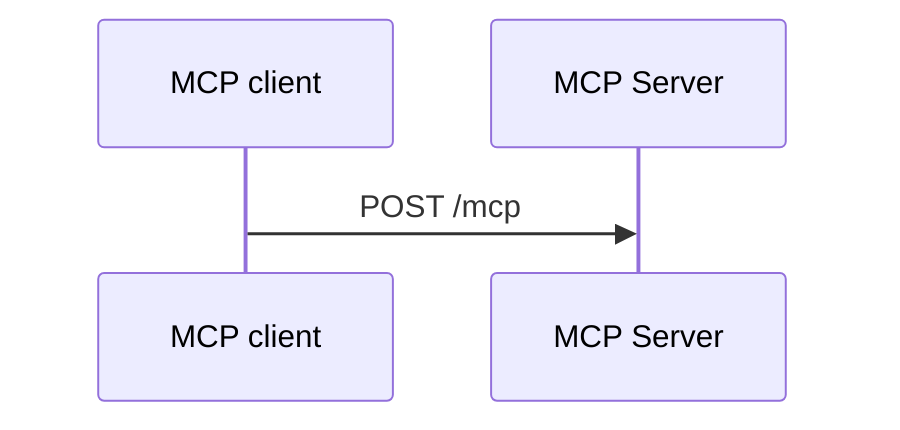

# Writing Practice Docs

## Overview

독자는 OAuth 기본은 알지만 MCP와 MCP의 discovery는 모르는 사람이다.
목표는 읽고 나면 MCP와 MCP OAuth를 직접 다룰 줄 알게 되는 것이다.
그래서 문서는 명세 준수를 증명하는 감사 보고서가 아니라 교재로 쓴다.
각 단계가 왜 있는지, 실제로 어떤 요청과 응답이 오가는지, 무엇을 확인하는지를 순서대로 보여 준다.

## 문서 구조

- `practice/mcp-guide/README.md`는 읽는 순서, 준비물(practice 실행 방법), 장 목록을 둔다.
- 장은 `01-mcp-basics.md`부터 `09-versions.md`까지다. 한 장은 한 단계나 한 개념을 다룬다.
- 부록은 `reference-api.md`(endpoint별 field 사전)와 `reference-compliance.md`(준수표)다.
- practice README는 소개, 실행, 코드 지도(클래스에서 안내서 장으로 가는 링크), 직접 확인할 것을 둔다.
- official이 아닌 practice의 README는 official과 다른 점만 쓴다.
- 세 practice의 비교는 `reference-compliance.md`에만 둔다.
- 개발 과정과 저장소 관리 이야기는 쓰지 않는다. 지금 동작과 명세만 쓴다.

## 용어

기술 용어는 흔한 말도 영어로 쓴다.
token, browser, login, consent, client, credentials, public key, signature, parameter, header가 그 예다.
field, redirect, endpoint, session, metadata, issuer, scope, callback, filter, bean도 영어로 쓴다.
요청·응답·주소·설정·서버(단독으로 쓸 때) 같은 일상 단어는 한국어로 쓴다.

한국어로 쓰면 걸리는 표기와 대신 쓸 영어 표기는 [terms.txt](terms.txt)에 있다.
새 기술 용어가 나오면 이 목록에 더한다.

## 문체

- 영어·코드 뒤 조사는 붙여 쓴다: "token을", "`resource`를", "MCP Server가".
- "왜 이 단계가 있나"를 먼저 쓰고, 규칙은 그 뒤에 쓴다.
- 한 문장에 개념 하나를 쓴다. 한 문장은 150자 이하다(inline code·URL 제외).
- 기계적 번역 어투를 쓰지 않는다: `싣다`, 설정을 `걸다`, `배선`, `물러나다`, `드러나다`.
- 제목은 한국어 제목 관례를 따른다: `왜 필요한가` 대신 "Discovery의 필요성".
- 클래스·설정·parameter 이름은 backtick으로 감싼다.

나쁜 예 1: 조사를 띄어 쓰고, 한 문장에 개념 세 개와 절 번호 링크를 넣었다.

```text
PKCE 는 `application.yml` 의 `require-proof-key: true` 로 강제하고, `AuthorizationServerConfig` 가 filter chain 두 개를 직접 정의해 `resource` 검증([5.3](#53-authorization-request를-보낸다)), access token `aud` 발급([5.7](#57-token-request)), authorization response 의 `iss`([5.6](#56-callback에서-state와-iss를-확인한다))를 건다.
```

좋은 예 1: 같은 내용을 한 문장에 개념 하나씩 풀었다.

> PKCE는 `application.yml`의 `require-proof-key: true`로 반드시 쓰게 한다.
> `AuthorizationServerConfig`는 filter chain 두 개를 직접 정의한다.
> 첫 번째 filter chain은 authorization request의 `resource`를 검증한다.
> 같은 filter chain은 authorization response에 `iss`를 넣는다.
> access token의 `aud`는 `ResourceAudienceTokenCustomizer`가 `resource` 값으로 정한다.

나쁜 예 2: 번역 어투이고, 이유 없이 요구 수준 단어만 있다.

```text
client 는 `resource` 를 token request 에도 싣는다(**MUST**).
```

좋은 예 2: 이유를 먼저 쓰고, 요구 수준은 장 끝 표로 보낸다.

> Authorization Server는 token request의 `resource`를 보고 token의 `aud`를 정한다.
> 그래서 client는 token request에도 `resource`를 넣는다.

## 장의 틀

장은 이 순서로 쓴다: 필요성 → 시퀀스 다이어그램 → 단계별 실제 요청·응답 → 확인하는 것(어기면 생기는 일) → official 코드 → 직접 해 보기 → 정리 → 명세 근거.
개념 장(1·2·8·9장)은 흐름에 맞게 줄여도 된다.
기준 예시는 [practice/mcp-guide/03-discovery.md](../../../practice/mcp-guide/03-discovery.md)다. 제목 뼈대는 [templates.md](templates.md)에 있다.

- 예시 값은 official practice 값이다: Authorization Server `http://localhost:9010`, MCP Server `http://localhost:8111/mcp`, agent `http://localhost:8110`.
- 요청·응답은 official을 실제로 띄워 받은 값(`docs/superpowers/captures/`)을 보여 준다.
- 긴 JSON은 핵심 field만 남기고 `"...": "그 밖의 field는 생략"`으로 줄인다. JWT는 앞 20자 뒤에 `...`를 붙인다.
- 장 끝에는 이웃 장과 목차로 가는 링크 한 줄을 둔다.

## 명세 근거

장 끝 "명세 근거" 절에 표 하나를 둔다. 열은 내용 · 명세 · 요구 수준이다.
명세 칸에는 원문 절로 가는 링크를 단다.
요구 수준 칸에는 원문 단어(MUST, MUST NOT, SHOULD, MAY, REQUIRED, RECOMMENDED, OPTIONAL)를 그대로 쓴다.
본문에는 요구 수준 단어, 캡처 번호, 테스트 메서드 이름, 절 번호 링크를 쓰지 않는다.
부록(`reference-*.md`)은 예외라서 요구 수준 단어와 캡처 번호를 써도 된다.

## 다이어그램

- mermaid 코드 블록 바로 아래 줄에 `[다이어그램 그림으로 보기](diagrams/<문서 이름>-<n>.png)`를 둔다.
- GitHub·IntelliJ는 mermaid를 그리고, Claude Code desktop은 그림 링크를 연다.
- desktop이 mermaid와 로컬 그림을 그리지 않는 이유는 [anthropics/claude-code#52517](https://github.com/anthropics/claude-code/issues/52517)에 있다.
- 다이어그램 안에는 식별자·경로·field 이름 위주로 짧게 쓴다.
- PNG는 `render_diagrams.py`로만 만든다. 그림 링크를 넣거나 이름을 고치고, 원본 해시를 `diagrams/.sources.json`에 적는다.

`render_diagrams.py`는 아래 모양의 블록만 찾는다.
여는 줄은 줄 맨 앞에서 backtick 세 개와 `mermaid`만 쓴다. 들여 쓰거나 뒤에 다른 글자를 붙이면 찾지 못한다.
닫는 줄은 줄 맨 앞에 backtick 세 개만 쓴다.

````markdown


[다이어그램 그림으로 보기](diagrams/03-discovery-1.png)
````

```bash
python3 .claude/skills/writing-practice-docs/scripts/render_diagrams.py FILE...
MMDC=/path/to/mmdc python3 .claude/skills/writing-practice-docs/scripts/render_diagrams.py FILE...
```

`MMDC`가 없으면 `npx -y @mermaid-js/mermaid-cli`를 부른다. mermaid 블록을 고치면 다시 돌리고, PNG와 `.sources.json`을 함께 커밋한다.

## 검사

```bash
python3 .claude/skills/writing-practice-docs/scripts/check_docs.py FILE...
python3 .claude/skills/writing-practice-docs/scripts/check_docs.py --links-from OLD.md --dropped DROPPED.txt FILE...
python3 -m unittest discover -s .claude/skills/writing-practice-docs/scripts -p 'test_*.py'
```

위반 0이 될 때까지 고친다. 두 번째 형식은 옛 문서의 외부 링크가 새 문서로 모두 옮겨졌는지 본다.
세 번째 명령은 두 스크립트의 테스트다.

| 규칙 | 고치는 법 |
|---|---|
| `setext` | 구분선 `---` 바로 위 줄을 비운다 |
| `narrative` | 개발 과정 표현을 지우고 지금 동작만 쓴다 |
| `term` | 한국어 기술 용어를 `terms.txt`의 영어 표기로 바꾼다 |
| `particle-space` | 영어·코드 뒤 조사를 붙여 쓴다 |
| `style` | 번역 어투를 자연스러운 한국어로 바꾼다 |
| `body-level` | 요구 수준 단어를 본문에서 지우고 "명세 근거" 표로 옮긴다 |
| `body-capture` | 캡처 번호를 지우고 값만 보여 준다 |
| `body-test` | 테스트 메서드 이름을 지우고 동작을 문장으로 쓴다 |
| `html` | HTML 태그와 앵커 태그를 지운다. 링크는 제목 자동 앵커로 한다 |
| `link` | 없는 파일이나 앵커로 가는 링크를 고친다 |
| `mermaid` | 선언 안 된 participant, 짝 없는 블록, 괄호 짝을 고친다 |
| `diagram-link` | `render_diagrams.py`를 돌려 그림 링크를 넣거나 이름을 고친다. 그래도 걸리면 fence 모양을 본다 |
| `diagram-missing`, `diagram-stale` | `render_diagrams.py`를 돌려 PNG와 해시를 새로 만든다 |
| `cell-length` | 표 칸을 2문장 이하로 줄인다 |
| `sentence-chars` | 150자를 넘는 문장을 나눈다 |
| `links-from` | 빠진 외부 링크를 새 문서에 넣거나, 뺀 이유를 `DROPPED.txt`에 적는다 |
| `missing` | 파일 경로를 고친다 |

## 흔한 실수

| 실수 | 고친 모양 |
|---|---|
| 제목 `왜 필요한가` | "Discovery의 필요성"처럼 한국어 제목 관례로 쓴다 |
| `token 을`, `MCP Server 가`, `resource` 뒤에 띄어 쓴 조사 | "token을", "MCP Server가", "`resource`를" |
| 본문의 `MUST`, 캡처 번호 `C3`, 테스트 메서드 이름 | 이유와 결과를 문장으로 쓰고, 요구 수준은 "명세 근거" 표로 옮긴다 |
| 한 문장에 설정·검증·발급을 모두 | 문장을 나눠 한 문장에 개념 하나만 쓴다 |
| `싣는다`, `배선`, `물러난다`, `드러난다`, 설정을 `건다` | 넣는다, 연결, 빠진다, 보인다, 켠다 |
| `인가 서버`, `토큰`, `동의 화면`, `헤더` | Authorization Server, token, consent 화면, header |
| `처음엔 …`, `… 를 고쳤다` | 지금 동작과 명세만 쓴다 |
| 구분선 `---` 바로 위에 글 | 그 사이 한 줄을 비운다(비우지 않으면 윗줄이 제목이 된다) |
