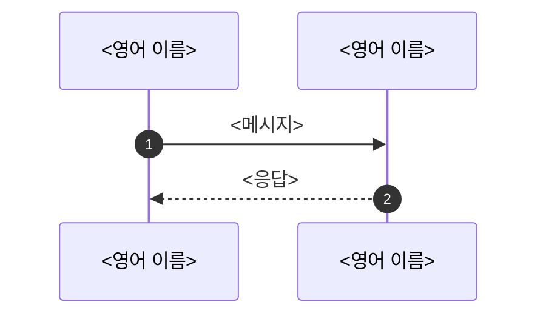

# 템플릿

각 틀의 `<…>` 를 채운다. 절 제목 바로 위에는 다른 문서가 링크할 `<a id="…"></a>` 를 둔다. "원문 필드" 뒤의 N 은 정수 하나이고 표의 데이터 행 수와 같아야 하며, `check_docs.py` 의 `field-count` 규칙이 그 둘을 센다.

## 허브 절 (최상위 `<TOPIC>.md`)

````markdown
<a id="s4-7"></a>

### 4.7 <단계 이름>

<무엇을, 왜 — 2~3문장.>

#### 명세

- [<문서 §절>](<링크>) — <압축한 규칙>(**<요구 수준>**).

#### 이 practice

- <클래스·설정>이 <무엇을> 한다. 테스트: `<클래스#메서드>`.

자세히: [API](<TOPIC>-API-SPEC.md#<앵커>) · [시퀀스](<TOPIC>-SEQUENCES.md#<앵커>)
````

## 엔드포인트 (`API-SPEC.md`)

````markdown
<a id="<앵커>"></a>

## `<METHOD> <경로>` — <이름>

<목적 1~2문장.>

근거: [<문서 §절>](<링크>), [<문서 §절>](<링크>)

**요청**

| 이름 | 위치 | 표시 | 설명 | 이 practice |
|---|---|---|---|---|
| `<name>` | 쿼리·본문·헤더 | <원문 단어 — MUST·REQUIRED·OPTIONAL 등, 원문이 쓴 그대로> | <한 줄> | 씀 |
| `<name>` | 쿼리 | <원문 단어> | <한 줄> | 쓰지 않음 |

원문 필드: <문서 §절> 에 정의된 <N>개 → 표 <N>행(필드가 없으면 "원문 필드: 없음")

**응답**

| 이름 | 표시 | 설명 | 이 practice |
|---|---|---|---|

원문 필드: <문서 §절> 에 정의된 <N>개 → 표 <N>행(필드가 없으면 "원문 필드: 없음")

**오류**

| 상황 | 응답 | 근거 |
|---|---|---|

**예시** (<캡처 파일> <단계>)

```http
<요청 줄과 핵심 헤더>
```

```json
<응답 본문>
```
````

## 시퀀스 (`SEQUENCES.md`)

````markdown
<a id="<앵커>"></a>

## <흐름 이름>

<무엇이 일어나는가 2~3문장.>



**단계**

1. <1번 메시지: 무엇을, 왜 — 2~3문장. API 는 [링크](<TOPIC>-API-SPEC.md#<앵커>).>
2. <2번 메시지.>
````

## README (practice)

````markdown
# <practice 이름>

<한 줄 소개.>

## 다루는 것

<2~3문장.>

## 구성

| 모듈 | 포트 | 역할 |
|---|---|---|

## 모듈별 역할

### <모듈>

<2~3문장.> API: [API-SPEC.md](API-SPEC.md#<앵커>) · 흐름: [SEQUENCES.md](SEQUENCES.md#<앵커>)

## 직접 쓴 코드

| 클래스 | 역할 | 명세 |
|---|---|---|

## 실행과 확인

| 확인 방법 | 기대 결과 |
|---|---|

## 학습 포인트

### <결론 한 줄>

<2~3문장.>

## 비목표

- <한 줄>

## 링크

- <최상위 문서, 캡처>
````
