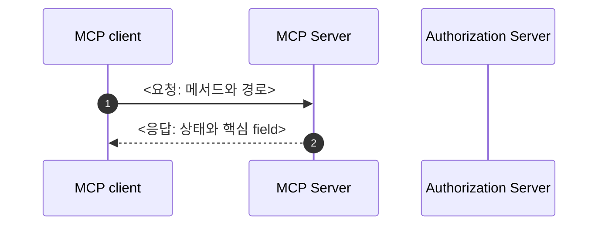

# 템플릿

각 틀의 `<…>`를 채운다.
장의 기준 예시는 [3장](../../../practice/mcp-guide/03-discovery.md)이다. 문체와 검사 규칙은 [SKILL.md](SKILL.md)에 있다.

## 장 (`practice/mcp-guide/<nn>-<이름>.md`)

개념 장(1·2·8·9장)은 흐름에 맞게 절을 줄여도 된다. 요청·응답 단계 절은 단계 수만큼 둔다.

````markdown
# <n>. <주제> — <이 장이 답하는 질문>

## <n>.1 <주제>의 필요성

<OAuth만 아는 독자가 여기서 무엇을 모르는가. 이 단계가 없으면 무엇이 안 되는가.>

<이 장의 흐름 한두 문장: 요청 몇 번으로 무엇을 얻는가.>

## <n>.2 시퀀스 다이어그램



[다이어그램 그림으로 보기](diagrams/<nn>-<이름>-1.png)

| 단계 | 묻는 곳 | 얻는 것 |
|---|---|---|
| 1단계 (1)(2): <무엇을 한다> | <서버> | <얻는 값> |

아래 예시는 official practice를 실제로 띄워 받은 응답이다.

## <n>.3 1단계: <무엇을 한다>

<왜 이 요청을 보내는가.>

```bash
curl -i http://localhost:8111/mcp ...
```

```http
<official에서 받은 응답. 긴 JSON은 핵심 field만 남기고 "...": "그 밖의 field는 생략">
```

<응답에서 볼 곳과 그 뜻. 한 문장에 개념 하나.>

| field | 뜻 | client가 할 일 |
|---|---|---|

## <n>.<k> <client 또는 server>가 확인하는 것

<받은 값을 왜 그대로 믿으면 안 되는가.>

| 확인 | 어기면 생기는 일 |
|---|---|

## <n>.<k> official 코드에서 보기

**<module>: <이 module이 맡는 쪽>**

<설정이나 클래스가 무엇을 하는가.>

```java
<핵심만 남긴 코드. 줄 끝 주석으로 위 단계와 잇는다>
```

## <n>.<k> 직접 해 보기

```bash
cd practice/mcp-security-authn-official
./run.sh
```

```bash
# 1단계: <무엇을 한다>
curl ...
```

## <n>.<k> 정리

- <한 줄 요약. 이 장에서 기억할 것>

## <n>.<k> 명세 근거

| 내용 | 명세 | 요구 수준 |
|---|---|---|
| <규칙을 한 줄로> | [<문서 — 절 이름>](<원문 절 링크>) | <원문 단어: MUST, SHOULD, MAY 등> |

[← <n-1>장](<앞 장 파일>.md) · [목차](README.md) · [<n+1>장 →](<다음 장 파일>.md)
````

## practice README (`practice/<practice>/README.md`)

official이 아닌 practice는 "official과 다른 점" 절을 소개 바로 아래에 두고, 나머지 절은 다른 점만 쓴다.

````markdown
# <practice 이름>

<이 practice가 무엇을 보여 주는가 한두 문장. 안내서의 어느 장과 함께 읽는가.>

## 구성

| module | 포트 | 역할 |
|---|---|---|
| `<module>` | <포트> | <한 줄> |

## 실행

```bash
cd practice/<practice>
./run.sh
```

<login 계정, 멈추는 방법.>

## 코드 지도

| 클래스 | 하는 일 | 안내서 |
|---|---|---|
| `<클래스>` | <한 줄> | [<n>장 <절 이름>](../mcp-guide/<장 파일>.md#<제목-앵커>) |

## 직접 확인할 것

| 해 볼 것 | 기대 결과 |
|---|---|
| <명령이나 browser 동작> | <보여야 하는 값> |

## 더 읽을 것

- [MCP 안내서](../mcp-guide/README.md)
````
