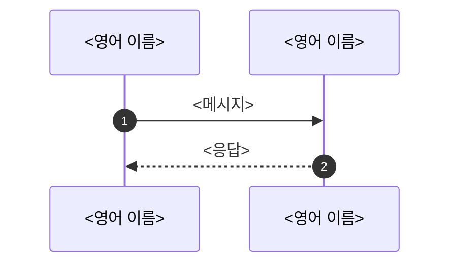

# MCP 인증 학습 문서 재구성 Implementation Plan

> **For agentic workers:** REQUIRED SUB-SKILL: Use superpowers:subagent-driven-development (recommended) or superpowers:executing-plans to implement this plan task-by-task. Steps use checkbox (`- [ ]`) syntax for tracking.

**Goal:** 최상위와 세 practice 에 허브·API 명세·시퀀스 3종(12개 파일)을 핵심만 남긴 계층형으로 쓰고, 그 작성 규칙을 프로젝트 스킬 `writing-practice-docs` 로 만든다.

**Architecture:** 먼저 스킬(규칙·템플릿·용어 목록·검사 스크립트)을 writing-skills 절차(RED → GREEN)로 만든다. 문서 task 는 모두 그 스킬을 불러서 쓰고, 스킬의 `check_docs.py` 로 검사한다. 같은 내용은 한 곳에만 두고 나머지는 링크한다 — 최상위가 표준을, practice 가 구현을 맡는다.

**Tech Stack:** Markdown(GitHub 렌더링), mermaid(sequenceDiagram·flowchart), Python 3 표준 라이브러리(검사 스크립트, unittest).

**Spec:** `docs/superpowers/specs/2026-09-25-mcp-docs-restructure-design.md`

## Global Constraints

- 코드·테스트·캡처 스크립트·캡처 파일은 바꾸지 않는다. 바꾸는 것은 문서와 스킬뿐이다.
- 한 문단·한 목록 항목은 3문장 이하. 주제마다 2~3문장 요약 → 하위 제목에서 2~3문장씩.
- 전문 용어는 영어 그대로(조사는 한국어). 목록은 스킬의 `terms.txt`.
- 개발 과정 이야기(처음엔·고쳤다·Task N·실측했더니·착각·버그 수정 경위)는 쓰지 않는다. README 의 실험 상세와 트러블슈팅 절은 없앤다.
- 명세 인용은 원문 기준, 요구 수준 단어는 원문 그대로. API 표는 REQUIRED·RECOMMENDED·OPTIONAL 필드를 원문에서 빠짐없이 옮긴다.
- 범위는 MCP 와 우리가 만든 Authorization Server. 쓰지 않는 기능은 "다루지 않음"·"달라지는 점"으로 몇 줄.
- 모든 task 끝에 `python3 .claude/skills/writing-practice-docs/scripts/check_docs.py <그 task 파일들>` 위반 0.
- `.superpowers/` 는 절대 `git add` 하지 않는다. 커밋 메시지 끝에 `Co-Authored-By: Claude Opus 5.5 <noreply@anthropic.com>`.

## Review Focus

1. **요구 수준 약화·혼동** — 압축하면서 SHOULD 를 "할 수 있다"로, 다른 절 내용을 엉뚱한 절 번호로 옮기기 쉽다. 기대: 모든 MUST/SHOULD/MAY 가 원문 절과 일치. 소유 task: 2·3·4 의 "원문 대조" 단계.
2. **파일 사이 앵커 끊김** — practice 문서가 최상위 문서의 앵커를 링크하는데, 앵커 이름이 task 마다 다르면 끊긴다. 기대: 아래 "앵커 이름" 표 그대로. 소유 task: 각 task 의 `check_docs.py`(link 규칙) + Task 7 의 12개 파일 전체 검사.
3. **예시 값이 캡처와 다름** — 요약하며 값을 고쳐 쓰거나 디코딩해 옮기기 쉽다. 기대: 캡처 원문 그대로(토큰만 줄임). 소유 task: 2·5·6·7 의 "예시 대조" 단계(`grep -F`).
4. **용어 규칙이 코드 식별자·고유명사를 건드림** — `terms.txt` 는 inline code 와 코드 블록을 검사하지 않는다. 클래스·설정 이름은 반드시 backtick 으로 감싼다. 기대: `McpAuthorizationDiscovery` 같은 이름은 그대로. 소유 task: 1 의 테스트(`test_inline_code_와_코드_블록의_한국어는_통과한다`).
5. **mermaid 렌더 오류** — 린트는 participant 선언·블록 짝·세미콜론·괄호만 본다. 기대: GitHub 에서 그려진다. 소유 task: 3·5·6·7 의 리뷰 단계에서 다이어그램마다 문법을 눈으로 대조(화살표 `->>`/`-->>`, `Note over X,Y:`, `alt/else/end`, 메시지에 `;` 없음).

---

## 공통 참고

### 앵커 이름 (모든 task 가 이 이름을 쓴다)

각 절 제목 바로 위에 `<a id="…"></a>` 를 두고, 다른 파일에서는 이 id 로 링크한다.

| 파일 | 앵커 |
|---|---|
| `practice/MCP-API-SPEC.md` | `common`, `mcp-unauthenticated`, `prm`, `mcp-post`, `mcp-get`, `mcp-delete`, `as-metadata`, `oidc-discovery`, `authorize`, `authorize-consent`, `authorization-response`, `token-authorization-code`, `token-refresh`, `jwks`, `cimd-document`, `dcr-register` |
| `practice/MCP-SEQUENCES.md` | `components`, `reg-confidential`, `reg-public`, `reg-cimd`, `reg-dcr`, `issuer-binding`, `rt-discovery`, `rt-authz-confidential`, `rt-authz-public`, `rt-token`, `rt-mcp-session`, `rt-token-validation`, `rt-refresh`, `rt-errors` |
| `practice/MCP-AUTHORIZATION.md` | `s1`~`s9`, `s4-1`~`s4-10`, `s5-1`~`s5-7` |
| `practice/mcp-security-authn-official/API-SPEC.md` | `auth-server`, `mcp-server`, `agent`, `agent-login`, `api-chat`, `tool-search-products`, `tool-get-stock` |
| `practice/mcp-security-authn-official/SEQUENCES.md` | `modules`, `agent-login`, `mcp-call`, `as-internals` |
| `practice/mcp-security-authn-chat-memory/API-SPEC.md` | `endpoints`, `api-chat`, `api-conversations`, `api-conversation-get`, `api-conversation-delete` |
| `practice/mcp-security-authn-chat-memory/SEQUENCES.md` | `conversation-id`, `memory-read-write`, `tool-memory` |
| `practice/mcp-security-authn-community/API-SPEC.md` | `endpoints`, `providers` |
| `practice/mcp-security-authn-community/SEQUENCES.md` | `modules`, `diff-authorization-server`, `diff-mcp-server`, `diff-agent` |

### practice 값

| | official | chat-memory | community |
|---|---|---|---|
| Authorization Server(issuer) | `http://localhost:9010` | `http://localhost:9020` | `http://localhost:9000` |
| MCP Server resource | `http://localhost:8111/mcp` | `http://localhost:8131/mcp` | `http://localhost:8101/mcp` |
| agent | `http://localhost:8110` | `http://localhost:8130` | `http://localhost:8100` |
| confidential client | `official-shop-agent` | `memory-agent` | `shop-agent` |
| public client | `local-mcp-client`, redirect URI `http://127.0.0.1:8123/callback` (세 practice 같음) | | |
| 로그인 | `user`/`password` | `alice`/`alice`, `bob`/`bob` | `user`/`password` |

### 원문 자료

문서 task 는 명세 원문과 대조한다. 아래를 한 번 받아 둔다(이미 있으면 건너뛴다).

```bash
mkdir -p /tmp/mcp-refs && cd /tmp/mcp-refs
for r in 6749 6750 7517 7518 7591 7636 8252 8414 8707 9068 9207 9728; do
  [ -f rfc$r.txt ] || curl -sf -o rfc$r.txt https://www.rfc-editor.org/rfc/rfc$r.txt
done
[ -f oauth21-13.txt ] || curl -sf -o oauth21-13.txt https://www.ietf.org/archive/id/draft-ietf-oauth-v2-1-13.txt
[ -f cimd-00.txt ] || curl -sf -o cimd-00.txt https://www.ietf.org/archive/id/draft-ietf-oauth-client-id-metadata-document-00.txt
ls -la /tmp/mcp-refs
```

- MCP 명세 페이지(2025-11-25·2026-07-28 Authorization, Transports, Lifecycle, Security Best Practices, Client Registration, Authorization Server Discovery)는 WebFetch 로 읽는다. 링크는 옛 문서 10절에 있다.
- 옛 문서는 main 에서 꺼낸다: `git show main:practice/MCP-AUTHORIZATION.md > /tmp/old-MCP-AUTHORIZATION.md`, README 도 같은 방식(`/tmp/old-README-<practice>.md`).
- 캡처는 `docs/superpowers/captures/` 의 `2026-09-12-<practice>.txt`(C 번호), `2026-09-16-official-supplement.txt`(S 번호), `2026-09-25-<practice>-public-client.txt`(P 번호).

---

### Task 1: 프로젝트 스킬 `writing-practice-docs`

**Files:**
- Create: `.claude/skills/writing-practice-docs/SKILL.md`
- Create: `.claude/skills/writing-practice-docs/templates.md`
- Create: `.claude/skills/writing-practice-docs/terms.txt`
- Create: `.claude/skills/writing-practice-docs/scripts/check_docs.py`
- Create: `.claude/skills/writing-practice-docs/scripts/test_check_docs.py`
- Create: `docs/superpowers/skill-tests/2026-09-25-writing-practice-docs.md` (RED/GREEN 기록)

**Interfaces:**
- Produces: 명령 `python3 .claude/skills/writing-practice-docs/scripts/check_docs.py [--links-from OLD.md] [--dropped DROPPED.txt] FILE...` — 위반마다 `경로:줄: [규칙] 설명`, 마지막 줄 `검사한 파일 N개, 위반 M건`, 위반이 있으면 종료 코드 1. 규칙 이름: `setext`, `length`, `narrative`, `term`, `link`, `mermaid`, `links-from`, `missing`.
- Produces: 스킬 이름 `writing-practice-docs`. 문서 task 는 "REQUIRED SUB-SKILL: writing-practice-docs" 로 부른다.

- [ ] **Step 1: RED — 스킬 없이 쓴 문서 받기**

`Agent` 도구로 subagent 5개를 병렬로 띄운다(general-purpose). 프롬프트는 모두 같고 출력 파일 번호만 다르다(N=1..5). 이 단계는 스킬 파일을 만들기 **전에** 돌린다.

```text
이 저장소(/Users/starryeye/study/spring-ai)의 학습 문서 한 조각을 한국어로 써서 /tmp/skilltest/red-N.md 에 저장하라.
1) practice/mcp-security-authn-official 의 Authorization Server 가 여는 `GET /oauth2/jwks` 엔드포인트의 API 명세 한 절.
2) "MCP Server 가 access token 을 검증하는 과정" 시퀀스 한 절(mermaid 다이어그램 포함).
기존 학습 문서 practice/MCP-AUTHORIZATION.md 의 문체를 참고해도 된다. 명세 원문은 /tmp/mcp-refs/ 에 있다.
다 쓰면 파일 경로만 보고하라.
```

- [ ] **Step 2: 검사 스크립트 테스트와 용어 목록 쓰기**

`.claude/skills/writing-practice-docs/scripts/test_check_docs.py`:

````python
"""check_docs.py 의 규칙마다 걸리는 예와 통과하는 예를 하나씩 둔다.

실행: python3 -m unittest discover -s .claude/skills/writing-practice-docs/scripts -p 'test_*.py'
"""
import sys
import tempfile
import textwrap
import unittest
from pathlib import Path

sys.path.insert(0, str(Path(__file__).resolve().parent))
import check_docs  # noqa: E402

TERMS = check_docs.load_terms()


def rules(text: str, name: str = "doc.md", extra: dict | None = None) -> list[str]:
    """임시 디렉터리에 문서를 쓰고 검사해 `규칙:줄` 목록을 돌려준다."""
    with tempfile.TemporaryDirectory() as d:
        for other, body in (extra or {}).items():
            (Path(d) / other).write_text(textwrap.dedent(body), encoding="utf-8")
        path = Path(d) / name
        path.write_text(textwrap.dedent(text), encoding="utf-8")
        return [f"{i.rule}:{i.line}" for i in check_docs.check_file(path, TERMS)]


class SetextTest(unittest.TestCase):
    def test_글_바로_아래_구분선은_걸린다(self):
        self.assertIn("setext:2", rules("문단이다.\n---\n"))

    def test_빈_줄_뒤_구분선은_통과한다(self):
        self.assertEqual([], rules("문단이다.\n\n---\n"))

    def test_front_matter_는_구분선으로_보지_않는다(self):
        self.assertEqual([], rules("---\nname: x\n---\n\n본문이다.\n"))


class LengthTest(unittest.TestCase):
    def test_네_문장_문단은_걸린다(self):
        self.assertIn("length:1", rules("하나다. 둘이다. 셋이다. 넷이다.\n"))

    def test_세_문장_문단은_통과한다(self):
        self.assertEqual([], rules("하나다. 둘이다. 셋이다.\n"))

    def test_목록_항목은_따로_센다(self):
        self.assertEqual([], rules("- 하나다. 둘이다.\n- 셋이다. 넷이다.\n"))

    def test_절_번호의_점은_문장_끝이_아니다(self):
        self.assertEqual([], rules("OAuth 2.1 §4.3.1 과 RFC 8252 §7.3 을 본다.\n"))

    def test_코드_블록_안은_세지_않는다(self):
        self.assertEqual([], rules("```text\n하나. 둘. 셋. 넷.\n```\n"))

    def test_긴_fence_안의_짧은_fence_는_블록을_닫지_않는다(self):
        doc = "````markdown\n```mermaid\nx\n```\n[a](없음.md) 하나. 둘. 셋. 넷.\n````\n"
        self.assertEqual([], rules(doc))


class WordsTest(unittest.TestCase):
    def test_개발_과정_표현은_걸린다(self):
        self.assertIn("narrative:1", rules("처음엔 동작하지 않았다.\n"))

    def test_번역된_용어는_걸린다(self):
        found = rules("인가 서버가 토큰을 준다.\n")
        self.assertEqual(2, found.count("term:1"))

    def test_inline_code_와_코드_블록의_한국어는_통과한다(self):
        self.assertEqual([], rules("`토큰` 값을 본다.\n\n```json\n{\"text\": \"토큰\"}\n```\n"))

    def test_인가_는_단어일_때만_걸린다(self):
        self.assertEqual([], rules("이것은 무엇인가?\n"))
        self.assertIn("term:1", rules("인가 흐름을 본다.\n"))


class LinkTest(unittest.TestCase):
    def test_명시_앵커와_제목_앵커는_통과한다(self):
        doc = '<a id="e1"></a>\n\n## 4.1 Token 요청\n\n[e](#e1) [h](#41-token-요청)\n'
        self.assertEqual([], rules(doc))

    def test_없는_앵커는_걸린다(self):
        self.assertIn("link:1", rules("[x](#nowhere)\n"))

    def test_다른_파일의_앵커를_확인한다(self):
        extra = {"other.md": '<a id="jwks"></a>\n'}
        self.assertEqual([], rules("[j](other.md#jwks)\n", extra=extra))
        self.assertIn("link:1", rules("[j](other.md#nope)\n", extra=extra))
        self.assertIn("link:1", rules("[j](missing.md)\n"))

    def test_외부_링크는_확인하지_않는다(self):
        self.assertEqual([], rules("[r](https://www.rfc-editor.org/rfc/rfc8707#section-2)\n"))


class MermaidTest(unittest.TestCase):
    OK = """\
        ```mermaid
        sequenceDiagram
            autonumber
            participant C as Client
            participant A as Authorization Server
            C->>A: GET /oauth2/authorize
            alt 올바름
                A-->>C: 302 code
            else 틀림
                A-->>C: 400
            end
            Note over C,A: 끝
        ```
        """

    def test_올바른_시퀀스는_통과한다(self):
        self.assertEqual([], rules(self.OK))

    def test_선언_안_된_participant_는_걸린다(self):
        self.assertTrue(any(r.startswith("mermaid") for r in rules(self.OK.replace("C->>A", "C->>X"))))

    def test_닫히지_않은_블록은_걸린다(self):
        broken = self.OK.replace("            end\n", "")
        self.assertTrue(any(r.startswith("mermaid") for r in rules(broken)))

    def test_flowchart_괄호_짝(self):
        self.assertEqual([], rules("```mermaid\nflowchart LR\n  A[Agent] --> B[MCP Server]\n```\n"))
        self.assertTrue(rules("```mermaid\nflowchart LR\n  A[Agent --> B\n```\n"))


class LinksFromTest(unittest.TestCase):
    def test_옮기지_않은_링크와_뺀_이유(self):
        with tempfile.TemporaryDirectory() as d:
            old, new, dropped = Path(d) / "old.md", Path(d) / "new.md", Path(d) / "dropped.txt"
            old.write_text("[a](https://a.example/x) [b](https://b.example/y) [c](https://c.example/z)\n")
            new.write_text("[a](https://a.example/x)\n")
            dropped.write_text("https://b.example/y\t범위 밖\nhttps://c.example/z\n")
            found = [i.message for i in check_docs.check_links_from(old, [new], dropped)]
            self.assertEqual(1, len([m for m in found if "뺀 이유가 없다" in m]))
            self.assertEqual([], [m for m in found if "옮기지 않은 링크" in m])


if __name__ == "__main__":
    unittest.main()
````

`.claude/skills/writing-practice-docs/terms.txt` (정규식과 영어 표기 사이는 **탭** 한 칸, 테스트가 읽는다):

```text
# 한국어로 옮기면 안 되는 전문 용어. 형식: 정규식<TAB>써야 할 영어 표기. 주제가 늘면 여기에 더한다.
토큰	token
클라이언트	client
(?<![가-힣])인가(?=[\s을를은는이가의에와과도로]|$)	authorization
리소스 서버	Resource Server
보호 리소스	Protected Resource
메타데이터	metadata
사전 등록	pre-registration
동의 화면	consent
(?<![가-힣])동의(?=[\s을를은는이가의에와과도로]|$)	consent
리다이렉트	redirect
콜백	callback
발급자	issuer
스코프	scope
(?<![가-힣])발견(?=[\s을를은는이가의에와과도로하한했해]|$)	discovery
챌린지	challenge
세션	session
필터 ?체인	filter chain
에이전트	agent
MCP 서버	MCP Server
```

Run: `python3 -m unittest discover -s .claude/skills/writing-practice-docs/scripts -p 'test_*.py'`
Expected: FAIL — `ModuleNotFoundError: No module named 'check_docs'`

- [ ] **Step 3: 검사 스크립트 쓰기**

`.claude/skills/writing-practice-docs/scripts/check_docs.py`:

````python
#!/usr/bin/env python3
"""practice 학습 문서의 형식 규칙을 검사한다(규칙: ../SKILL.md).

사용: python3 check_docs.py [--links-from OLD.md] [--dropped DROPPED.txt] FILE...
위반이 하나라도 있으면 `경로:줄: [규칙] 설명` 을 출력하고 종료 코드 1 로 끝난다.
"""
from __future__ import annotations

import argparse
import re
import sys
from dataclasses import dataclass
from pathlib import Path
from urllib.parse import unquote

SKILL_DIR = Path(__file__).resolve().parent.parent
TERMS_FILE = SKILL_DIR / "terms.txt"

# 개발 과정 이야기를 드러내는 표현. 문서에는 결과와 명세만 남긴다.
BANNED_PHRASES = ["처음엔", "처음에는", "고쳤", "수정했", "Task ", "실측했", "착각", "버그를"]
SENTENCE_LIMIT = 3

FENCE = re.compile(r"^\s*(```+|~~~+)(.*)$")
HEADING = re.compile(r"^(#{1,6})\s+(.*?)\s*#*\s*$")
ANCHOR_ID = re.compile(r'<a\s+id="([^"]+)"')
LINK = re.compile(r"\[[^\]]*\]\(([^)\s]+)(?:\s+\"[^\"]*\")?\)")
LIST_ITEM = re.compile(r"^\s*(?:[-*+]|\d+\.)\s+")
RULE_LINE = re.compile(r"^\s*(-{3,}|={3,})\s*$")
URL = re.compile(r"https?://[^\s)\]>`\"']+")


@dataclass(frozen=True)
class Issue:
    path: str
    line: int
    rule: str
    message: str

    def __str__(self) -> str:
        return f"{self.path}:{self.line}: [{self.rule}] {self.message}"


def load_terms(path: Path = TERMS_FILE) -> list[tuple[re.Pattern, str]]:
    """terms.txt 한 줄은 `정규식<TAB>영어 표기`. 빈 줄과 # 주석은 건너뛴다."""
    terms = []
    for raw in path.read_text(encoding="utf-8").splitlines():
        if not raw.strip() or raw.startswith("#"):
            continue
        pattern, english = raw.split("\t", 1)
        terms.append((re.compile(pattern), english.strip()))
    return terms


def strip_front_matter(text: str) -> str:
    """SKILL.md 의 YAML front matter 를 같은 줄 수의 빈 줄로 바꾼다(줄 번호 유지)."""
    if text.startswith("---\n"):
        end = text.find("\n---\n", 4)
        if end != -1:
            head = text[: end + 5]
            return "\n" * head.count("\n") + text[end + 5 :]
    return text


def split_blocks(text: str):
    """코드 밖 줄 [(줄 번호, 줄)] 과 코드 블록 [(여는 줄 번호, 언어, [줄])] 로 나눈다."""
    prose, blocks = [], []
    in_code, fence, lang, buf, start = False, "", "", [], 0
    for no, line in enumerate(text.splitlines(), 1):
        m = FENCE.match(line)
        if not in_code:
            if m:
                in_code, fence, lang, buf, start = True, m.group(1), m.group(2).strip(), [], no
                continue
            prose.append((no, line))
            continue
        stripped = line.strip()
        # 닫는 fence 는 여는 fence 와 같은 문자로, 길이가 같거나 길어야 한다(CommonMark).
        if stripped.startswith(fence) and set(stripped) == {fence[0]}:
            blocks.append((start, lang, buf))
            in_code = False
        else:
            buf.append(line)
    return prose, blocks


def clean(line: str) -> str:
    """inline code, 링크 대상, URL 을 지운다. 링크 글자는 남긴다."""
    line = re.sub(r"`[^`]*`", " ", line)
    line = re.sub(r"\[([^\]]*)\]\([^)]*\)", r"\1", line)
    return URL.sub(" ", line)


def sentence_count(text: str) -> int:
    """문장 끝(. ? !)을 센다. 숫자 사이의 점(2.1, §4.3)은 세지 않는다."""
    return len(re.findall(r"(?<!\d)[.?!](?=\s|$|[)\]\"'])", clean(text)))


def units(prose):
    """문단과 목록 항목을 한 단위로 묶는다: [(시작 줄 번호, 글)]."""
    out, cur = [], None
    for no, line in prose:
        s = line.strip()
        if not s or s.startswith(("#", "|", "<")) or RULE_LINE.match(line):
            if cur:
                out.append(cur)
            cur = None
            continue
        if s.startswith(">"):
            s = s.lstrip(">").strip()
        if LIST_ITEM.match(line):
            if cur:
                out.append(cur)
            cur = (no, LIST_ITEM.sub("", line).strip())
        elif cur:
            cur = (cur[0], cur[1] + " " + s)
        else:
            cur = (no, s)
    if cur:
        out.append(cur)
    return out


def check_setext(path: str, prose) -> list[Issue]:
    """바로 윗줄이 글인 `---`/`===` 는 구분선이 아니라 그 글을 제목으로 만든다."""
    issues, prev_no, prev = [], -1, ""
    for no, line in prose:
        if RULE_LINE.match(line) and prev_no == no - 1 and prev.strip():
            issues.append(Issue(path, no, "setext", "구분선 위에 빈 줄이 없어 윗줄이 제목이 된다"))
        prev_no, prev = no, line
    return issues


def check_units(path: str, prose) -> list[Issue]:
    return [
        Issue(path, no, "length", f"한 문단·항목이 {n}문장이다(최대 {SENTENCE_LIMIT})")
        for no, text in units(prose)
        if (n := sentence_count(text)) > SENTENCE_LIMIT
    ]


def check_words(path: str, prose, terms) -> list[Issue]:
    issues = []
    for no, line in prose:
        if line.lstrip().startswith("<a "):
            continue
        text = clean(line)
        for phrase in BANNED_PHRASES:
            if phrase in text:
                issues.append(Issue(path, no, "narrative", f"개발 과정 표현 '{phrase.strip()}'"))
        for pattern, english in terms:
            for m in pattern.finditer(text):
                issues.append(Issue(path, no, "term", f"'{m.group(0)}' 대신 '{english}'"))
    return issues


def slugify(heading: str) -> str:
    """GitHub 제목 앵커: 소문자, 글자·숫자·_·-·공백만 남기고 공백은 -."""
    t = re.sub(r"`", "", heading)
    t = re.sub(r"\[([^\]]*)\]\([^)]*\)", r"\1", t).strip().lower()
    t = re.sub(r"[^\w\- ]", "", t)
    return t.replace(" ", "-")


def anchors_of(text: str) -> set[str]:
    prose, _ = split_blocks(strip_front_matter(text))
    ids, seen = set(), {}
    for _, line in prose:
        ids.update(ANCHOR_ID.findall(line))
        h = HEADING.match(line)
        if h:
            base = slugify(h.group(2))
            n = seen.get(base, 0)
            seen[base] = n + 1
            ids.add(base if n == 0 else f"{base}-{n}")
    return ids


def check_links(path: Path, prose) -> list[Issue]:
    issues, cache = [], {}
    own = str(path)
    for no, line in prose:
        for target in LINK.findall(re.sub(r"`[^`]*`", " ", line)):
            if re.match(r"^[a-z]+:", target):
                continue
            file_part, _, anchor = target.partition("#")
            dest = path if not file_part else (path.parent / unquote(file_part)).resolve()
            if not dest.exists():
                issues.append(Issue(own, no, "link", f"없는 파일: {target}"))
                continue
            if anchor and dest.suffix == ".md":
                if dest not in cache:
                    cache[dest] = anchors_of(dest.read_text(encoding="utf-8"))
                if unquote(anchor) not in cache[dest]:
                    issues.append(Issue(own, no, "link", f"없는 앵커: {target}"))
    return issues


SEQ_PARTICIPANT = re.compile(r"^\s*(?:participant|actor)\s+([A-Za-z0-9_]+)")
SEQ_ARROW = re.compile(r"^\s*([A-Za-z0-9_]+)\s*(?:-{1,2}>>|-{1,2}>|-{1,2}x|-{1,2}\))\s*[+-]?\s*([A-Za-z0-9_]+)\s*:")
SEQ_NOTE = re.compile(r"^\s*Note\s+(?:over|left of|right of)\s+([A-Za-z0-9_]+)(?:\s*,\s*([A-Za-z0-9_]+))?\s*:", re.I)
SEQ_OPEN = re.compile(r"^\s*(?:alt|opt|loop|par|critical|break|rect)\b")
SEQ_MIDDLE = re.compile(r"^\s*(?:else|and|option)\b")
SEQ_END = re.compile(r"^\s*end\s*$")


def lint_mermaid(path: str, start: int, lines: list[str]) -> list[Issue]:
    """렌더러 없이 잡을 수 있는 mermaid 오류: 선언 안 된 participant, 짝 없는 블록, 세미콜론, 괄호 짝."""
    body = [l.strip() for l in lines if l.strip() and not l.strip().startswith("%%")]
    if not body:
        return [Issue(path, start, "mermaid", "빈 mermaid 블록")]
    issues = []
    if body[0] == "sequenceDiagram":
        declared, depth = set(), 0
        for off, line in enumerate(lines, 1):
            no, s = start + off, line.strip()
            if not s or s.startswith("%%") or s in ("sequenceDiagram", "autonumber"):
                continue
            if m := SEQ_PARTICIPANT.match(line):
                declared.add(m.group(1))
            elif SEQ_OPEN.match(line):
                depth += 1
            elif SEQ_MIDDLE.match(line):
                if depth == 0:
                    issues.append(Issue(path, no, "mermaid", "alt/par 밖의 else/and"))
            elif SEQ_END.match(line):
                depth -= 1
                if depth < 0:
                    issues.append(Issue(path, no, "mermaid", "짝 없는 end"))
                    depth = 0
            elif m := SEQ_NOTE.match(line):
                for p in filter(None, m.groups()):
                    if p not in declared:
                        issues.append(Issue(path, no, "mermaid", f"선언 안 된 participant: {p}"))
            elif m := SEQ_ARROW.match(line):
                for p in m.groups():
                    if p not in declared:
                        issues.append(Issue(path, no, "mermaid", f"선언 안 된 participant: {p}"))
                if ";" in s:
                    issues.append(Issue(path, no, "mermaid", "메시지의 ; 는 줄을 끊는다"))
            elif not s.startswith(("activate", "deactivate")):
                issues.append(Issue(path, no, "mermaid", f"해석할 수 없는 줄: {s[:40]}"))
        if depth > 0:
            issues.append(Issue(path, start, "mermaid", "닫히지 않은 alt/opt/loop/par 블록"))
    elif re.match(r"^(flowchart|graph)\s+(TB|TD|BT|RL|LR)\b", body[0]):
        for off, line in enumerate(lines, 1):
            for o, c in ("[]", "()", "{}"):
                if line.count(o) != line.count(c):
                    issues.append(Issue(path, start + off, "mermaid", f"괄호 짝이 맞지 않음: {o}{c}"))
    else:
        issues.append(Issue(path, start, "mermaid", f"지원하지 않는 다이어그램: {body[0][:30]}"))
    return issues


def check_file(path: Path, terms) -> list[Issue]:
    text = strip_front_matter(path.read_text(encoding="utf-8"))
    prose, blocks = split_blocks(text)
    rel = str(path)
    issues = check_setext(rel, prose) + check_units(rel, prose) + check_words(rel, prose, terms)
    issues += check_links(path.resolve(), prose)
    for start, lang, lines in blocks:
        if lang == "mermaid":
            issues += lint_mermaid(rel, start, lines)
    return issues


def urls_of(text: str) -> dict[str, int]:
    """URL → 처음 나온 줄 번호. 끝의 문장부호는 뗀다."""
    found = {}
    for no, line in enumerate(text.splitlines(), 1):
        for u in URL.findall(line):
            found.setdefault(u.rstrip(".,;:"), no)
    return found


def check_links_from(old: Path, new_files: list[Path], dropped: Path | None) -> list[Issue]:
    """옛 문서의 URL 이 새 문서 묶음 어딘가에 있는지. 일부러 뺀 것은 dropped 에 `URL<TAB>이유`."""
    skip, issues = {}, []
    if dropped:
        for no, raw in enumerate(dropped.read_text(encoding="utf-8").splitlines(), 1):
            if not raw.strip() or raw.startswith("#"):
                continue
            url, _, reason = raw.partition("\t")
            if not reason.strip():
                issues.append(Issue(str(dropped), no, "links-from", f"뺀 이유가 없다: {url}"))
            skip[url.strip()] = reason
    present = set()
    for f in new_files:
        present |= set(urls_of(f.read_text(encoding="utf-8")))
    for url, no in urls_of(old.read_text(encoding="utf-8")).items():
        if url not in present and url not in skip:
            issues.append(Issue(str(old), no, "links-from", f"옮기지 않은 링크: {url}"))
    return issues


def main(argv: list[str] | None = None) -> int:
    parser = argparse.ArgumentParser(description=__doc__)
    parser.add_argument("files", nargs="+", type=Path)
    parser.add_argument("--links-from", type=Path, help="옛 문서. 그 URL 이 FILES 에 모두 있어야 한다")
    parser.add_argument("--dropped", type=Path, help="일부러 뺀 URL 목록(URL<TAB>이유)")
    parser.add_argument("--terms", type=Path, default=TERMS_FILE)
    args = parser.parse_args(argv)

    terms = load_terms(args.terms)
    issues = []
    for f in args.files:
        if not f.exists():
            issues.append(Issue(str(f), 0, "missing", "파일이 없다"))
            continue
        issues += check_file(f, terms)
    if args.links_from:
        issues += check_links_from(args.links_from, [f for f in args.files if f.exists()], args.dropped)
    for issue in issues:
        print(issue)
    print(f"검사한 파일 {len(args.files)}개, 위반 {len(issues)}건")
    return 1 if issues else 0


if __name__ == "__main__":
    sys.exit(main())
````

Run: `python3 -m unittest discover -s .claude/skills/writing-practice-docs/scripts -p 'test_*.py'`
Expected: `Ran 22 tests` … `OK`

Run: `python3 .claude/skills/writing-practice-docs/scripts/check_docs.py practice/MCP-AUTHORIZATION.md | grep -c '\[mermaid\]\|\[link\]\|\[setext\]'`
Expected: `0` — 지금 문서의 다이어그램 9개와 링크는 올바르므로, 여기서 걸리면 스크립트의 오탐이다(term·length 위반은 여러 건 나오는 것이 정상).

- [ ] **Step 4: RED 결과 채점과 기록**

```bash
for n in 1 2 3 4 5; do python3 .claude/skills/writing-practice-docs/scripts/check_docs.py /tmp/skilltest/red-$n.md | tail -1; done
for n in 1 2 3 4 5; do python3 .claude/skills/writing-practice-docs/scripts/check_docs.py /tmp/skilltest/red-$n.md | sed -E 's/.*\[([a-z-]+)\].*/\1/' | sort | uniq -c; done
```

다섯 파일을 직접 읽고 `docs/superpowers/skill-tests/2026-09-25-writing-practice-docs.md` 의 "RED" 절에 표로 기록한다: 규칙별 위반 수, 개발 과정 서술 여부, 필드 완전성(RFC 7517 §5 `keys` REQUIRED, §4 JWK `kty` REQUIRED·`use`·`key_ops`·`alg`·`kid`·`x5u`·`x5c`·`x5t`·`x5t#S256` OPTIONAL, RFC 7518 §6.3.1 RSA `n`·`e` REQUIRED), 한 문단에 여러 층위를 섞었는지. 대표 문장을 그대로 옮겨 적는다. 다섯 파일 모두 위반이 없으면 RED 가 성립하지 않으므로 멈추고 보고한다.

- [ ] **Step 5: GREEN — SKILL.md 와 templates.md 쓰기**

Step 4 의 실패마다 아래 본문의 어느 줄이 그것을 막는지 짝지어 기록 파일에 적는다. 막는 줄이 없는 실패가 있으면 "문장 모양"·"명세 인용"·"흔한 실수" 중 맞는 절에 레시피 한 줄("이렇게 쓴다" 형태)을 더한다.

`.claude/skills/writing-practice-docs/SKILL.md`:

````markdown
---
name: writing-practice-docs
description: Use when writing, rewriting, or reviewing learning documents under practice/ in this repository — a practice README.md, API-SPEC.md, SEQUENCES.md, or a top-level topic document such as MCP-AUTHORIZATION.md, MCP-API-SPEC.md, MCP-SEQUENCES.md
---

# Writing Practice Docs

## Overview

practice 학습 문서는 명세를 근거로, 핵심만 계층형으로 쓴다.
한 주제는 허브·API 명세·시퀀스 3종으로 나누고, 같은 내용은 한 곳에만 둔다.

## 문서 3종

| 종류 | 최상위(주제 전체) | practice(프로젝트 하나) |
|---|---|---|
| 허브 | `<TOPIC>.md` — 개념·규칙·단계 요약·준수표·보안 | `README.md` — 소개·구성·모듈 역할·직접 쓴 코드·실행·학습 포인트 |
| API 명세 | `<TOPIC>-API-SPEC.md` — 표준 엔드포인트 전체 명세 | `API-SPEC.md` — 모듈별 엔드포인트 표, 프로젝트 고유 API 전체 명세 |
| 시퀀스 | `<TOPIC>-SEQUENCES.md` — 표준 흐름 | `SEQUENCES.md` — 같은 흐름을 이 프로젝트의 클래스·bean 이름으로 |

- 최상위는 표준을, practice 는 구현을 맡는다. practice 는 표준 설명을 반복하지 않고 최상위 앵커로 링크한다.
- 기준 practice 를 확장한 practice 는 겹치는 부분을 "기준 practice 와 같음" 한 줄과 링크로 끝낸다.
- 라이브러리로 같은 기능을 대신한 practice 는 대체 표(기준의 X → 이 practice 의 설정·확장점 Y)를 중심에 둔다.

## 문장 모양

각 절은 이렇게 쓴다.

1. 요약 2~3문장: 무엇을, 왜.
2. 하위 제목마다 2~3문장: 한 단계 더 자세히.
3. 더 필요하면 그 아래 하위 제목에서 다시 2~3문장.

- 한 문단·한 목록 항목은 3문장 이하다. 나열은 표나 목록으로 쓴다.
- 전문 용어는 영어로 쓰고 조사만 한국어로 붙인다. 목록은 `terms.txt` 다.
- 문장은 동작과 명세를 말한다: "X 는 Y 를 한다(조항)". 결과만 쓴다.
- 명세와 구현이 다르면 이 모양으로 쓴다: "Spring 기본 동작은 X, 명세는 Y(조항), 이 practice 는 Z".
- 클래스·설정·파라미터 이름은 backtick 으로 감싼다.

## 명세 인용

- 근거는 원문이다. 조항 링크를 달고 요구 수준(MUST·SHOULD·MAY, REQUIRED·RECOMMENDED·OPTIONAL)은 원문 단어 그대로 쓴다. 설명은 압축한다.
- API 표는 원문의 필드 목록에서 시작한다. REQUIRED·RECOMMENDED·OPTIONAL 을 모두 행으로 두고, 쓰지 않는 필드는 "이 practice" 열에 "쓰지 않음"이라고 쓴다.
- 관측은 "관측: …" 한 줄로 쓴다. 요청·응답 예시는 API 명세에 엔드포인트당 하나, 캡처 원문 그대로(token 은 앞 20자 + `...`).

## 템플릿

허브 절, 엔드포인트, 시퀀스, README 틀은 `templates.md` 에 있다.

## 검사

```bash
python3 .claude/skills/writing-practice-docs/scripts/check_docs.py FILE...
python3 .claude/skills/writing-practice-docs/scripts/check_docs.py --links-from OLD.md --dropped DROPPED.txt FILE...
```

위반 0 이 될 때까지 고친다. 두 번째 형식은 옛 문서를 새로 쓸 때, 옛 링크가 빠지지 않았는지 본다. 문장 끝 판정은 근사치라서 `length` 가 걸리면 문장을 나눠서 맞춘다.

## 흔한 실수

| 실수 | 고친 모양 |
|---|---|
| `처음엔 …`, `… 를 고쳤다`, `Task 3 에서` | 지금 동작과 명세만 쓴다 |
| `인가 서버`, `토큰`, `동의 화면` | Authorization Server, token, consent |
| 한 문단에 배경·규칙·예외·구현을 모두 | 요약 2~3문장 + 하위 제목으로 나눈다 |
| 구현을 보고 필드 표를 채움 | 원문 필드 목록에서 시작해 "이 practice" 열로 대조한다 |
| SHOULD 를 "할 수 있다"로 옮김 | 요구 수준 단어를 원문 그대로 괄호에 쓴다 |
| 같은 표를 허브와 API 명세에 모두 | 한 곳에 두고 링크한다 |
| README 에 실험 상세·트러블슈팅 | 결론만 학습 포인트로 남긴다 |
| 구분선 `---` 바로 위에 글 | 빈 줄을 하나 둔다(없으면 윗줄이 제목이 된다) |
````

`.claude/skills/writing-practice-docs/templates.md`:

`````markdown
# 템플릿

각 틀의 `<…>` 를 채운다. 절 제목 바로 위에는 다른 문서가 링크할 `<a id="…"></a>` 를 둔다.

## 허브 절 (최상위 `<TOPIC>.md`)

````markdown
<a id="s4-7"></a>

### 4.7 <단계 이름>

<무엇을, 왜 — 2~3문장.>

#### 명세

- [<문서 §절>](<링크>) — <압축한 규칙>(**<요구 수준>**).

#### 이 practice

- <클래스·설정>이 <무엇을> 한다. 테스트: `<클래스#메서드>`.

자세히: [API](<TOPIC>-API-SPEC.md#<앵커>) · [시퀀스](<TOPIC>-SEQUENCES.md#<앵커>)
````

## 엔드포인트 (`API-SPEC.md`)

````markdown
<a id="<앵커>"></a>

## `<METHOD> <경로>` — <이름>

<목적 1~2문장.>

근거: [<문서 §절>](<링크>), [<문서 §절>](<링크>)

**요청**

| 이름 | 위치 | 표시 | 설명 | 이 practice |
|---|---|---|---|---|
| `<name>` | 쿼리·본문·헤더 | REQUIRED | <한 줄> | 씀 |
| `<name>` | 쿼리 | OPTIONAL | <한 줄> | 쓰지 않음 |

**응답**

| 이름 | 표시 | 설명 | 이 practice |
|---|---|---|---|

**오류**

| 상황 | 응답 | 근거 |
|---|---|---|

**예시** (<캡처 파일> <단계>)

```http
<요청 줄과 핵심 헤더>
```

```json
<응답 본문>
```
````

## 시퀀스 (`SEQUENCES.md`)

````markdown
<a id="<앵커>"></a>

## <흐름 이름>

<무엇이 일어나는가 2~3문장.>



**단계**

1. <1번 메시지: 무엇을, 왜 — 2~3문장. API 는 [링크](<TOPIC>-API-SPEC.md#<앵커>).>
2. <2번 메시지.>
````

## README (practice)

````markdown
# <practice 이름>

<한 줄 소개.>

## 다루는 것

<2~3문장.>

## 구성

| 모듈 | 포트 | 역할 |
|---|---|---|

## 모듈별 역할

### <모듈>

<2~3문장.> API: [API-SPEC.md](API-SPEC.md#<앵커>) · 흐름: [SEQUENCES.md](SEQUENCES.md#<앵커>)

## 직접 쓴 코드

| 클래스 | 역할 | 명세 |
|---|---|---|

## 실행과 확인

| 확인 방법 | 기대 결과 |
|---|---|

## 학습 포인트

### <결론 한 줄>

<2~3문장.>

## 비목표

- <한 줄>

## 링크

- <최상위 문서, 캡처>
````
`````

Run: `python3 .claude/skills/writing-practice-docs/scripts/check_docs.py .claude/skills/writing-practice-docs/SKILL.md .claude/skills/writing-practice-docs/templates.md`
Expected: `검사한 파일 2개, 위반 0건`

Run: `wc -w .claude/skills/writing-practice-docs/SKILL.md`
Expected: 600 단어 이하

- [ ] **Step 6: GREEN — 스킬을 따라 쓴 문서 받기**

Step 1 과 같은 subagent 5개를 띄우되 프롬프트 첫 줄에 아래를 더하고 출력은 `/tmp/skilltest/green-N.md` 로 한다.

```text
먼저 .claude/skills/writing-practice-docs/SKILL.md 와 templates.md 를 읽고 그대로 따르라. 다 쓴 뒤 그 스킬의 scripts/check_docs.py 로 검사해 위반 0 을 만든 다음 보고하라.
```

```bash
for n in 1 2 3 4 5; do python3 .claude/skills/writing-practice-docs/scripts/check_docs.py /tmp/skilltest/green-$n.md | tail -1; done
```

통과 기준(다섯 파일을 직접 읽고 판정): 모두 위반 0, 모두 Step 4 의 필드 전부와 요구 수준이 원문과 같음, 개발 과정 서술 없음, 요약 → 하위 제목 계층이 있음. 결과를 기록 파일 "GREEN" 절에 표로 남긴다.

- [ ] **Step 7: REFACTOR**

기준을 못 넘은 파일이 있으면 그 실패를 막는 레시피 한 줄을 SKILL.md 에 더하고 Step 6 을 다시 돈다. 모두 넘으면 기록 파일 끝에 "REFACTOR: 추가 없음" 이라고 적는다.

- [ ] **Step 8: 커밋**

```bash
git add .claude/skills/writing-practice-docs docs/superpowers/skill-tests/2026-09-25-writing-practice-docs.md
git commit -m "feat: 프로젝트 스킬 writing-practice-docs — practice 학습 문서 작성 규칙과 검사

Co-Authored-By: Claude Opus 5.5 <noreply@anthropic.com>"
```

---

### Task 2: `practice/MCP-API-SPEC.md`

**Files:**
- Create: `practice/MCP-API-SPEC.md`

**Interfaces:**
- Consumes: 스킬 `writing-practice-docs`(Task 1), 앵커 이름 표.
- Produces: 앵커 `common` … `dcr-register`(표 그대로). Task 3·4·5·6·7 이 링크한다.

- [ ] **Step 1: 준비**

REQUIRED SUB-SKILL: `writing-practice-docs` 를 읽는다. "원문 자료" 명령을 돌리고 옛 문서를 꺼낸다(`git show main:practice/MCP-AUTHORIZATION.md > /tmp/old-MCP-AUTHORIZATION.md`). 옛 문서의 5절 E1~E10(앵커 `e1`~`e10`)과 4.4.1 절(public client)이 출발점이다.

- [ ] **Step 2: 문서 쓰기**

구성(순서대로, 각 절 위에 앵커):

| 앵커 | 제목 | 출발점 |
|---|---|---|
| — | 머리말(2~3문장) + 엔드포인트 목차 표(구분 · 엔드포인트 · 앵커) | 설계 "대상" 표 |
| `common` | 공통 — 표기법(표 열의 뜻, 요구 수준 표기), MCP 요청 헤더(`MCP-Protocol-Version`, `Mcp-Session-Id`, `Origin`, `Accept`, `Content-Type`)와 각 요구 수준 | 옛 E9 헤더 행 + MCP 2025-11-25 Transports |
| `mcp-unauthenticated` | `POST /mcp` — token 없음 | 옛 E1 |
| `prm` | `GET /.well-known/oauth-protected-resource[/mcp]` | 옛 E2 |
| `mcp-post` | `POST /mcp` — Bearer (`initialize`, `notifications/initialized`, `tools/list`, `tools/call`) | 옛 E9 |
| `mcp-get` | `GET /mcp` | 옛 E10 |
| `mcp-delete` | `DELETE /mcp` | 옛 E10 |
| `as-metadata` | `GET /.well-known/oauth-authorization-server` | 옛 E3 (`token_endpoint_auth_methods_supported` 는 `none` 포함 7개, P1) |
| `oidc-discovery` | `GET /.well-known/openid-configuration` | 옛 E4 (P2) |
| `authorize` | `GET /oauth2/authorize` | 옛 E5 (public client 는 200 consent, P3) |
| `authorize-consent` | `POST /oauth2/authorize` — consent 제출 | 옛 4.4.1 P3·P4. 명세가 형식을 정하지 않음(OAuth 2.1 §7.3)을 밝히고 Spring 기본 폼 필드(`client_id`, `state`, `scope`)를 표로 |
| `authorization-response` | Authorization Response (redirect) | 옛 E6 |
| `token-authorization-code` | `POST /oauth2/token` — `authorization_code` | 옛 E7 (public client 는 `client_id` 만, P5·P11·P12·P14) |
| `token-refresh` | `POST /oauth2/token` — `refresh_token` | 옛 E8 (public client 에는 발급 안 함, P7) |
| `jwks` | `GET /oauth2/jwks` | 새로: RFC 7517 §5(JWK Set `keys` REQUIRED), §4(JWK 필드, `kty` REQUIRED, 나머지 OPTIONAL), RFC 7518 §6.3.1(RSA `n`·`e`), RFC 8414 §2 `jwks_uri` |
| `cimd-document` | Client ID Metadata Document — 명세만, 미구현 | 새로: CIMD draft-00 §3·§4.1·§4.4·§6.5·§6.6 + MCP 2025-11-25 "Client ID Metadata Documents". 예시는 draft 의 예시 문서(명세 예시라고 밝힘) |
| `dcr-register` | `POST /register` — DCR, deprecated | 한두 문장: RFC 7591 §3, MCP 2026-07-28 deprecated, 이 practice 는 켜지 않음 |

엔드포인트 절 하나의 모양은 스킬 `templates.md` 의 "엔드포인트" 틀을 따른다: 목적 1~2문장 → 근거 조항 목록 → 요청 표 → 응답 표 → 오류 표 → 예시 하나.

- 표 열: 이름 · 위치 · 표시 · 설명 · 이 practice. "표시"는 원문 단어(REQUIRED·RECOMMENDED·OPTIONAL·MUST…), 조건이 있으면 조건까지.
- 옛 E1~E10 의 모든 행을 옮긴다(OIDC 전용 필드 포함). 관측 열은 없애고, 관측값은 "이 practice" 열에 짧게 넣거나 예시로 보낸다.
- 예시: 캡처에서 그대로 발췌(토큰은 앞 20자 + `...`). `jwks` 는 캡처가 없으므로 official Authorization Server 만 띄워 받는다:

```bash
cd /Users/starryeye/study/spring-ai/practice/mcp-security-authn-official
export JAVA_HOME=$(find "$HOME/.sdkman/candidates/java" -maxdepth 1 -type d -name '21.*' | sort -V | tail -1)
(cd auth-server && nohup ./gradlew bootRun -q > ../logs/auth-server.log 2>&1 < /dev/null &)
for i in $(seq 1 90); do [ "$(curl -s -o /dev/null -w '%{http_code}' http://localhost:9010/oauth2/jwks)" = 200 ] && break; sleep 2; done
curl -si http://localhost:9010/oauth2/jwks | tr -d '\r' | grep -vE '^(X-|Expires|Date|Keep-Alive|Connection)'
for p in $(lsof -ti tcp:9010 -sTCP:LISTEN); do kill $p; done
```

`n` 값은 앞 20자 + `...` 로 줄이고, 예시 제목에 "관측(official, 문서 작성 시점)" 이라고 밝힌다.

- [ ] **Step 3: 검사**

Run: `python3 .claude/skills/writing-practice-docs/scripts/check_docs.py practice/MCP-API-SPEC.md`
Expected: `위반 0건`

Run: `for a in common mcp-unauthenticated prm mcp-post mcp-get mcp-delete as-metadata oidc-discovery authorize authorize-consent authorization-response token-authorization-code token-refresh jwks cimd-document dcr-register; do grep -q "<a id=\"$a\"></a>" practice/MCP-API-SPEC.md || echo "앵커 없음: $a"; done`
Expected: 출력 없음

- [ ] **Step 4: 원문·캡처 대조**

- 표의 "표시" 열을 절마다 원문과 대조한다(`/tmp/mcp-refs/*.txt` 에서 해당 절을 `grep -n` 으로 찾아 읽는다). 옛 문서에 있던 행이 빠지지 않았는지 옛 E 절과 행 수를 비교한다.
- 예시의 값마다 `grep -F '<값>' docs/superpowers/captures/<파일>` 로 캡처에 있는지 확인한다(토큰을 줄인 부분 제외).

- [ ] **Step 5: 커밋**

```bash
git add practice/MCP-API-SPEC.md
git commit -m "docs: MCP API 명세 모음 — MCP Server·Authorization Server 엔드포인트

Co-Authored-By: Claude Opus 5.5 <noreply@anthropic.com>"
```

---

### Task 3: `practice/MCP-SEQUENCES.md`

**Files:**
- Create: `practice/MCP-SEQUENCES.md`

**Interfaces:**
- Consumes: 스킬, `MCP-API-SPEC.md` 앵커(Task 2).
- Produces: 앵커 `components` … `rt-errors`. Task 4·5·6·7 이 링크한다.

- [ ] **Step 1: 준비**

REQUIRED SUB-SKILL: `writing-practice-docs`. 옛 문서의 다이어그램 ①~⑨(3절, 4.1, 4.4.1, 4.5, 4.6, 4.7, 4.8, 4.10, 6.3)와 4.9·4.11 절이 출발점이다. CIMD 는 `docs/superpowers/specs/2026-09-24-cimd-public-client-design.md` 와 `/tmp/mcp-refs/cimd-00.txt`.

- [ ] **Step 2: 문서 쓰기**

각 절 = 앵커 → 제목 → 2~3문장 요약 → mermaid 다이어그램 하나(`autonumber`) → "단계" 목록(다이어그램 번호마다 2~3문장, 관련 API 는 `MCP-API-SPEC.md#<앵커>` 링크).

| 앵커 | 제목 | 다이어그램 | 담을 것 |
|---|---|---|---|
| `components` | 전체 구성요소 | `flowchart LR` | Browser, Agent(confidential client), Local MCP Client(public client), MCP Server, Authorization Server. 화살표 라벨: 로그인·authorization request, token request, Bearer 호출, JWKS 조회, metadata 조회. 아래에 신뢰 관계 표(누가 무엇을 미리 알고 무엇을 실행 중에 알아내는가) |
| `reg-confidential` | Pre-registration — confidential client | sequence | 운영자가 Authorization Server 설정에 client 를 넣고, agent 설정에 자격증명과 `credentials-issuer` 를 넣는다. 실행 중 발견한 issuer 와 비교 |
| `reg-public` | Pre-registration — public client | sequence | `local-mcp-client`, `none`, loopback redirect URI, PKCE·consent 필수. 비밀이 없다는 점 |
| `reg-cimd` | Client ID Metadata Document — 명세 기준, 미구현 | sequence | client 가 HTTPS URL 에 문서를 올림 → authorization request 의 `client_id` 가 그 URL → Authorization Server 가 문서를 가져와 `client_id` 일치·`redirect_uris`·구조 검증(MUST), 캐시(SHOULD), SSRF 주의. 첫 줄에 "이 practice 는 구현하지 않음"과 이유(HTTPS 문서 URL 전제) |
| `reg-dcr` | Dynamic Client Registration — deprecated | 없음 | 2~3문장: `POST /register`, 2026-07-28 deprecated, 이 practice 는 켜지 않음. `MCP-API-SPEC.md#dcr-register` 링크 |
| `issuer-binding` | Issuer binding | sequence | 발견한 issuer ≠ `credentials-issuer` 면 client_secret 을 보내지 않고 멈춤(MCP 2026-07-28) |
| `rt-discovery` | Discovery | sequence | 401 + `WWW-Authenticate` → PRM(경로형 → 루트형) → Authorization Server Metadata(RFC 8414 → OIDC), `issuer` 일치·`S256` 확인 |
| `rt-authz-confidential` | Authorization — confidential client | sequence | 로그인, PKCE S256, `resource`, consent 생략, callback 의 `state`·`iss` 검증 후 token request |
| `rt-authz-public` | Authorization — public client | sequence | 옛 다이어그램 ⑨ 압축: 매번 consent, loopback 포트 허용 |
| `rt-token` | Token request | sequence 하나에 `alt` 두 갈래 | confidential(Basic) vs public(`client_id` + PKCE 가 인증 대신). 응답 필드 차이(refresh token 유무), `aud`=resource |
| `rt-mcp-session` | MCP session | sequence | `initialize` → `Mcp-Session-Id` → `notifications/initialized`(202) → `tools/list` → `tools/call`(SSE) → `DELETE` |
| `rt-token-validation` | MCP Server 의 token 검증 | sequence | 서명(JWKS) → `iss` → `aud` → `exp` → Origin·Host → `MCP-Protocol-Version` → 세션. 실패마다 응답 코드 |
| `rt-refresh` | 만료와 refresh | sequence | 보내기 전 만료 확인 → refresh(+`resource`) → 새 access token. public client 는 refresh token 이 없어 authorization request 부터 다시 |
| `rt-errors` | 주요 오류 경로 | sequence 하나에 `alt` 여러 갈래 | `aud` 불일치(401 invalid_token, C12), `invalid_target`(C16·S6), `iss` 불일치(S18·S19), PKCE 누락(C17·P9) |

- 다이어그램의 participant 이름은 한 글자 id + `as` 영어 이름(`participant A as Authorization Server`).
- 옛 다이어그램을 옮길 때 메시지 문구는 영어 용어 규칙에 맞춘다.

- [ ] **Step 3: 검사**

Run: `python3 .claude/skills/writing-practice-docs/scripts/check_docs.py practice/MCP-SEQUENCES.md practice/MCP-API-SPEC.md`
Expected: `위반 0건`

Run: `for a in components reg-confidential reg-public reg-cimd reg-dcr issuer-binding rt-discovery rt-authz-confidential rt-authz-public rt-token rt-mcp-session rt-token-validation rt-refresh rt-errors; do grep -q "<a id=\"$a\"></a>" practice/MCP-SEQUENCES.md || echo "앵커 없음: $a"; done`
Expected: 출력 없음

- [ ] **Step 4: 흐름 대조**

다이어그램마다 캡처·코드와 순서가 맞는지 확인한다. 예: `rt-mcp-session` 의 202 는 C8, SSE 응답은 C10, `rt-authz-public` 의 두 번째 요청 200 은 P8. `reg-cimd` 의 MUST/SHOULD 는 `/tmp/mcp-refs/cimd-00.txt` 와 MCP 2025-11-25 "Client ID Metadata Documents — Implementation Requirements" 원문과 대조.

- [ ] **Step 5: 커밋**

```bash
git add practice/MCP-SEQUENCES.md
git commit -m "docs: MCP 핵심 시퀀스 — 구성요소, 등록, 런타임

Co-Authored-By: Claude Opus 5.5 <noreply@anthropic.com>"
```

---

### Task 4: `practice/MCP-AUTHORIZATION.md` 다시 쓰기

**Files:**
- Modify (전체 다시 씀): `practice/MCP-AUTHORIZATION.md`
- Create: `docs/superpowers/specs/2026-09-25-mcp-docs-dropped-links.txt`
- Modify: `README.md:17` (루트 — 새 두 파일 링크 추가)

**Interfaces:**
- Consumes: 스킬, `MCP-API-SPEC.md`·`MCP-SEQUENCES.md` 앵커.
- Produces: 앵커 `s1`~`s9`, `s4-1`~`s4-10`, `s5-1`~`s5-7`. Task 5·6·7 이 링크한다.

- [ ] **Step 1: 준비**

REQUIRED SUB-SKILL: `writing-practice-docs`. `git show main:practice/MCP-AUTHORIZATION.md > /tmp/old-MCP-AUTHORIZATION.md`.

- [ ] **Step 2: 문서 쓰기**

| 앵커 | 제목 | 담을 것 (옛 문서 출발점) |
|---|---|---|
| — | 머리말 | 2~3문장 + 문서 3종 안내(이 파일·`MCP-API-SPEC.md`·`MCP-SEQUENCES.md`) + 세 practice 링크 |
| `s1` | 1. 범위와 기준 리비전 | 옛 1.1. 표기 규칙은 3줄 이하(요구 수준 원문, 관측 표기) |
| `s2` | 2. 구성요소 | 옛 2.1~2.5 압축: 역할 표, 두 client, 신뢰 관계 표, 포트 표, 구현 위치 지도 표(행 그대로, 설명 셀은 짧게). "MCP Server 가 Authorization Server 를 겸하지 않는 이유"는 2~3문장 |
| `s3` | 3. 전체 흐름 | 작은 sequence 하나(발견 → authorization → token → MCP 호출, 6~8 메시지) + 단계와 절·시퀀스 대응 표 |
| `s4` | 4. 단계별 | 절 머리 2~3문장 |
| `s4-1`~`s4-10` | 4.1 401 challenge · 4.2 PRM · 4.3 Authorization Server Metadata · 4.4 Client 등록(pre-registration·CIMD·DCR, confidential·public, issuer binding) · 4.5 Authorization request 와 consent · 4.6 Callback 과 `iss` · 4.7 Token request · 4.8 MCP 호출과 session · 4.9 Token 검증 · 4.10 만료와 refresh | 옛 4.1~4.10 + 4.4.1 + 4.11(오류는 4.9·`rt-errors` 로). 각 절: 요약 2~3문장 → `####` 명세(조항·요구 수준 목록, 압축) → `####` 이 practice(클래스·설정, 테스트 이름은 대표 하나) → 작은 다이어그램(선택, 3~6 메시지) → "자세히: API · 시퀀스" 링크 한 줄 |
| `s5` | 5. 보안 고려사항 | `s5-1` token passthrough · `s5-2` confused deputy · `s5-3` mix-up · `s5-4` discovery SSRF · `s5-5` redirect URI 와 PKCE(loopback 포트 예외 포함) · `s5-6` public client 사칭과 재동의 · `s5-7` localhost HTTP 와 session 오류 정보 노출·Origin/Host. 옛 7.1~7.10 압축 |
| `s6` | 6. 준수표 | 옛 8절 1~26번을 모두. 열: # · 항목 · 요구 수준 · official · chat-memory · community · 근거. 셀은 "예/아니오/해당 없음 + 클래스나 관측 한 개". 표 아래 요약 3문장 이하(남은 MUST 위반 12·19) |
| `s7` | 7. 2026-07-28 전송에서 달라지는 점 | 옛 6절을 표 하나 + 2~3문장으로 |
| `s8` | 8. 다루지 않는 것 | 옛 9절 표 |
| `s9` | 9. 출처 | 옛 10절 목록 + 새 문서에서 더 인용한 것 |

- 옛 문서의 관측 코드 블록(요청·응답 전문)은 옮기지 않는다 — 예시는 `MCP-API-SPEC.md` 에 있다. 본문에는 "관측: …" 한 줄.
- 옛 문서의 조항 링크는 `MCP-AUTHORIZATION.md`·`MCP-API-SPEC.md`·`MCP-SEQUENCES.md` 셋 중 어디엔가 남아야 한다(Step 3). 범위를 줄이며 일부러 뺀 링크는 `docs/superpowers/specs/2026-09-25-mcp-docs-dropped-links.txt` 에 `URL<TAB>이유` 로 적는다(첫 줄은 `# 옛 MCP-AUTHORIZATION.md 에서 일부러 뺀 링크. 형식: URL<TAB>이유`).

루트 `README.md` 17행을 다음 세 줄로 바꾼다.

```markdown
- [MCP 인가 표준](practice/MCP-AUTHORIZATION.md) — 인증이 포함된 MCP 스펙 정리
- [MCP API 명세](practice/MCP-API-SPEC.md) — MCP Server·Authorization Server 엔드포인트
- [MCP 시퀀스](practice/MCP-SEQUENCES.md) — 구성요소·등록·런타임 흐름
```

- [ ] **Step 3: 검사**

Run:
```bash
python3 .claude/skills/writing-practice-docs/scripts/check_docs.py \
  --links-from /tmp/old-MCP-AUTHORIZATION.md \
  --dropped docs/superpowers/specs/2026-09-25-mcp-docs-dropped-links.txt \
  practice/MCP-AUTHORIZATION.md practice/MCP-API-SPEC.md practice/MCP-SEQUENCES.md
```
Expected: `위반 0건`

Run: `grep -cE '^\| (1|2|3|4|5|6|7|8|9|1[0-9]|2[0-6]) \|' practice/MCP-AUTHORIZATION.md`
Expected: `26`

- [ ] **Step 4: 원문 대조**

`s4-*`·`s5-*`·`s6` 의 요구 수준 단어를 절마다 원문과 대조한다. 준수표의 판정(예/아니오/해당 없음)은 옛 8절과 하나씩 비교해 달라진 것이 없는지 확인한다. dropped 목록의 이유가 범위 규칙(설계 "범위")에 맞는지 확인한다.

- [ ] **Step 5: 커밋**

```bash
git add practice/MCP-AUTHORIZATION.md README.md docs/superpowers/specs/2026-09-25-mcp-docs-dropped-links.txt
git commit -m "docs: MCP-AUTHORIZATION.md 를 계층형 허브 문서로 다시 씀

Co-Authored-By: Claude Opus 5.5 <noreply@anthropic.com>"
```

---

### Task 5: official 3종

**Files:**
- Modify (전체 다시 씀): `practice/mcp-security-authn-official/README.md`
- Create: `practice/mcp-security-authn-official/API-SPEC.md`
- Create: `practice/mcp-security-authn-official/SEQUENCES.md`

**Interfaces:**
- Consumes: 스킬, 최상위 3종 앵커.
- Produces: 앵커(official 행). Task 6·7 이 "official 과 같음" 링크로 쓴다.

- [ ] **Step 1: 준비**

REQUIRED SUB-SKILL: `writing-practice-docs`. `git show main:practice/mcp-security-authn-official/README.md > /tmp/old-README-official.md`. 코드: `practice/mcp-security-authn-official/*/src/main/java/**`, `*/src/main/resources/application.yml`.

- [ ] **Step 2: README.md**

순서: 한 줄 소개 → 다루는 것(2~3문장: 공식 라이브러리만으로 MCP authorization 을 직접 배선) → 구성과 포트(표) → 모듈별 역할(Authorization Server·MCP Server·agent 각 2~3문장 + `API-SPEC.md#…`·`SEQUENCES.md#…` 링크) → 직접 쓴 코드(앱별 표: 클래스 → 역할 → 담당 명세 조항, 옛 README "직접 쓴 코드" 표의 모든 클래스) → 실행과 확인(`run.sh`, 로그인, 캡처 스크립트 3종 명령, 확인 방법 → 기대 결과 표 5행: 옛 시나리오 1~5) → community 와의 차이(옛 7절 표를 결론만) → 학습 포인트(옛 8절 1~4 의 결론만, 각 2~3문장) → 비목표 → 링크(최상위 3종, 캡처).

없앨 것: 옛 "7.1 조용히 죽는 스위치 실측 상세"(실험 1·2), "트러블슈팅" 절, 개발 과정 서술.

- [ ] **Step 3: API-SPEC.md**

| 앵커 | 내용 |
|---|---|
| `auth-server` | Authorization Server(:9010) 엔드포인트 표: 엔드포인트 · 역할 한 줄 · 이 practice 값 · 명세(`../MCP-API-SPEC.md#<앵커>`) |
| `mcp-server` | MCP Server(:8111) 엔드포인트 표(같은 열) |
| `agent` | agent(:8110) 엔드포인트 표: `GET /`(정적 화면), `GET /oauth2/authorization/authserver`, `GET /login/oauth2/code/authserver`, `POST /api/chat` |
| `agent-login` | agent 로그인 엔드포인트 두 개: 누가 부르고 무엇을 돌려주는가(302 Location 형태), `iss` 검증 실패 시 응답(S18·S19) |
| `api-chat` | `POST /api/chat` 전체 명세: 요청 본문(평문 메시지), 응답(`text/plain;charset=UTF-8` 스트리밍, `ChatController`), 인증 필요(세션), 오류(미로그인 시) — 코드에서 확인 |
| `tool-search-products` | MCP tool `searchProducts`: 입력 스키마(파라미터 이름·타입·required·설명, `ProductTools.java` 의 `@McpTool`/`@McpToolParam`), 응답 형태, 예 |
| `tool-get-stock` | MCP tool `getStock`: 같은 모양. 예시는 C10 |

- [ ] **Step 4: SEQUENCES.md**

| 앵커 | 다이어그램 | 담을 것 |
|---|---|---|
| `modules` | `flowchart` | 세 앱 안의 클래스와 그 연결(agent: `SecurityConfig`·`McpAuthorizationDiscovery`·`DiscoveredClientRegistrationRepository`·`AuthorizationResponseIssuerFilter`·`McpSecurityConfig`·`OAuth2TokenAttachingRequestCustomizer`·`SecurityMcpTransportContextProvider`, MCP Server: `SecurityConfig`·`McpTransportConfig`·`McpProtocolVersionFilter`·`ProductTools`, Authorization Server: `AuthorizationServerConfig` 와 거기 걸린 클래스들) |
| `agent-login` | sequence | 표준 `rt-discovery`+`rt-authz-confidential`+`rt-token` 을 이 클래스 이름으로: 브라우저 → `SecurityConfig` 의 oauth2Login → `DiscoveredClientRegistrationRepository` → `McpAuthorizationDiscovery` → authorization request resolver(PKCE·`ResourceIndicators`) → callback → `AuthorizationResponseIssuerFilter` → token request(`ResourceIndicators`) → `OAuth2AuthorizedClientService` 저장 |
| `mcp-call` | sequence | `/api/chat` → ChatClient → MCP 클라이언트 → `SecurityMcpTransportContextProvider`(SecurityContext 전달) → `OAuth2TokenAttachingRequestCustomizer` → `OAuth2AuthorizedClientManager`(만료 시 refresh) → MCP Server |
| `as-internals` | sequence | authorization request → `ResourceIndicatorValidator` → (public client) consent·`PublicClientConsentService` → `IssuerIdentifyingAuthorizationResponseHandler` → token request → client 인증(`ClientAuthenticationChallengeFailureHandler`) → `ResourceAudienceTokenCustomizer`(`aud`) |

- 각 다이어그램 아래 단계 설명에서 표준 절(`../MCP-SEQUENCES.md#…`)로 링크한다. 표준 설명은 반복하지 않는다.
- 호출 순서는 코드에서 확인한다(클래스 이름·메서드 이름을 코드와 대조).

- [ ] **Step 5: 검사와 대조**

Run: `python3 .claude/skills/writing-practice-docs/scripts/check_docs.py practice/mcp-security-authn-official/README.md practice/mcp-security-authn-official/API-SPEC.md practice/mcp-security-authn-official/SEQUENCES.md`
Expected: `위반 0건`

Run: `for c in $(grep -o '[A-Za-z]*\.java' /tmp/old-README-official.md | sort -u | sed 's/\.java//'); do grep -q "$c" practice/mcp-security-authn-official/README.md practice/mcp-security-authn-official/SEQUENCES.md || echo "빠진 클래스: $c"; done`
Expected: 출력 없음

tool 스키마·`/api/chat` 명세를 코드(`ProductTools.java`, `ChatController.java`)와 한 줄씩 대조한다.

- [ ] **Step 6: 커밋**

```bash
git add practice/mcp-security-authn-official
git commit -m "docs: official — README·API-SPEC·SEQUENCES 3종

Co-Authored-By: Claude Opus 5.5 <noreply@anthropic.com>"
```

---

### Task 6: chat-memory 3종

**Files:**
- Modify (전체 다시 씀): `practice/mcp-security-authn-chat-memory/README.md`
- Create: `practice/mcp-security-authn-chat-memory/API-SPEC.md`
- Create: `practice/mcp-security-authn-chat-memory/SEQUENCES.md`

**Interfaces:**
- Consumes: 스킬, 최상위 3종·official 3종 앵커.

- [ ] **Step 1: 준비**

REQUIRED SUB-SKILL: `writing-practice-docs`. `git show main:practice/mcp-security-authn-chat-memory/README.md > /tmp/old-README-chat-memory.md`. 코드: `shop-agent/src/main/java/dev/starryeye/memoryauthn/agent/`(`ChatController`, `ConversationController`, `ConversationId`, `ChatMemoryConfig`, `MessageView`).

- [ ] **Step 2: README.md**

순서: 한 줄 소개 → 다루는 것(사용자별 대화 격리) → 구성과 포트 → official 과 같은 것(한 줄 + `../mcp-security-authn-official/README.md` 링크)과 다른 것(표: 포트·계정·client_id·agent 대화 API) → 핵심 설계(`conversationId` 를 서버가 `Authentication` 에서 만든다 — 옛 "핵심" 절 압축, 부모 practice 와 비교 표) → 실행과 확인(격리 확인 방법 → 기대 결과, 옛 시나리오 1~6) → tool 결과가 memory 에 남는가(옛 절 결론만) → 학습 포인트 → 비목표 → 링크.

없앨 것: 트러블슈팅, "답하지 않는 질문" 중 개발 과정 서술, 실측 로그 전문.

- [ ] **Step 3: API-SPEC.md**

| 앵커 | 내용 |
|---|---|
| `endpoints` | Authorization Server·MCP Server·agent 표준 엔드포인트는 official 과 같다는 한 줄 + 값 차이 표(포트·client_id·redirect URI) + `../mcp-security-authn-official/API-SPEC.md` 링크 |
| `api-chat` | `POST /api/chat?label=…` 전체 명세(`label` 선택 파라미터와 기본값, 본문, 응답, `conversationId` 파생 규칙 요약) |
| `api-conversations` | `GET /api/conversations` — 호출자 접두사로 거른 label 목록 |
| `api-conversation-get` | `GET /api/conversations/{label}` — `MessageView` 목록(필드 표) |
| `api-conversation-delete` | `DELETE /api/conversations/{label}` — 응답 코드 |

- [ ] **Step 4: SEQUENCES.md**

| 앵커 | 다이어그램 | 담을 것 |
|---|---|---|
| `conversation-id` | sequence | `Authentication` → `ConversationId`(`<username>:<sanitize(label)>`) → ChatClient advisor |
| `memory-read-write` | sequence | 두 사용자(alice·bob)가 같은 label 로 요청해도 저장소 키가 달라 섞이지 않는 흐름, 조회 API 가 접두사를 강제하는 흐름 |
| `tool-memory` | sequence | tool 호출 결과가 memory 에 어떤 메시지로 남는지(옛 README 결론) |

인가 흐름은 그리지 않고 `../mcp-security-authn-official/SEQUENCES.md#agent-login` 으로 링크한다.

- [ ] **Step 5: 검사와 대조**

Run: `python3 .claude/skills/writing-practice-docs/scripts/check_docs.py practice/mcp-security-authn-chat-memory/README.md practice/mcp-security-authn-chat-memory/API-SPEC.md practice/mcp-security-authn-chat-memory/SEQUENCES.md`
Expected: `위반 0건`

API 경로·파라미터·응답 타입을 `ChatController.java`·`ConversationController.java`·`MessageView.java` 와 대조한다. `conversationId` 형식을 `ConversationId.java` 와 대조한다.

- [ ] **Step 6: 커밋**

```bash
git add practice/mcp-security-authn-chat-memory
git commit -m "docs: chat-memory — README·API-SPEC·SEQUENCES 3종

Co-Authored-By: Claude Opus 5.5 <noreply@anthropic.com>"
```

---

### Task 7: community 3종과 전체 검사

**Files:**
- Modify (전체 다시 씀): `practice/mcp-security-authn-community/README.md`
- Create: `practice/mcp-security-authn-community/API-SPEC.md`
- Create: `practice/mcp-security-authn-community/SEQUENCES.md`

**Interfaces:**
- Consumes: 스킬, 최상위 3종·official 3종 앵커.

- [ ] **Step 1: 준비**

REQUIRED SUB-SKILL: `writing-practice-docs`. `git show main:practice/mcp-security-authn-community/README.md > /tmp/old-README-community.md`. 모듈 소스: `~/.gradle/caches` 의 `org.springaicommunity` 0.1.14 sources jar(`find ~/.gradle/caches -name 'mcp-*-0.1.14-sources.jar'`). 설정: `*/src/main/resources/application.yml`.

- [ ] **Step 2: README.md**

순서: 한 줄 소개 → 다루는 것(모듈 3종 위에서 같은 MCP authorization) → 구성과 포트 → 모듈 3종(모듈별 2~3문장 + 자동 구성 표: bean/기능 → 하는 일) → **대체 표**(행: official 의 클래스 또는 설정 → community 의 설정·확장점 → 제공자(모듈 자동 구성 / 직접 얹은 확장 / 같은 클래스)). official 의 모든 클래스가 한 행씩 있어야 한다 → 실행과 확인(확인 방법 → 기대 결과) → 학습 포인트(옛 1~8 결론만, "모듈이 조용히 물러나는 조건"은 한 항목 1~2문장) → 비목표 → 링크.

없앨 것: 트러블슈팅, "직접 해보기"의 실측 서술, 개발 과정 서술.

- [ ] **Step 3: API-SPEC.md**

| 앵커 | 내용 |
|---|---|
| `endpoints` | 엔드포인트는 official 과 같다는 한 줄 + 값 차이 표 + official `API-SPEC.md` 링크 |
| `providers` | 엔드포인트별 제공자 표: 엔드포인트 · 제공(모듈 자동 구성 / 직접 얹은 확장 / Spring 기본) · 설정 위치. 차이 항목: OIDC Discovery(`OidcDiscoveryConfig`), DCR 끔(`dynamic-client-registration.enabled: false`), 401 entry point(`SecurityConfig#resourceMetadataEntryPoint`), `none` 광고(같은 커스터마이저 람다) |

- [ ] **Step 4: SEQUENCES.md**

| 앵커 | 다이어그램 | 담을 것 |
|---|---|---|
| `modules` | `flowchart` | 세 앱에서 모듈 자동 구성 bean 과 직접 얹은 클래스를 구분해 표시(`classDef` 두 개) |
| `diff-authorization-server` | sequence | official `as-internals` 와 다른 지점: `McpAuthorizationServerConfigurer` 확장점, 모듈 기본 token customizer 와 `ResourceAudienceTokenCustomizer` 의 관계, `McpNoScopeClientConsentNotRequired` |
| `diff-mcp-server` | sequence | `McpServerOAuth2Configurer`, `AudienceValidationJwtDecoder`(기대 `aud` 를 요청 URL 로 계산), `OriginValidationFilter` |
| `diff-agent` | sequence | `McpMetadataDiscoveryService`, `OAuth2AuthorizationCodeSyncHttpRequestCustomizer`, `ChatController` 의 `.contextWrite(...)` |

같은 흐름은 `../mcp-security-authn-official/SEQUENCES.md#…` 로 링크한다.

- [ ] **Step 5: 검사와 대조**

Run: `python3 .claude/skills/writing-practice-docs/scripts/check_docs.py practice/mcp-security-authn-community/README.md practice/mcp-security-authn-community/API-SPEC.md practice/mcp-security-authn-community/SEQUENCES.md`
Expected: `위반 0건`

Run: `for c in $(ls practice/mcp-security-authn-official/*/src/main/java/dev/starryeye/*/ | grep '\.java$' | sed 's/\.java//' | grep -vE 'Application$|^Product$|^ProductRepository$'); do grep -q "$c" practice/mcp-security-authn-community/README.md || echo "대체 표에 없음: $c"; done`
Expected: 출력 없음

모듈 클래스·설정 키 이름을 모듈 소스와 `application.yml` 과 대조한다.

- [ ] **Step 6: 12개 파일 전체 검사**

Run:
```bash
python3 .claude/skills/writing-practice-docs/scripts/check_docs.py \
  practice/MCP-AUTHORIZATION.md practice/MCP-API-SPEC.md practice/MCP-SEQUENCES.md \
  practice/mcp-security-authn-official/{README,API-SPEC,SEQUENCES}.md \
  practice/mcp-security-authn-chat-memory/{README,API-SPEC,SEQUENCES}.md \
  practice/mcp-security-authn-community/{README,API-SPEC,SEQUENCES}.md
```
Expected: `검사한 파일 12개, 위반 0건`

- [ ] **Step 7: 커밋**

```bash
git add practice/mcp-security-authn-community
git commit -m "docs: community — README·API-SPEC·SEQUENCES 3종

Co-Authored-By: Claude Opus 5.5 <noreply@anthropic.com>"
```
