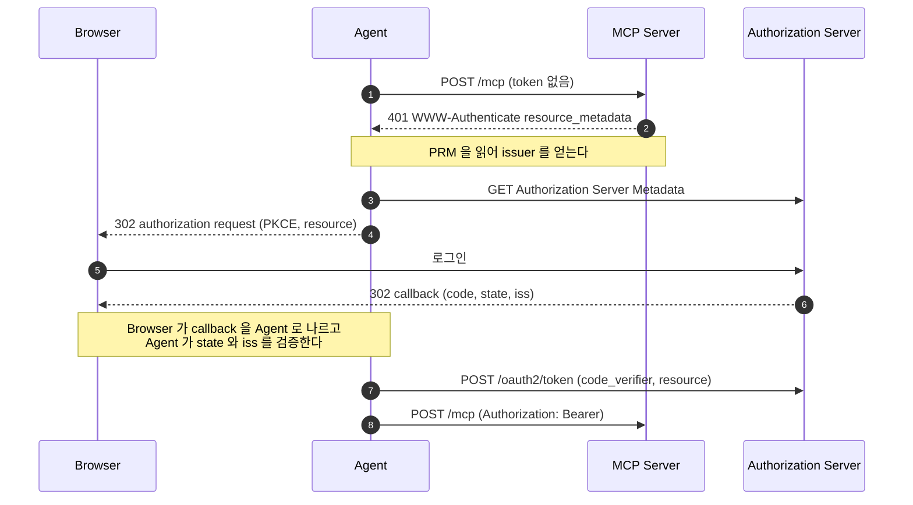
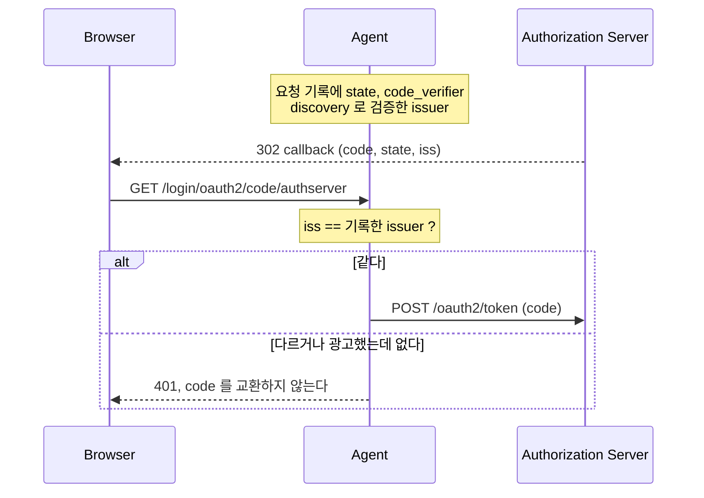

# MCP Authorization — 표준으로 배우기

인증이 포함된 MCP(Model Context Protocol) 호출을 명세 기준으로 처음부터 끝까지 정리한 허브 문서다.
단계마다 명세 규칙을 요구 수준 원문 그대로 압축하고, 세 practice 가 그 규칙을 어느 클래스·설정으로 지키는지 붙인다.
필드 표와 요청·응답 예시, 전체 다이어그램은 아래 두 문서에 있다.

| 문서 | 담는 것 |
|---|---|
| 이 문서 | 범위, 구성요소, 단계별 규칙과 구현, 보안, 준수표 |
| [MCP-API-SPEC.md](MCP-API-SPEC.md) | 엔드포인트마다 요청·응답 필드 표, 오류, 캡처 예시 |
| [MCP-SEQUENCES.md](MCP-SEQUENCES.md) | 등록과 런타임 흐름의 sequence 다이어그램과 단계 설명 |

- [`mcp-security-authn-official`](mcp-security-authn-official) — Spring Security · Spring Authorization Server · Spring AI MCP 를 직접 조립
- [`mcp-security-authn-chat-memory`](mcp-security-authn-chat-memory) — official 과 같은 구조에 사용자별 대화 기억을 더한 것
- [`mcp-security-authn-community`](mcp-security-authn-community) — spring-ai-community `mcp-security` 모듈(0.1.14) 자동설정 위에서 구현

## 목차

1. [범위와 기준 리비전](#s1)
2. [구성요소](#s2)
3. [전체 흐름](#s3)
4. [단계별](#s4) — [4.1 401 challenge](#s4-1) · [4.2 PRM](#s4-2) · [4.3 Authorization Server Metadata](#s4-3) · [4.4 Client 등록](#s4-4) · [4.5 Authorization request 와 consent](#s4-5) · [4.6 Callback 과 `iss`](#s4-6) · [4.7 Token request](#s4-7) · [4.8 MCP 호출과 session](#s4-8) · [4.9 Token 검증](#s4-9) · [4.10 만료와 refresh](#s4-10)
5. [보안 고려사항](#s5)
6. [준수표](#s6)
7. [2026-07-28 전송에서 달라지는 점](#s7)
8. [다루지 않는 것](#s8)
9. [출처](#s9)

---

## 1. 범위와 기준 리비전

MCP 명세는 날짜로 리비전을 나누고, 이 문서는 전송·수명주기와 authorization 을 서로 다른 기준으로 따른다.
다루는 대상은 MCP 와 이 practice 가 만든 Authorization Server 다. 쓰지 않는 기능은 [7절](#s7)과 [8절](#s8)에서 몇 줄로 정리한다.

| 계층 | 기준 리비전 | 이유 |
|---|---|---|
| 전송·수명주기 (Streamable HTTP, `initialize`, session) | **2025-11-25** | 세 practice 의 MCP Java SDK 2.0.0 `ProtocolVersions` 는 `2024-11-05` · `2025-03-26` · `2025-06-18` · `2025-11-25` 까지만 안다. 협상된 `protocolVersion` 도 `2025-11-25` 다(C7) |
| authorization (discovery, client 등록, PKCE, `resource`, token 검증) | **2025-11-25 + 2026-07-28 추가분** | authorization 은 HTTP 계층 규칙이라 전송과 따로 적용된다. 2026-07-28 이 더한 [Authorization Response Validation](https://modelcontextprotocol.io/specification/2026-07-28/basic/authorization#authorization-response-validation)(RFC 9207 `iss`)과 [Authorization Server Binding](https://modelcontextprotocol.io/specification/2026-07-28/basic/authorization/client-registration#authorization-server-binding)까지 따른다 |

### 표기

- 요구 수준 단어(MUST·SHOULD·MAY, REQUIRED·RECOMMENDED·OPTIONAL)는 원문 그대로 둔다. MCP 명세는 절 제목(앵커 링크)으로, RFC·OAuth 2.1 draft-13·OpenID 문서는 절 번호로 가리킨다.
- "관측:" 의 `C<n>`·`S<n>`·`P<n>` 은 [캡처](../docs/superpowers/captures) 단계 번호다([파일과 스크립트](MCP-API-SPEC.md#common)). practice 를 밝히지 않은 관측·구현은 세 practice 공통이고, 포트·client_id·사용자 이름만 다르다.
- 테스트는 `클래스#메서드` 로 적고, 같은 클래스의 다음 테스트는 `#메서드` 로 줄인다.

---

## 2. 구성요소

protected MCP Server 는 OAuth 2.1 resource server, MCP client 는 OAuth 2.1 client 다([MCP 2025-11-25 Authorization — Roles](https://modelcontextprotocol.io/specification/2025-11-25/basic/authorization#roles)).
Authorization Server 는 사용자와 상호작용하고 MCP Server 에서 쓸 access token 을 발급하며, resource server 와 같이 둘 수도 별도로 둘 수도 있다.
세 practice 는 Authorization Server·MCP Server·Agent 를 서로 다른 프로세스(포트)로 띄운다.

### 역할

| 역할 | OAuth 용어 | 프로젝트 | 하는 일 |
|---|---|---|---|
| Browser | user-agent (resource owner 가 조작) | 브라우저 | Agent 화면을 열고 Authorization Server 에 로그인하며, authorization code 가 담긴 redirect 를 나른다. token 은 보지 않는다 |
| Agent | confidential client ([OAuth 2.1 §2.1](https://datatracker.ietf.org/doc/html/draft-ietf-oauth-v2-1-13#section-2.1)) | `shop-agent` | 사용자 대신 MCP Server 를 부른다. discovery, code 교환, token 보관을 서버 쪽에서 하고, token endpoint 에서 `client_secret_basic` 으로 인증한다 |
| Local MCP Client | public client | 없음 — 캡처 스크립트(`curl`)가 대신한다 | 사용자 기기의 데스크톱 앱·CLI 를 가정한다. 비밀 없이 `local-mcp-client` 로 등록돼 있다 |
| MCP Server | resource server | `shop-mcp-server` | PRM 을 공개하고, 요청마다 token 을 검증하고, tool(`getStock`, `searchProducts`)을 실행한다 |
| Authorization Server | authorization server | `auth-server` | 사용자를 로그인시키고 token 을 발급한다 |

### 두 client

Agent 는 브라우저 안의 앱이 아니라 서버에서 도는 웹 앱이라 `client_secret` 을 안전하게 보관하고, MCP Server 로 가는 요청에 브라우저의 `Origin` 이 붙지 않는다.
사용자 기기의 MCP client 는 배포본에서 비밀이 드러나므로 public client 로 등록한다.
두 client 는 모두 pre-registration 이고, 차이는 [4.4](#s4-4)에 있다.

### 신뢰 관계

| 누가 | 미리 아는 것(설정) | 실행 중에 알아내거나 검증하는 것 |
|---|---|---|
| Agent | MCP Server URL(`mcp.authorization.resource-url`), pre-registration 자격증명(client_id·secret·redirect URI·scope), 그 자격증명의 issuer(`mcp.authorization.credentials-issuer`) | Authorization Server 위치와 endpoint 는 설정에 없고 MCP Server 에게서 discovery 한다([4.2](#s4-2), [4.3](#s4-3)). issuer 가 `credentials-issuer` 와 다르면 자격증명을 보내지 않는다([4.4](#s4-4)) |
| MCP Server | 신뢰할 issuer(`issuer-uri`), 자기 resource 식별자(audience) | 서명 key 는 metadata 의 `jwks_uri` 에서 받고, 요청마다 서명·`iss`·`aud`·`exp` 를 검증한다([4.9](#s4-9)) |
| Authorization Server | 등록된 client 둘 — Agent(confidential, PKCE 필수)와 `local-mcp-client`(public, loopback redirect URI, PKCE·consent 필수), token 을 발급할 resource 목록(`mcp.authorization.resources`), 사용자 계정 | authorization request 의 `resource` 가 목록에 있는지, token request 의 `resource` 가 authorization request 와 같은지 본다([4.5](#s4-5), [4.7](#s4-7)) |
| Browser | 없음 | Authorization Server 와 Agent 각각의 session cookie 만 가진다 |

### MCP Server 가 Authorization Server 를 겸하지 않는 이유

[MCP 2025-03-26 Authorization](https://modelcontextprotocol.io/specification/2025-03-26/basic/authorization) 에서는 client 가 MCP Server URL 에서 경로를 버린 base URL 에서 Authorization Server Metadata 를 찾아야 했다(MUST).
[MCP 2025-06-18 Key Changes](https://modelcontextprotocol.io/specification/2025-06-18/changelog) 가 MCP Server 를 OAuth Resource Server 로 분류하고, PRM 과 RFC 8707 Resource Indicators 를 요구하며 역할을 나눴다.
그래서 MCP Server 는 token 을 검증만 하고, 여러 resource 가 한 Authorization Server 를 함께 쓸 때 `resource` 와 audience 검증으로 token 의 대상을 가린다([4.7](#s4-7), [4.9](#s4-9)).

### practice 별 포트·계정

| | official | chat-memory | community |
|---|---|---|---|
| Authorization Server (issuer) | `http://localhost:9010` | `http://localhost:9020` | `http://localhost:9000` |
| MCP Server resource 식별자 | `http://localhost:8111/mcp` | `http://localhost:8131/mcp` | `http://localhost:8101/mcp` |
| Agent | `http://localhost:8110` | `http://localhost:8130` | `http://localhost:8100` |
| client_id | `official-shop-agent` | `memory-agent` | `shop-agent` |
| redirect URI | `http://localhost:8110/login/oauth2/code/authserver` | `http://localhost:8130/login/oauth2/code/authserver` | `http://localhost:8100/login/oauth2/code/authserver` |
| public client | `local-mcp-client`, redirect URI `http://127.0.0.1:8123/callback` | 같음 | 같음 |
| 로그인 계정 | `user` / `password` | `alice` / `alice`, `bob` / `bob` | `user` / `password` |
| 구성 방식 | filter chain·bean 을 직접 정의 | official 과 같은 클래스 구성 | 모듈 자동설정 + 확장점, 막히는 곳만 직접 정의 |

### 구현 위치 지도

chat-memory 의 Authorization Server·MCP Server 클래스는 official 과 패키지만 다르다(`dev.starryeye.memoryauthn.*`).
뒤 절의 "이 practice" 는 이 표의 이름으로 가리킨다.

| 관심사 | official · chat-memory | community |
|---|---|---|
| PRM 공개 | `shop-mcp-server` `SecurityConfig` — `protectedResourceMetadata(...)` | 모듈 `McpServerOAuth2Configurer#protectedResourceMetadataCustomizer` |
| 401 challenge 의 `resource_metadata` | `SecurityConfig#resourceMetadataEntryPoint` (Spring `BearerTokenAuthenticationEntryPoint`) | 같은 진입점을 모듈 기본 진입점 대신 건다 |
| token 검증(서명·`iss`·`aud`·`exp`) | `application.yml` 의 `spring.security.oauth2.resourceserver.jwt.issuer-uri` · `audiences` | Boot `JwtDecoder` + 모듈 `validateAudienceClaim(true)`(`AudienceValidationJwtDecoder`) |
| `Origin`·`Host` 검증 | `McpTransportConfig` — SDK `DefaultServerTransportSecurityValidator` | 모듈 `allowedOrigins` · `allowedHosts` → `OriginValidationFilter` |
| `MCP-Protocol-Version` 검증 | `McpProtocolVersionFilter` + `McpTransportConfig#mcpProtocolVersionFilter` | `McpProtocolVersionFilter` + `McpProtocolVersionFilterConfig` |
| Authorization Server 설정 진입점 | `AuthorizationServerConfig` (filter chain 직접 정의) | `McpAuthorizationStandardConfig` (`Customizer<McpAuthorizationServerConfigurer>`), `OidcDiscoveryConfig` |
| PKCE 강제 | `auth-server` `application.yml` — `require-proof-key: true` | 같음 |
| `resource` 허용 목록과 authorization request 검증 | `McpResourceProperties`, `ResourceIndicatorValidator` | 같음 |
| access token `aud` 발급과 token request `resource` 검증 | `ResourceAudienceTokenCustomizer` | 같음 + ID token `aud` 를 client_id 로 되돌리는 분기 |
| authorization response 의 `iss`, metadata 광고(`iss` 지원 + client 인증 서명 알고리즘 세 claim) | `IssuerIdentifyingAuthorizationResponseHandler` + `AuthorizationServerConfig` | `IssuerIdentifyingAuthorizationResponseHandler` + `McpAuthorizationStandardConfig` |
| client 인증 실패의 `WWW-Authenticate` | `ClientAuthenticationChallengeFailureHandler` + `AuthorizationServerConfig#clientAuthentication` | `ClientAuthenticationChallengeFailureHandler` + `McpAuthorizationStandardConfig#clientAuthentication` |
| public client 등록 | `auth-server` `application.yml` — `local-mcp-client` | 같음 |
| metadata 의 `none` 광고 | `AuthorizationServerConfig` — `tokenEndpointAuthenticationMethods(...)` | `McpAuthorizationStandardConfig` |
| public client 의 consent 를 기록하지 않음 | `PublicClientConsentService` + `AuthorizationServerConfig#authorizationConsentService` | `PublicClientConsentService` + `McpAuthorizationStandardConfig#authorizationConsentService` |
| Dynamic Client Registration(DCR) | 켜지 않음 — Spring Authorization Server 기본값 | 끔 — `spring.ai.mcp.authorizationserver.dynamic-client-registration.enabled: false` |
| PRM·Authorization Server Metadata discovery | `McpAuthorizationDiscovery`, `DiscoveredAuthorization` | `McpAuthorizationDiscovery` + 모듈 `McpMetadataDiscoveryService`(401 challenge 와 PRM) |
| pre-registration 자격증명과 issuer binding | `DiscoveredClientRegistrationRepository`, `McpAuthorizationProperties` | 같음 |
| authorization request 의 PKCE·`resource` | `SecurityConfig#authorizationRequestResolver`, `ResourceIndicators` | 같음 |
| token·refresh request 의 `resource` | `McpSecurityConfig` — `RestClientAuthorizationCodeTokenResponseClient`, `RestClientRefreshTokenTokenResponseClient` + `ResourceIndicators` | 같음 |
| authorization response `iss` 검증 | `AuthorizationResponseIssuerFilter` (+ `LoginFailureHandler`) | 같음 |
| MCP 요청에 token 부착 | `OAuth2TokenAttachingRequestCustomizer`, `SecurityMcpTransportContextProvider` | 모듈 `OAuth2AuthorizationCodeSyncHttpRequestCustomizer`, `ChatController` 의 `AuthenticationMcpTransportContextProvider.writeToReactorContext()` |
| 만료 token refresh | `McpSecurityConfig#authorizedClientManager` (`AuthorizedClientServiceOAuth2AuthorizedClientManager`) | `McpSecurityConfig#authorizedClientManager` (`DefaultOAuth2AuthorizedClientManager`) |
| MCP 전송(client) | SDK `HttpClientStreamableHttpTransport` — `Accept`·`Mcp-Session-Id`·`MCP-Protocol-Version` 을 붙인다 | 같음 |

---

## 3. 전체 흐름

Agent 는 discovery → authorization request → token request → MCP 호출 순서로 움직인다.
Authorization Server 의 위치는 첫 authorization request 를 만들 때 알아내고, 성공한 discovery 결과는 캐시한다.
아래는 요약이고, 번호별 전체 흐름은 [MCP-SEQUENCES.md](MCP-SEQUENCES.md) 에 있다.

| 메시지 | 무엇을 하나 | 절 | 시퀀스 | API |
|---|---|---|---|---|
| 1–2번 | token 없는 요청과 401 challenge | [4.1](#s4-1) | [Discovery](MCP-SEQUENCES.md#rt-discovery) | [`mcp-unauthenticated`](MCP-API-SPEC.md#mcp-unauthenticated) |
| (Note) | PRM | [4.2](#s4-2) | [Discovery](MCP-SEQUENCES.md#rt-discovery) | [`prm`](MCP-API-SPEC.md#prm) |
| 3번 | Authorization Server Metadata | [4.3](#s4-3) | [Discovery](MCP-SEQUENCES.md#rt-discovery) | [`as-metadata`](MCP-API-SPEC.md#as-metadata), [`oidc-discovery`](MCP-API-SPEC.md#oidc-discovery) |
| (설정) | client 등록과 issuer binding | [4.4](#s4-4) | [confidential](MCP-SEQUENCES.md#reg-confidential), [public](MCP-SEQUENCES.md#reg-public), [issuer binding](MCP-SEQUENCES.md#issuer-binding) | [`cimd-document`](MCP-API-SPEC.md#cimd-document), [`dcr-register`](MCP-API-SPEC.md#dcr-register) |
| 4–5번 | authorization request, 로그인, consent | [4.5](#s4-5) | [confidential](MCP-SEQUENCES.md#rt-authz-confidential), [public](MCP-SEQUENCES.md#rt-authz-public) | [`authorize`](MCP-API-SPEC.md#authorize), [`authorize-consent`](MCP-API-SPEC.md#authorize-consent) |
| 6번 | callback 과 `iss` 검증 | [4.6](#s4-6) | [confidential](MCP-SEQUENCES.md#rt-authz-confidential) | [`authorization-response`](MCP-API-SPEC.md#authorization-response) |
| 7번 | token request | [4.7](#s4-7) | [Token request](MCP-SEQUENCES.md#rt-token) | [`token-authorization-code`](MCP-API-SPEC.md#token-authorization-code) |
| 8번 | 인증된 MCP 호출과 session | [4.8](#s4-8) | [MCP session](MCP-SEQUENCES.md#rt-mcp-session) | [`mcp-post`](MCP-API-SPEC.md#mcp-post), [`mcp-get`](MCP-API-SPEC.md#mcp-get), [`mcp-delete`](MCP-API-SPEC.md#mcp-delete) |
| (매 요청) | MCP Server 의 token 검증 | [4.9](#s4-9) | [token 검증](MCP-SEQUENCES.md#rt-token-validation) | [`jwks`](MCP-API-SPEC.md#jwks) |
| (5분 뒤) | 만료와 refresh | [4.10](#s4-10) | [만료와 refresh](MCP-SEQUENCES.md#rt-refresh) | [`token-refresh`](MCP-API-SPEC.md#token-refresh) |

이 흐름은 confidential client(Agent)의 것이다.
public client 도 discovery·PKCE·`resource`·`iss` 는 같고, consent 와 token request 의 모양이 다르다([4.4](#s4-4)).

---

## 4. 단계별

각 절은 요약 → 명세 → 이 practice → 자세히 링크 순서로 쓴다.
요청·응답 필드와 캡처 예시는 [MCP-API-SPEC.md](MCP-API-SPEC.md), 번호별 흐름은 [MCP-SEQUENCES.md](MCP-SEQUENCES.md) 에 있다.

### 4.1 401 challenge

MCP client 가 처음 아는 것은 MCP Server URL 하나다.
token 없이 그 URL 을 부르면 MCP Server 가 `401` 과 PRM 의 위치로 답하고, 이것이 discovery 의 출발점이다.

#### 명세

- [MCP 2025-11-25 Authorization — Protected Resource Metadata Discovery Requirements](https://modelcontextprotocol.io/specification/2025-11-25/basic/authorization#protected-resource-metadata-discovery-requirements) — MCP Server 는 `401` 의 `WWW-Authenticate` 에 `resource_metadata` 를 싣거나([RFC 9728 §5.1](https://www.rfc-editor.org/rfc/rfc9728#section-5.1)) well-known URI 에 PRM 을 두는 것 중 하나를 구현한다(**MUST**). client 는 둘 다 지원하고, header 의 URL 을 먼저 쓰고 없으면 경로형 → 루트형 순서로 well-known URI 를 만든다(**MUST**).
- 같은 절 — MCP Server 는 challenge 에 필요한 `scope` 를 넣는 것이 좋다(**SHOULD**, [RFC 6750 §3](https://www.rfc-editor.org/rfc/rfc6750#section-3)). 없으면 client 는 [Scope Selection Strategy](https://modelcontextprotocol.io/specification/2025-11-25/basic/authorization#scope-selection-strategy)를 따라(**SHOULD**) PRM 의 `scopes_supported` 전체를 요청하고, 그것도 없으면 `scope` 를 생략한다. client 는 `WWW-Authenticate` 를 해석해 `401` 에 대응할 수 있어야 한다(**MUST**).
- [RFC 6750 §3](https://www.rfc-editor.org/rfc/rfc6750#section-3) · [OAuth 2.1 §5.3.1](https://datatracker.ietf.org/doc/html/draft-ietf-oauth-v2-1-13#section-5.3.1) — 인증 정보나 허용되는 token 이 없으면 resource server 는 스킴 `Bearer` 의 `WWW-Authenticate` 를 포함한다(**MUST**). `realm` 은 MAY, `scope` 는 OPTIONAL 이다. 인증 정보가 아예 없던 요청에는 `error` 를 넣지 않는 것이 좋다(**SHOULD NOT**, [RFC 6750 §3.1](https://www.rfc-editor.org/rfc/rfc6750#section-3.1)).
- [RFC 9110 §11.2](https://www.rfc-editor.org/rfc/rfc9110#section-11.2) — `auth-param` 값이 `:`·`/` 를 담으면 `token` 이 될 수 없으므로([§5.6.2](https://www.rfc-editor.org/rfc/rfc9110#section-5.6.2)) URL 은 `quoted-string` 으로 보낸다.

#### 이 practice

- MCP Server: `SecurityConfig#resourceMetadataEntryPoint` 가 Spring `BearerTokenAuthenticationEntryPoint` 로 요청 경로 `/mcp` 앞에 `/.well-known/oauth-protected-resource` 를 끼운 URL 을 싣는다([RFC 9728 §3.1](https://www.rfc-editor.org/rfc/rfc9728#section-3.1)). community 도 이 진입점을 모듈 기본 진입점 대신 건다. 테스트: `McpAuthorizationStandardTest#토큰_없는_요청의_챌린지가_경로형_메타데이터를_가리킨다`.
- Agent: `McpAuthorizationDiscovery` 가 token 없이 `initialize` 를 POST 하고, `401` 이 아니면 discovery 를 멈춘다. community 는 모듈 `McpMetadataDiscoveryService#getWwwAuthenticateParameters` 가 같은 일을 한다.

관측: C1 은 `401` 과 `WWW-Authenticate: Bearer resource_metadata="http://localhost:8111/.well-known/oauth-protected-resource/mcp"` 다(chat-memory `http://localhost:8131/.well-known/oauth-protected-resource/mcp`, community `http://localhost:8101/.well-known/oauth-protected-resource/mcp`). 값은 따옴표로 감쌌고 `error`·`realm`·`scope` 는 없다. `scope` 가 없는 것은 scope 를 설계하지 않았기 때문이고([8절](#s8)), Agent 는 로그인 설정의 `openid profile` 을 요청한다.

자세히: [API](MCP-API-SPEC.md#mcp-unauthenticated) · [시퀀스](MCP-SEQUENCES.md#rt-discovery)

### 4.2 PRM

Protected Resource Metadata(PRM)는 이 resource 가 무엇이고 어느 Authorization Server 가 이 resource 용 token 을 발급하는지 적은 JSON 문서다.
client 는 PRM 의 `resource` 를 검증한 뒤 `authorization_servers` 에서 issuer 를 고른다.

#### 명세

- [MCP 2025-11-25 Authorization — Authorization Server Location](https://modelcontextprotocol.io/specification/2025-11-25/basic/authorization#authorization-server-location) — MCP Server 는 RFC 9728 을 구현하고(**MUST**), `authorization_servers` 에 Authorization Server 를 하나 이상 넣는다(**MUST**). RFC 9728 자체에서 이 필드는 OPTIONAL 이다. 여럿이면 client 가 [RFC 9728 §7.6](https://www.rfc-editor.org/rfc/rfc9728#section-7.6)에 따라 고른다.
- [MCP 2026-07-28 Authorization Server Discovery — Authorization Server Location](https://modelcontextprotocol.io/specification/2026-07-28/basic/authorization/authorization-server-discovery#authorization-server-location) — client 는 나열된 Authorization Server 마다 등록 상태를 따로 가져야 하고(**MUST**), 한 서버의 자격증명이 다른 서버에서 통한다고 가정하면 안 된다(**MUST NOT**).
- [RFC 9728 §3](https://www.rfc-editor.org/rfc/rfc9728#section-3) · [§3.1](https://www.rfc-editor.org/rfc/rfc9728#section-3.1) — metadata URL 은 resource 식별자의 host 와 path 사이에 `/.well-known/oauth-protected-resource` 를 끼워 만들고, 요청은 `GET` 이다(**MUST**). 성공 응답은 `200` + `application/json` 이다(**MUST**, [§3.2](https://www.rfc-editor.org/rfc/rfc9728#section-3.2)).
- [RFC 9728 §3.3](https://www.rfc-editor.org/rfc/rfc9728#section-3.3) — 응답의 `resource` 는 URL 을 만든 resource 식별자와, `resource_metadata` 로 받았다면 client 가 요청한 URL 과 정확히 같아야 한다. 다르면 응답을 쓰면 안 된다(**MUST NOT**). 다른 resource 의 metadata 로 엉뚱한 Authorization Server 에 유도하는 사칭([§7.3](https://www.rfc-editor.org/rfc/rfc9728#section-7.3))을 막는다.
- [MCP 2025-11-25 Authorization — Canonical Server URI](https://modelcontextprotocol.io/specification/2025-11-25/basic/authorization#canonical-server-uri) — canonical URI 는 RFC 8707 resource 식별자이자 RFC 9728 의 `resource` 다. scheme 이 있고 fragment 가 없어야 하며, 끝 `/` 는 의미가 없으면 붙이지 않는 것이 좋다(**SHOULD**).

#### 이 practice

- MCP Server: `SecurityConfig` 의 `protectedResourceMetadata(...)` 가 issuer 를 설정하고, Spring Security 가 경로형·루트형 두 곳에 문서를 낸다. community 는 모듈 `McpServerOAuth2Configurer#protectedResourceMetadataCustomizer` 로 같은 값과 `resourceName` 을 준다. 테스트: `McpAuthorizationStandardTest#보호_리소스_메타데이터를_경로형으로_공개한다`.
- `tls_client_certificate_bound_access_tokens`: Spring 기본 동작은 PRM 에 이 값을 `true` 로 내고(`OAuth2ProtectedResourceMetadataFilter`), 명세는 이 resource 가 mTLS 에 묶인 access token 을 지원하는지 알리는 OPTIONAL 필드로 생략하면 `false` 로 보며([RFC 9728 §2](https://www.rfc-editor.org/rfc/rfc9728#section-2)), 이 practice 는 그런 token 을 요구하지도 검증하지도 않으므로 `tlsClientCertificateBoundAccessTokens(false)` 로 끈다.
- Agent: `McpAuthorizationDiscovery#protectedResourceMetadata` 가 challenge URL → 경로형 → 루트형 순서로 시도하고, `resource` 를 `resource-url`(루트형은 origin)과 비교한다. issuer 는 `authorization_servers` 의 첫 값이다. 테스트: `McpAuthorizationDiscoveryTest#메타데이터의_resource_가_요청한_URL_과_다르면_실패한다`.
- community Agent: 모듈 `McpMetadataDiscoveryService#getMcpMetadata` 가 같은 순서와 같은 비교를 하고, issuer 선택부터는 `McpAuthorizationDiscovery` 가 이어받는다.

관측: C2 의 `resource` 는 `http://localhost:8111/mcp`, `authorization_servers` 는 `["http://localhost:9010"]` 이고 challenge 를 받은 URL 과 같다. 루트형 `http://localhost:8111/.well-known/oauth-protected-resource` 의 `resource` 는 `http://localhost:8111` 이다(S2). `scopes_supported`(RECOMMENDED)는 없고 `resource_name`(RECOMMENDED)은 community 에만 있다.

자세히: [API](MCP-API-SPEC.md#prm) · [시퀀스](MCP-SEQUENCES.md#rt-discovery)

### 4.3 Authorization Server Metadata

PRM 이 알려 주는 것은 issuer 식별자뿐이다.
authorization·token endpoint 주소와 지원 기능은 Authorization Server Metadata 에서 얻고, client 는 `issuer` 일치와 PKCE 지원을 확인한 뒤에야 진행한다.

#### 명세

- [MCP 2025-11-25 Authorization — Overview](https://modelcontextprotocol.io/specification/2025-11-25/basic/authorization#overview) — Authorization Server 는 RFC 8414 와 OpenID Connect Discovery 1.0 중 하나 이상을 제공하고(**MUST**), client 는 둘 다 지원한다(**MUST**).
- [MCP 2025-11-25 Authorization — Authorization Server Metadata Discovery](https://modelcontextprotocol.io/specification/2025-11-25/basic/authorization#authorization-server-metadata-discovery) — client 는 아래 표의 순서로 시도한다(**MUST**). RFC 8414 를 먼저 보는 근거는 [RFC 8414 §5](https://www.rfc-editor.org/rfc/rfc8414#section-5)이고, 경로가 있는 issuer 에서 두 규격의 URL 변환이 다르다.
- [MCP 2026-07-28 Authorization Server Discovery — Authorization Server Metadata Discovery](https://modelcontextprotocol.io/specification/2026-07-28/basic/authorization/authorization-server-discovery#authorization-server-metadata-discovery) — 응답의 `issuer` 는 URL 을 만든 issuer 와 같아야 하고(**MUST**, [RFC 8414 §3.3](https://www.rfc-editor.org/rfc/rfc8414#section-3.3) · [OIDC Discovery §4.3](https://openid.net/specs/openid-connect-discovery-1_0.html#ProviderConfigurationValidation)), 다르면 그 문서를 쓰면 안 된다(**MUST NOT**).
- [MCP 2025-11-25 Authorization — Authorization Code Protection](https://modelcontextprotocol.io/specification/2025-11-25/basic/authorization#authorization-code-protection) — client 는 metadata 로 PKCE 지원을 확인해야 하고(**MUST**), `code_challenge_methods_supported` 가 없으면 진행을 거부해야 한다(**MUST**). OIDC Discovery 를 제공하는 Authorization Server 는 이 필드를 넣어야 한다(**MUST**). 가능하면 `S256` 을 써야 한다(**MUST**).
- [RFC 9207 §3](https://www.rfc-editor.org/rfc/rfc9207#section-3) — `authorization_response_iss_parameter_supported` 는 authorization response 에 `iss` 를 싣는지 알린다. 생략하면 `false` 다.

| issuer 형태 | 1순위 | 2순위 | 3순위 |
|---|---|---|---|
| 경로 있음 `https://auth.example.com/tenant1` | `/.well-known/oauth-authorization-server/tenant1` (RFC 8414, 경로 앞에 삽입) | `/.well-known/openid-configuration/tenant1` (OIDC, 경로 앞에 삽입) | `/tenant1/.well-known/openid-configuration` (OIDC, 경로 뒤에 붙임) |
| 경로 없음 `https://auth.example.com` | `/.well-known/oauth-authorization-server` | `/.well-known/openid-configuration` | — |

#### 이 practice

- Agent: `McpAuthorizationDiscovery#metadataUrls` 가 위 순서로 URL 을 만든다(official 은 `http://localhost:9010/.well-known/oauth-authorization-server` 다음 `http://localhost:9010/.well-known/openid-configuration`). 처음 `200` 이 온 문서의 `issuer` 와 `S256` 을 확인하고, 어긋나면 `McpDiscoveryException` 으로 멈추며 다음 후보로 넘어가지 않는다. 테스트: `McpAuthorizationDiscoveryTest#PKCE_S256_을_광고하지_않으면_진행하지_않는다`.
- Authorization Server: `AuthorizationServerConfig`(community 는 `McpAuthorizationStandardConfig`)가 두 metadata 문서에 `authorization_response_iss_parameter_supported: true`, `none`, client 인증 서명 알고리즘 세 claim 을 더한다. community 는 모듈이 OIDC endpoint 를 켜지 않아 `OidcDiscoveryConfig` 가 `oidc()` 를 켠다. 테스트: `AuthorizationServerStandardTest#메타데이터가_PKCE_S256_과_RFC9207_iss_지원을_광고한다`.
- 세 서명 알고리즘 claim 의 값은 Spring 의 `JwtClientAssertionDecoderFactory` 가 `client_secret_jwt`·`private_key_jwt` 에서 실제로 검증하는 12개(HS·RS·ES·PS 256/384/512)다. Spring Security 에 이 claim 상수가 없어 문자열로 넣는다. 테스트: `#메타데이터에_클라이언트_인증_서명_알고리즘이_광고된다`.

관측: C3 의 `issuer` 는 `http://localhost:9010` 이고 `code_challenge_methods_supported: ["S256"]`·`authorization_response_iss_parameter_supported: true` 가 두 문서 모두에 있다(S1). `token_endpoint_auth_methods_supported` 에는 여섯 방식과 `none` 이 있고(P1), `registration_endpoint`·`client_id_metadata_document_supported` 는 없다. `grant_types_supported` 의 `client_credentials`·token exchange 는 서버 전체 능력이고, 등록된 grant 는 `authorization_code`·`refresh_token` 뿐이다.

자세히: [API](MCP-API-SPEC.md#as-metadata) · [OIDC](MCP-API-SPEC.md#oidc-discovery) · [시퀀스](MCP-SEQUENCES.md#rt-discovery)

### 4.4 Client 등록

authorization request 를 만들려면 Authorization Server 가 아는 `client_id` 가 있어야 한다.
등록 방식(pre-registration·CIMD·DCR)과 인증 방식(confidential·public)은 서로 다른 축이다.
이 practice 는 두 client 를 모두 pre-registration 으로 등록하고, 자격증명을 issuer 에 묶는다.

#### 명세 — 등록 방식

[MCP 2025-11-25 Authorization — Client Registration Approaches](https://modelcontextprotocol.io/specification/2025-11-25/basic/authorization#client-registration-approaches) · [MCP 2026-07-28 Client Registration](https://modelcontextprotocol.io/specification/2026-07-28/basic/authorization/client-registration) — 모든 방식을 지원하는 client 는 아래 우선순위를 따르는 것이 좋다(**SHOULD**).

| 순위 | 방식 | 언제 | 요구 수준 | 이 practice |
|---|---|---|---|---|
| 1순위 | pre-registration | client 가 그 서버용 정보를 이미 가질 때 | 정적 자격증명 지원 **SHOULD** | 씀 — confidential·public 두 client |
| 2순위 | Client ID Metadata Document(CIMD) | Authorization Server 가 `client_id_metadata_document_supported: true` 를 광고할 때 | **SHOULD** | 쓰지 않음 |
| 3순위 | Dynamic Client Registration(DCR, RFC 7591) | metadata 에 `registration_endpoint` 가 있을 때 | **MAY**, 2026-07-28 에서 deprecated | 쓰지 않음 |
| 4순위 | 사용자 입력 | 위 방법이 모두 없을 때 | — | 쓰지 않음 |

- CIMD — client 는 자기 metadata JSON 을 `https` 에 경로가 있는 URL 에 올리고 그 URL 을 `client_id` 로 쓴다(**MUST**, [draft-ietf-oauth-client-id-metadata-document-00 §3](https://www.ietf.org/archive/id/draft-ietf-oauth-client-id-metadata-document-00.html#section-3)). 문서에는 최소 `client_id`·`client_name`·`redirect_uris` 가 있고(**MUST**, [MCP — Implementation Requirements](https://modelcontextprotocol.io/specification/2025-11-25/basic/authorization#implementation-requirements)), `client_id` 는 문서 URL 과 정확히 같아야 한다(**MUST**, [§4.1](https://www.ietf.org/archive/id/draft-ietf-oauth-client-id-metadata-document-00.html#section-4.1)). Authorization Server 는 문서를 가져오고(**SHOULD**) 검증하며(**MUST**), 임의 URL 을 가져오는 SSRF 위험을 고려한다(**SHOULD**).
- DCR — 이전 리비전과의 하위 호환용이고, 2026-07-28 은 deprecated 로 표시하며 새 구현은 CIMD 를 쓰라고 한다. 그대로 쓰는 client 는 알맞은 `application_type` 을 지정해야 한다(**MUST**).

#### 명세 — issuer binding

- [MCP 2026-07-28 Client Registration — Authorization Server Binding](https://modelcontextprotocol.io/specification/2026-07-28/basic/authorization/client-registration#authorization-server-binding) — pre-registration·DCR 자격증명은 발급한 Authorization Server 의 `issuer` 를 키로 묶어야 한다(**MUST**). Authorization Server 가 바뀌면 다른 서버의 자격증명을 재사용하면 안 되고(**MUST NOT**) 새 서버에 다시 등록해야 한다(**MUST**). 자격증명이 PRM 이 가리키는 서버와 맞지 않으면 몰래 시도하지 말고 오류를 드러내는 것이 좋다(**SHOULD**).

#### 명세 — confidential client 와 public client

- [OAuth 2.1 §2.1](https://datatracker.ietf.org/doc/html/draft-ietf-oauth-v2-1-13#section-2.1) — 자격증명이 있으면 `confidential`, 없으면 `public` 이다. 한 client_id 를 두 유형으로 다루면 안 된다(**SHOULD NOT**). Authorization Server 는 client 신원에 대한 확신 정도를 고려해 consent 를 얼마나 자주 물을지 정하는 것이 좋다(**SHOULD**).
- [OAuth 2.1 §8.1.1](https://datatracker.ietf.org/doc/html/draft-ietf-oauth-v2-1-13#section-8.1.1) · [RFC 8252 §8.4](https://www.rfc-editor.org/rfc/rfc8252#section-8.4) — 네이티브 앱에 공유 비밀로 client 인증을 요구하는 것은 **NOT RECOMMENDED** 이고, 그래도 요구하면 public client 로 다뤄야 한다(**MUST**). client 별 비밀이 없으면 네이티브 앱은 public client 로 등록해야 하고, Authorization Server 는 유형을 기록해야 한다(**MUST**).
- [RFC 8414 §2](https://www.rfc-editor.org/rfc/rfc8414#section-2) · [RFC 7591 §2](https://www.rfc-editor.org/rfc/rfc7591#section-2) — `token_endpoint_auth_methods_supported` 의 값 `none` 은 client secret 이 없는 public client 라는 뜻이다.
- [OAuth 2.1 §4.1.3](https://datatracker.ietf.org/doc/html/draft-ietf-oauth-v2-1-13#section-4.1.3) — client 인증을 하지 않는 client 는 token request 에 `client_id` 를 보낸다(REQUIRED). confidential client 는 인증해야 한다(**MUST**, [§3.2.2](https://datatracker.ietf.org/doc/html/draft-ietf-oauth-v2-1-13#section-3.2.2)).
- [OAuth 2.1 §7.5.2](https://datatracker.ietf.org/doc/html/draft-ietf-oauth-v2-1-13#section-7.5.2) · [RFC 8252 §8.1](https://www.rfc-editor.org/rfc/rfc8252#section-8.1) — `code_challenge`·`code_verifier` 는 client 에게 REQUIRED 이고 Authorization Server 는 강제해야 한다(**MUST**). public client 에는 예외가 없고, 같은 기기의 다른 앱이 가로챈 code 를 쓸모없게 만드는 유일한 방어다.
- [RFC 8252 §7.3](https://www.rfc-editor.org/rfc/rfc8252#section-7.3) · [OAuth 2.1 §8.4.2](https://datatracker.ietf.org/doc/html/draft-ietf-oauth-v2-1-13#section-8.4.2) — loopback redirect(`http://127.0.0.1:{port}/{path}`)는 요청 시점의 어떤 포트든 허용해야 한다(**MUST**). 포트 말고는 등록 URI 와 정확히 같아야 하고(**MUST**, RFC 8252 §8.4), 이름 `localhost` 는 **NOT RECOMMENDED** 다([RFC 8252 §8.3](https://www.rfc-editor.org/rfc/rfc8252#section-8.3)).
- [OAuth 2.1 §1.3.2](https://datatracker.ietf.org/doc/html/draft-ietf-oauth-v2-1-13#section-1.3.2) · [§4.3.1](https://datatracker.ietf.org/doc/html/draft-ietf-oauth-v2-1-13#section-4.3.1) — refresh token 발급은 Authorization Server 재량이다. public client 에 발급하면 sender-constrained token 이나 회전을 써야 한다(**MUST**).
- [RFC 8707 §2](https://www.rfc-editor.org/rfc/rfc8707#section-2) · [MCP 2025-11-25 Authorization — Token Audience Binding and Validation](https://modelcontextprotocol.io/specification/2025-11-25/basic/authorization#token-audience-binding-and-validation) — `resource` 와 audience 규칙은 client 유형을 가리지 않는다.

#### 이 practice

| | confidential client (Agent) | public client |
|---|---|---|
| client_id | `official-shop-agent` · `memory-agent` · `shop-agent` | `local-mcp-client` (세 practice 같음) |
| token endpoint 인증 | `client_secret_basic` | `none` — 본문에 `client_id` 만(P5) |
| redirect URI | [포트 표](#s2)의 Agent callback | `http://127.0.0.1:8123/callback` — loopback, 포트는 요청마다 달라도 된다(P10) |
| PKCE | 필수(`require-proof-key: true`) | 필수(P9·P11) |
| consent | 없음(`require-authorization-consent: false`) | 매 요청(`require-authorization-consent: true` + `PublicClientConsentService`, P3·P8) |
| refresh token | 발급, 회전 없음(C11) | 발급하지 않음(P7) |
| access token `aud` | `resource`(C6-1) | `resource`(P5-1) |
| MCP Server 의 검증 | 서명·`iss`·`aud`·`exp` | 같다 — MCP Server 는 client 유형을 보지 않는다(P6) |

- Agent 설정에는 자격증명(`spring.security.oauth2.client.registration.authserver`)과 `mcp.authorization.resource-url`·`credentials-issuer` 만 있다. `DiscoveredClientRegistrationRepository#registration` 은 discovery 로 얻은 issuer 가 `credentials-issuer` 와 다르면 `McpDiscoveryException` 을 던지고 `ClientRegistration` 을 만들지 않아, `client_secret` 이 어디로도 나가지 않는다. 테스트: `DiscoveredClientRegistrationRepositoryTest#자격증명이_묶인_인가_서버가_아니면_쓰지_않는다`.
- discovery 는 처음 필요할 때 한 번 하고 성공한 결과만 프로세스 수명 동안 캐시하며, 실패한 discovery 는 캐시하지 않아 다음 요청에서 다시 시도한다(`DiscoveredClientRegistrationRepositoryTest#발견은_한_번만_한다`, `#실패는_캐시하지_않는다`). 그래서 PRM 의 Authorization Server 가 바뀐 것은 Agent 를 다시 시작할 때 드러나고, 그때 위 검사가 오류를 낸다.
- `local-mcp-client` 는 `auth-server` `application.yml` 설정만으로 등록된다(`client-authentication-methods: [none]`, `require-proof-key: true`, `require-authorization-consent: true`). Spring 의 `PublicClientAuthenticationProvider` 가 `none` 등록을 확인하고 `CodeVerifierAuthenticator` 로 PKCE 를 검증하므로, public client 에게는 PKCE 검증이 곧 client 인증이다.
- Spring 기본 metadata 는 `none` 을 광고하지 않고, 명세에서 이 광고는 OPTIONAL 이다. 이 practice 는 `tokenEndpointAuthenticationMethods(methods -> methods.add("none"))` 로 기존 목록 끝에 덧붙인다. 테스트: `AuthorizationServerStandardTest#메타데이터에_공개_클라이언트_인증_방식_none_이_광고되고_기존_방식도_유지된다`.
- `OAuth2RefreshTokenGenerator` 는 `authorization_code` grant 에서 인증 방식이 `none` 이면 refresh token 을 만들지 않는다. loopback 포트는 `OAuth2AuthorizationCodeRequestAuthenticationValidator` 가 등록 URI 의 포트를 요청 포트로 바꿔 비교한다. 테스트: `#루프백_리다이렉트는_등록된_포트와_달라도_허용되고_경로가_다르면_거부된다`.
- community Authorization Server 는 모듈이 기본으로 켜는 DCR 을 `dynamic-client-registration.enabled: false` 로 끈다. 테스트: `AuthorizationServerStandardTest#동적_클라이언트_등록은_켜지_않는다`.

관측: C3·S1 metadata 에 `registration_endpoint` 와 `client_id_metadata_document_supported` 가 없어, 이 Authorization Server 에서 가능한 등록 방식은 pre-registration 뿐이다.

자세히: [API — CIMD](MCP-API-SPEC.md#cimd-document) · [API — DCR](MCP-API-SPEC.md#dcr-register) · 시퀀스 [confidential](MCP-SEQUENCES.md#reg-confidential) · [public](MCP-SEQUENCES.md#reg-public) · [CIMD](MCP-SEQUENCES.md#reg-cimd) · [DCR](MCP-SEQUENCES.md#reg-dcr) · [issuer binding](MCP-SEQUENCES.md#issuer-binding)

### 4.5 Authorization request 와 consent

client 는 PKCE 값과 `resource` 를 실은 authorization request 로 Browser 를 Authorization Server 에 보낸다.
Authorization Server 는 client·redirect URI·PKCE·`resource` 를 검증하고, 사용자를 로그인시킨 뒤 필요하면 consent 를 받는다.

#### 명세

- [OAuth 2.1 §4.1.1](https://datatracker.ietf.org/doc/html/draft-ietf-oauth-v2-1-13#section-4.1.1) — `response_type=code`·`client_id` 는 REQUIRED, `code_challenge` 는 REQUIRED 또는 RECOMMENDED(§7.5.1), `code_challenge_method` 는 OPTIONAL(기본 `plain`), `scope`·`state` 는 OPTIONAL 이다. `redirect_uri` 는 등록값과 단순 문자열로 정확히 대조해야 한다(**MUST**). [RFC 6749 §4.1.1](https://www.rfc-editor.org/rfc/rfc6749#section-4.1.1) 에서 `state` 는 RECOMMENDED 였다.
- [RFC 7636 §4.1](https://www.rfc-editor.org/rfc/rfc7636#section-4.1)–§4.3 — `code_verifier` 는 43~128자의 고엔트로피 무작위 문자열이고, `S256` 이면 `code_challenge = BASE64URL-ENCODE(SHA256(ASCII(code_verifier)))` 다. `S256` 을 쓸 수 있는 client 는 써야 한다(**MUST**). PKCE 를 요구하는 서버는 `code_challenge` 없는 요청에 `invalid_request` 를 돌려줘야 한다(**MUST**, [§4.4.1](https://www.rfc-editor.org/rfc/rfc7636#section-4.4.1)).
- [OAuth 2.1 §7.5.2](https://datatracker.ietf.org/doc/html/draft-ietf-oauth-v2-1-13#section-7.5.2) — PKCE 생략은 confidential client 이면서 OIDC `nonce` 를 올바르게 쓴다는 확신이 있을 때뿐이고, 그때도 PKCE 는 RECOMMENDED 다. MCP 는 이 예외 없이 client 가 PKCE 를 구현하고(**MUST**) 진행 전에 지원을 확인하라고 한다(**MUST**, [4.3](#s4-3)).
- [MCP 2025-11-25 Authorization — Resource Parameter Implementation](https://modelcontextprotocol.io/specification/2025-11-25/basic/authorization#resource-parameter-implementation) — client 는 RFC 8707 을 구현하고(**MUST**), authorization request 와 token request 둘 다에 MCP Server 의 canonical URI 를 `resource` 로 넣는다(**MUST**). Authorization Server 가 지원하는지와 무관하게 보낸다(**MUST**).
- [RFC 8707 §2](https://www.rfc-editor.org/rfc/rfc8707#section-2) · [§2.1](https://www.rfc-editor.org/rfc/rfc8707#section-2.1) — `resource` 는 절대 URI 이고 fragment 가 없어야 한다(**MUST**). 받아들일 수 없는 값은 `invalid_target` 이고, `resource` 를 생략한 요청은 기본값으로 처리할 수도(**MAY**) `invalid_target` 으로 거부할 수도(**MAY**) 있다.
- [MCP 2025-11-25 Authorization — Open Redirection](https://modelcontextprotocol.io/specification/2025-11-25/basic/authorization#open-redirection) · [RFC 6749 §4.1.2.1](https://www.rfc-editor.org/rfc/rfc6749#section-4.1.2.1) — client 는 redirect URI 를 등록하고(**MUST**) `state` 를 쓰고 검증하는 것이 좋다(**SHOULD**). redirect URI 나 client_id 가 없거나 틀리면 Authorization Server 는 그 URI 로 자동 redirect 하면 안 된다(**MUST NOT**).
- [OAuth 2.1 §7.3](https://datatracker.ietf.org/doc/html/draft-ietf-oauth-v2-1-13#section-7.3) · [§7.3.1](https://datatracker.ietf.org/doc/html/draft-ietf-oauth-v2-1-13#section-7.3.1) — Authorization Server 는 사용자를 명시적으로 인증하고 client·scope·수명 정보를 보여 주는 것이 좋다(**SHOULD**). client 신원을 확인할 수 없으면 consent 없이 자동 처리하지 않는 것이 좋고(**SHOULD NOT**), 이전 consent 가 있어도 처음처럼 처리하는 것이 좋다(**SHOULD**).
- [OpenID Connect Core 1.0 §3.1.2.1](https://openid.net/specs/openid-connect-core-1_0.html#AuthRequest) — `nonce`(OPTIONAL)는 client session 과 ID token 을 묶어 재전송을 막는다.

#### 이 practice

- Agent: `SecurityConfig#authorizationRequestResolver` 가 `OAuth2AuthorizationRequestCustomizers.withPkce()` 와 `ResourceIndicators.authorizationRequest(...)` 를 잇는다. 요청 기록은 `HttpSessionOAuth2AuthorizationRequestRepository` 에 저장된다. 테스트: `ShopAgentApplicationTests#인가_요청에_PKCE_와_resource_가_실린다`.
- Authorization Server: `require-proof-key: true` 가 `code_challenge` 없는 요청을 거부하고, `ResourceIndicatorValidator` 가 허용 목록 밖 `resource` 에 `invalid_target` 을 던진다. `resource` 가 없는 요청은 거부하지 않는다(RFC 8707 §2.1 의 MAY). 테스트: `AuthorizationServerStandardTest#등록되지_않은_resource_는_invalid_target_이다`.
- consent: confidential client 는 consent 를 생략하고(`require-authorization-consent: false`), public client 는 매번 받는다. Spring 기본은 받은 consent 를 저장해 다음부터 건너뛰지만, `PublicClientConsentService` 가 인증 방식이 `none` 인 client 의 consent 를 저장하지 않는다. 테스트: `AuthorizationServerStandardTest#공개_클라이언트는_이전에_동의했어도_매번_동의_화면을_거친다`.

관측: S17 요청에 `code_challenge_method=S256` 과 `resource=http://localhost:8111/mcp` 가 실린다. 허용 목록 밖 `resource=http://localhost:9999/mcp` 는 `error=invalid_target`(C16), `code_challenge` 누락은 `error=invalid_request`(C17), 등록되지 않은 redirect URI 는 redirect 없는 `400`(S4)이다. public client 는 이전 consent 가 있어도 `200` consent 화면을 받는다(P3·P8).

자세히: [API](MCP-API-SPEC.md#authorize) · [consent API](MCP-API-SPEC.md#authorize-consent) · 시퀀스 [confidential](MCP-SEQUENCES.md#rt-authz-confidential) · [public](MCP-SEQUENCES.md#rt-authz-public)

### 4.6 Callback 과 `iss`

authorization response(`code`, `state`)에는 누가 발급했는지가 없어, client 가 Authorization Server 를 둘 이상 다루면 mix-up 공격이 생긴다([RFC 9207 §1](https://www.rfc-editor.org/rfc/rfc9207#section-1)).
MCP 에서는 client 가 MCP Server 가 알려 준 Authorization Server 로 가므로 이 조건이 쉽게 생긴다([MCP 2026-07-28 Security Considerations — Mix-Up Attacks](https://modelcontextprotocol.io/specification/2026-07-28/basic/authorization/security-considerations#mix-up-attacks)).
callback 의 `iss` 를 기록해 둔 issuer 와 비교하면 다른 서버의 응답을 걸러낸다.

#### 명세

- [RFC 6749 §4.1.2](https://www.rfc-editor.org/rfc/rfc6749#section-4.1.2) · [OAuth 2.1 §4.1.2](https://datatracker.ietf.org/doc/html/draft-ietf-oauth-v2-1-13#section-4.1.2) — 성공 응답은 `code`(REQUIRED), `state`(요청에 있었으면 REQUIRED)이고, OAuth 2.1 은 `iss`(OPTIONAL)를 더했다. client 는 모르는 응답 파라미터를 무시해야 한다(**MUST**).
- [RFC 9207 §2](https://www.rfc-editor.org/rfc/rfc9207#section-2) · [§2.3](https://www.rfc-editor.org/rfc/rfc9207#section-2.3) — RFC 9207 을 지원하는 Authorization Server 는 성공·오류 응답 모두에 `iss` 를 넣어야 한다(**MUST**). RFC 8414 metadata 를 내면 `issuer` 가 `iss` 와 같아야 하고, `authorization_response_iss_parameter_supported: true` 를 광고해야 한다(**MUST**).
- [RFC 9207 §2.4](https://www.rfc-editor.org/rfc/rfc9207#section-2.4) — client 는 `iss` 를 디코딩해 요청을 보낸 issuer 와 단순 문자열 비교해야 하고(**MUST**), 다르면 거부하고 진행하면 안 된다(**MUST NOT**). 오류 응답이 의도한 서버에서 왔다고 가정하면 안 된다(**MUST NOT**). 지원하는 서버의 응답에 `iss` 가 없으면 거부해야 한다(**MUST**).
- [OAuth 2.1 §2.3.4](https://datatracker.ietf.org/doc/html/draft-ietf-oauth-v2-1-13#section-2.3.4) — Authorization Server 를 둘 이상 다루는 client 는 mix-up 을 막아야 한다(**MUST**).
- [MCP 2026-07-28 Authorization — Authorization Response Validation](https://modelcontextprotocol.io/specification/2026-07-28/basic/authorization#authorization-response-validation) — redirect 전에 검증한 `issuer` 를 PKCE `code_verifier`(와 `state`)를 저장하는 같은 요청별 기록에 저장해야 한다(**MUST**). Authorization Server 는 오류 응답을 포함해 `iss` 를 넣는 것이 좋고(**SHOULD**), 넣으면 metadata 로 광고해야 한다(**MUST**). client 는 code 를 어떤 token endpoint 로 보내기 전에 아래 표대로 검증해야 한다(**MUST**).
- 같은 절 — 비교 전에 scheme·host 대소문자, 기본 포트, 끝 `/`, 퍼센트 인코딩을 정규화하면 안 된다(**MUST NOT**). 오류 응답에도 적용되며, 불일치하면 `error`·`error_description`·`error_uri` 를 따르거나 보여 주면 안 된다(**MUST NOT**).
- [MCP 2025-11-25 Authorization — Open Redirection](https://modelcontextprotocol.io/specification/2025-11-25/basic/authorization#open-redirection) — `state` 가 없거나 원래 값과 다른 결과는 버리는 것이 좋다(**SHOULD**).

| metadata `authorization_response_iss_parameter_supported` | 응답의 `iss` | client 동작 |
|---|---|---|
| `true` | 있음 | 기록한 issuer 와 단순 문자열 비교 |
| `true` | 없음 | 응답 거부 |
| `false` 또는 없음 | 있음 | 기록한 issuer 와 단순 문자열 비교 |
| `false` 또는 없음 | 없음 | 진행 |

#### 이 practice

- Authorization Server: `IssuerIdentifyingAuthorizationResponseHandler` 를 authorization endpoint 의 성공·오류 응답 핸들러로 걸어 모든 redirect 에 `iss` 를 붙인다. 값은 `AuthorizationServerContextHolder` 의 issuer 로 metadata 의 `issuer` 와 같다. 테스트: `AuthorizationServerStandardTest#인가_응답에_code_state_iss_가_실린다`.
- Agent: `AuthorizationResponseIssuerFilter` 가 code 를 교환하는 `OAuth2LoginAuthenticationFilter` 앞에서 `state` 로 요청 기록을 찾고, 그 `registrationId` 의 `issuerUri` 와 `iss` 를 `String.equals` 로 비교한다. 실패하면 기록을 지우고 `LoginFailureHandler` 가 `401` 을 보내며, Authorization Server 가 보낸 `error` 계열 파라미터는 보여 주지 않는다. 테스트: `AuthorizationResponseIssuerFilterTest#iss_가_다르면_코드를_교환하지_않는다`.
- 기록 방식: 명세는 issuer 를 `code_verifier` 와 같은 요청별 기록에 넣으라고 하고, 이 practice 는 요청별 기록에 `registrationId` 를 넣고 issuer 는 그 등록(프로세스 수명 동안 캐시한 discovery 결과)에서 꺼낸다. Authorization Server 가 하나이고 discovery 결과가 실행 중 바뀌지 않아 비교 대상은 같지만, 문구 그대로의 구현은 아니다([6절](#s6) 10번).

관측: 성공 응답의 `iss=http%3A%2F%2Flocalhost%3A9010` 은 디코딩하면 C3 `issuer` 와 같고(C5), 오류 redirect 에도 `iss` 가 있다(C16·C17). 조작한 `iss` 는 `401 iss mismatch`(S18), `iss` 없는 callback 은 `401 iss is missing`(S19)으로 끝나고 code 를 교환하지 않는다. 정상 왕복은 code 교환 뒤 `302 Location: http://localhost:8110/` 로 로그인을 마친다(S20).

자세히: [API](MCP-API-SPEC.md#authorization-response) · [시퀀스](MCP-SEQUENCES.md#rt-authz-confidential)

### 4.7 Token request

`iss` 검증을 통과한 callback 에서 client 는 authorization code 를 token 으로 바꾼다.
이 요청은 Browser 를 거치지 않는 back-channel 요청이다.
Authorization Server 는 client 인증·PKCE·`resource` 를 확인한 뒤 audience 를 `resource` 로 제한한 access token 을 발급한다.

#### 명세

- [OAuth 2.1 §3.2.2](https://datatracker.ietf.org/doc/html/draft-ietf-oauth-v2-1-13#section-3.2.2) · [§4.1.3](https://datatracker.ietf.org/doc/html/draft-ietf-oauth-v2-1-13#section-4.1.3) — `grant_type=authorization_code`·`code` 는 REQUIRED 이고, `code_verifier` 는 `code_challenge` 가 있었으면 REQUIRED, 없었으면 쓰면 안 된다. confidential client 는 인증해야 한다(**MUST**). Authorization Server 는 code 하나로 token 을 한 번만 발급하고, `code_verifier` 가 `code_challenge` 가 있었을 때에만 오는지 확인해 둘을 대조해야 한다(**MUST**).
- [RFC 6749 §4.1.3](https://www.rfc-editor.org/rfc/rfc6749#section-4.1.3) — authorization request 에 `redirect_uri` 가 있었다면 같은 값으로 REQUIRED 다. OAuth 2.1 은 이 파라미터를 목록에서 뺐고, 하위 호환은 §10.2 에서 다룬다.
- [RFC 7636 §4.6](https://www.rfc-editor.org/rfc/rfc7636#section-4.6) — `BASE64URL-ENCODE(SHA256(ASCII(code_verifier)))` 가 `code_challenge` 와 다르면 `invalid_grant` 를 돌려줘야 한다(**MUST**).
- [RFC 8707 §2.2](https://www.rfc-editor.org/rfc/rfc8707#section-2.2) · [MCP Resource Parameter Implementation](https://modelcontextprotocol.io/specification/2025-11-25/basic/authorization#resource-parameter-implementation) — `authorization_code`·`refresh_token` grant 의 `resource` 는 원래 허가된 resource 로 제한할 수 있다. Authorization Server 는 access token audience 를 `resource` 로 제한하는 것이 좋고(**SHOULD**, [§2](https://www.rfc-editor.org/rfc/rfc8707#section-2)), MCP client 는 token request 에도 `resource` 를 넣어야 한다(**MUST**).
- [OAuth 2.1 §3.2.3](https://datatracker.ietf.org/doc/html/draft-ietf-oauth-v2-1-13#section-3.2.3) — `access_token`·`token_type` 은 REQUIRED, `expires_in` 은 RECOMMENDED, `refresh_token` 은 OPTIONAL 이다. token 이 든 응답에는 `Cache-Control: no-store` 가 있어야 한다(**MUST**).
- [OIDC Core §3.1.3.3](https://openid.net/specs/openid-connect-core-1_0.html#TokenResponse) · [§2](https://openid.net/specs/openid-connect-core-1_0.html#IDToken) — OIDC token 응답에는 `id_token` 이 있어야 한다(**MUST**). ID token 의 `aud` 에는 client_id 가 있어야 하고(**MUST**), 다른 audience 를 더할 수 있다(MAY).
- [OAuth 2.1 §3.2.4](https://datatracker.ietf.org/doc/html/draft-ietf-oauth-v2-1-13#section-3.2.4) · [RFC 6749 §5.2](https://www.rfc-editor.org/rfc/rfc6749#section-5.2) — 오류는 기본 `400` 이다. `Authorization` 헤더로 인증을 시도했다 실패한 `invalid_client` 는 `401` 과 그 스킴의 `WWW-Authenticate` 로 응답해야 한다(**MUST**).
- [RFC 9068 §2.1](https://www.rfc-editor.org/rfc/rfc9068#section-2.1) · [§2.2](https://www.rfc-editor.org/rfc/rfc9068#section-2.2) — JWT access token 프로파일은 헤더 `typ` 에 access token media type 을 넣어야 하고(**MUST**) 값은 `at+jwt` 가 좋다(**SHOULD**). claim `iss`·`exp`·`aud`·`sub`·`client_id`·`iat`·`jti` 는 REQUIRED 이고, scope 를 요청했으면 공백으로 구분한 문자열 `scope` 가 있는 것이 좋다(**SHOULD**, [RFC 8693 §4.2](https://www.rfc-editor.org/rfc/rfc8693#section-4.2)).
- MCP 는 audience 검증을 설명하며 RFC 9068 을 예로 들 뿐 access token 형식을 정하지 않는다([Access Token Privilege Restriction](https://modelcontextprotocol.io/specification/2025-11-25/basic/authorization#access-token-privilege-restriction), [OAuth 2.1 §5.2](https://datatracker.ietf.org/doc/html/draft-ietf-oauth-v2-1-13#section-5.2)).

#### 이 practice

- Agent: `McpSecurityConfig#authorizationCodeTokenResponseClient` 가 `RestClientAuthorizationCodeTokenResponseClient` 에 `ResourceIndicators.tokenRequest(...)` 를 더해 `resource` 를 싣는다. `code_verifier`·`redirect_uri` 는 저장된 요청 기록에서, 인증 방식 `CLIENT_SECRET_BASIC` 은 `DiscoveredClientRegistrationRepository` 에서 온다. 테스트: `AuthorizationCodeTokenRequestTest#코드_교환_요청에_resource_를_실어_보낸다`.
- Authorization Server: `ResourceAudienceTokenCustomizer` 는 token request 와 authorization request 의 `resource` 가 다르거나 허용 목록 밖이면 `invalid_target` 을 던지고, 통과하면 `aud` 를 그 값 하나로 둔다. 둘 다 없으면 `aud` 를 바꾸지 않고, 그 token 은 MCP Server 에서 거부된다. 테스트: `AuthorizationServerStandardTest#access_token_의_aud_는_resource_이고_id_token_은_client_id_다`.
- community: 모듈 `ResourceIdentifierAudienceTokenCustomizer` 는 ID token 의 `aud` 도 `resource` 로 덮어쓴다. community 의 `ResourceAudienceTokenCustomizer` 는 그 뒤에 실행돼 ID token `aud` 를 client_id 로 되돌린다(OIDC Core §2).
- `invalid_client` 의 `WWW-Authenticate`: Spring 기본 `OAuth2ClientAuthenticationFilter#onAuthenticationFailure` 는 이 헤더를 붙이지 않는다([spring-security #18285](https://github.com/spring-projects/spring-security/issues/18285), 7.2.0-M1 도 같다). 명세는 `401` 과 스킴에 맞는 `WWW-Authenticate` 를 요구하므로, `ClientAuthenticationChallengeFailureHandler` 가 요청의 스킴과 issuer realm 으로 채운다. 스킴이 `token` 문법에 맞지 않으면 `Basic` 으로 되돌리고, `Authorization` 헤더 없이 실패하면 헤더를 붙이지 않는다.
- access token 은 RFC 9068 프로파일이 아니다: `typ` 과 `client_id` claim 이 없고 `scope` 가 JSON 배열이다(C6-1). MCP 는 이 프로파일을 요구하지 않아 MCP 준수에는 영향이 없다([6절](#s6) 17번).

관측: C6-1 access token 의 `aud` 는 `http://localhost:8111/mcp`, C6-2 ID token 의 `aud` 는 `official-shop-agent` 이고 access token 수명은 300초다. 다른 `resource` 는 `400 invalid_target`(S6), 틀린 `code_verifier` 는 `400 invalid_grant`(S7)이다. 틀린 client_secret 은 `401` 과 `WWW-Authenticate: Basic realm="http://localhost:9010"` 이다(S8).

자세히: [API](MCP-API-SPEC.md#token-authorization-code) · [시퀀스](MCP-SEQUENCES.md#rt-token)

### 4.8 MCP 호출과 session

token 을 가진 Agent 는 사용자의 채팅 요청을 처리하며 MCP session 을 연다.
authorization 은 HTTP 계층의 일이라 JSON-RPC 메시지는 인증이 없을 때와 같고, 모든 HTTP 요청에 `Authorization` 헤더가 붙는 것만 다르다.

#### 명세

- [MCP 2025-11-25 Lifecycle — Initialization](https://modelcontextprotocol.io/specification/2025-11-25/basic/lifecycle#initialization) — 초기화는 첫 상호작용이어야 한다(**MUST**). server 는 `protocolVersion`·`capabilities`·`serverInfo` 로 응답하고(**MUST**), 요청 버전을 지원하면 같은 버전으로 답해야 한다(**MUST**, [Version Negotiation](https://modelcontextprotocol.io/specification/2025-11-25/basic/lifecycle#version-negotiation)). 성공한 뒤 client 는 `notifications/initialized` 를 보내야 한다(**MUST**).
- [MCP 2025-11-25 Transports — Sending Messages to the Server](https://modelcontextprotocol.io/specification/2025-11-25/basic/transports#sending-messages-to-the-server) — JSON-RPC 메시지는 각각 새 HTTP POST 이고, `Accept` 에 `application/json`·`text/event-stream` 을 모두 넣어야 한다(**MUST**). 알림·응답에는 본문 없는 `202`, 요청에는 `application/json` 이나 `text/event-stream` 으로 응답해야 한다(**MUST**).
- [MCP 2025-11-25 Transports — Session Management](https://modelcontextprotocol.io/specification/2025-11-25/basic/transports#session-management) — server 는 `MCP-Session-Id` 를 줄 수 있고(MAY), 받은 client 는 이후 모든 요청에 넣어야 한다(**MUST**). ID 없는 요청에는 `400` 이 좋고(**SHOULD**), 끝난 session 에는 `404` 여야 하며(**MUST**) 그 client 는 새 `initialize` 를 해야 한다(**MUST**). HTTP 헤더 이름은 대소문자를 구분하지 않는다([RFC 9110 §5.1](https://www.rfc-editor.org/rfc/rfc9110#section-5.1)).
- [MCP 2025-11-25 Transports — Protocol Version Header](https://modelcontextprotocol.io/specification/2025-11-25/basic/transports#protocol-version-header) — client 는 이후 모든 요청에 `MCP-Protocol-Version` 을 넣어야 한다(**MUST**). 헤더가 없으면 server 는 `2025-03-26` 으로 가정하는 것이 좋고(**SHOULD**), 유효하지 않거나 지원하지 않는 값이면 `400` 이어야 한다(**MUST**).
- [MCP 2025-11-25 Transports — Security Warning](https://modelcontextprotocol.io/specification/2025-11-25/basic/transports#security-warning) — server 는 모든 연결의 `Origin` 헤더를 검증해야 하고(**MUST**), `Origin` 헤더가 있는데 유효하지 않으면 `403` 이어야 한다(**MUST**). 로컬 실행 시 127.0.0.1 에만 bind 하고, 모든 연결에 인증을 두는 것이 좋다(**SHOULD**).
- [MCP 2025-11-25 Authorization — Token Requirements](https://modelcontextprotocol.io/specification/2025-11-25/basic/authorization#token-requirements) — 같은 논리 session 이라도 모든 HTTP 요청에 `Authorization: Bearer <access-token>` 을 넣어야 하고(**MUST**, [OAuth 2.1 §5.1.1](https://datatracker.ietf.org/doc/html/draft-ietf-oauth-v2-1-13#section-5.1.1)), URI 쿼리에 넣으면 안 된다(**MUST NOT**).
- [MCP 2025-11-25 Transports — Resumability and Redelivery](https://modelcontextprotocol.io/specification/2025-11-25/basic/transports#resumability-and-redelivery) — SSE 이벤트 `id` 는 붙일 수 있고(MAY), 붙였다면 session 안의 모든 stream 에서 전역으로 유일해야 한다(**MUST**).

#### 이 practice

- Agent: SDK `HttpClientStreamableHttpTransport` 가 POST 마다 `Accept`·`Content-Type`·`MCP-Protocol-Version`·`Mcp-Session-Id` 를 붙이고, session ID 를 받으면 `GET /mcp` stream 을 연다. `Authorization` 은 요청마다 불리는 커스터마이저(`OAuth2TokenAttachingRequestCustomizer`, community 는 모듈 `OAuth2AuthorizationCodeSyncHttpRequestCustomizer`)가 붙인다. token 은 로그인한 사용자의 것이고, Agent 자신의 client credentials token 은 쓰지 않는다.
- Agent 는 기동 시점에 `initialize` 를 하지 않는다(`spring.ai.mcp.client.initialized: false`). 기동 시점에는 대신 호출할 사용자가 없어 `401` 이 오기 때문이고, handshake 는 첫 채팅 요청 중에 일어난다.
- MCP Server: Spring AI `WebMvcStreamableServerTransportProvider` 가 session(UUID)과 `400`/`404` 를 판단한다. `McpProtocolVersionFilter` 가 SDK 가 하지 않는 `MCP-Protocol-Version` 검증을 하고(없으면 통과), `Origin`·`Host` 는 SDK `DefaultServerTransportSecurityValidator`(community 는 모듈 `OriginValidationFilter`)가 보고, `Origin` 헤더가 없는 요청은 통과시킨다. 테스트: `McpAuthorizationStandardTest#지원하지_않는_MCP_Protocol_Version_헤더는_400이다`.
- 검사 순서: official·chat-memory 는 `McpProtocolVersionFilter` 가 먼저, community 는 `OriginValidationFilter` 가 먼저다. 그래서 잘못된 버전과 허용되지 않은 `Origin` 을 함께 실으면 official·chat-memory 는 `400`, community 는 `403` 이다. 허용 Origin 은 official·chat-memory 가 없음, community 가 `http://localhost:8101` 이다.
- SSE 이벤트 `id`: SDK 서버 전송은 이벤트 `id` 로 session ID 를 써서 한 session 의 이벤트가 같은 `id` 를 가진다(C9·C10). 그 값을 정하는 `WebMvcStreamableMcpSessionTransport` 가 `private` 이고 이를 감싼 `WebMvcStreamableServerTransportProvider` 가 `public final` 이라, 전송 구현 전체를 포크하지 않고는 바꿀 수 없다([6절](#s6) 19번).

관측: C7 `initialize` 는 `200` 과 `Mcp-Session-Id`, 협상 버전 `2025-11-25` 이고, C8 `notifications/initialized` 는 `202` 다. 지원하지 않는 버전은 `400` `-32600`(C15), session ID 없는 POST 는 `400`(C14), 끝난 session 은 `404`(S13·S16)이다. `Origin: http://evil.example` 은 `403`(C13), `Host: evil.example:8111` 은 `421`(S14)이다.

자세히: [API](MCP-API-SPEC.md#mcp-post) · [GET](MCP-API-SPEC.md#mcp-get) · [DELETE](MCP-API-SPEC.md#mcp-delete) · [시퀀스](MCP-SEQUENCES.md#rt-mcp-session)

### 4.9 Token 검증

MCP Server 는 요청을 처리하기 전에 access token 을 검증하고, 자기를 audience 로 발급한 token 만 받는다.
같은 Authorization Server 가 서명했고 `iss` 도 맞는 token 이라도 대상이 다르면 거부한다.

#### 명세

- [MCP 2025-11-25 Authorization — Token Handling](https://modelcontextprotocol.io/specification/2025-11-25/basic/authorization#token-handling) — MCP Server 는 [OAuth 2.1 §5.2](https://datatracker.ietf.org/doc/html/draft-ietf-oauth-v2-1-13#section-5.2) 대로 검증하고(**MUST**), token 이 자기를 audience 로 발급됐는지 확인해야 한다(**MUST**, RFC 8707 §2). 실패하면 OAuth 2.1 §5.3 대로 응답하고, 유효하지 않거나 만료된 token 에는 `401` 이어야 한다(**MUST**). 자기 resource 에 유효한 token 만 받고(**MUST**), 다른 token 은 받거나 전달하면 안 된다(**MUST NOT**).
- [MCP 2025-11-25 Authorization — Access Token Privilege Restriction](https://modelcontextprotocol.io/specification/2025-11-25/basic/authorization#access-token-privilege-restriction) — 요청 처리 전에 검증하고(**MUST**), audience 에 자기가 없는 token 은 거부해야 한다(**MUST**).
- [OAuth 2.1 §5.2](https://datatracker.ietf.org/doc/html/draft-ietf-oauth-v2-1-13#section-5.2) — resource server 는 token 이 만료되지 않았는지, 요청한 resource 에 권한이 있는지, 알맞은 scope 로 발급됐는지, 그 밖의 정책을 만족하는지 확인해야 한다(**MUST**).
- [RFC 9068 §4](https://www.rfc-editor.org/rfc/rfc9068#section-4) — `typ` 이 `at+jwt`·`application/at+jwt` 인지, `iss` 가 정확히 같은지, `aud` 에 자기가 있는지, 서명이 맞고 `alg: none` 이 아닌지, `exp` 전인지 확인해야 한다(**MUST**). 실패하면 `invalid_token` 이고, [RFC 6750 §3.1](https://www.rfc-editor.org/rfc/rfc6750#section-3.1) 에서 `invalid_token` 은 `401` 이다(**SHOULD**).

#### 이 practice

| 검증 | 명세 | official · chat-memory | community | 관측 |
|---|---|---|---|---|
| 서명 | RFC 9068 §4 MUST | `issuer-uri` 로 metadata 의 `jwks_uri` key 를 쓴다(`NimbusJwtDecoder.withIssuerLocation`) | Boot 가 만든 같은 decoder 를 모듈에 넘긴다 | S3 `not-a-jwt` → `401 invalid_token` |
| `iss` | MUST, 정확히 일치 | `JwtIssuerValidator(issuer-uri)` | 같음 | 테스트 `McpAuthorizationStandardTest#iss_가_다른_토큰은_거부한다` |
| `aud` | MCP MUST · RFC 9068 MUST | `jwt.audiences: http://localhost:8111/mcp` | 모듈 `AudienceValidationJwtDecoder` 가 요청 URL 로 계산한 `http://localhost:8101/mcp` | C12 ID token → `401 The aud claim is not valid` |
| `exp`·`nbf` | MUST | `JwtTimestampValidator`(허용 오차 60초) | 같음 | 캡처 없음 |
| `typ` | RFC 9068 MUST `at+jwt` | `JwtTypeValidator.jwt()` — `typ` 이 없거나 `JWT` 일 때만 통과 | 같음 | C7 `typ` 없는 token 통과 |
| scope | OAuth 2.1 §5.2 MUST(알맞은 scope) | 검사하지 않는다. 인증된 요청은 모든 tool 허용 | 같음 | — |

community 는 기대 audience 를 요청 URL 로 계산하므로, 허용 Host `127.0.0.1:8101` 로 부르면 기대값이 `http://127.0.0.1:8101/mcp` 가 되어 `localhost` 로 발급된 token 을 거부한다.
거부되는 쪽으로 어긋나 안전하지만, 기대값을 설정으로 고정하는 official 방식이 canonical URI 하나를 기준으로 삼는 명세에 더 가깝다.

관측: C12 의 ID token 은 서명과 `iss` 가 맞아도 `aud` 가 달라 `401` 이고, 오류 응답에도 `resource_metadata` 가 남아 client 는 discovery 를 다시 할 수 있다. RFC 9068 §5 가 경고하는 ID token 오용을 이 practice 는 `aud` 검사로 막는다.

자세히: [API](MCP-API-SPEC.md#jwks) · [시퀀스](MCP-SEQUENCES.md#rt-token-validation) · [오류 경로](MCP-SEQUENCES.md#rt-errors)

### 4.10 만료와 refresh

access token 수명은 300초다(`expires_in: 299`).
Agent 는 만료 직전의 token 을 refresh token 으로 바꾸고, 이때도 `resource` 를 실어 audience 를 유지한다.
public client 는 refresh token 을 받지 않아, 만료되면 authorization request 부터 다시 한다.

#### 명세

- [OAuth 2.1 §4.3.1](https://datatracker.ietf.org/doc/html/draft-ietf-oauth-v2-1-13#section-4.3.1) · [RFC 6749 §6](https://www.rfc-editor.org/rfc/rfc6749#section-6) — `grant_type=refresh_token`·`refresh_token` 은 REQUIRED, `scope` 는 OPTIONAL 이다. confidential client 는 인증해야 하고(**MUST**), Authorization Server 는 refresh token 과 client 의 묶임, grant 유효성, refresh token 자체를 검증해야 한다(**MUST**). public client 에는 refresh token 회전이나 sender-constrained token 을 써야 한다(**MUST**).
- [OAuth 2.1 §4.3.2](https://datatracker.ietf.org/doc/html/draft-ietf-oauth-v2-1-13#section-4.3.2) — Authorization Server 는 새 refresh token 을 줄 수 있고(MAY), 주면 client 는 옛것을 버려야 한다(**MUST**).
- [OAuth 2.1 §3.2.3](https://datatracker.ietf.org/doc/html/draft-ietf-oauth-v2-1-13#section-3.2.3) — refresh token 은 resource owner 가 허락한 scope 와 resource server 에 묶여야 한다(**MUST**). client 는 `expires_in` 동안 token 이 반드시 유효하리라 기대하면 안 된다(**MUST NOT**).
- [RFC 8707 §2.2](https://www.rfc-editor.org/rfc/rfc8707#section-2.2) · [MCP Resource Parameter Implementation](https://modelcontextprotocol.io/specification/2025-11-25/basic/authorization#resource-parameter-implementation) — `resource` 는 모든 grant 의 token request 에 쓸 수 있고, MCP 는 token request 에 `resource` 를 요구한다(**MUST**).
- [MCP 2026-07-28 Authorization — Refresh Tokens](https://modelcontextprotocol.io/specification/2026-07-28/basic/authorization#refresh-tokens) — client 는 refresh token 을 전송·저장 중 기밀로 유지해야 하고(**MUST**), 발급을 가정하면 안 된다(**MUST NOT**). client metadata `grant_types` 에 `refresh_token` 을 넣는 것이 좋고(**SHOULD**), `scopes_supported` 에 `offline_access` 가 있으면 요청할 수 있다(MAY). MCP Server 는 `offline_access` 를 challenge 나 `scopes_supported` 에 넣지 않는 것이 좋다(**SHOULD NOT**).
- [RFC 9728 §5.2](https://www.rfc-editor.org/rfc/rfc9728#section-5.2) — resource server 는 새 challenge 로 metadata 변경을 알릴 수 있고(MAY), client 는 그때 PRM 을 다시 받아 검증하는 것이 좋다(**SHOULD**).
- [RFC 6750 §3.1](https://www.rfc-editor.org/rfc/rfc6750#section-3.1) — `invalid_token` 을 받은 client 는 새 access token 을 받아 재시도할 수 있다(MAY).

#### 이 practice

- Agent: token 부착 커스터마이저가 요청마다 `OAuth2AuthorizedClientManager#authorize` 를 부른다. Spring Security 의 refresh provider 는 access token 이 만료됐거나 60초 안에 만료되면, `McpSecurityConfig` 가 넣은 `RestClientRefreshTokenTokenResponseClient` + `ResourceIndicators.tokenRequest(...)` 로 갱신한다. 테스트: `TokenRefreshTest#만료된_토큰을_resource_를_실어_갱신한다`.
- 만료된 token 은 MCP Server 로 나가기 전에 바뀌므로, `401` 을 받은 뒤 재시도하는 로직은 없다.
- Authorization Server: refresh grant 에도 `ResourceAudienceTokenCustomizer` 가 같은 규칙을 적용하고, 원래 `resource` 는 저장된 authorization 에 남아 있다. 테스트: `AuthorizationServerStandardTest#refresh_로_받은_access_token_도_같은_aud_다`.
- discovery 결과는 프로세스 수명 동안 캐시하고, 실행 중 받은 `401` 로 PRM 을 다시 읽지 않는다([6절](#s6) 21번).

관측: C11 의 새 access token 은 `aud` 가 그대로 MCP Server 이고 `jti` 가 새 값이다. refresh token 은 처음 값과 같아 회전하지 않으며, 회전 요구는 public client 에만 MUST 라 confidential client 에서는 허용된다. public client 는 refresh token 을 받지 않고(P7), 발급은 재량이라([OAuth 2.1 §1.3.2](https://datatracker.ietf.org/doc/html/draft-ietf-oauth-v2-1-13#section-1.3.2)) 위반이 아니다.

자세히: [API](MCP-API-SPEC.md#token-refresh) · [시퀀스](MCP-SEQUENCES.md#rt-refresh)

---

## 5. 보안 고려사항

4절의 개별 검증이 막는 공격을 한데 모은다.
메커니즘은 4절을 가리키고, 여기서는 위협과 이 practice 의 결론만 적는다.

### 5.1 Token passthrough

[MCP 2025-11-25 Authorization — Token Handling](https://modelcontextprotocol.io/specification/2025-11-25/basic/authorization#token-handling) 은 client 가 그 MCP Server 의 Authorization Server 가 발급하지 않은 token 을 보내는 것(**MUST NOT**)과, MCP Server 가 자기 resource 용이 아닌 token 을 받거나 전달하는 것(**MUST NOT**)을 금한다.
[Security Best Practices — Token Passthrough](https://modelcontextprotocol.io/specification/2025-11-25/basic/security_best_practices#token-passthrough) 는 검증 없이 하류 API 로 token 을 넘기는 것을 안티패턴으로 규정하고, 자기 앞으로 발급되지 않은 token 은 받으면 안 된다고 한다(**MUST NOT**).
이 practice 의 MCP Server 는 하류 API 를 부르지 않고, Agent 는 로그인한 사용자의 access token 하나만 보낸다([4.8](#s4-8)).

### 5.2 Confused deputy

[Security Best Practices — Confused Deputy Problem](https://modelcontextprotocol.io/specification/2025-11-25/basic/security_best_practices#confused-deputy-problem) 의 공격은 MCP Server 가 static client_id 로 제3자 Authorization Server 에 등록된 OAuth proxy 이고, consent cookie 가 남으며 client 별 consent 를 따로 받지 않을 때 성립한다.
이 practice 의 MCP Server 는 proxy 가 아니어서 이 조건이 없다.
대신 [MCP 2026-07-28 Security Considerations — Access Token Privilege Restriction](https://modelcontextprotocol.io/specification/2026-07-28/basic/authorization/security-considerations#access-token-privilege-restriction) 의 일반 방어, 곧 자기 앞으로 발급된 token 만 받고(**MUST**) audience 에 자기가 없는 token 은 거부하는 것(**MUST**)을 [4.7](#s4-7)·[4.9](#s4-9)가 구현한다(C12).

### 5.3 Mix-up

악성 MCP Server 의 PRM 이 공격자 Authorization Server 를 가리키면 authorization code 가 엉뚱한 곳으로 흐를 수 있다([RFC 9207 §1](https://www.rfc-editor.org/rfc/rfc9207#section-1)).
[4.6](#s4-6)의 `AuthorizationResponseIssuerFilter` 는 discovery 때 검증한 issuer 와 callback 의 `iss` 가 다르면 code 를 어느 token endpoint 로도 보내지 않는다(S18·S19).

### 5.4 Discovery SSRF

discovery 에서 client 가 여는 URL 은 모두 MCP Server 가 알려 준 값이라, 악성 MCP Server 는 이를 내부망이나 `http://169.254.169.254/` 같은 cloud metadata 주소로 채울 수 있다([Security Best Practices — Server-Side Request Forgery (SSRF)](https://modelcontextprotocol.io/specification/2025-11-25/basic/security_best_practices#server-side-request-forgery-ssrf)).
server 에 배포된 MCP client 는 OAuth 관련 URL 을 가져올 때 SSRF 위험을 고려하고 알맞은 대응을 구현해야 하며(**MUST**), 대응으로 HTTPS 강제, 사설 IP 대역 차단([RFC 9728 §7.7](https://www.rfc-editor.org/rfc/rfc9728#section-7.7)), redirect 대상 검증, egress proxy 를 든다(모두 **SHOULD**).
Agent 는 서버에서 도는 client 라 이 MUST 의 대상이고, 세 practice 의 판정은 [준수표 27번](#s6)이다.

#### 이 practice

- official·chat-memory 는 이 대응을 하지 않는다. `McpAuthorizationDiscovery` 가 `resource_metadata` 와 metadata URL 을 검증 없이 GET 한다.
- community 는 `McpSecurityConfig` 가 모듈 `McpMetadataDiscoveryService` 에 `new DefaultUrlValidator(true)` 를 주어, PRM URL 을 가져오기 전에 HTTPS 이거나 loopback HTTP 인지 본다. Authorization Server Metadata URL 은 세 practice 모두 검증하지 않는다.
- 대신 PRM `resource` 가 요청한 URL 과 같아야 하고([4.2](#s4-2)) metadata `issuer` 가 요청한 issuer 와 같아야 한다는([4.3](#s4-3)) 두 일치 검증이 신뢰 범위를 좁힌다. `https://attacker.example/.well-known/oauth-authorization-server` 가 `"issuer": "https://honest.example"` 를 내밀어도 거부된다([MCP 2026-07-28 Authorization Server Discovery](https://modelcontextprotocol.io/specification/2026-07-28/basic/authorization/authorization-server-discovery#authorization-server-metadata-discovery)). 두 검증은 요청 자체가 아니라, SSRF 로 얻은 응답을 신뢰해 다음 단계로 넘어가는 것을 막는다.

### 5.5 Redirect URI 와 PKCE

[MCP 2026-07-28 Security Considerations — Open Redirection](https://modelcontextprotocol.io/specification/2026-07-28/basic/authorization/security-considerations#open-redirection) 은 Authorization Server 가 `redirect_uri` 를 등록값과 정확히 대조하라고 한다(**MUST**).
[Authorization Code Protection](https://modelcontextprotocol.io/specification/2026-07-28/basic/authorization/security-considerations#authorization-code-protection) 의 PKCE 는 code 를 가로챈 공격자가 `code_verifier` 없이 token 으로 바꾸지 못하게 한다.

관측: 등록되지 않은 `redirect_uri=http://evil.example/callback` 은 redirect 없이 `400` 이고(S4), `code_challenge` 없는 요청은 거부되어(C17) 모든 code 가 PKCE 로 보호된다.

#### Loopback 포트 예외

loopback IP redirect 는 포트를 요청 시점 값으로 허용해야 한다(**MUST**, [RFC 8252 §7.3](https://www.rfc-editor.org/rfc/rfc8252#section-7.3) · [OAuth 2.1 §8.4.2](https://datatracker.ietf.org/doc/html/draft-ietf-oauth-v2-1-13#section-8.4.2)).
loopback redirect 는 기기 밖으로 나가지 않지만 같은 기기의 다른 프로세스가 그 포트에서 code 를 받을 수 있고([RFC 8252 §8.1](https://www.rfc-editor.org/rfc/rfc8252#section-8.1)), 그 code 를 쓸모없게 만드는 것이 PKCE 다.

관측: 포트만 다른 `:9999` 는 통과하고(P10) 경로가 다르면 redirect 없는 `400` 이며(P10-1), 틀린 `code_verifier` 는 `invalid_grant` 다(P11).

### 5.6 Public client 사칭과 재동의

[OAuth 2.1 §7.3](https://datatracker.ietf.org/doc/html/draft-ietf-oauth-v2-1-13#section-7.3) · [§7.3.1](https://datatracker.ietf.org/doc/html/draft-ietf-oauth-v2-1-13#section-7.3.1) 은 client 신원을 확인할 수 없으면 consent 없이 자동 처리하지 않는 것이 좋고(**SHOULD NOT**), 이전 consent 가 있어도 처음처럼 처리하는 것이 좋다고 한다(**SHOULD**).
public client 의 `client_id` 는 비밀이 아니라, 같은 기기의 다른 프로그램이 `local-mcp-client` 를 대며 요청할 수 있다.
매번 consent 를 받으면 사용자가 자기가 시작하지 않은 요청을 알아챌 수 있고, code 가 새더라도 PKCE 가 막는다.

Spring 기본 동작은 consent 를 저장해 두 번째 요청부터 건너뛰고, 명세는 매번 처음처럼 처리하기를 권한다.
이 practice 는 `PublicClientConsentService` 로 public client 의 consent 를 저장하지 않아, 두 번째 요청도 `200` consent 화면이 온다(P8).
confidential client 는 비밀로 신원을 증명하므로 이 절의 대상이 아니고, consent 를 켜지 않는다.

### 5.7 localhost HTTP, session 오류 정보 노출, Origin·Host

로컬 데모라서 생기는 위반과 약점, 전송 계층의 방어를 모았다.
HTTPS 는 명세 위반이고, 나머지는 명세 위반이 아닌 관찰이다.

#### localhost HTTP

[MCP 2026-07-28 Security Considerations — Communication Security](https://modelcontextprotocol.io/specification/2026-07-28/basic/authorization/security-considerations#communication-security) 는 OAuth 2.1 §1.5 를 따라 모든 Authorization Server endpoint 가 HTTPS 여야 하고(**MUST**), 모든 redirect URI 는 `localhost` 이거나 HTTPS 여야 한다고 한다(**MUST**).
`localhost` 예외는 redirect URI 에만 있으므로, `http://localhost` 로 Authorization Server·MCP Server·Agent 를 띄우는 세 practice 는 이 MUST 를 어긴다([6절](#s6) 12번).
요청·응답을 그대로 관측하려는 로컬 학습용 선택이고, 평문 HTTP 에서는 access token·refresh token·client_secret 이 네트워크 경로에 그대로 실린다.

#### Session 오류 응답의 정보 노출

`Mcp-Session-Id` 없는 요청의 `400`(C14)과 없는 session 의 `404`(S13)는 명세대로지만, 본문의 `stackTrace` 에 Java 스택트레이스가 담긴다.
전송 명세는 이 본문 형식을 정하지 않아(`id` 없는 JSON-RPC 오류는 MAY) 위반은 아니지만, 내부 구현이 드러나는 information disclosure 약점이다.
오류 코드는 [JSON-RPC 2.0 §5.1](https://www.jsonrpc.org/specification#error_object) 의 값과 서버 정의 범위(`-32000`~`-32099`)이고, session 누락에 `-32601` 을 쓰는 것은 SDK 의 선택이다.

#### Origin·Host 와 DNS rebinding

[Transports — Security Warning](https://modelcontextprotocol.io/specification/2025-11-25/basic/transports#security-warning) 의 `Origin` 검증(**MUST**)은 공격자 웹페이지가 Browser 를 거쳐 `localhost` MCP Server 에 요청하게 만드는 DNS rebinding 을 막는다.
관측: `Origin: http://evil.example` 은 `403` 이다(C13).
Host 는 MCP 명세에 규칙이 없지만 SDK 검증기가 `Host: evil.example:8111` 을 `421` 로 막는다(S14, [RFC 9110 §15.5.20](https://www.rfc-editor.org/rfc/rfc9110#section-15.5.20)).

#### 캡처 원본의 token

`2026-09-12-*.txt`·`2026-09-16-official-supplement.txt` 원본에는 access token·refresh token·ID token·authorization code 가 줄이지 않은 채 남아 있다.
모두 로컬 Authorization Server 가 발급한 5~30분 수명의 token 이지만, 원본을 저장소 밖으로 옮길 때는 줄여서 옮긴다.

---

## 6. 준수표

행은 명세 항목, 열은 세 practice 다.
칸은 판정과 클래스나 관측 한 개이고, 자세한 근거는 마지막 열의 절에 있다.

| # | 항목 | 요구 수준 | official | chat-memory | community | 근거 |
|---|---|---|---|---|---|---|
| 1 | PRM 제공, `resource` 일치 | MUST (MCP · RFC 9728 §3.3) | 예 — `SecurityConfig#protectedResourceMetadata`, C2 | 예 — 같음 | 예 — 모듈 `McpServerOAuth2Configurer#protectedResourceMetadataCustomizer`, C2 | [4.2](#s4-2) |
| 2 | `401` 의 `resource_metadata` | MUST (MCP) | 예 — `resourceMetadataEntryPoint`, C1 | 예 — 같음 | 예 — 모듈 진입점 대신 같은 Spring 진입점, C1 | [4.1](#s4-1) |
| 3 | client 의 PRM discovery 와 fallback 순서 | MUST | 예 — `McpAuthorizationDiscovery#protectedResourceMetadata` | 예 — 같음 | 예 — 모듈 `McpMetadataDiscoveryService#getMcpMetadata` | [4.2](#s4-2) |
| 4 | Authorization Server Metadata discovery 순서와 `issuer` 검증 | MUST | 예 — `McpAuthorizationDiscovery#metadataUrls` | 예 — 같음 | 예 — `McpAuthorizationDiscovery` 가 이어받음 | [4.3](#s4-3) |
| 5 | `code_challenge_methods_supported` 확인 | MUST | 예 — `#PKCE_S256_을_광고하지_않으면_진행하지_않는다` | 예 — 같음 | 예 — 같음 | [4.3](#s4-3) |
| 6 | PKCE `S256` | MUST | 예 — `withPkce()` + `require-proof-key: true`, C17 | 예 — 같음 | 예 — 같음 | [4.5](#s4-5) |
| 7 | `resource` — authorization·token·refresh request | MUST | 예 — `ResourceIndicators`, C5·C6·C11 | 예 — 같음 | 예 — 같음 | [4.5](#s4-5), [4.7](#s4-7), [4.10](#s4-10) |
| 8 | token audience 발급과 검증 | MUST | 예 — `ResourceAudienceTokenCustomizer` + `audiences`, C12 | 예 — 같음 | 예 — 모듈 `AudienceValidationJwtDecoder`(기대값을 요청 URL 로 계산) | [4.7](#s4-7), [4.9](#s4-9) |
| 9 | RFC 9207 `iss` — 보내기·광고·client 검증 | SHOULD (보내기, MCP 2026-07-28) · MUST (보내면 광고, RFC 9207 §2.3) · MUST (있으면 검증) | 예 — `IssuerIdentifyingAuthorizationResponseHandler`·`AuthorizationResponseIssuerFilter`, S18·S19 | 예 — 같음 | 예 — 같음(`McpAuthorizationStandardConfig`) | [4.6](#s4-6) |
| 10 | 자격증명의 issuer binding | MUST (MCP 2026-07-28) | 예(기록 방식은 문구와 다름) — `DiscoveredClientRegistrationRepository` | 예(기록 방식은 문구와 다름) — 같음 | 예(기록 방식은 문구와 다름) — 같음 | [4.4](#s4-4), [4.6](#s4-6) |
| 11 | `Origin` 검증, `Host` 검증 | MUST (`Origin`) · 규정 없음 (`Host`) | 예 — SDK `DefaultServerTransportSecurityValidator`, C13·S14 | 예 — 같음 | 예 — 모듈 `OriginValidationFilter`, 테스트로 `421` | [4.8](#s4-8), [5.7](#s5-7) |
| 12 | HTTPS | MUST | **아니오** — 모두 `http://localhost` | **아니오** — 같음 | **아니오** — 같음 | [5.7](#s5-7) |
| 13 | token passthrough 금지 | MUST · MUST NOT | 예 — 하류 API 없음, `OAuth2TokenAttachingRequestCustomizer` | 예 — 같음 | 예 — 모듈 `OAuth2AuthorizationCodeSyncHttpRequestCustomizer` | [5.1](#s5-1) |
| 14 | Dynamic Client Registration(RFC 7591) | MAY · 2026-07-28 deprecated | 다루지 않음 — 켜지 않음, C3 `registration_endpoint` 없음 | 다루지 않음 — 같음 | 다루지 않음 — `dynamic-client-registration.enabled: false` | [4.4](#s4-4) |
| 15 | Client ID Metadata Document(CIMD) | SHOULD | 다루지 않음 — HTTPS `client_id` 가 전제 | 다루지 않음 — 같음 | 다루지 않음 — 같음 | [4.4](#s4-4), [8절](#s8) |
| 16 | scope 설계·step-up authorization | SHOULD ([Scope Challenge Handling](https://modelcontextprotocol.io/specification/2025-11-25/basic/authorization#scope-challenge-handling)) | 다루지 않음 — 인증된 요청은 모든 tool 허용 | 다루지 않음 — 같음 | 다루지 않음 — 같음 | [4.9](#s4-9), [8절](#s8) |
| 17 | RFC 9068 access token 프로파일 | 참고 — MCP 는 요구하지 않음 | 아니오(불일치) — `typ` 과 `client_id` claim 없음, `scope` 가 JSON 배열 | 아니오(불일치) — 같음 | 아니오(불일치) — 같음 | [4.7](#s4-7) |
| 18 | `invalid_client` `401` 의 `WWW-Authenticate` | MUST (RFC 6749 §5.2 · OAuth 2.1 §3.2.4) | 예 — `ClientAuthenticationChallengeFailureHandler`, S8 | 예 — 같음 | 예 — `McpAuthorizationStandardConfig` 가 같은 handler 를 건다 | [4.7](#s4-7) |
| 19 | SSE 이벤트 `id` 의 session 내 유일성 | MUST (MCP Resumability and Redelivery) | **아니오** — 이벤트 `id` 가 session ID, C9·C10 | **아니오** — 같음(같은 SDK) | **아니오** — 같음(같은 SDK) | [4.8](#s4-8) |
| 20 | `token_endpoint`·`revocation_endpoint`·`introspection_endpoint` 의 `_auth_signing_alg_values_supported` | 조건부 MUST (RFC 8414 §2) | 예 — `AuthorizationServerConfig` metadata customizer | 예 — 같음 | 예 — `McpAuthorizationStandardConfig` | [4.3](#s4-3) |
| 21 | discovery 결과 재검증 | SHOULD (RFC 9728 §5.2) | **아니오** — 프로세스 수명 동안 캐시 | **아니오** — 같음 | **아니오** — 같음 | [4.10](#s4-10) |
| 22 | `GET /mcp` stream 의 응답 시작 확인 | 참고 — 규정 없음 | 해당 없음 — 첫 이벤트 전까지 헤더가 나가지 않는다(S11) | 해당 없음 — 같음 | 해당 없음 — 같음 | [API](MCP-API-SPEC.md#mcp-get) |
| 23 | public client 의 `client_id`, PKCE 강제, `none` 광고 | REQUIRED · MUST · OPTIONAL | 예 — `local-mcp-client` + `none` 광고, P5 | 예 — 같음 | 예 — `McpAuthorizationStandardConfig`, P5 | [4.4](#s4-4) |
| 24 | loopback redirect 의 포트 허용 | MUST (RFC 8252 §7.3 · OAuth 2.1 §8.4.2) | 예 — Spring `OAuth2AuthorizationCodeRequestAuthenticationValidator`, P10 | 예 — 같음 | 예 — 같음 | [4.4](#s4-4), [5.5](#s5-5) |
| 25 | 신원을 확인할 수 없는 client 의 재동의 | SHOULD · SHOULD NOT (OAuth 2.1 §7.3.1) | 예 — `PublicClientConsentService`, P8 | 예 — 같음 | 예 — 같음 | [5.6](#s5-6) |
| 26 | public client refresh token 의 회전 또는 sender-constrained | MUST (OAuth 2.1 §4.3.1) | 해당 없음 — refresh token 을 발급하지 않음, P7 | 해당 없음 — 같음 | 해당 없음 — 같음 | [4.10](#s4-10) |
| 27 | 서버에 배포된 MCP client 의 SSRF 위험 고려와 대응 | MUST, 대응 네 가지는 SHOULD ([Security Best Practices — SSRF](https://modelcontextprotocol.io/specification/2025-11-25/basic/security_best_practices#server-side-request-forgery-ssrf)) | **아니오** — `McpAuthorizationDiscovery` 가 challenge·PRM 이 준 URL 을 스킴·사설 IP·redirect 제한 없이 GET 한다(구성요소가 모두 localhost 인 학습 환경) | **아니오** — 같음 | **아니오** — PRM URL 만 `DefaultUrlValidator(true)` 로 HTTPS·loopback HTTP 검사, Authorization Server Metadata URL 과 사설 IP 는 제한 없음 | [5.4](#s5-4) |

남은 MUST 위반은 12번(HTTPS), 19번(SSE 이벤트 `id`), 27번(SSRF 대응) 셋이다.
12번은 로컬 관측을 위한 선택이고, 19번은 SDK 전송 클래스 구조 때문에 포크 없이는 바꿀 수 없으며, 27번은 구성요소가 모두 localhost 인 학습 환경이라 대응을 두지 않았다(community 는 PRM URL 만 일부 검증).
18·20·25번은 Spring 기본 동작이 명세에 못 미치는 곳을 이 practice 가 직접 채운 것이고, 21번은 SHOULD 를 이행하지 않으며, 17·22번은 MCP 가 요구하지 않거나 규정이 없는 참고 항목이라 위반으로 세지 않는다.

---

## 7. 2026-07-28 전송에서 달라지는 점

[MCP 2026-07-28 Key Changes](https://modelcontextprotocol.io/specification/2026-07-28/changelog) 는 전송·수명주기를 stateless 로 바꾼다.
authorization 은 HTTP 계층이라 그대로이고, 이 practice 의 MCP Java SDK 2.0.0 은 이 전송을 구현하지 않아 아래는 명세만의 정리다.

| 항목 | 2025-11-25 (이 practice) | 2026-07-28 |
|---|---|---|
| handshake | `initialize` → `notifications/initialized` | 없음. 요청마다 `_meta` 에 `io.modelcontextprotocol/protocolVersion`·`clientCapabilities` 를 싣는다 |
| session | `Mcp-Session-Id` 발급·검증 | 없음. 상태가 필요하면 tool 인자로 주고받는 서버 발급 handle 을 쓴다 |
| 버전 전달 | `MCP-Protocol-Version` 헤더(없으면 구버전 가정) | 헤더와 본문 `_meta` 가 정확히 같아야 하고, 어긋나면 `400` `HeaderMismatch`(`-32020`) MUST ([Request Metadata](https://modelcontextprotocol.io/specification/2026-07-28/basic/transports/streamable-http#request-metadata)) |
| 신원 | `initialize` 의 `clientInfo`·`serverInfo` 한 번 | 매 요청 `clientInfo`(SHOULD), 매 결과 `serverInfo`(SHOULD) |
| 서버발 stream | `GET /mcp` SSE | `subscriptions/listen`(opt-in 알림 전용) |
| 재개 | `Last-Event-ID`, SSE 이벤트 `id` | 없음 — stream 이 끊기면 새 요청 ID 로 다시 보내야 한다(MUST) |
| 라우팅 헤더 | 없음 | `Mcp-Method`(모든 요청 REQUIRED), `Mcp-Name`(`tools/call`·`resources/read`·`prompts/get` REQUIRED) |
| 사전 조회 | 없음 | `server/discover` — server 구현 MUST, client 호출 MAY ([Discovery](https://modelcontextprotocol.io/specification/2026-07-28/server/discover)) |
| session 종료 | `DELETE /mcp` | 없음. 이 버전만 지원하는 server 는 `GET`·`DELETE` 에 `405` 가 좋다(SHOULD, [Backward Compatibility](https://modelcontextprotocol.io/specification/2026-07-28/basic/transports/streamable-http#backward-compatibility)) |
| 오류 코드 | SDK 관례 | `-32000`~`-32019` 는 SDK 관례, `-32020`~`-32099` 는 MCP 예약(`UnsupportedProtocolVersion` `-32022`) |

`server/discover` 응답의 `serverInfo` 는 자체 신고 값이라 client 가 보안 판단에 쓰면 안 된다(SHOULD NOT).
SDK 2.0.0 의 `ProtocolVersions` 가 `2025-11-25` 까지만 알아, 이 절은 캡처로 확인할 수 없다([8절](#s8)).

---

## 8. 다루지 않는 것

| 항목 | 다루지 않는 이유 |
|---|---|
| 2026-07-28 전송(stateless) | 세 practice 의 MCP Java SDK 2.0.0 `ProtocolVersions` 가 `2025-11-25` 까지만 안다([1절](#s1), [7절](#s7)). `_meta` 기반 요청, `server/discover`, `Mcp-Method`·`Mcp-Name` 헤더를 SDK 가 만들거나 받지 않는다 |
| Client ID Metadata Document(CIMD) | `client_id` 문서 URL 이 `https` 여야 하고(MUST, [4.4](#s4-4)) Authorization Server 가 그 문서를 가져와야 한다. 전부 `http://localhost` 로 띄우는 이 practice 와 맞지 않아 별도 practice 로 둔다. CIMD client 가 결국 되는 모습(비밀 없는 public client, PKCE, consent)은 `local-mcp-client` 로 볼 수 있다 |
| Dynamic Client Registration(DCR) | 2026-07-28 에서 deprecated 로 표시되고 CIMD 로 대체됐다([4.4](#s4-4)). pre-registration 만으로 흐름을 다 보일 수 있어 켜지 않는다 |
| public client 프로그램 | `local-mcp-client` 로 붙는 실제 프로그램(loopback callback 서버, `state`·`iss` 검증, token 보관)은 없다. Authorization Server 가 public client 를 어떻게 다루는지가 주제라, client 쪽은 캡처 스크립트(`curl`)가 흉내 낸다([4.4](#s4-4)) |
| HTTPS | 여러 포트로 띄운 구성요소의 요청·응답을 그대로 관측하는 것이 목적이다. TLS 종단을 두면 스크립트와 설정이 늘지만 authorization 흐름 자체에는 새로운 것이 없다([5.7](#s5-7), [6절](#s6) 12번) |
| scope 설계·step-up authorization | MCP Server 는 인증된 요청이면 모든 tool 을 허용한다([4.9](#s4-9)). scope 최소화, 런타임 `insufficient_scope` challenge, step-up 은 다음 practice(`mcp-security-authz`)의 범위다 |

---

## 9. 출처

### MCP 명세

- 2025-11-25 Authorization: https://modelcontextprotocol.io/specification/2025-11-25/basic/authorization
- 2025-11-25 Transports: https://modelcontextprotocol.io/specification/2025-11-25/basic/transports
- 2025-11-25 Lifecycle: https://modelcontextprotocol.io/specification/2025-11-25/basic/lifecycle
- 2025-11-25 Security Best Practices: https://modelcontextprotocol.io/specification/2025-11-25/basic/security_best_practices
- 2025-11-25 Changelog: https://modelcontextprotocol.io/specification/2025-11-25/changelog
- 2025-03-26 Authorization(비교용, [2절](#s2)): https://modelcontextprotocol.io/specification/2025-03-26/basic/authorization
- 2025-06-18 Changelog(비교용, [2절](#s2)): https://modelcontextprotocol.io/specification/2025-06-18/changelog
- 2026-07-28 Key Changes: https://modelcontextprotocol.io/specification/2026-07-28/changelog
- 2026-07-28 Streamable HTTP: https://modelcontextprotocol.io/specification/2026-07-28/basic/transports/streamable-http
- 2026-07-28 Authorization: https://modelcontextprotocol.io/specification/2026-07-28/basic/authorization
- 2026-07-28 Authorization Server Discovery: https://modelcontextprotocol.io/specification/2026-07-28/basic/authorization/authorization-server-discovery
- 2026-07-28 Client Registration: https://modelcontextprotocol.io/specification/2026-07-28/basic/authorization/client-registration
- 2026-07-28 Authorization Security Considerations: https://modelcontextprotocol.io/specification/2026-07-28/basic/authorization/security-considerations
- 2026-07-28 server/discover(Discovery): https://modelcontextprotocol.io/specification/2026-07-28/server/discover

### RFC · OAuth · OpenID

- RFC 9728 Protected Resource Metadata: https://www.rfc-editor.org/rfc/rfc9728
- RFC 8414 Authorization Server Metadata: https://www.rfc-editor.org/rfc/rfc8414
- RFC 8707 Resource Indicators: https://www.rfc-editor.org/rfc/rfc8707
- RFC 9207 Issuer Identification: https://www.rfc-editor.org/rfc/rfc9207
- RFC 7636 PKCE: https://www.rfc-editor.org/rfc/rfc7636
- RFC 6749 OAuth 2.0: https://www.rfc-editor.org/rfc/rfc6749
- RFC 6750 Bearer Token Usage: https://www.rfc-editor.org/rfc/rfc6750
- RFC 7591 Dynamic Client Registration(`token_endpoint_auth_method` 값, `none`): https://www.rfc-editor.org/rfc/rfc7591
- RFC 8252 OAuth 2.0 for Native Apps(loopback redirect): https://www.rfc-editor.org/rfc/rfc8252
- RFC 9068 JWT Profile for Access Tokens: https://www.rfc-editor.org/rfc/rfc9068
- RFC 7517 JSON Web Key(`GET /oauth2/jwks`): https://www.rfc-editor.org/rfc/rfc7517
- RFC 7518 JSON Web Algorithms(JWK 의 RSA 파라미터): https://www.rfc-editor.org/rfc/rfc7518
- OAuth 2.1: https://datatracker.ietf.org/doc/html/draft-ietf-oauth-v2-1-13
- OpenID Connect Discovery 1.0: https://openid.net/specs/openid-connect-discovery-1_0.html
- OAuth Client ID Metadata Document: https://datatracker.ietf.org/doc/draft-ietf-oauth-client-id-metadata-document/

### 그 밖에 인용한 문서

- RFC 9110 HTTP Semantics(auth-param 문법, 헤더 대소문자, Misdirected Request): https://www.rfc-editor.org/rfc/rfc9110
- RFC 8705 mTLS Client Authentication(`tls_client_certificate_bound_access_tokens`): https://www.rfc-editor.org/rfc/rfc8705
- RFC 9449 DPoP(`dpop_signing_alg_values_supported`): https://www.rfc-editor.org/rfc/rfc9449
- RFC 9396 Rich Authorization Requests(`authorization_details_types_supported`): https://www.rfc-editor.org/rfc/rfc9396
- RFC 8693 OAuth 2.0 Token Exchange(`scope` claim 형식): https://www.rfc-editor.org/rfc/rfc8693
- OpenID Connect Core 1.0: https://openid.net/specs/openid-connect-core-1_0.html
- JSON-RPC 2.0: https://www.jsonrpc.org/specification
