# MCP Authorization 시퀀스

인증이 포함된 MCP 호출의 표준 흐름을 등록과 런타임으로 나눠 그린다. 각 절은 mermaid 다이어그램 하나와, 다이어그램 번호마다 2~3문장 설명으로 이루어진다. 요청·응답 필드는 [MCP-API-SPEC.md](MCP-API-SPEC.md) 에 있고, 여기서는 순서와 판단만 다룬다.

기준은 MCP 2025-11-25 이고, authorization 은 2026-07-28 추가분(`iss` 검증, 자격증명의 issuer binding)을 더한다. 예시 값은 official practice 의 값이다. 괄호 안의 `C<n>`·`S<n>`·`P<n>` 은 캡처 단계 번호다([표기](MCP-API-SPEC.md#common)).

단계 설명의 명세 규칙은 요구 수준 단어만 남기고, 조항과 근거는 [허브](MCP-AUTHORIZATION.md) 의 해당 절로 링크한다. 각 절 끝의 "구현:" 줄은 세 practice 의 `SEQUENCES.md` 에서 같은 흐름을 클래스 이름으로 그린 절로 간다.

## 목차

| 구분 | 절 | 앵커 |
|---|---|---|
| 구성 | 전체 구성요소 | [`components`](#components) |
| 등록 | Pre-registration — confidential client | [`reg-confidential`](#reg-confidential) |
| 등록 | Pre-registration — public client | [`reg-public`](#reg-public) |
| 등록 | Client ID Metadata Document — 명세 기준, 미구현 | [`reg-cimd`](#reg-cimd) |
| 등록 | Dynamic Client Registration — deprecated | [`reg-dcr`](#reg-dcr) |
| 등록 | Issuer binding | [`issuer-binding`](#issuer-binding) |
| 런타임 | Discovery | [`rt-discovery`](#rt-discovery) |
| 런타임 | Authorization — confidential client | [`rt-authz-confidential`](#rt-authz-confidential) |
| 런타임 | Authorization — public client | [`rt-authz-public`](#rt-authz-public) |
| 런타임 | Token request | [`rt-token`](#rt-token) |
| 런타임 | MCP session | [`rt-mcp-session`](#rt-mcp-session) |
| 런타임 | MCP Server 의 요청 검증 | [`rt-token-validation`](#rt-token-validation) |
| 런타임 | 만료와 refresh | [`rt-refresh`](#rt-refresh) |
| 런타임 | 주요 오류 경로 | [`rt-errors`](#rt-errors) |

---

## 1. 전체 구성요소

MCP Server 는 OAuth 2.1 resource server, MCP client 는 OAuth 2.1 client 다. Authorization Server 는 MCP Server 에서 쓸 access token 을 발급한다([허브 2절](MCP-AUTHORIZATION.md#s2)). client 는 비밀을 보관할 수 있는 Agent(confidential client)와 사용자 기기에서 도는 Local MCP Client(public client) 두 종류다.

실선은 요청 방향, 점선은 metadata 조회다.

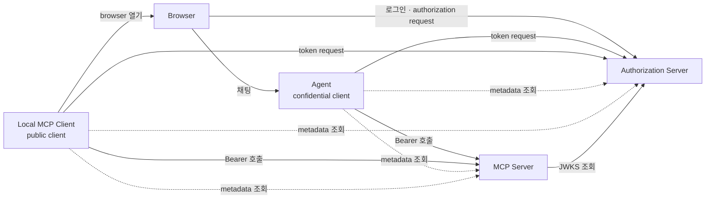

### 신뢰 관계

누가 무엇을 설정으로 미리 알고 무엇을 실행 중에 알아내는지는 [허브 2절 신뢰 관계](MCP-AUTHORIZATION.md#s2) 에 있다.

구현: [official](mcp-security-authn-official/SEQUENCES.md#modules) · [community](mcp-security-authn-community/SEQUENCES.md#modules) · [chat-memory](mcp-security-authn-chat-memory/SEQUENCES.md)

---

## 2. 등록

client 가 authorization request 를 만들려면 Authorization Server 가 아는 `client_id` 가 있어야 한다. MCP 는 pre-registration, Client ID Metadata Document(CIMD), Dynamic Client Registration(DCR)을 둔다. 모두 지원하는 client 는 pre-registration → CIMD → DCR → 사용자 입력 순서를 따르는 것이 좋다(SHOULD, [허브 4.4](MCP-AUTHORIZATION.md#s4-4)).

이 practice 는 두 client 를 pre-registration 으로 등록한다.

### 2.1 Pre-registration — confidential client

운영자가 Authorization Server 에 Agent 를 client 로 등록하고, 같은 자격증명을 Agent 설정에 넣는다. Agent 설정에는 Authorization Server 의 endpoint 가 없고, 자격증명이 어느 issuer 의 것인지(`credentials-issuer`)만 있다. endpoint 는 실행 중 discovery 로 알아내고, PRM 이 알려 준 issuer 를 metadata 요청 전에 `credentials-issuer` 와 비교한다.

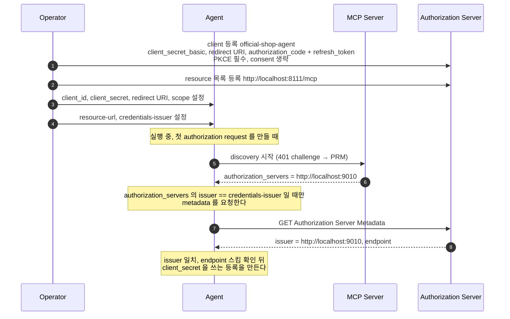

**단계**

1. 운영자가 Authorization Server 설정에 Agent 를 client 로 넣는다. token endpoint 인증은 `client_secret_basic`, redirect URI 는 `http://localhost:8110/login/oauth2/code/authserver` 하나다. confidential client 도 PKCE 를 필수로 두고, consent 화면은 생략한다.
2. Authorization Server 에 token 을 발급할 resource 목록을 넣는다. 목록 밖의 `resource` 로 온 authorization request 는 `invalid_target` 으로 거부된다([주요 오류 경로](#rt-errors)).
3. 같은 자격증명을 Agent 설정에 넣는다. MCP client 는 이런 정적 자격증명 옵션을 지원하는 것이 좋다(SHOULD, [허브 4.4](MCP-AUTHORIZATION.md#s4-4)). Authorization Server 의 주소와 endpoint 는 여기에 적지 않는다.
4. discovery 의 출발점인 MCP Server URL(`resource-url`)과, 자격증명을 발급한 Authorization Server 의 issuer(`credentials-issuer`)를 넣는다. 자격증명을 issuer 에 묶어 두는 것은 MCP 2026-07-28 의 요구다(MUST, [허브 4.4](MCP-AUTHORIZATION.md#s4-4)).
5. Agent 는 authorization request 를 처음 만들 때 discovery 를 한다. token 없는 요청의 `401` challenge 에서 PRM 위치를 얻는다([Discovery](#rt-discovery)).
6. PRM 의 `authorization_servers` 가 Authorization Server 의 issuer 를 알려 준다. 이 issuer 가 `credentials-issuer` 와 다르면 metadata 를 요청하지 않고 멈춘다([Issuer binding](#issuer-binding)). 필드 명세는 [PRM](MCP-API-SPEC.md#prm) 에 있다.
7. Agent 는 그 issuer 로 Authorization Server Metadata 를 요청한다. 요청 경로는 [Authorization Server Metadata](MCP-API-SPEC.md#as-metadata) 에 있다.
8. 응답의 `issuer` 가 요청한 issuer 와 같고 endpoint 가 `https` 이거나 loopback 주소의 `http` 인지 본다([허브 5.4](MCP-AUTHORIZATION.md#s5-4)). 통과하면 응답의 endpoint 로 등록 정보를 완성한다.

구현: [official](mcp-security-authn-official/SEQUENCES.md#registration) · [community](mcp-security-authn-community/SEQUENCES.md#diff-authorization-server) · [chat-memory](mcp-security-authn-chat-memory/SEQUENCES.md)

### 2.2 Pre-registration — public client

사용자 기기에서 도는 client 는 배포본에 비밀을 넣어도 비밀로 지켜지지 않는다. 그래서 `local-mcp-client` 는 비밀 없이(`none`) 등록하고, loopback redirect URI 와 PKCE·consent 로 그 빈자리를 채운다. 같은 Authorization Server 에 confidential client 와 나란히 등록된다.

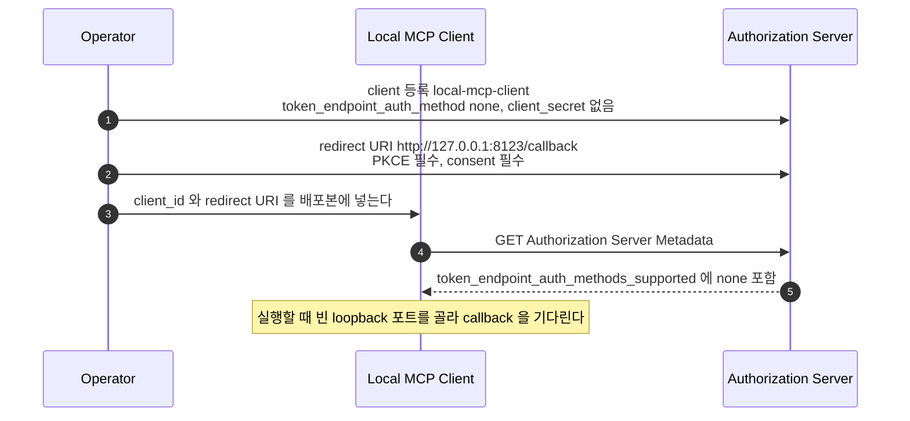

**단계**

1. `client_secret` 없이 인증 방식 `none` 으로 등록한다. `none` 은 public client 이고 client secret 이 없다는 뜻이다. per-instance 비밀을 발급하지 않는 native app 은 public client 로 등록해야 한다(MUST, [허브 4.4](MCP-AUTHORIZATION.md#s4-4)).
2. redirect URI 는 loopback 주소이고, Authorization Server 는 요청 시점의 어떤 포트든 허용해야 한다(MUST, [허브 5.5](MCP-AUTHORIZATION.md#s5-5)). 비밀이 없으니 PKCE 가 code 가로채기를 막는 유일한 장치다. client 신원을 확인할 수 없으면 이전 consent 가 있어도 처음처럼 처리하는 것이 좋으므로(SHOULD, [허브 5.6](MCP-AUTHORIZATION.md#s5-6)), consent 를 매번 받는다.
3. 배포본에는 `client_id` 와 redirect URI 만 들어간다. 여러 사용자에게 배포되는 앱에 박힌 비밀은 비밀이 아니고, 그래도 공유 비밀을 요구하는 Authorization Server 는 그 client 를 public client 로 다뤄야 한다(MUST, [허브 4.4](MCP-AUTHORIZATION.md#s4-4)).
4. Local MCP Client 도 Agent 와 같은 discovery 로 Authorization Server Metadata 를 읽는다. 요청 경로는 [Authorization Server Metadata](MCP-API-SPEC.md#as-metadata) 에 있다.
5. `token_endpoint_auth_methods_supported` 에 `none` 이 있어 public client 를 받는다는 것을 알 수 있다(P1·P2). 이후 흐름은 [Authorization — public client](#rt-authz-public) 와 [Token request](#rt-token) 이다.

구현: [official](mcp-security-authn-official/SEQUENCES.md#registration) · [community](mcp-security-authn-community/SEQUENCES.md#diff-authorization-server) · [chat-memory](mcp-security-authn-chat-memory/SEQUENCES.md)

### 2.3 Client ID Metadata Document — 명세 기준, 미구현

**이 practice 는 구현하지 않음.** CIMD 의 `client_id` 는 `https` URL 이어야 하는데(MUST, [허브 4.4](MCP-AUTHORIZATION.md#s4-4)), 이 practice 는 localhost 의 HTTP 로만 돈다. 그래서 아래는 명세의 흐름이다.

client 가 자기 metadata JSON 을 HTTPS URL 에 올리고, 그 URL 을 `client_id` 로 쓴다. Authorization Server 는 URL 형태의 `client_id` 를 만나면 문서를 가져와 검증한다. MCP client 와 Authorization Server 는 이 방식을 지원하는 것이 좋다(SHOULD, [MCP 2025-11-25 Client ID Metadata Documents](https://modelcontextprotocol.io/specification/2025-11-25/basic/authorization#client-id-metadata-documents)).

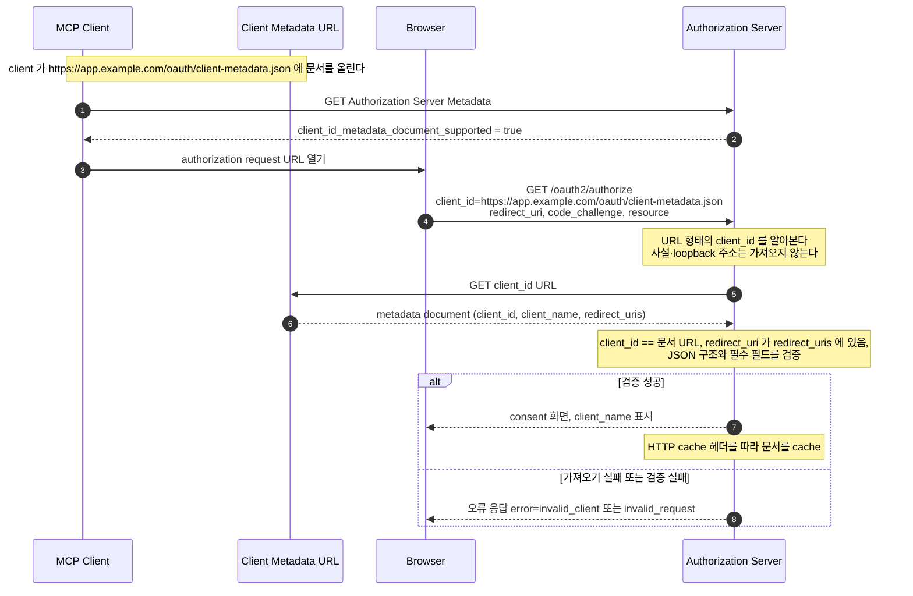

**단계**

1. client 는 Authorization Server Metadata 에서 CIMD 지원 여부를 확인하는 것이 좋다(SHOULD, [Client ID Metadata Documents — Discovery](https://modelcontextprotocol.io/specification/2025-11-25/basic/authorization#discovery)). 그 전에 client 는 문서를 HTTPS URL 에 올려 두어야 한다(MUST, [허브 4.4](MCP-AUTHORIZATION.md#s4-4)).
2. Authorization Server Metadata 를 공개하는 서버는 CIMD 를 지원하면 `client_id_metadata_document_supported` 를 넣어야 한다(MUST, [CIMD draft-00 §5](https://www.ietf.org/archive/id/draft-ietf-oauth-client-id-metadata-document-00.html#section-5)). 이 필드가 없으면 client 는 DCR 이나 pre-registration 으로 돌아갈 수 있다(MAY, [MCP Discovery](https://modelcontextprotocol.io/specification/2025-11-25/basic/authorization#discovery)).
3. client 가 URL 형태의 `client_id` 를 실은 authorization request 를 browser 로 연다. 나머지 파라미터는 pre-registration client 와 같다([`GET /oauth2/authorize`](MCP-API-SPEC.md#authorize)).
4. `client_id` URL 은 `https` scheme 과 path 를 가져야 한다(MUST, [허브 4.4](MCP-AUTHORIZATION.md#s4-4)). dot segment·fragment·query·port 규칙은 [Client ID Metadata Document](MCP-API-SPEC.md#cimd-document) 의 요청 표에 있다.
5. Authorization Server 는 URL 형태의 `client_id` 를 만나면 문서를 가져오는 것이 좋다(SHOULD, [허브 4.4](MCP-AUTHORIZATION.md#s4-4)). 임의 URL 을 가져오는 SSRF 에 주의해 사설·loopback 주소는 가져오지 않는 것이 좋다(SHOULD, [CIMD §6.5](https://www.ietf.org/archive/id/draft-ietf-oauth-client-id-metadata-document-00.html#section-6.5)). 응답 크기도 제한하는 것이 좋다(SHOULD, 권장 최대 5KB, [CIMD §6.6](https://www.ietf.org/archive/id/draft-ietf-oauth-client-id-metadata-document-00.html#section-6.6)).
6. 문서는 최소 `client_id`·`client_name`·`redirect_uris` 를 담아야 하고, `client_id` 는 문서 URL 과 정확히 같아야 한다(MUST, [허브 4.4](MCP-AUTHORIZATION.md#s4-4)). Authorization Server 는 `client_id` 일치, redirect URI, JSON 구조와 필수 필드를 검증해야 한다(MUST). 필드 표는 [Client ID Metadata Document](MCP-API-SPEC.md#cimd-document) 에 있다.
7. 검증이 끝나면 `client_name` 을 보여 주는 consent 화면으로 간다. 문서는 HTTP cache 헤더를 따라 cache 하는 것이 좋다(SHOULD, MCP Implementation Requirements). 오류 응답과 잘못된 문서는 cache 하면 안 된다(MUST NOT, [CIMD §4.4](https://www.ietf.org/archive/id/draft-ietf-oauth-client-id-metadata-document-00.html#section-4.4)).
8. 문서를 가져오지 못하면 authorization request 를 중단하는 것이 좋다(SHOULD, [CIMD §4.3](https://www.ietf.org/archive/id/draft-ietf-oauth-client-id-metadata-document-00.html#section-4.3)). 검증에 실패하면 MCP 흐름 다이어그램은 `invalid_client` 나 `invalid_request` 오류를 보인다([Client ID Metadata Documents Flow](https://modelcontextprotocol.io/specification/2025-11-25/basic/authorization#client-id-metadata-documents-flow)).

구현: 없음 — 세 practice 모두 CIMD 를 구현하지 않는다([허브 4.4](MCP-AUTHORIZATION.md#s4-4)).

### 2.4 Dynamic Client Registration — deprecated

client 가 사용자 개입 없이 `POST /register` 로 `client_id` 를 받는 방식이다([RFC 7591](https://www.rfc-editor.org/rfc/rfc7591)). MCP 2026-07-28 은 이 방식을 deprecated 로 표시하고 새 구현은 CIMD 를 쓰라고 한다([허브 4.4](MCP-AUTHORIZATION.md#s4-4)). 이 practice 는 DCR 을 켜지 않고, 요청 형식은 [`POST /register`](MCP-API-SPEC.md#dcr-register) 에 있다.

구현: 없음 — 세 practice 모두 DCR 을 켜지 않는다([허브 4.4](MCP-AUTHORIZATION.md#s4-4)).

### 2.5 Issuer binding

pre-registration 자격증명은 그것을 발급한 Authorization Server 에만 쓸 수 있다. client 는 자격증명을 그 issuer 에 묶어 두고, discovery 로 알아낸 Authorization Server 가 다르면 `client_secret` 을 보내지 않고 멈춘다([허브 4.4](MCP-AUTHORIZATION.md#s4-4)). 비교를 metadata 요청 앞에 두면 PRM 이 다른 서버를 가리켜도 그 서버로 요청 하나 나가지 않는다([허브 5.4](MCP-AUTHORIZATION.md#s5-4)).

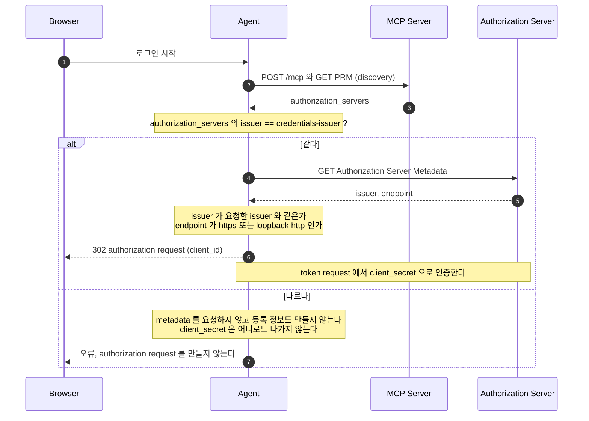

**단계**

1. 로그인하지 않은 사용자가 Agent 를 연다. Agent 는 authorization request 를 만들기 전에 Authorization Server 를 알아야 한다.
2. token 없는 요청의 `401` challenge 와 PRM 으로 discovery 를 한다([Discovery](#rt-discovery)). 여기까지는 자격증명을 쓰지 않는다.
3. PRM 의 `authorization_servers` 가 issuer 를 알려 주고, 여러 개일 때 무엇을 쓸지는 client 가 고른다([허브 4.2](MCP-AUTHORIZATION.md#s4-2)). Agent 는 고른 issuer 를 설정의 `credentials-issuer` 와 문자열로 비교한다. 자격증명은 발급한 Authorization Server 의 `issuer` 를 키로 묶여 있어야 한다(MUST, [허브 4.4](MCP-AUTHORIZATION.md#s4-4)).
4. 같으면 그 issuer 로 Authorization Server Metadata 를 요청한다. 요청 경로는 [Authorization Server Metadata](MCP-API-SPEC.md#as-metadata) 에 있다.
5. 응답의 `issuer` 가 요청한 issuer 와 다르면 그 응답을 쓰면 안 된다(MUST NOT, [허브 4.3](MCP-AUTHORIZATION.md#s4-3)). 그래서 metadata 요청 전의 비교와 응답 `issuer` 의 비교는 같은 값을 본다. `authorization_endpoint`·`token_endpoint` 는 `https` 이거나 loopback 주소의 `http` 여야 한다(MUST, [허브 5.4](MCP-AUTHORIZATION.md#s5-4)).
6. 확인을 통과하면 그 자격증명으로 authorization request 를 만든다. 이후 흐름은 [Authorization — confidential client](#rt-authz-confidential) 이다.
7. 다르면 metadata 를 요청하지 않고 등록 정보도 만들지 않아, `client_secret` 이 어떤 token endpoint 로도 나가지 않는다. 다른 Authorization Server 의 자격증명을 재사용하면 안 되고(MUST NOT) 새 서버에 다시 등록해야 하며(MUST), 오류를 드러내는 것이 좋다(SHOULD, [허브 4.4](MCP-AUTHORIZATION.md#s4-4)). CIMD 의 `client_id` 는 Authorization Server 사이에서 옮겨 쓸 수 있어 다시 등록할 필요가 없다.

구현: [official](mcp-security-authn-official/SEQUENCES.md#agent-login) · [community](mcp-security-authn-community/SEQUENCES.md#diff-agent) · [chat-memory](mcp-security-authn-chat-memory/SEQUENCES.md)

---

## 3. 런타임

Agent 의 흐름은 discovery → authorization → token request → MCP session 순서이고, access token 이 만료되면 refresh 로 새 token 을 받는다. public client 는 authorization 과 token request 의 모양만 다르고, 나머지는 같다.

### 3.1 Discovery

client 가 처음 아는 것은 MCP Server URL 하나다. token 없는 요청의 `401` challenge 에서 PRM 을 찾고, PRM 의 `authorization_servers` 로 Authorization Server Metadata 를 찾는다. 각 단계에서 응답이 요청한 식별자와 같은지, 자격증명의 issuer 인지, PKCE `S256` 과 안전한 endpoint 스킴인지 확인한다.

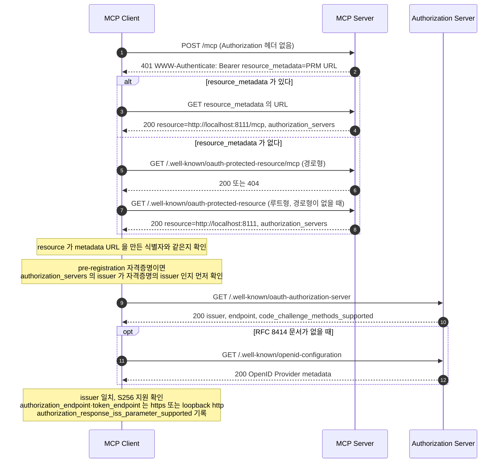

**단계**

1. client 는 token 없이 MCP endpoint 를 부른다(C1). 요청 모양은 [`POST /mcp` — token 없음](MCP-API-SPEC.md#mcp-unauthenticated) 에 있다.
2. MCP Server 는 `401` 과 `WWW-Authenticate` 의 `resource_metadata` 로 PRM 위치를 알린다(C1). 서버는 이 방식과 well-known URI 중 하나를 구현하고, client 는 `401` 에 대응할 수 있어야 한다(MUST, [허브 4.1](MCP-AUTHORIZATION.md#s4-1)). 인증 정보가 없던 요청이라 `error` 는 싣지 않는다(SHOULD NOT).
3. 헤더에 URL 이 있으면 client 는 그 URL 을 써야 한다(MUST, [허브 4.1](MCP-AUTHORIZATION.md#s4-1)). 이 practice 의 경로다(C2).
4. PRM 은 `resource` 와 `authorization_servers` 를 싣는다(C2). `authorization_servers` 는 하나 이상이어야 한다(MUST, [허브 4.2](MCP-AUTHORIZATION.md#s4-2)). 필드는 [PRM](MCP-API-SPEC.md#prm) 에 있다.
5. 헤더에 URL 이 없으면 경로형 well-known URI 부터 만들어 요청해야 한다(MUST, [허브 4.1](MCP-AUTHORIZATION.md#s4-1)). 경로형은 host 와 MCP endpoint 경로 사이에 `/.well-known/oauth-protected-resource` 를 넣는다.
6. 경로형 문서가 있으면 `200` 이고, 없으면 루트형으로 넘어간다. 이 practice 는 두 형태 모두 응답한다.
7. 루트형은 host 바로 뒤의 `/.well-known/oauth-protected-resource` 다(S2). 경로형 다음 순서로 시도한다(MUST).
8. 루트형 문서의 `resource` 는 서버 루트 `http://localhost:8111` 이다(S2). 받은 `resource` 가 metadata URL 을 만든 식별자와 다르면 그 응답을 쓰면 안 된다(MUST NOT, [허브 4.2](MCP-AUTHORIZATION.md#s4-2)).
9. pre-registration client 는 PRM 의 issuer 가 자격증명의 issuer 인지 먼저 보고, 아니면 여기서 멈춘다([Issuer binding](#issuer-binding)). 같으면 path 없는 issuer 에 RFC 8414 문서를 먼저 시도해야 한다(MUST, [허브 4.3](MCP-AUTHORIZATION.md#s4-3)). 요청 형식은 [Authorization Server Metadata](MCP-API-SPEC.md#as-metadata) 에 있다.
10. 응답의 `issuer` 는 요청한 issuer 와 같아야 하고, `code_challenge_methods_supported` 가 없으면 진행을 거부해야 한다(MUST, [허브 4.3](MCP-AUTHORIZATION.md#s4-3)). `authorization_endpoint`·`token_endpoint` 는 `https` 이거나 loopback 주소의 `http` 여야 한다(MUST, [허브 5.4](MCP-AUTHORIZATION.md#s5-4)). C3 에는 `["S256"]` 과 `authorization_response_iss_parameter_supported: true` 가 있다.
11. RFC 8414 문서가 없으면 OpenID Connect Discovery 문서를 시도한다(S1). 요청 형식은 [OpenID Provider Metadata](MCP-API-SPEC.md#oidc-discovery) 에 있다.
12. OIDC Discovery 는 `code_challenge_methods_supported` 를 정의하지 않는다. 그래서 MCP 는 OIDC Discovery 를 제공하는 Authorization Server 에 이 필드를 넣으라고 요구한다(MUST, [허브 4.3](MCP-AUTHORIZATION.md#s4-3)).

구현: [official](mcp-security-authn-official/SEQUENCES.md#agent-login) · [community](mcp-security-authn-community/SEQUENCES.md#diff-agent) · [chat-memory](mcp-security-authn-chat-memory/SEQUENCES.md)

### 3.2 Authorization — confidential client

Agent 는 로그인하지 않은 사용자를 곧바로 authorization request 로 보낸다. 요청에는 PKCE `S256` 의 `code_challenge` 와 대상 MCP Server 를 가리키는 `resource` 를 싣는다. callback 에서 `state` 와 `iss` 를 검증한 뒤에야 code 를 token request 로 보낸다.

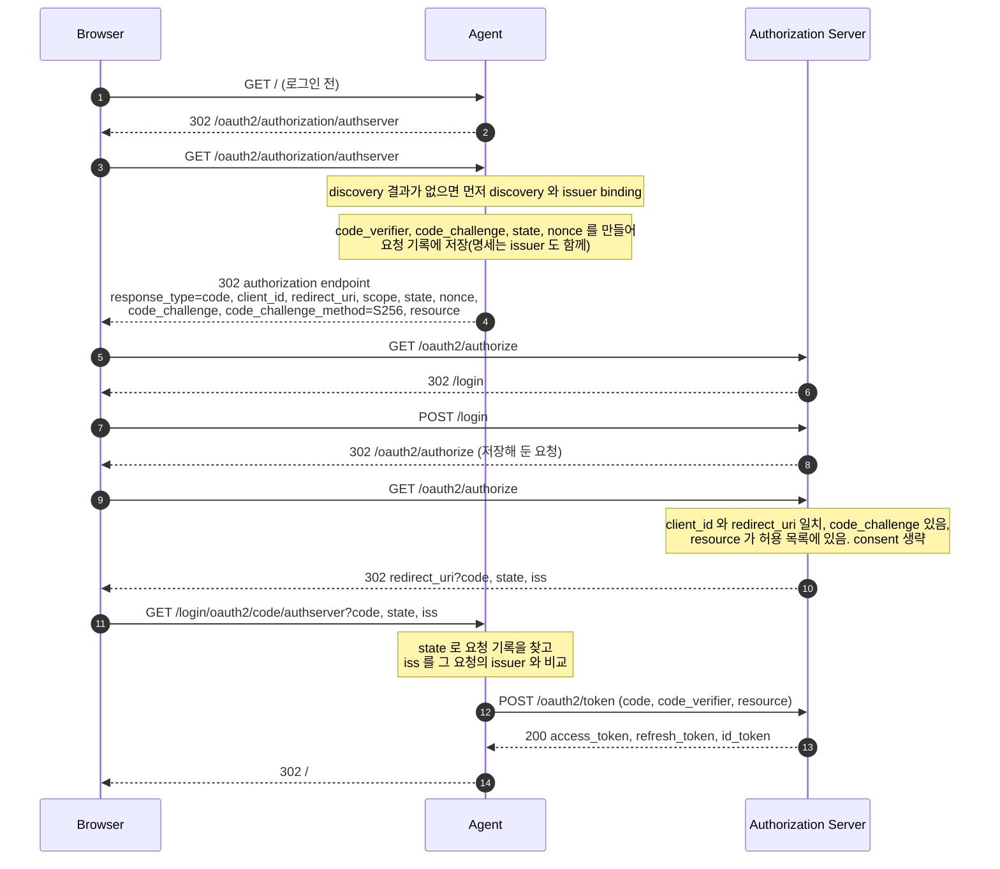

**단계**

1. 로그인하지 않은 사용자가 Agent 를 연다. Agent 에는 로그인 화면이 따로 없다.
2. Agent 는 사용자를 authorization request 를 만드는 자기 주소로 보낸다. client 가 하나라 곧바로 그 client 의 흐름을 시작한다.
3. browser 가 그 주소를 열면 Agent 는 discovery 결과가 없을 때 먼저 [discovery](#rt-discovery) 와 [issuer binding](#issuer-binding) 을 한다. 이어 `code_verifier`·`state`·`nonce` 를 무작위로 만들고 `code_challenge = BASE64URL(SHA256(code_verifier))` 를 계산한다. 명세는 redirect 전에 검증한 `issuer` 를 `code_verifier`·`state` 와 같은 요청 기록에 남기라고 하고(MUST), 이 practice 의 기록 방식은 [허브 4.6](MCP-AUTHORIZATION.md#s4-6) 에 있다.
4. Agent 가 authorization endpoint 로 redirect 한다(S17). PKCE 는 `S256` 으로 구현하고 `resource` 는 authorization request 와 token request 모두에 실어야 한다(MUST, [허브 4.5](MCP-AUTHORIZATION.md#s4-5)). 파라미터 표는 [`GET /oauth2/authorize`](MCP-API-SPEC.md#authorize) 에 있다.
5. browser 가 Authorization Server 의 authorization endpoint 를 연다. 사용자는 아직 Authorization Server 에 로그인하지 않았다.
6. Authorization Server 는 요청을 저장해 두고 로그인 화면으로 보낸다. 로그인 화면은 명세 범위 밖이다.
7. 사용자가 계정을 입력한다(C4). Authorization Server 에 로그인 session 이 생긴다.
8. Authorization Server 가 저장해 둔 authorization request 로 되돌린다. browser 는 같은 URL 을 다시 연다.
9. Authorization Server 는 `client_id` 와 redirect URI 를 먼저 보고, 등록값과 정확히 같아야 한다(MUST, [허브 5.5](MCP-AUTHORIZATION.md#s5-5)). `code_challenge` 가 없거나 `resource` 가 허용 목록 밖이면 오류로 redirect 한다([주요 오류 경로](#rt-errors)). confidential client 는 consent 화면을 생략하도록 등록했다.
10. Authorization Server 가 code·`state`·`iss` 를 실어 redirect URI 로 보낸다(C5). MCP Authorization Server 는 오류 응답을 포함한 authorization response 에 `iss` 를 넣는 것이 좋다(SHOULD, [허브 4.6](MCP-AUTHORIZATION.md#s4-6)). 필드는 [Authorization Response](MCP-API-SPEC.md#authorization-response) 에 있다.
11. browser 가 Agent 의 callback 을 연다(S20). client 는 `state` 를 검증하는 것이 좋고(SHOULD), code 를 token endpoint 로 보내기 전에 `iss` 를 검증해야 한다(MUST, [허브 4.6](MCP-AUTHORIZATION.md#s4-6)). `iss` 가 다르거나 없으면 `401` 로 끝난다(S18·S19, [주요 오류 경로](#rt-errors)).
12. 검증을 통과한 code 로 token request 를 보낸다. 요청과 검사는 [Token request](#rt-token) 에 있다.
13. Authorization Server 가 access token·refresh token·ID token 을 준다. Agent 는 ID token 으로 로그인을 끝내고 token 은 Agent 프로세스에 보관한다.
14. Agent 가 사용자를 첫 화면으로 돌려보낸다(S20 `302`). browser 는 token 을 보지 않는다.

구현: [official](mcp-security-authn-official/SEQUENCES.md#agent-login) · [community](mcp-security-authn-community/SEQUENCES.md#diff-agent) · [chat-memory](mcp-security-authn-chat-memory/SEQUENCES.md)

### 3.3 Authorization — public client

Local MCP Client 는 browser 로 authorization request 를 열고 loopback 포트에서 callback 을 받는다. 이전에 consent 했어도 매 요청마다 consent 화면을 거친다. discovery 와 `iss` 검증은 confidential client 와 같다.

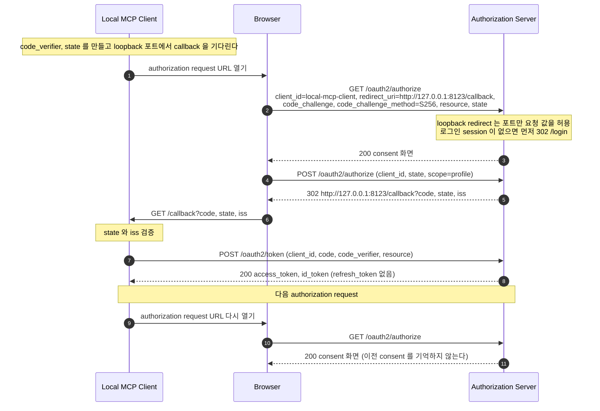

**단계**

1. Local MCP Client 가 authorization request URL 을 browser 로 연다. URL 모양은 confidential client 와 같고 `client_id` 와 redirect URI 만 다르다.
2. browser 가 authorization endpoint 를 연다(P3). loopback redirect 는 요청 시점의 어떤 포트든 허용하고, 포트 말고는 등록값과 같아야 한다(MUST, [허브 5.5](MCP-AUTHORIZATION.md#s5-5)). 포트 `9999` 는 통과하고(P10), 경로가 다르면 redirect 없이 `400` 이다(P10-1).
3. code 대신 consent 화면이 온다(P3). consent 화면은 client 와 요청 scope 를 보여 주는 것이 좋다(SHOULD, [허브 4.5](MCP-AUTHORIZATION.md#s4-5)). scope 가 없거나 `openid` 하나뿐이면 consent 화면 없이 `invalid_scope` redirect 다(P8-1, [허브 5.6](MCP-AUTHORIZATION.md#s5-6)).
4. 사용자가 consent 를 제출한다(P4). 폼의 `state` 는 서버가 consent 화면에 새로 발급한 값이다([consent 제출](MCP-API-SPEC.md#authorize-consent)).
5. Authorization Server 가 code·원래 요청의 `state`·`iss` 를 실어 loopback 주소로 보낸다(P4). 필드는 [Authorization Response](MCP-API-SPEC.md#authorization-response) 와 같다.
6. browser 가 Local MCP Client 가 열어 둔 loopback 포트로 callback 을 전달한다. client 는 `state` 와 `iss` 를 confidential client 와 같은 규칙으로 검증한다.
7. `client_secret` 없이 `client_id` 와 `code_verifier` 로 token request 를 보낸다(P5). 자세한 내용은 [Token request](#rt-token) 에 있다.
8. access token 과 ID token 을 받고 refresh token 은 받지 않는다(P5·P7). 만료 뒤에는 이 흐름을 처음부터 다시 한다([만료와 refresh](#rt-refresh)).
9. 다음에 token 이 필요하면 authorization request 를 새 `code_verifier`·`state` 로 다시 연다. 이전 authorization 의 결과는 쓰지 않는다.
10. browser 가 authorization endpoint 를 다시 연다. 로그인 session 은 남아 있다.
11. 이전에 consent 했어도 다시 consent 화면이 온다(P8). client 신원을 확인할 수 없으면 이전 consent 가 없던 것처럼 처리하는 것이 좋다(SHOULD, [허브 5.6](MCP-AUTHORIZATION.md#s5-6)).

구현: [official](mcp-security-authn-official/SEQUENCES.md#as-internals) · [community](mcp-security-authn-community/SEQUENCES.md#diff-authorization-server) · [chat-memory](mcp-security-authn-chat-memory/SEQUENCES.md)

### 3.4 Token request

authorization code 를 access token 으로 바꾼다. confidential client 는 `Authorization: Basic` 으로 인증하고, public client 는 client 인증 없이 `client_id` 만 싣되 PKCE `code_verifier` 가 code 를 요청한 쪽에 묶는다. 두 경우 모두 access token 의 `aud` 는 `resource` 값이다.

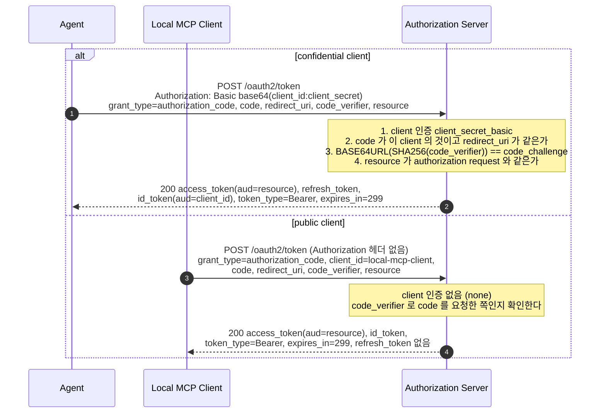

**단계**

1. confidential client 는 token endpoint 에서 인증하고 `resource` 를 token request 에도 실어야 한다(MUST, [허브 4.7](MCP-AUTHORIZATION.md#s4-7)). 이 practice 는 `client_secret_basic` 을 쓴다(S5). Authorization Server 는 `code_verifier` 를 저장한 `code_challenge` 와 비교하고, `resource` 가 authorization request 와 다르거나 그때 없던 값이거나 여러 개면 `invalid_target` 으로 거부한다(S6).
2. 응답은 access token·refresh token·ID token 을 싣는다(S5). access token 의 `aud` 는 `http://localhost:8111/mcp`(C6-1), ID token 의 `aud` 는 `official-shop-agent`(C6-2)다. 필드 표는 [`POST /oauth2/token` — `authorization_code`](MCP-API-SPEC.md#token-authorization-code) 에 있다.
3. public client 는 `Authorization` 헤더 없이 `client_id` 를 본문에 싣는다(P5, REQUIRED, [허브 4.4](MCP-AUTHORIZATION.md#s4-4)). 등록 방식이 `none` 인 client 에 비밀을 보내면 `401 invalid_client` 이고(P12), 반대로 confidential client 가 `client_id` 만 보내도 `401 invalid_client` 다(P14).
4. 응답에 refresh token 이 없고, access token 의 `aud` 는 confidential client 와 같은 `resource` 다(P5·P5-1·P7). refresh token 발급은 Authorization Server 재량이고, public client 에 발급한다면 회전이나 sender-constrained token 을 써야 한다(MUST, [허브 4.10](MCP-AUTHORIZATION.md#s4-10)). `code_verifier` 가 틀리면 `400 invalid_grant` 다(P11).

구현: [official](mcp-security-authn-official/SEQUENCES.md#as-internals) · [community](mcp-security-authn-community/SEQUENCES.md#diff-authorization-server) · [chat-memory](mcp-security-authn-chat-memory/SEQUENCES.md)

### 3.5 MCP session

access token 을 받은 client 는 `initialize` 로 MCP session 을 연다. 서버가 준 `Mcp-Session-Id` 와 협상한 `MCP-Protocol-Version` 을 이후 모든 요청에 싣고, 요청마다 `Authorization: Bearer` 도 싣는다. 더 쓰지 않을 session 은 `DELETE` 로 닫는다.

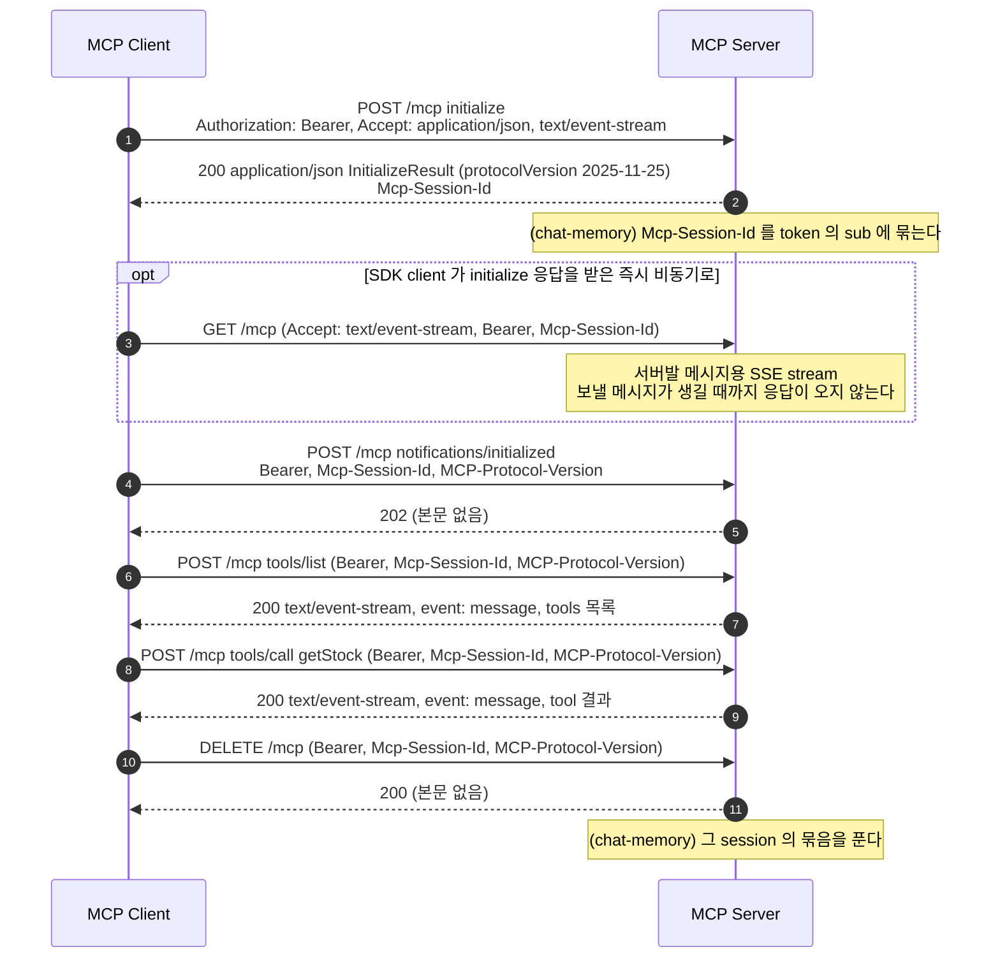

**단계**

1. `initialize` 는 첫 상호작용이어야 하고, authorization 은 같은 session 이라도 모든 HTTP 요청에 실어야 한다(MUST, [허브 4.8](MCP-AUTHORIZATION.md#s4-8)). 요청 형식은 [`POST /mcp` — Bearer](MCP-API-SPEC.md#mcp-post) 에 있다.
2. 서버가 `InitializeResult` 와 함께 `Mcp-Session-Id` 를 발급하고(C7), client 는 이후 모든 요청에 실어야 한다(MUST, [허브 4.8](MCP-AUTHORIZATION.md#s4-8)). session ID 는 인증을 대신하지 않고, 사용자에 묶는 것이 좋다(SHOULD, [허브 5.8](MCP-AUTHORIZATION.md#s5-8)). chat-memory MCP Server 는 이 응답을 쓰는 순간 session 을 token 의 `sub` 에 묶는다.
3. client 는 서버발 메시지를 받으려고 `GET` 으로 SSE stream 을 열 수 있다(MAY, [Listening for Messages from the Server](https://modelcontextprotocol.io/specification/2025-11-25/basic/transports#listening-for-messages-from-the-server)). SDK client(`HttpClientStreamableHttpTransport`)는 session ID 를 받는 즉시 비동기로 이 요청을 보내므로 `notifications/initialized` 와의 순서는 보장되지 않는다. 이 서버는 보낼 메시지가 생길 때까지 상태 줄도 보내지 않고 stream 을 열어 둔다(S11, [`GET /mcp`](MCP-API-SPEC.md#mcp-get)).
4. `initialize` 가 성공하면 `notifications/initialized` 를 보내야 한다(MUST, [허브 4.8](MCP-AUTHORIZATION.md#s4-8)). 이때부터 `MCP-Protocol-Version: 2025-11-25` 를 싣는다(MUST).
5. 서버는 notification 을 받아들였으면 `202` 를 돌려줘야 한다(MUST, [허브 4.8](MCP-AUTHORIZATION.md#s4-8)). C8 은 본문 없는 `202` 다.
6. `tools/list` 로 쓸 수 있는 tool 을 받는다. 요청에는 Bearer·`Mcp-Session-Id`·`MCP-Protocol-Version` 이 모두 있다.
7. 응답은 `text/event-stream` 이고 첫 이벤트가 곧 JSON-RPC response 다(C9). 서버는 request 에 `application/json` 과 SSE 중 하나로 답하고, client 는 둘 다 처리해야 한다(MUST, [허브 4.8](MCP-AUTHORIZATION.md#s4-8)).
8. `tools/call` 로 `getStock` 을 부른다. 요청 형식은 `tools/list` 와 같다.
9. 결과가 SSE 이벤트로 온다(C10). 이벤트 `id` 는 session ID 와 같은 값이다.
10. 더 쓰지 않을 session 은 `Mcp-Session-Id` 를 실은 `DELETE` 로 끝내는 것이 좋다(SHOULD, [Session Management](https://modelcontextprotocol.io/specification/2025-11-25/basic/transports#session-management)). 서버는 이 요청을 `405` 로 거절할 수도 있다(MAY). chat-memory 는 다른 사용자가 보낸 `DELETE` 를 `403` 으로 막는다.
11. 이 서버는 `200` 으로 session 을 끝낸다(C18). 끝난 session ID 로 다시 요청하면 `404` 이고(S16), client 는 새 `initialize` 로 다시 시작해야 한다(MUST, [허브 4.8](MCP-AUTHORIZATION.md#s4-8)). 요청 형식은 [`DELETE /mcp`](MCP-API-SPEC.md#mcp-delete) 에 있다.

구현: [official](mcp-security-authn-official/SEQUENCES.md#mcp-call) · [community](mcp-security-authn-community/SEQUENCES.md#diff-agent) · [chat-memory](mcp-security-authn-chat-memory/SEQUENCES.md)

### 3.6 MCP Server 의 요청 검증

MCP Server 는 요청을 처리하기 전에 access token 을 검증하고, 자기를 audience 로 발급한 token 만 받아야 한다(MUST, [허브 4.9](MCP-AUTHORIZATION.md#s4-9)). 세 practice 는 `Origin`·`Host` 를 인증보다 먼저 보고, token 검증 뒤에 `MCP-Protocol-Version`·`Accept`·session 을 본다. chat-memory 는 token 검증과 `MCP-Protocol-Version` 사이에서 session 이 그 사용자의 것인지 본다.

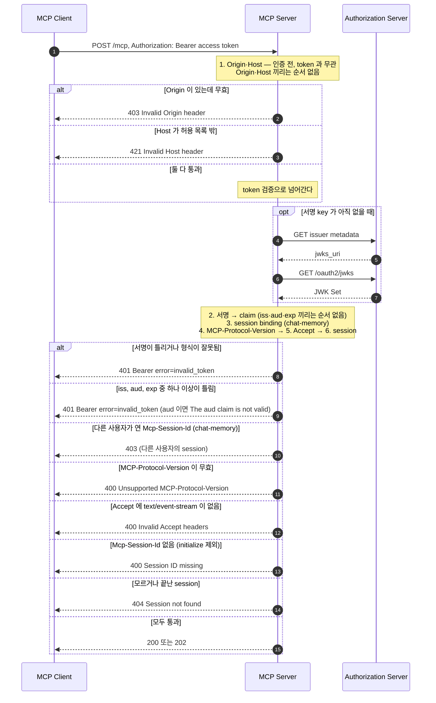

**단계**

1. 모든 요청이 `Authorization: Bearer` 를 싣는다. 헤더가 아예 없으면 `error` 없는 `401` challenge 이고, 이것이 [discovery](#rt-discovery) 의 시작이다.
2. 서버는 모든 연결에서 `Origin` 을 검증하고, 있는데 무효면 `403` 이어야 한다(MUST, [허브 4.8](MCP-AUTHORIZATION.md#s4-8)). 세 practice 는 이 검사를 인증 앞에 두어 token 이 없어도 `403` 이다(C13, [허브 5.7](MCP-AUTHORIZATION.md#s5-7)).
3. 허용하지 않은 `Host` 는 token 과 무관하게 `421` 이다(S14). MCP 는 이 경우를 규정하지 않고, DNS rebinding 을 막는 장치다([RFC 9110 §15.5.20](https://www.rfc-editor.org/rfc/rfc9110#section-15.5.20)). official·chat-memory 의 SDK 검증기는 헤더를 받은 순서대로 보므로 `Origin`·`Host` 사이에 정해진 순서가 없다.
4. MCP Server 는 신뢰할 issuer 만 설정으로 안다. 서명 key 가 없으면 issuer 의 metadata 를 읽는다.
5. metadata 의 `jwks_uri` 가 key 위치다. Authorization Server 는 metadata 로 `jwks_uri` 와 `issuer` 를 알리는 것이 좋다(SHOULD, [RFC 9068 §4](https://www.rfc-editor.org/rfc/rfc9068#section-4)).
6. MCP Server 가 JWK Set 을 요청한다. 형식은 [`GET /oauth2/jwks`](MCP-API-SPEC.md#jwks) 에 있다.
7. 받은 key 로 서명을 검증한다. Authorization Server 가 준 key 로 검증하고 `alg: none` 은 거부해야 한다(MUST, [허브 4.9](MCP-AUTHORIZATION.md#s4-9)).
8. 서명이 틀리거나 JWT 형식이 아니면 `401 invalid_token` 이다(S3 `Malformed token`). 유효하지 않거나 만료된 token 은 `401` 이어야 한다(MUST, [허브 4.9](MCP-AUTHORIZATION.md#s4-9)).
9. `iss` 는 정확히 같고, `aud` 에 자기 resource 식별자가 있고, 현재 시각은 `exp` 이전이어야 한다(MUST, [허브 4.9](MCP-AUTHORIZATION.md#s4-9)). Spring 검증기는 셋을 모두 검사한 뒤 오류를 모으므로 셋 사이에 순서가 없고, 어느 것이 틀려도 `401 invalid_token` 이다. 같은 Authorization Server 가 발급한 ID token(`aud=official-shop-agent`)을 보내면 `The aud claim is not valid` 가 돌아온다(C12).
10. chat-memory 는 token 검증 뒤 `McpSessionBindingFilter` 가 `Mcp-Session-Id` 를 연 사용자와 token 의 `sub` 를 비교한다. 다르면 `DELETE` 를 포함해 `403` 이다. session 을 사용자에 묶는 것은 SHOULD 이고, official·community 가 묶지 않는 이유는 [허브 5.8](MCP-AUTHORIZATION.md#s5-8) 에 있다.
11. 무효·미지원 `MCP-Protocol-Version` 에는 `400` 을 줘야 한다(MUST, [허브 4.8](MCP-AUTHORIZATION.md#s4-8)). C15 의 `1999-01-01` 이 이 경우다. 세 practice 는 이 검사를 인증 뒤의 servlet filter(`McpProtocolVersionFilter`)에서 한다.
12. POST 의 `Accept` 에는 `application/json` 과 `text/event-stream` 을 모두 넣어야 한다(MUST, [허브 4.8](MCP-AUTHORIZATION.md#s4-8)). 어겼을 때의 서버 응답은 명세가 정하지 않고, 이 서버는 `400` 이다(S15).
13. session ID 가 필요한 서버는 `initialize` 말고 `Mcp-Session-Id` 없는 요청에 `400` 으로 답하는 것이 좋다(SHOULD, [허브 4.8](MCP-AUTHORIZATION.md#s4-8)). C14 가 `400` 이다.
14. 끝났거나 모르는 session ID 에는 `404` 여야 한다(MUST, [허브 4.8](MCP-AUTHORIZATION.md#s4-8)). S13 이 `404` 다.
15. 모두 통과하면 request 는 `200`, notification 은 `202` 다. 명세는 검사 순서를 정하지 않는다. 세 practice 의 순서는 `Origin`·`Host` → token → session binding(chat-memory) → `MCP-Protocol-Version` → `Accept` → session 이다.

구현: [official](mcp-security-authn-official/SEQUENCES.md#mcp-server-validation) · [community](mcp-security-authn-community/SEQUENCES.md#diff-mcp-server) · [chat-memory](mcp-security-authn-chat-memory/SEQUENCES.md)

### 3.7 만료와 refresh

access token 수명은 300초다(`expires_in: 299`). Agent 는 MCP 요청을 보내기 전에 만료를 확인하고, refresh token 에 `resource` 를 다시 실어 새 access token 을 받는다. public client 는 refresh token 이 없어 authorization request 부터 다시 한다.

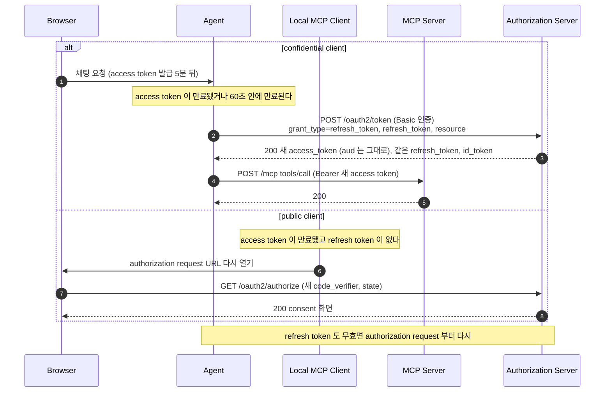

**단계**

1. 사용자가 access token 수명이 지난 뒤 채팅을 보낸다. Agent 는 이 요청을 처리하며 MCP Server 를 부른다.
2. Agent 는 보내기 전에 만료를 확인하고, 만료됐거나 60초 안에 만료되면 refresh 한다. confidential client 는 refresh 요청에서도 인증하고, token request 에 `resource` 를 실어야 한다(MUST, [허브 4.10](MCP-AUTHORIZATION.md#s4-10)). 요청 형식은 [`POST /oauth2/token` — `refresh_token`](MCP-API-SPEC.md#token-refresh) 에 있다.
3. 새 access token 의 `aud` 는 그대로 MCP Server 이고 `jti` 는 새 값이다(C11). refresh token 은 처음 값 그대로라 회전하지 않는다(C11). 회전이나 sender-constrained token 을 요구하는 MUST 는 public client 대상이라 confidential client 에는 해당하지 않는다([허브 4.10](MCP-AUTHORIZATION.md#s4-10)).
4. 새 access token 으로 MCP 요청을 보낸다. 만료된 token 이 MCP Server 로 나가지 않는다.
5. MCP Server 는 새 token 을 [같은 규칙](#rt-token-validation) 으로 검증한다. 명세는 `401 invalid_token` 을 받은 뒤 새 token 으로 다시 시도하는 방식도 허용한다(MAY, [RFC 6750 §3.1](https://www.rfc-editor.org/rfc/rfc6750#section-3.1)).
6. public client 는 refresh token 을 받지 않았으므로(P7) authorization request 부터 다시 한다. client 는 refresh token 이 발급되리라 가정하면 안 된다(MUST NOT, [허브 4.10](MCP-AUTHORIZATION.md#s4-10)).
7. 새 `code_verifier` 와 `state` 로 authorization endpoint 를 연다. 흐름은 [Authorization — public client](#rt-authz-public) 와 같다.
8. 다시 consent 화면을 거친다(P8). refresh token 이 만료·폐기돼 `invalid_grant` 를 받은 confidential client 도 authorization request 부터 다시 한다.

구현: [official](mcp-security-authn-official/SEQUENCES.md#mcp-call) · [community](mcp-security-authn-community/SEQUENCES.md#diff-agent) · [chat-memory](mcp-security-authn-chat-memory/SEQUENCES.md)

### 3.8 주요 오류 경로

token 의 audience, `resource` 허용 목록, callback 의 `iss`, PKCE, public client 의 scope 가 각각 다른 공격이나 우회를 막는다. 오류는 막는 쪽이 누구냐에 따라 MCP Server 의 `401`, Authorization Server 의 오류 redirect 나 `400`, client 의 `401` 로 나타난다. 전체 오류 표는 각 endpoint 의 [API 명세](MCP-API-SPEC.md) 에 있다.

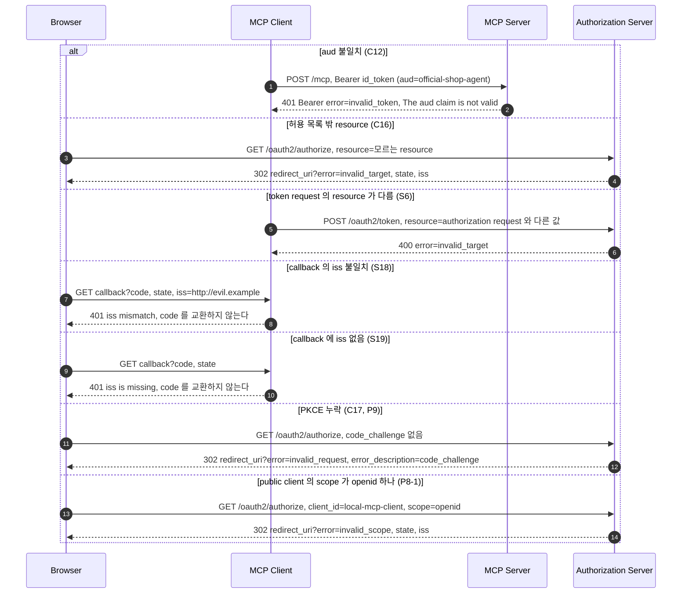

**단계**

1. 같은 Authorization Server 가 서명했고 `iss` 도 맞지만 다른 대상에게 발급된 token 을 MCP Server 에 보낸다. C12 는 ID token 을 Bearer 로 쓴다.
2. MCP Server 는 자기를 audience 로 발급한 token 만 받아야 하고(MUST, [허브 4.9](MCP-AUTHORIZATION.md#s4-9)), `401` 과 `The aud claim is not valid` 로 거부한다(C12). 오류 응답에도 `resource_metadata` 가 남아 client 는 discovery 를 다시 할 수 있다.
3. authorization request 의 `resource` 가 Authorization Server 의 허용 목록에 없다. 대상 MCP Server 를 모르는 token 은 발급하지 않는다.
4. Authorization Server 는 `error=invalid_target` 을 실어 redirect URI 로 돌려보낸다(C16, [허브 4.5](MCP-AUTHORIZATION.md#s4-5)). 오류 redirect 에도 `state` 와 `iss` 가 있다.
5. token request 의 `resource` 가 authorization request 의 것과 다르다. 허락받은 resource 와 다른 audience 의 token 을 얻으려는 요청이다.
6. Authorization Server 는 `400` 과 `invalid_target` 으로 거부한다(S6). authorization request 에 없던 `resource` 와 여러 개의 `resource` 도 같은 오류다([허브 4.7](MCP-AUTHORIZATION.md#s4-7)).
7. 다른 Authorization Server 의 응답이 이 client 의 callback 으로 들어온다(mix-up). S18 은 `iss=http://evil.example` 을 싣는다.
8. `iss` 가 기록한 issuer 와 다르면 client 는 응답을 거부하고 authorization grant 를 진행하면 안 된다(MUST, MUST NOT, [허브 4.6](MCP-AUTHORIZATION.md#s4-6)). Agent 는 `401` 로 끝내고 code 를 어느 token endpoint 로도 보내지 않는다(S18).
9. `iss` 없는 callback 이 들어온다. Authorization Server 는 metadata 에 `authorization_response_iss_parameter_supported: true` 를 광고했다.
10. `iss` 지원을 광고한 서버의 응답에 `iss` 가 없으면 거부해야 한다(MUST, [허브 4.6](MCP-AUTHORIZATION.md#s4-6)). Agent 는 `401` 로 끝낸다(S19).
11. `code_challenge` 없는 authorization request 가 온다. confidential client(C17)와 public client(P9) 모두 같은 결과다.
12. Authorization Server 는 `error=invalid_request` 와 `error_description=OAuth 2.0 Parameter: code_challenge` 로 redirect 한다(C17·P9). public client 의 요청은 거부해야 하고, 다른 client 도 code injection 을 달리 막는다는 확신이 없으면 거부해야 한다(MUST, [허브 4.5](MCP-AUTHORIZATION.md#s4-5)).
13. public client 가 scope 없이, 또는 `openid` 하나만 요청한다. `openid` 하나뿐이면 Spring 기본 동작은 consent 를 건너뛰고, community module 은 scope 가 없을 때도 건너뛴다.
14. Authorization Server 는 consent 판정 전에 `error=invalid_scope` 로 redirect 한다(P8-1). scope 생략에는 기본값 처리나 `invalid_scope` 거부 중 하나를 해야 하고(MUST), 이 practice 가 거부를 고른 이유는 [허브 5.6](MCP-AUTHORIZATION.md#s5-6) 에 있다.

구현: [official](mcp-security-authn-official/SEQUENCES.md#as-internals) · [community](mcp-security-authn-community/SEQUENCES.md#diff-authorization-server) · [chat-memory](mcp-security-authn-chat-memory/SEQUENCES.md)
