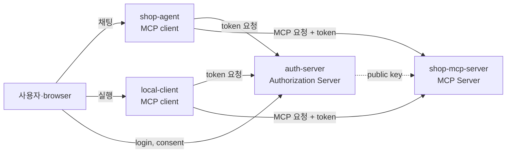
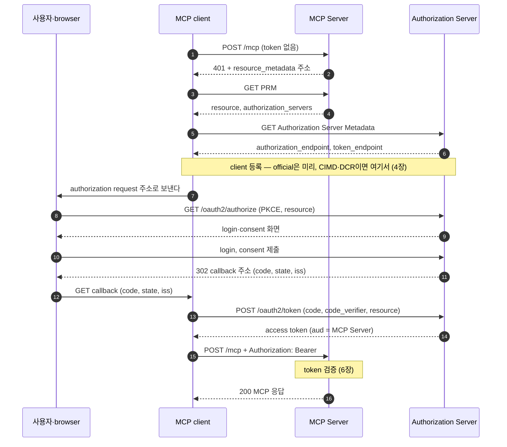

# 2. MCP와 OAuth — 원격 MCP Server는 누구의 요청인지 어떻게 아나

## 2.1 OAuth의 필요성

1장에서 본 대로 HTTP로 열린 MCP Server에는 주소를 아는 누구나 요청을 보낼 수 있다.
공개된 정보만 주는 server라면 그래도 괜찮다.

원격 MCP Server는 대개 사용자의 데이터를 다룬다.
메일을 읽는 server, 일정을 잡는 server, 쇼핑몰 주문을 조회하는 server가 그 예다.
이런 server는 요청마다 두 가지를 알아야 한다.
하나는 요청을 보낸 client를 믿어도 되는가이고, 다른 하나는 그 client가 어느 사용자를 대신하는가다.
1장에서 본 대로 session ID는 보낸 사람을 증명하지 않는다.

MCP client와 MCP Server는 대개 만든 곳이 다르다.
사용자가 Claude Desktop에 쇼핑몰 password를 맡기면, Claude Desktop은 그 계정으로 무엇이든 할 수 있다.
그래서 password 대신 권한만 빌려주는 OAuth를 쓴다.
MCP client는 access token을 받아 요청에 붙이고, MCP Server는 그 token으로 누구의 요청인지 안다.

official에서 발급된 access token의 payload는 다음과 같다.

```json
{
  "iss": "http://localhost:9010",
  "sub": "user",
  "aud": "http://localhost:8111/mcp",
  "...": "그 밖의 field는 생략"
}
```

`sub`는 client가 대신하는 사용자이고, MCP Server는 이 값을 요청한 사용자로 본다.
`aud`에는 MCP Server의 주소가 들어 있다.
이 token을 받아 줄 곳이 이 MCP Server뿐이라는 뜻이다(5장).
official의 `shop-mcp-server`는 tool을 실행할 때마다 `sub`의 사용자를 로그에 남긴다.

```text
getStock 호출 (productId=p1, 사용자=user)
```

로그에 남는 이름은 MCP Server를 부른 agent가 아니라, agent에게 질문한 사용자다.

1장에서 본 대로 authorization은 선택이고, OAuth는 HTTP transport에서만 쓴다.

이 장은 누가 어떤 역할을 맡는지, 일반 OAuth와 무엇이 다른지, 전체 흐름이 어떻게 이어지는지를 한눈에 본다.
각 단계의 요청과 응답은 3~7장에서 하나씩 다룬다.

## 2.2 역할

MCP authorization은 OAuth 2.1의 역할을 그대로 쓴다.
MCP client는 OAuth client이고, MCP Server는 resource server다.
Authorization Server는 사용자의 login을 받고, MCP Server에서 쓸 access token을 발급한다.



[다이어그램 그림으로 보기](diagrams/02-why-oauth-1.png)

| 역할 | OAuth 이름 | 하는 일 | official |
|---|---|---|---|
| 사용자 | resource owner | 자기 데이터에 접근해도 되는지 허락한다 | `user` / `password` 계정 |
| browser | user-agent | login·consent 화면을 보여 주고, authorization code가 담긴 redirect를 client에게 나른다 | 사용자의 browser |
| MCP client | client | 사용자를 대신해 MCP Server를 부른다. token을 받아 두고 요청마다 붙인다 | `shop-agent`(`:8110`), `local-client` |
| MCP Server | resource server | 요청마다 token을 검증하고 tool을 실행한다 | `shop-mcp-server`(`:8111`) |
| Authorization Server | authorization server | 사용자의 login을 받고, consent를 확인해 token을 발급한다 | `auth-server`(`:9010`) |

1장의 구분으로 보면 `shop-agent`는 host이고, 그 안의 MCP client가 token을 붙여 MCP Server를 부른다.
Authorization Server에 client로 등록되는 것은 `shop-agent` 앱이고, 그 `client_id`는 `official-shop-agent`다.

`local-client`는 official에 함께 들어 있는 명령줄 앱이다.
Claude Desktop이나 Cursor처럼 사용자 기기에서 도는 MCP client를 흉내 내고, 7장에서 이 앱으로 흐름을 따라간다.

## 2.3 client의 두 종류: confidential client와 public client

OAuth 2.1은 client를 credentials가 있느냐로 나눈다.
Authorization Server에 자기를 증명할 비밀이 있으면 confidential client, 없으면 public client다.
비밀을 지킬 수 있느냐는 client가 어디서 도느냐에 달려 있다.

**서버에서 도는 agent: confidential client**

`shop-agent`는 서버에서 도는 web 앱이다.
사용자는 browser로 화면만 볼 뿐, 앱의 코드와 설정에는 손댈 수 없다.
그래서 `client_secret`을 서버 설정에 두어도 사용자에게 보이지 않는다.
agent는 token request를 보낼 때 이 비밀을 `Authorization` header에 넣어(`client_secret_basic`) 자기가 `official-shop-agent`임을 증명한다.
받은 token도 서버에 두고, browser에는 agent의 session cookie만 간다.

**사용자 기기의 앱: public client**

Claude Desktop, Cursor, 명령줄 도구 같은 MCP client는 사용자 기기에 설치된다.
배포 파일에 비밀을 넣으면 누구든 꺼내 볼 수 있어서, 그 비밀은 더 이상 비밀이 아니다.
그래서 이런 client는 비밀 없이 public client로 등록한다.
official에서는 `local-mcp-client`가 그렇게 등록된 client이고, `local-client`가 이 `client_id`를 쓴다.

비밀이 없으면 누군가 authorization code를 가로챘을 때, 그 code로 token을 받아 가는 것을 막을 장치가 하나 줄어든다.
public client는 PKCE, loopback redirect URI, 매번 받는 consent로 그 자리를 채운다(4·5·7장).
MCP client 가운데에는 desktop 앱과 명령줄 도구가 많아서, MCP에서는 public client가 흔하다.

## 2.4 일반 OAuth와 다른 점

흐름 자체는 PKCE를 쓰는 authorization code grant 그대로다.
달라지는 것은 이 흐름을 쓰는 상황이다.
보통의 OAuth 앱은 한 서비스의 API를 부르려고 만들고, 개발자는 그 서비스를 미리 안다.
MCP client는 사용자가 넣은 어느 MCP Server에든 붙는다.
이 차이 때문에 다섯 가지가 달라진다.

| 무엇이 다른가 | 일반 OAuth | MCP | 다루는 장 |
|---|---|---|---|
| Authorization Server를 모른다 | 개발자가 Authorization Server 주소를 설정에 적는다 | client는 MCP Server 주소만 안다. Authorization Server는 discovery로 찾는다 | [3장](03-discovery.md) |
| 처음 보는 client를 등록해야 한다 | 개발자가 Authorization Server에 앱을 미리 등록해 `client_id`를 받는다 | client와 Authorization Server가 서로 모르는 채 만난다. 미리 등록하는 방법 말고도 CIMD·DCR로 `client_id`를 얻는다 | [4장](04-client-registration.md) |
| token의 대상을 MCP Server로 좁힌다 | token을 쓸 API가 정해져 있어 대상을 밝히지 않는 경우가 많다 | client가 `resource`로 MCP Server를 밝히고, MCP Server는 token의 `aud`에 자기가 있는지 본다 | [5장](05-authorization-and-token.md), [6장](06-mcp-call-and-validation.md) |
| public client가 흔하다 | 비밀을 지킬 수 있는 web 앱이 흔하다 | desktop 앱·명령줄 도구가 대부분이다. 한 client가 비밀을 미리 나눠 둘 수 없는 여러 server를 만나서, PKCE로 authorization code를 지킨다 | [5장](05-authorization-and-token.md), [7장](07-local-client.md) |
| token 말고 전송 단계도 검사한다 | token 검증이 API 보안의 중심이다 | 사용자 기기에서 authorization 없이 도는 MCP Server도 있다. browser를 거친 요청을 막으려고 `Origin`을 검사한다(official은 `Host`도) | [6장](06-mcp-call-and-validation.md) |

세 번째와 다섯 번째 항목은 이유를 조금 더 살펴본다.

**token의 대상을 좁히는 이유**

한 Authorization Server가 여러 MCP Server의 token을 발급할 수 있다.
token에 대상이 적혀 있지 않으면, 그 token을 받은 MCP Server가 같은 token으로 다른 MCP Server를 부를 수 있다.
악의적인 MCP Server가 사용자의 token을 받아 다른 곳에서 쓰는 길이 열리는 것이다.
`aud`에 MCP Server의 이름이 있으면, 다른 MCP Server는 그 token을 거절한다.

**전송 단계도 검사하는 이유**

MCP Server는 사용자 기기의 `localhost`에서 돌기도 하고, 이런 server는 authorization 없이 열려 있기도 하다.
사용자가 연 악성 web page는 DNS rebinding으로 browser를 거쳐 그 MCP Server에 요청을 보낼 수 있다.
token을 요구하지 않는 server라면 token 검증으로는 이 요청을 막지 못한다.
그래서 MCP Server는 전송 단계에서 `Origin` header를 보고, 허용하지 않은 곳에서 온 요청을 거절한다.
official의 MCP Server는 token을 검사하기 전에 `Origin`과 `Host`를 먼저 본다.

## 2.5 전체 흐름: 시퀀스 다이어그램

아래는 MCP client가 token 없이 MCP Server를 처음 부를 때부터, token을 붙여 부를 때까지의 흐름이다.
official의 `shop-agent`와 `local-client`가 모두 이 순서를 밟는다.



[다이어그램 그림으로 보기](diagrams/02-why-oauth-2.png)

| 구간 | 메시지 | 하는 일 | 다루는 장 |
|---|---|---|---|
| discovery | (1)~(6) | MCP Server 주소 하나에서 Authorization Server의 endpoint까지 찾아간다 | [3장](03-discovery.md) |
| client 등록 | (6)과 (7) 사이. official은 미리 등록해 둔다 | Authorization Server가 아는 `client_id`를 마련한다 | [4장](04-client-registration.md) |
| authorization request | (7)(8) | PKCE와 `resource`를 넣은 주소로 사용자를 Authorization Server에 보낸다 | [5장](05-authorization-and-token.md) |
| login·consent | (9)(10) | 사용자가 Authorization Server에서 직접 login하고 허락한다 | [5장](05-authorization-and-token.md) |
| callback | (11)(12) | authorization code가 client에게 돌아온다. client는 `state`와 `iss`를 확인한다 | [5장](05-authorization-and-token.md) |
| token request | (13)(14) | code를 access token으로 바꾼다. token의 `aud`는 MCP Server다 | [5장](05-authorization-and-token.md) |
| MCP 호출 | (15)(16) | 요청마다 token을 붙이고, MCP Server는 그 token을 검증한다 | [6장](06-mcp-call-and-validation.md) |

두 client는 같은 순서를 밟지만, 몇 단계에서 하는 일이 다르다.

| 메시지 | `shop-agent` | `local-client` |
|---|---|---|
| (7) | browser의 요청에 `302`로 답해 authorization request 주소로 보낸다 | 사용자 기기의 browser를 그 주소로 연다 |
| (9)(10) | login만 한다. consent 화면이 나오지 않는다 | login한 뒤 consent 화면에서 `profile`을 고른다. 매번 consent를 받는다 |
| (11)(12) | agent 서버의 `http://localhost:8110/login/oauth2/code/authserver`로 돌아온다 | `127.0.0.1`의 빈 포트에 잠깐 연 callback server로 돌아온다 |
| (13) | `client_secret`으로 자기를 증명한다 | 비밀 없이 `client_id`와 `code_verifier`만 보낸다 |
| (14) | refresh token도 받는다 | refresh token은 받지 않는다 |

agent는 discovery 결과를 기억해 두고, 사용자가 login할 때마다 (7)~(14)로 그 사용자의 token을 받는다.
그 뒤의 채팅에서는 (15)(16)만 되풀이하고, token이 만료되면 refresh token으로 새 token을 받는다(5장).
`local-client`로 처음부터 끝까지 따라가는 과정은 7장에서 다룬다.

## 2.6 각자 미리 아는 것과 알아내는 것

discovery가 있으면 무엇을 설정에 적고 무엇을 실행 중에 알아내는지 헷갈리기 쉽다.
처음부터 믿을 수 있는 것은 각자 설정에 적어 둔 값뿐이다.
실행 중에 받은 값은 이 값과 맞춰 본 뒤에 쓴다.

| 누가 | 미리 아는 것(설정) | 실행 중에 알아내거나 확인하는 것 |
|---|---|---|
| `shop-agent` | MCP Server 주소(`mcp.authorization.resource-url`), 자기 `client_id`·`client_secret`·redirect URI·scope, credentials를 발급한 issuer(`mcp.authorization.credentials-issuer`) | Authorization Server의 endpoint를 discovery로 알아낸다. PRM이 가리킨 issuer가 `credentials-issuer`와 다르면 멈춘다 |
| `local-client` | MCP Server 주소(`--resource`), `client_id` `local-mcp-client`, 이 client가 등록된 issuer(`--issuer`) | Authorization Server의 endpoint를 discovery로 알아낸다. callback 포트는 실행할 때 빈 포트를 고른다 |
| `shop-mcp-server` | 믿는 issuer(`issuer-uri`), 자기 이름(`audiences`) | token signature를 확인할 public key를 Authorization Server의 `jwks_uri`에서 받는다. 요청마다 signature·`iss`·`aud`·`exp`를 확인한다 |
| `auth-server` | 등록된 client 둘, token을 발급할 resource 목록(`mcp.authorization.resources`), 사용자 계정 | authorization request의 `resource`가 목록에 있는지, token request의 `resource`가 authorization request와 같은지 본다 |
| 사용자·browser | 자기 계정(`user`/`password`), agent 주소(`http://localhost:8110`) | consent 화면이 나오면 어느 client가 무엇을 요청하는지 확인한다. browser는 session cookie만 받고 token은 받지 않는다 |

표에서 볼 곳은 세 가지다.
첫째, agent의 설정에는 Authorization Server의 endpoint가 없다.
agent는 MCP Server 주소 하나에서 출발해 찾아간다.
둘째, MCP Server는 어느 client가 보냈는지 미리 알 필요가 없다.
믿는 issuer가 자기 이름으로 발급한 token인지만 본다.
셋째, browser는 token을 보지 않는다.
browser가 나르는 것은 한 번만 쓰는 authorization code다.

## 2.7 MCP Server와 Authorization Server의 분리

2025-03-26 버전의 MCP 명세에서는 client가 MCP Server 주소의 path를 뗀 주소에서 Authorization Server Metadata를 찾았다.
그래서 Authorization Server의 metadata는 MCP Server와 같은 host에 있어야 했고, 명세의 예시도 MCP Server가 Authorization Server를 겸하는 구성이었다.
회사가 이미 쓰는 Authorization Server가 다른 host에 있으면, MCP Server가 둘 사이에서 중개를 맡아야 했다.

2025-06-18 버전은 MCP Server를 OAuth resource server로 정하고, Authorization Server의 위치는 PRM으로 알리게 했다(3장).
이제 MCP Server는 token을 검증만 하고, token 발급은 따로 있는 Authorization Server가 맡는다.
한 Authorization Server가 여러 MCP Server를 맡을 수 있어서, token의 대상을 좁히는 일도 함께 필요해졌다(2.4).
명세는 지금도 두 서버를 같은 곳에 두는 것을 막지 않는다.
official은 `auth-server`와 `shop-mcp-server`를 다른 process로 띄운다.
버전별 변화는 9장에서 정리한다.

## 2.8 official 코드에서 보기

**local-client: 전체 흐름을 한 메서드로**

`local-client`의 `Main#run`은 2.5의 흐름을 위에서 아래로 한 번 밟는다.
단계마다 클래스 하나가 맡는다.

```java
static void run(Options options, PrintStream out) {
    HttpClient http = /* redirect를 따라가지 않는 HttpClient */;

    // (1)~(6) discovery: MCP Server 주소에서 Authorization Server의 endpoint까지
    AuthorizationServer server = new Discovery(http).discover(options.resourceUrl(), options.issuer());

    Pkce pkce = Pkce.generate();                                    // code_verifier와 code_challenge
    String state = randomState();
    try (LoopbackCallbackServer callback = LoopbackCallbackServer.start()) {   // 127.0.0.1의 빈 포트
        // (7)(8) PKCE와 resource를 넣은 authorization request 주소를 browser로 연다
        URI authorization = AuthorizationRequest.uri(server, CLIENT_ID, callback.redirectUri(), SCOPE, state, pkce);
        if (options.openBrowser()) {
            Browser.open(authorization, out);
        }
        // (9)~(12) login·consent 뒤 callback으로 온 state와 iss를 확인하고 code를 꺼낸다
        String code = AuthorizationResponse.code(callback.await(LOGIN_TIMEOUT), state, server);

        // (13)(14) client_secret 없이 code와 code_verifier로 token을 받는다
        TokenResponse token = new TokenClient(http).exchange(server, CLIENT_ID, code, callback.redirectUri(), pkce);

        // (15)(16) token을 붙여 initialize, tools/list, tools/call
        McpCalls.run(options.resourceUrl(), token.accessToken(), out);
    }
    /* ... */
}
```

`CLIENT_ID`는 미리 등록해 둔 `local-mcp-client`다.
`options.resourceUrl()`과 `options.issuer()`의 기본값은 `http://localhost:8111/mcp`와 `http://localhost:9010`이다.

agent는 같은 흐름을 Spring Security의 `oauth2Login`과 official이 만든 클래스 몇 개로 나눠 처리한다.
discovery는 3장, authorization request부터 token까지는 5장, token을 MCP 요청에 붙이는 부분은 6장에서 본다.

## 2.9 직접 해 보기

```bash
cd practice/mcp-security-authn-official
./run.sh
```

token 없이 MCP Server를 부르면 `401`이 온다.
2.5의 흐름은 이 `401`에서 시작한다.

```bash
curl -i -X POST http://localhost:8111/mcp -H 'Content-Type: application/json' \
  -H 'Accept: application/json, text/event-stream' \
  -d '{"jsonrpc":"2.0","id":1,"method":"initialize","params":{"protocolVersion":"2025-11-25","capabilities":{},"clientInfo":{"name":"curl","version":"1.0"}}}'
```

agent의 흐름을 curl로 한 단계씩 기록하는 스크립트도 있다: `docs/superpowers/captures/mcp-authorization-walkthrough.sh`.
출력의 1~3단계가 discovery, 4~5단계가 login과 authorization request, 6단계가 token request, 7~10단계가 MCP 호출이다.
`local-client`를 직접 돌려 public client의 흐름을 밟는 방법은 7장에 있다.

## 2.10 정리

- 원격 MCP Server는 OAuth access token의 `sub`로 누구를 대신한 요청인지 알고, `aud`로 자기에게 온 token인지 안다.
- MCP client는 OAuth client, MCP Server는 resource server이고, token은 따로 있는 Authorization Server가 발급한다.
- 서버에서 도는 agent는 `client_secret`이 있는 confidential client이고, 사용자 기기의 앱은 비밀이 없는 public client다.
- 흐름은 PKCE를 쓰는 authorization code grant 그대로이고, MCP는 discovery, 처음 보는 client의 등록(CIMD·DCR), `resource`·`aud`, public client 보호, 전송 보안을 더한다.

## 2.11 명세 근거

| 내용 | 명세 | 요구 수준 |
|---|---|---|
| MCP Server는 OAuth 2.1 resource server, MCP client는 OAuth 2.1 client다. Authorization Server는 resource server와 같이 둘 수도, 따로 둘 수도 있다 | [MCP 2025-11-25 Authorization — Roles](https://modelcontextprotocol.io/specification/2025-11-25/basic/authorization#roles) | — |
| Authorization Server는 confidential client와 public client 모두에 맞춰 OAuth 2.1을 구현한다. MCP Server는 PRM을 제공하고, client는 PRM으로 Authorization Server를 찾는다 | [MCP 2025-11-25 Authorization — Overview](https://modelcontextprotocol.io/specification/2025-11-25/basic/authorization#overview), [RFC 9728](https://www.rfc-editor.org/rfc/rfc9728) | MUST |
| client 등록은 미리 등록한 정보 → CIMD → DCR 순서로 쓴다. CIMD는 지원을 권하고, DCR은 선택이다 | [MCP 2025-11-25 Authorization — Client Registration Approaches](https://modelcontextprotocol.io/specification/2025-11-25/basic/authorization#client-registration-approaches) | SHOULD, MAY |
| credentials가 있으면 confidential client, 없으면 public client다. credentials가 있는 client는 유출을 막고, 사용자 기기의 앱에 넣은 credentials는 꺼낼 수 있다고 본다 | [OAuth 2.1 §2.1](https://datatracker.ietf.org/doc/html/draft-ietf-oauth-v2-1-13#section-2.1) | MUST |
| client는 authorization request와 token request에 `resource`를 넣는다. MCP Server는 자기를 대상으로 발급된 token만 받는다 | [MCP 2025-11-25 Authorization — Resource Parameter Implementation](https://modelcontextprotocol.io/specification/2025-11-25/basic/authorization#resource-parameter-implementation), [Token Handling](https://modelcontextprotocol.io/specification/2025-11-25/basic/authorization#token-handling) | MUST |
| client는 PKCE를 쓰고, 가능하면 `S256`을 쓴다 | [MCP 2025-11-25 Authorization — Authorization Code Protection](https://modelcontextprotocol.io/specification/2025-11-25/basic/authorization#authorization-code-protection) | MUST |
| MCP Server는 들어오는 모든 연결의 `Origin`을 검사한다 | [MCP 2025-11-25 Transports — Security Warning](https://modelcontextprotocol.io/specification/2025-11-25/basic/transports#security-warning) | MUST |
| 전체 흐름: `401` → PRM → metadata → client 등록 → authorization request → callback → token request → MCP 요청 | [MCP 2025-11-25 Authorization — Authorization Flow Steps](https://modelcontextprotocol.io/specification/2025-11-25/basic/authorization#authorization-flow-steps) | — |
| 2025-03-26에는 MCP Server 주소에서 path를 뗀 base URL에서 metadata를 찾았고, 다른 Authorization Server는 MCP Server가 중개해 쓸 수 있었다 | [MCP 2025-03-26 Authorization — Authorization Base URL](https://modelcontextprotocol.io/specification/2025-03-26/basic/authorization#authorization-base-url), [Third-Party Authorization Flow](https://modelcontextprotocol.io/specification/2025-03-26/basic/authorization#third-party-authorization-flow) | MUST, MAY |
| 2025-06-18은 MCP Server를 OAuth resource server로 정하고, PRM과 RFC 8707 Resource Indicators를 넣었다 | [MCP 2025-06-18 Key Changes](https://modelcontextprotocol.io/specification/2025-06-18/changelog#major-changes) | — |

[← 1장](01-mcp-basics.md) · [목차](README.md) · [3장 →](03-discovery.md)
