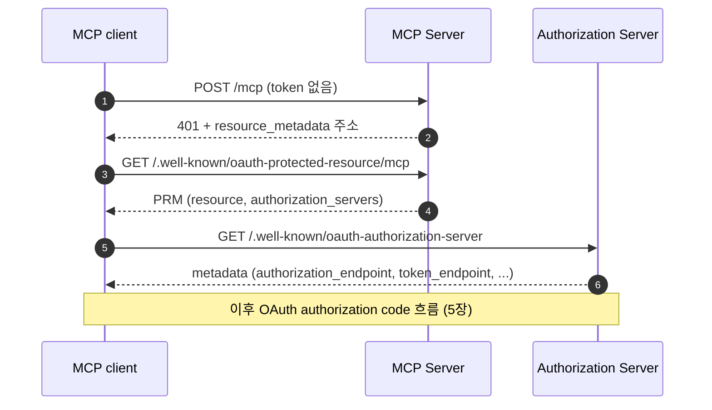

# 3. Discovery — client는 Authorization Server를 어떻게 찾아가나

## 3.1 Discovery의 필요성

보통의 OAuth 앱은 개발자가 Authorization Server 주소를 설정 파일에 미리 적어 둔다.
Spring Boot라면 `spring.security.oauth2.client.provider.<이름>.issuer-uri`를 적는다. client는 처음부터 어디로 가야 하는지 안다.

MCP는 다르다. 사용자는 Claude Desktop이나 Cursor 같은 MCP client에 MCP Server 주소 하나만 넣는다.

```text
https://mcp.example.com/mcp
```

client는 이 주소 말고는 아무것도 모른다.
이 서버를 어느 Authorization Server가 지키는지, 그 Authorization Server의 login 화면과 token 발급 주소가 어디인지는 모두 알아내야 한다.
이렇게 MCP Server 주소 하나에서 출발해 Authorization Server의 정보까지 찾아가는 과정이 discovery다.

discovery는 요청 세 번으로 끝난다.
MCP Server에게 자기를 보호하는 Authorization Server(issuer)가 무엇인지 묻고, 그 Authorization Server에게 login·token endpoint가 어디인지 묻는다.

## 3.2 시퀀스 다이어그램



[다이어그램 그림으로 보기](diagrams/03-discovery-1.png)

| 단계 | 묻는 곳 | 얻는 것 |
|---|---|---|
| 1단계 (1)(2): token 없이 호출 | MCP Server | PRM이 있는 주소 |
| 2단계 (3)(4): PRM 읽기 | MCP Server | Authorization Server의 이름(issuer) |
| 3단계 (5)(6): Authorization Server Metadata 읽기 | Authorization Server | login 주소(`authorization_endpoint`), token 발급 주소(`token_endpoint`), PKCE 지원 여부 |

아래 예시는 official practice를 실제로 띄워 받은 응답이다.
MCP Server는 `http://localhost:8111/mcp`, Authorization Server는 `http://localhost:9010`이다.

## 3.3 1단계: token 없이 불러 본다

client는 일단 token 없이 MCP Server를 부른다.
MCP에서 가장 먼저 보내는 요청은 `initialize`이므로 그것을 그대로 보낸다.

```bash
curl -i -X POST http://localhost:8111/mcp \
  -H 'Content-Type: application/json' \
  -H 'Accept: application/json, text/event-stream' \
  -d '{"jsonrpc":"2.0","id":1,"method":"initialize","params":{"protocolVersion":"2025-11-25","capabilities":{},"clientInfo":{"name":"curl","version":"1.0"}}}'
```

```http
HTTP/1.1 401
WWW-Authenticate: Bearer resource_metadata="http://localhost:8111/.well-known/oauth-protected-resource/mcp"
```

`401`은 "token이 필요하다"는 뜻이고, 여기까지는 일반 OAuth와 같다.
MCP에서 새로 보이는 것은 `WWW-Authenticate` header의 `resource_metadata` 값이다.
MCP Server는 이 값으로 "나에 대한 설명서(PRM)는 이 주소에 있다"고 알려 준다.

이 방식 덕분에 client는 MCP Server 주소 말고는 아무것도 미리 알 필요가 없다.
처음 보낸 요청이 거절되면서 다음에 갈 곳을 알게 된다.

> **header가 없으면?**
> MCP Server는 이 header를 보내거나, 정해진 위치(well-known URI)에 PRM을 두거나, 둘 중 하나는 반드시 해야 한다.
> client는 둘 다 처리할 줄 알아야 한다. header가 없으면 주소를 직접 만들어 본다(3.4의 "주소 규칙").

## 3.4 2단계: Protected Resource Metadata(PRM)를 읽는다

PRM은 MCP Server가 자기 자신을 소개하는 JSON 문서다.
형식은 RFC 9728 "OAuth 2.0 Protected Resource Metadata"가 정한다.

```bash
curl http://localhost:8111/.well-known/oauth-protected-resource/mcp
```

```json
{
  "resource": "http://localhost:8111/mcp",
  "authorization_servers": ["http://localhost:9010"],
  "bearer_methods_supported": ["header"],
  "tls_client_certificate_bound_access_tokens": false
}
```

중요한 field는 두 개다.

| field | 뜻 | client가 할 일 |
|---|---|---|
| `resource` | 이 MCP Server의 공식 이름. 보통 MCP Server 주소 그대로다 | 방금 호출한 주소와 **정확히 같은지** 확인한다. 다르면 이 문서를 버린다 |
| `authorization_servers` | 이 MCP Server용 token을 발급하는 Authorization Server의 이름(issuer) 목록 | 여기서 하나를 골라 3단계로 간다 |

`resource`를 확인하는 이유가 있다.
공격자가 다른 서버의 PRM을 보여 주면 client는 엉뚱한 Authorization Server로 끌려가 login과 token을 넘길 수 있다.
"내가 부른 서버의 설명서가 맞는가"를 먼저 확인해 이 경로를 막는다.

`resource` 값은 뒤에서 한 번 더 쓰인다.
client는 token을 요청할 때 이 값을 `resource` parameter로 보내고, Authorization Server는 그 값을 token의 `aud`에 넣는다(5장).
그래서 이 token은 이 MCP Server에서만 통한다.

**주소 규칙**

PRM 주소는 MCP Server 주소의 host와 path 사이에 `/.well-known/oauth-protected-resource`를 끼워 넣어 만든다.
header가 없을 때 client는 path가 붙은 주소를 먼저 시도하고, 없으면 path를 뺀 주소를 시도한다.

| MCP Server 주소 | 1순위 | 2순위 |
|---|---|---|
| `http://localhost:8111/mcp` | `http://localhost:8111/.well-known/oauth-protected-resource/mcp` | `http://localhost:8111/.well-known/oauth-protected-resource` |

2순위 주소로 받은 문서의 `resource`는 `http://localhost:8111`처럼 path가 없는 값이어야 한다.

## 3.5 3단계: Authorization Server Metadata를 읽는다

PRM이 알려 준 것은 Authorization Server의 **이름**(issuer)뿐이다.
login 화면 주소나 token 발급 주소는 아직 모른다.
그 정보는 Authorization Server가 스스로 공개하는 metadata에 있다. 형식은 RFC 8414가 정한다.

```bash
curl http://localhost:9010/.well-known/oauth-authorization-server
```

```json
{
  "issuer": "http://localhost:9010",
  "authorization_endpoint": "http://localhost:9010/oauth2/authorize",
  "token_endpoint": "http://localhost:9010/oauth2/token",
  "jwks_uri": "http://localhost:9010/oauth2/jwks",
  "code_challenge_methods_supported": ["S256"],
  "authorization_response_iss_parameter_supported": true,
  "...": "그 밖의 field는 생략"
}
```

| field | 뜻 |
|---|---|
| `issuer` | Authorization Server의 이름. PRM에서 받은 값과 같아야 한다 |
| `authorization_endpoint` | 사용자를 보낼 login·consent 화면 주소 |
| `token_endpoint` | authorization code를 token으로 바꾸는 주소 |
| `jwks_uri` | token signature를 확인할 public key 주소. MCP Server가 쓴다(6장) |
| `code_challenge_methods_supported` | 지원하는 PKCE 방식. `S256`이 있어야 한다 |
| `authorization_response_iss_parameter_supported` | login 뒤 돌아오는 redirect에 자기 이름(`iss`)을 넣어 주는지 여부(5장) |

**주소 규칙**

issuer 주소에서 metadata 주소를 만드는 방법은 두 가지 표준이 있다.
MCP는 OAuth 표준(RFC 8414)을 먼저, OpenID Connect 표준을 나중에 시도하게 한다.

| issuer | 1순위 (RFC 8414) | 2순위 (OpenID Connect) | 3순위 (OpenID Connect) |
|---|---|---|---|
| `http://localhost:9010` | `/.well-known/oauth-authorization-server` | `/.well-known/openid-configuration` | — |
| `https://auth.example.com/tenant1` | `/.well-known/oauth-authorization-server/tenant1` | `/.well-known/openid-configuration/tenant1` | `/tenant1/.well-known/openid-configuration` |

issuer에 path가 있으면 두 표준의 규칙이 달라서 후보가 세 개가 된다.

## 3.6 client가 반드시 확인하는 것

discovery로 받은 값은 모두 네트워크에서 온 남의 말이다.
client는 다음을 확인하고, 하나라도 어긋나면 더 진행하지 않는다.

| 확인 | 어기면 생기는 일 |
|---|---|
| PRM의 `resource`가 방금 부른 MCP Server 주소와 같다 | 다른 서버의 설명서를 믿고 엉뚱한 Authorization Server로 간다 |
| metadata의 `issuer`가 PRM이 알려 준 issuer와 같다 | 가짜 metadata가 login·token 주소를 공격자 서버로 바꿔 놓을 수 있다 |
| `code_challenge_methods_supported`에 `S256`이 있다 | PKCE 없이 진행하게 되어, 가로챈 authorization code가 그대로 쓰인다 |
| `authorization_endpoint`·`token_endpoint`가 `https`다(개발용 loopback 주소만 `http` 허용) | `javascript:` 같은 주소를 browser에 열게 되거나, 암호화되지 않은 곳으로 code와 비밀이 간다 |
| 가진 client credentials가 그 issuer에서 발급받은 것이다(2026-07-28 추가) | 다른 Authorization Server에 `client_secret`을 보내게 된다 |

마지막 항목은 서버에서 도는 client에게 특히 중요하다.
official의 agent는 한 Authorization Server에 미리 등록된 `client_id`·`client_secret`을 가지고 있다.
PRM이 모르는 Authorization Server를 가리키면, agent는 그 서버의 metadata도 요청하지 않고 멈춘다.
공격자가 PRM을 조작해 agent가 내부망 주소나 공격자 서버로 요청을 보내게 만드는 것(SSRF)을 여기서 막는다.

## 3.7 official 코드에서 보기

**MCP Server: PRM과 `401`을 내보내는 쪽**

Spring Security 7.1에서는 PRM을 `protectedResourceMetadata(...)` 설정으로 켠다.
`shop-mcp-server`의 `SecurityConfig`는 여기에 Authorization Server 주소를 적는다.

```java
.oauth2ResourceServer(resourceServer -> resourceServer
        .jwt(Customizer.withDefaults())
        .authenticationEntryPoint(resourceMetadataEntryPoint())   // 401에 resource_metadata를 넣는다
        .protectedResourceMetadata(metadata -> metadata
                .protectedResourceMetadataCustomizer(builder -> builder
                        .authorizationServer(issuer)                     // PRM의 authorization_servers
                        .tlsClientCertificateBoundAccessTokens(false))))
```

`resourceMetadataEntryPoint()`는 `/mcp` 요청이 거절될 때 `/.well-known/oauth-protected-resource/mcp` 주소를 `401`에 넣는다.
`issuer` 값은 `application.yml`의 `spring.security.oauth2.resourceserver.jwt.issuer-uri`에서 온다.

**Agent: discovery를 하는 쪽**

agent의 설정에는 MCP Server 주소와, credentials를 발급한 Authorization Server의 이름만 있다.

```yaml
mcp:
  authorization:
    resource-url: http://localhost:8111/mcp       # discovery의 출발점
    credentials-issuer: http://localhost:9010     # client_secret을 발급한 곳
```

`McpAuthorizationDiscovery#discover`가 3.3~3.6을 순서대로 한다.

```java
public DiscoveredAuthorization discover(String resourceUrl, String trustedIssuer) {
    // 1~2단계: 401 → PRM. resource가 resourceUrl과 다르면 여기서 예외
    Map<String, Object> protectedResource = protectedResourceMetadata(resourceUrl);

    String issuer = /* authorization_servers의 첫 값 */;
    if (!trustedIssuer.equals(issuer)) {
        // credentials를 발급한 곳이 아니면 metadata도 요청하지 않는다
        throw new McpDiscoveryException(...);
    }
    // 3단계: metadata. issuer 일치, S256, endpoint 주소 형식을 확인한다
    return new DiscoveredAuthorization(..., issuer, authorizationServerMetadata(issuer));
}
```

discovery는 첫 login 때 한 번 하고, 성공한 결과만 기억해 둔다(`DiscoveredClientRegistrationRepository`).
agent를 띄울 때 MCP Server가 아직 꺼져 있어도 괜찮은 이유가 이것이다.

## 3.8 직접 해 보기

```bash
cd practice/mcp-security-authn-official
./run.sh
```

```bash
# 1단계: token 없이 호출 → 401과 PRM 주소
curl -i -X POST http://localhost:8111/mcp -H 'Content-Type: application/json' \
  -H 'Accept: application/json, text/event-stream' \
  -d '{"jsonrpc":"2.0","id":1,"method":"initialize","params":{"protocolVersion":"2025-11-25","capabilities":{},"clientInfo":{"name":"curl","version":"1.0"}}}'

# 2단계: PRM
curl http://localhost:8111/.well-known/oauth-protected-resource/mcp

# 3단계: Authorization Server Metadata
curl http://localhost:9010/.well-known/oauth-authorization-server
```

1~3단계를 한 번에 기록하는 스크립트도 있다: `docs/superpowers/captures/mcp-authorization-walkthrough.sh`의 1~3단계.

## 3.9 정리

- MCP client가 처음 아는 것은 MCP Server 주소 하나다. 나머지는 discovery로 알아낸다.
- `401`의 `resource_metadata` → PRM의 `authorization_servers` → Authorization Server Metadata의 endpoint 순서로 따라간다.
- 받은 값은 믿기 전에 확인한다. `resource`와 `issuer`가 맞는지, PKCE `S256`을 지원하는지, 주소가 `https`인지 본다. credentials가 있다면 그 issuer의 것인지도 본다.
- PRM의 `resource`는 token을 이 MCP Server 전용으로 만드는 데 다시 쓰인다(5장).

## 3.10 명세 근거

| 내용 | 명세 | 요구 수준 |
|---|---|---|
| MCP Server는 PRM을 제공하고 `authorization_servers`에 하나 이상 넣는다 | [MCP 2025-11-25 Authorization — Authorization Server Location](https://modelcontextprotocol.io/specification/2025-11-25/basic/authorization#authorization-server-location), [RFC 9728](https://www.rfc-editor.org/rfc/rfc9728) | MUST |
| PRM 위치를 `401` header 또는 well-known URI로 알린다. client는 둘 다 처리한다 | [MCP 2025-11-25 Authorization — Protected Resource Metadata Discovery Requirements](https://modelcontextprotocol.io/specification/2025-11-25/basic/authorization#protected-resource-metadata-discovery-requirements), [RFC 9728 §5.1](https://www.rfc-editor.org/rfc/rfc9728#section-5.1) | MUST |
| PRM의 `resource`가 요청한 주소와 다르면 쓰지 않는다 | [RFC 9728 §3.3](https://www.rfc-editor.org/rfc/rfc9728#section-3.3) | MUST NOT |
| metadata 주소를 RFC 8414 → OpenID Connect 순서로 시도한다 | [MCP 2025-11-25 Authorization — Authorization Server Metadata Discovery](https://modelcontextprotocol.io/specification/2025-11-25/basic/authorization#authorization-server-metadata-discovery) | MUST |
| metadata의 `issuer`가 다르면 쓰지 않는다 | [RFC 8414 §3.3](https://www.rfc-editor.org/rfc/rfc8414#section-3.3), [MCP 2026-07-28 Authorization Server Discovery](https://modelcontextprotocol.io/specification/2026-07-28/basic/authorization/authorization-server-discovery#authorization-server-metadata-discovery) | MUST |
| PKCE 지원을 확인하고, 없으면 진행하지 않는다 | [MCP 2025-11-25 Authorization — Authorization Code Protection](https://modelcontextprotocol.io/specification/2025-11-25/basic/authorization#authorization-code-protection) | MUST |
| authorization 주소는 `https`만(개발용 loopback은 `http` 허용) | [MCP Security Best Practices](https://modelcontextprotocol.io/specification/2025-11-25/basic/security_best_practices) | MUST |
| credentials는 발급한 Authorization Server에 묶어 둔다 | [MCP 2026-07-28 Client Registration — Authorization Server Binding](https://modelcontextprotocol.io/specification/2026-07-28/basic/authorization/client-registration#authorization-server-binding) | MUST |

[← 2장](02-why-oauth.md) · [목차](README.md) · [4장 →](04-client-registration.md)
