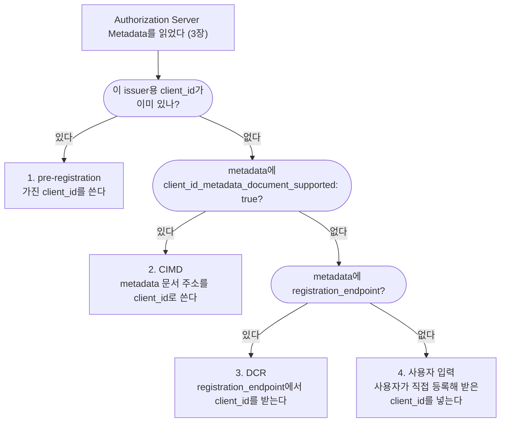
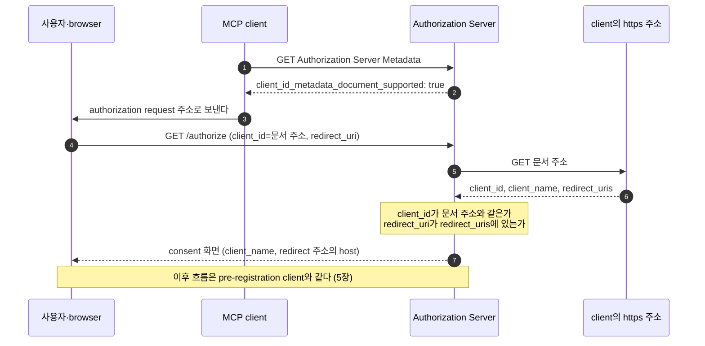

# 4. Client 등록 — Authorization Server는 처음 보는 client를 어떻게 알아보나

## 4.1 Client 등록의 필요성

3장에서 client는 Authorization Server의 login 주소와 token 발급 주소를 알아냈다.
이제 사용자를 login 화면으로 보내면 될 것 같지만, 하나가 더 필요하다.
authorization request에는 `client_id`가 들어가고, Authorization Server는 자기가 아는 `client_id`만 받는다.

Authorization Server는 등록된 정보를 다음 세 곳에 쓴다.

| 등록 정보 | Authorization Server가 쓰는 곳 |
|---|---|
| redirect URI 목록 | authorization code를 이 목록의 주소로만 보낸다. 아무 주소로나 보내면 공격자가 자기 주소를 적어 code를 받아 간다 |
| token endpoint 인증 방식 | token request를 보낸 client가 진짜인지 확인한다 |
| 이름 | consent 화면에서 누가 권한을 요청하는지 보여 준다 |

official의 Authorization Server는 등록되지 않은 `client_id`로 온 authorization request를 어느 주소로도 redirect하지 않고 오류로 끝낸다.
이 client의 redirect URI를 모르므로 믿고 보낼 주소가 없다.
요청에 적힌 주소로 오류를 보내 주면, 공격자가 Authorization Server를 거쳐 사용자를 아무 사이트로나 보내는 데 쓸 수 있다.
login한 browser에는 이 오류가 `400`으로 보인다.
login하지 않은 browser에는 login 화면이 보인다.
official에서는 오류 page(`/error`)도 login을 요구하기 때문이다.

2장에서 본 대로 MCP client는 처음 보는 Authorization Server를 만나므로, MCP는 미리 등록하는 방법 말고도 처음 만난 자리에서 `client_id`를 마련하는 방법을 둔다.

등록은 3장의 Authorization Server Metadata를 읽은 뒤에 한다.
그 Authorization Server가 어떤 등록 방식을 받는지 metadata가 알려 주기 때문이다.
미리 등록한 client는 이 단계가 이미 끝나 있고, official의 두 client가 그렇다.

## 4.2 등록 방식 네 가지와 우선순위

모든 방식을 지원하는 client는 아래 순서로 고른다.



[다이어그램 그림으로 보기](diagrams/04-client-registration-1.png)

| 방식 | 어울리는 상황 |
|---|---|
| pre-registration | client와 Authorization Server가 이미 아는 사이다 |
| CIMD(Client ID Metadata Document) | 서로 처음 만난다. MCP에서 가장 흔한 경우다 |
| DCR(Dynamic Client Registration) | CIMD를 모르는 Authorization Server와 호환해야 한다 |
| 사용자 입력 | 위 셋을 모두 쓸 수 없다. 사용자가 그 Authorization Server에서 client를 직접 등록하고, 받은 `client_id`(와 비밀)를 MCP client에 넣는다 |

pre-registration이 가장 앞에 오는 것은 그 Authorization Server와 이미 합의해 둔 정보이기 때문이다.
CIMD와 DCR은 둘 다 처음 만난 Authorization Server에서 `client_id`를 얻는 방법이다.
2026-07-28 버전은 DCR을 deprecated로 정하고, 새 구현에는 CIMD를 쓰라고 한다.

등록 방식과 client 종류(2장의 confidential·public)는 따로 정한다.
official은 두 종류를 모두 pre-registration으로 등록하고, CIMD와 DCR은 쓰지 않는다.

## 4.3 pre-registration: official의 두 client

`auth-server`는 client 두 개를 `application.yml`에 적는다.
Spring Boot가 시작할 때 이 설정을 읽어 client를 등록하므로, 등록용 bean은 따로 없다.

```yaml
spring:
  security:
    oauth2:
      authorizationserver:
        issuer: http://localhost:9010
        client:
          official-shop-agent:                   # confidential client (shop-agent)
            registration:
              client-id: official-shop-agent
              client-secret: "{noop}official-shop-agent-secret"
              client-authentication-methods: [client_secret_basic]
              authorization-grant-types: [authorization_code, refresh_token]
              redirect-uris: [http://localhost:8110/login/oauth2/code/authserver]
              scopes: [openid, profile]
            require-proof-key: true
            require-authorization-consent: false
          local-mcp-client:                      # public client (local-client)
            registration:
              client-id: local-mcp-client
              client-authentication-methods: [none]
              authorization-grant-types: [authorization_code, refresh_token]
              redirect-uris: [http://127.0.0.1:8123/callback]
              scopes: [openid, profile]
            require-proof-key: true
            require-authorization-consent: true
```

| 설정 | 뜻 |
|---|---|
| `client-secret` | confidential client가 token request에서 자기를 증명하는 비밀이다. `{noop}`은 암호화하지 않고 저장했다는 표시다 |
| `client-authentication-methods` | token endpoint에서 client를 확인하는 방법이다. `client_secret_basic`은 `Authorization: Basic` header로 비밀을 보내고, `none`은 `client_id`만 보낸다 |
| `redirect-uris` | code를 보낼 수 있는 주소다. 요청의 `redirect_uri`가 여기 없으면 그 주소로 redirect하지 않고 오류로 끝낸다(4.1) |
| `require-proof-key` | `true`면 `code_challenge`가 없는 authorization request를 거절한다. PKCE를 반드시 쓰게 된다 |
| `require-authorization-consent` | `true`면 login 뒤에 consent 화면을 보여 준다 |

두 client를 나란히 놓으면 다음과 같다.

| | `official-shop-agent` (confidential) | `local-mcp-client` (public) |
|---|---|---|
| token endpoint 인증 | `client_secret_basic`. header로 비밀을 보낸다 | `none`. 본문에 `client_id`만 넣는다 |
| redirect URI | 등록한 주소 그대로 | `127.0.0.1`의 `/callback`. 포트는 실행할 때마다 달라도 된다 |
| PKCE | 반드시 쓴다 | 반드시 쓴다 |
| consent | 묻지 않는다 | 매번 묻는다 |
| refresh token | 받는다 | 받지 않는다 |
| access token의 `aud` | `http://localhost:8111/mcp` | `http://localhost:8111/mcp` |

`shop-agent`는 비밀로 자기를 증명하므로, official은 이 client의 consent 화면을 생략한다.
access token의 `aud`는 client 종류와 상관없이 MCP Server다.
MCP Server는 token의 `iss`와 `aud`를 볼 뿐, 어느 종류의 client가 받았는지는 보지 않는다(6장).

등록은 client 쪽에도 같은 값을 적어야 끝난다.
`shop-agent`는 같은 `client-id`·`client-secret`·redirect URI를 `spring.security.oauth2.client.registration.authserver`에 적는다.
Authorization Server의 endpoint는 적지 않고, 3장의 discovery로 채운다.
`local-client`는 `local-mcp-client`를 코드에 상수로 두고, 비밀은 가지고 있지 않다.

## 4.4 public client의 규칙

public client의 `client_id`는 배포된 앱 안에 들어 있어서 비밀이 아니다.
같은 기기의 다른 프로그램도 `local-mcp-client`를 대며 요청할 수 있다.
Authorization Server는 요청을 보낸 것이 진짜 `local-client`인지 확인할 수 없다.
그래서 public client는 비밀 대신 다른 장치로 사용자와 authorization code를 지킨다.

| 규칙 | official 설정 | 어기면 생기는 일 |
|---|---|---|
| 비밀 없이 등록한다(`none`) | `client-authentication-methods: [none]` | 배포 파일의 비밀은 누구나 꺼낼 수 있다. 꺼낸 비밀로 다른 프로그램이 이 client 행세를 한다 |
| PKCE를 반드시 쓴다 | `require-proof-key: true` | loopback redirect로 온 code를 같은 기기의 다른 프로그램이 가로채 token으로 바꾼다(5장) |
| loopback redirect의 포트는 자유다 | Spring이 loopback IP 주소의 포트를 빼고 비교한다 | 포트를 고정하면 그 포트를 다른 프로그램이 쓰고 있을 때 login이 실패한다 |
| consent를 매번 받는다 | `require-authorization-consent: true`와 두 클래스 | 다른 프로그램이 `local-mcp-client`를 대고 요청하면 사용자 모르게 code가 발급된다 |
| refresh token을 주지 않는다 | Spring 기본 동작 | 새어 나간 refresh token 하나로 누구든 오랫동안 새 token을 받는다 |

**비밀 없음: `none`**

official은 metadata의 `token_endpoint_auth_methods_supported`에 `none`을 넣어, 비밀 없는 public client를 받는다고 알린다(4.8, 4.9).
Authorization Server는 client마다 종류를 기록해 두므로, `local-mcp-client`가 token request에 비밀을 보내면 오히려 `401` `invalid_client`로 거절된다.

**loopback redirect의 포트**

`local-client`는 `127.0.0.1`에서 운영체제가 골라 준 빈 포트로 callback을 받는다.
실행할 때마다 포트가 달라지므로, Authorization Server는 loopback IP 주소(`127.x.x.x`, `[::1]`)의 redirect URI를 비교할 때 포트를 뺀다.
등록한 포트는 `8123`이지만, `9999`로 보내도 그 주소로 code가 온다.

```http
HTTP/1.1 302
Location: http://127.0.0.1:9999/callback?code=CMoLrbqdsRXI...&state=public-state&iss=http%3A%2F%2Flocalhost%3A9010
```

포트 말고는 등록한 주소와 정확히 같아야 한다.
path가 다르면 그 주소로 redirect하지 않고 오류로 끝난다.
`localhost`라는 이름은 이 예외에 들지 않아서, Spring은 `localhost` redirect URI를 포트까지 정확히 비교한다.
`127.0.0.1`을 쓰면 callback server가 실수로 loopback 밖의 네트워크에서 요청을 받는 일도 없다.

**consent를 매번 받는 이유**

다른 프로그램이 `client_id=local-mcp-client`와 자기 loopback 포트를 넣어 browser를 연다고 해 보자.
사용자는 이미 login해 있고, 예전에 `local-mcp-client`에 consent한 적이 있다.
Authorization Server가 그 consent를 기억해 화면 없이 넘어가면, code는 곧장 그 프로그램에게 간다.
이때 PKCE는 도움이 되지 않는다.
요청을 시작한 쪽이 그 프로그램이라 `code_verifier`도 그 프로그램에게 있기 때문이다.
consent 화면을 매번 보여 주면, 사용자는 자기가 시작하지 않은 요청을 알아챌 수 있다.

public client는 consent할 scope가 하나는 있어야 하고, 그 이유와 동작은 [5장](05-authorization-and-token.md)에서 본다.

**refresh token**

`local-mcp-client`의 등록에는 `refresh_token` grant가 있지만, Spring은 인증 방식이 `none`인 client에게 refresh token을 주지 않는다.
refresh token은 오래 쓰이는데, public client는 그것을 쓸 때도 자기를 증명하지 못해서 새어 나가면 누구든 쓸 수 있다.
그래서 `local-client`는 token이 만료되면 authorization 흐름을 처음부터 다시 밟는다.

## 4.5 CIMD

CIMD는 client와 Authorization Server가 서로 처음 만나는 경우를 위한 방법이다.
client는 자기 정보를 담은 JSON 문서를 자기 `https` 주소에 올려 두고, 그 주소를 `client_id`로 쓴다.
Authorization Server는 주소 형식의 `client_id`를 만나면 그 문서를 가져와 등록 정보로 쓴다.
등록 요청을 따로 보낼 필요가 없다.
문서의 내용은 그 domain의 주인만 정할 수 있다.

MCP 명세의 예시 문서는 다음과 같다.

```json
{
  "client_id": "https://app.example.com/oauth/client-metadata.json",
  "client_name": "Example MCP Client",
  "client_uri": "https://app.example.com",
  "redirect_uris": [
    "http://127.0.0.1:3000/callback",
    "http://localhost:3000/callback"
  ],
  "token_endpoint_auth_method": "none",
  "...": "그 밖의 field는 생략"
}
```

| field | 뜻 |
|---|---|
| `client_id` | 이 문서의 주소다. path가 있는 `https` 주소이고, 문서를 가져온 주소와 글자 하나까지 같아야 한다 |
| `client_name` | consent 화면에 보일 이름이다 |
| `redirect_uris` | code를 받을 주소 목록이다. Authorization Server는 요청의 `redirect_uri`를 이 목록과 비교한다 |
| `token_endpoint_auth_method` | `none`이면 public client다. 문서는 누구나 읽을 수 있어서 `client_secret_basic` 같은 공유 비밀 방식은 쓸 수 없다 |

`client_id`·`client_name`·`redirect_uris` 세 field는 꼭 있어야 한다.



[다이어그램 그림으로 보기](diagrams/04-client-registration-2.png)

(5)(6)에서 Authorization Server는 모르는 client가 준 주소로 요청을 보낸다.
그래서 문서를 믿기 전에 다음을 확인한다.

| 확인 | 어기면 생기는 일 |
|---|---|
| 문서의 `client_id`가 문서를 가져온 주소와 같다 | 남의 문서를 복사해 자기 주소에 올린 client가 그 client 행세를 한다 |
| 요청의 `redirect_uri`가 문서의 `redirect_uris`에 있다 | code가 문서에 없는 공격자 주소로 간다 |
| 사설·loopback 주소는 가져오지 않고, 응답 크기를 제한한다 | 공격자가 `client_id`에 내부망 주소를 적어 Authorization Server가 그 주소로 요청하게 만든다(SSRF). 아주 큰 문서로 Authorization Server의 자원을 소모시켜 서비스를 멈추게 한다 |

통과한 문서는 HTTP cache header에 따라 cache하고, 가져오지 못했거나 잘못된 문서는 cache하지 않는다.

CIMD만으로 막지 못하는 경우도 있다.
진짜 client의 문서에 `localhost` redirect URI가 있으면, 공격자는 그 문서 주소를 `client_id`로 대고 자기가 연 `localhost` 포트로 code를 받을 수 있다.
사용자는 consent 화면에서 진짜 client의 이름을 보게 된다.
그래서 Authorization Server는 consent 화면에 redirect 주소의 host를 보여 주고, `localhost`로만 돌아가는 요청에는 경고를 더한다.

official은 CIMD를 구현하지 않는다.
CIMD의 `client_id`는 Authorization Server가 가져올 수 있는 `https` 주소여야 하는데, official은 `localhost`의 `http`로만 돈다.
metadata에도 `client_id_metadata_document_supported`가 없다.

## 4.6 DCR

DCR은 client가 Authorization Server의 `registration_endpoint`에 자기 정보를 `POST`로 보내 새 `client_id`를 받는 방법이다(RFC 7591).
사용자가 끼어들지 않아도 등록이 끝난다.
client는 받은 `client_id`를 저장해 두고 쓴다.

DCR로 등록된 client는 Authorization Server에 계속 쌓인다.
누가 등록했는지도 Authorization Server는 알 수 없다.
CIMD라면 Authorization Server가 저장할 것이 없다.
`client_id`의 host를 보면 이 client를 누가 올렸는지도 알 수 있다.
2026-07-28 버전은 DCR을 deprecated로 정했다.
DCR은 CIMD를 모르는 Authorization Server와 호환하려고 남아 있다.

DCR을 쓰는 client는 `application_type`을 넣는다.
OpenID Connect를 지원하는 Authorization Server는 이 값이 없으면 `web`으로 보고, `127.0.0.1` 같은 redirect URI를 거절할 수 있다.
desktop 앱·명령줄 도구는 `native`, 원격에서 도는 web 앱은 `web`을 쓴다.

official은 DCR을 켜지 않는다.
metadata에도 `registration_endpoint`가 없다.

## 4.7 credentials를 issuer에 묶기

미리 등록한 `client_id`와 `client_secret`은 그것을 발급한 Authorization Server에서만 통한다.
그런데 MCP client는 Authorization Server를 PRM에서 알아낸다(3장).
PRM이 다른 Authorization Server를 가리키면, client는 가진 비밀을 그 서버의 token endpoint로 보낼 수 있다.
PRM이 위조되었다면 비밀은 공격자에게 간다.

그래서 2026-07-28 버전은 credentials를 발급한 Authorization Server의 `issuer`에 묶어 두게 한다.

| 상황 | client가 할 일 |
|---|---|
| PRM이 알려 준 issuer가 credentials의 issuer와 같다 | 그 credentials로 흐름을 이어 간다 |
| 다르다 | 그 credentials를 쓰지 않는다. 몰래 시도하지 말고 오류를 보여 준다 |
| Authorization Server가 정말 바뀌었다 | 새 Authorization Server에 다시 등록한다 |

DCR로 받아 저장해 둔 credentials도 같은 규칙을 따른다.
CIMD는 어느 Authorization Server든 `client_id` 주소에서 문서를 직접 가져가므로, 서버가 바뀌어도 다시 등록할 필요가 없다.

official의 agent는 `mcp.authorization.credentials-issuer`에, `local-client`는 `--issuer` 옵션(기본값 `http://localhost:9010`)에 이 issuer를 둔다.
discovery는 PRM의 `authorization_servers`를 이 값과 먼저 비교하고, 다르면 metadata도 요청하지 않고 멈춘다(3장).

## 4.8 official 코드에서 보기

**auth-server: metadata에 `none`을 더한다**

Spring이 만드는 metadata의 `token_endpoint_auth_methods_supported`에는 `none`이 없다.
`AuthorizationServerConfig`는 metadata customizer로 `none`을 목록 끝에 더한다.
OpenID Connect discovery 문서(`/.well-known/openid-configuration`)에도 같은 방법으로 더한다.

```java
.authorizationServerMetadataEndpoint(metadata -> metadata
        .authorizationServerMetadataCustomizer(builder -> builder
                /* ... */
                // "none": 비밀 없는 public client를 받는다고 알린다
                .tokenEndpointAuthenticationMethods(methods ->
                        methods.add(PUBLIC_CLIENT_AUTHENTICATION_METHOD))))
```

같은 클래스는 `PublicClientConsentService`를 consent 저장소 bean으로 등록한다.
이 bean은 public client의 consent를 저장하지 않아서, public client는 매번 consent 화면을 거친다.
authorization request 검증의 마지막 단계에는 `PublicClientScopeValidator`를 붙인다.
두 클래스는 등록된 `client-authentication-methods`에 `none`이 있는 client만 다르게 처리하고, 자세한 동작은 5장에서 본다.

**shop-agent: 설정의 credentials와 discovery 결과를 합친다**

`DiscoveredClientRegistrationRepository`는 Spring Security가 login 때 쓰는 client 등록 정보를 만든다.
미리 등록한 값은 설정에서, endpoint는 discovery에서 가져온다.

```java
private ClientRegistration registration(DiscoveredAuthorization authorization) {
    return ClientRegistration.withRegistrationId(this.registrationId)
            // pre-registration: 설정 파일의 값
            .clientId(this.credentials.getClientId())
            .clientSecret(this.credentials.getClientSecret())
            .clientAuthenticationMethod(ClientAuthenticationMethod.CLIENT_SECRET_BASIC)
            /* ... */
            .redirectUri(this.credentials.getRedirectUri())
            /* ... */
            // discovery: credentials-issuer와 같은 issuer에서만 온다
            .authorizationUri(authorization.authorizationEndpoint())
            .tokenUri(authorization.tokenEndpoint())
            /* ... */
            .issuerUri(authorization.issuer())
            /* ... */
            .build();
}
```

이 메서드를 부르기 전에 `discover(resourceUrl, credentialsIssuer)`가 issuer를 비교한다.
비교를 통과하지 못하면 등록 정보가 만들어지지 않으므로, `client_secret`이 나갈 곳도 생기지 않는다.

## 4.9 직접 해 보기

```bash
cd practice/mcp-security-authn-official
./run.sh
```

```bash
# token endpoint 인증 방식. 끝에 none이 있다
curl -s http://localhost:9010/.well-known/oauth-authorization-server \
  | grep -o '"token_endpoint_auth_methods_supported":[^]]*]'

# OpenID Connect discovery 문서도 같다
curl -s http://localhost:9010/.well-known/openid-configuration \
  | grep -o '"token_endpoint_auth_methods_supported":[^]]*]'

# CIMD·DCR을 알리는 field는 없다. 아무것도 출력되지 않는다
curl -s http://localhost:9010/.well-known/oauth-authorization-server \
  | grep -o '"registration_endpoint"\|"client_id_metadata_document_supported"'
```

public client의 규칙을 curl로 한 단계씩 기록하는 스크립트도 있다: `docs/superpowers/captures/mcp-authorization-public-client.sh`.
출력의 처음 두 단계가 위의 metadata 확인이고, 뒤 단계에서 포트가 다른 loopback redirect와 refresh token 없는 token 응답을 볼 수 있다.

## 4.10 정리

- Authorization Server는 등록된 `client_id`만 받고, 등록 정보로 code를 보낼 주소와 client를 확인할 방법을 정한다.
- 등록 방식은 pre-registration → CIMD → DCR → 사용자 입력 순서로 고른다. DCR은 2026-07-28에서 deprecated다.
- official은 confidential client와 public client를 모두 미리 등록한다. public client는 비밀 없이 등록하고, PKCE·loopback redirect·매번 받는 consent로 지킨다.
- 미리 등록한 credentials는 발급한 issuer에 묶어 두고, PRM이 다른 Authorization Server를 가리키면 쓰지 않는다.

## 4.11 명세 근거

| 내용 | 명세 | 요구 수준 |
|---|---|---|
| 모든 방식을 지원하는 client는 pre-registration → CIMD → DCR → 사용자 입력 순서로 고른다. client는 정적 credentials 옵션을 지원한다 | [MCP 2025-11-25 Authorization — Client Registration Approaches](https://modelcontextprotocol.io/specification/2025-11-25/basic/authorization#client-registration-approaches), [Preregistration](https://modelcontextprotocol.io/specification/2025-11-25/basic/authorization#preregistration) | SHOULD |
| client와 Authorization Server는 CIMD를 지원하고, 지원하는 Authorization Server는 metadata에 `client_id_metadata_document_supported`를 넣는다. `client_id`는 path가 있는 `https` 주소이고, 문서에는 `client_id`·`client_name`·`redirect_uris`가 있으며 공유 비밀은 쓰지 않는다 | [MCP 2025-11-25 Authorization — Client ID Metadata Documents](https://modelcontextprotocol.io/specification/2025-11-25/basic/authorization#client-id-metadata-documents), [CIMD draft-00 §3](https://www.ietf.org/archive/id/draft-ietf-oauth-client-id-metadata-document-00.html#section-3), [§4.1](https://www.ietf.org/archive/id/draft-ietf-oauth-client-id-metadata-document-00.html#section-4.1), [§5](https://www.ietf.org/archive/id/draft-ietf-oauth-client-id-metadata-document-00.html#section-5) | SHOULD, MUST, MUST NOT |
| Authorization Server는 가져온 문서의 `client_id`·redirect URI·JSON 구조를 검증하고, HTTP cache header를 따라 cache한다. 오류 응답과 잘못된 문서는 cache하지 않고, 사설·loopback 주소는 가져오지 않으며 응답 크기를 제한한다 | [MCP 2025-11-25 Authorization — Implementation Requirements](https://modelcontextprotocol.io/specification/2025-11-25/basic/authorization#implementation-requirements), [CIMD draft-00 §4.4](https://www.ietf.org/archive/id/draft-ietf-oauth-client-id-metadata-document-00.html#section-4.4), [§6.5](https://www.ietf.org/archive/id/draft-ietf-oauth-client-id-metadata-document-00.html#section-6.5), [§6.6](https://www.ietf.org/archive/id/draft-ietf-oauth-client-id-metadata-document-00.html#section-6.6) | MUST, SHOULD, MUST NOT |
| Authorization Server는 redirect URI의 host를 보여 주고, `localhost`로만 돌아가는 요청에는 경고를 더한다 | [MCP 2025-11-25 Authorization — Localhost Redirect URI Risks](https://modelcontextprotocol.io/specification/2025-11-25/basic/authorization#localhost-redirect-uri-risks) | MUST, SHOULD |
| DCR은 선택이고, 2026-07-28에서 deprecated다. DCR을 쓰는 client는 알맞은 `application_type`을 넣는다 | [MCP 2025-11-25 Authorization — Dynamic Client Registration](https://modelcontextprotocol.io/specification/2025-11-25/basic/authorization#dynamic-client-registration), [MCP 2026-07-28 Client Registration — Dynamic Client Registration](https://modelcontextprotocol.io/specification/2026-07-28/basic/authorization/client-registration#dynamic-client-registration) | MAY, MUST |
| 기기별 비밀이 없는 native 앱은 public client로 등록하고, Authorization Server는 client 종류를 기록한다. `none`은 비밀 없는 public client다 | [OAuth 2.1 §8.1](https://datatracker.ietf.org/doc/html/draft-ietf-oauth-v2-1-13#section-8.1), [RFC 7591 §2](https://www.rfc-editor.org/rfc/rfc7591#section-2), [RFC 8414 §2](https://www.rfc-editor.org/rfc/rfc8414#section-2) | MUST |
| redirect URI는 등록하고 정확히 비교한다. loopback 주소는 요청의 어느 포트든 허용하고, 이름 `localhost`는 권하지 않는다 | [MCP 2025-11-25 Authorization — Open Redirection](https://modelcontextprotocol.io/specification/2025-11-25/basic/authorization#open-redirection), [OAuth 2.1 §8.4.2](https://datatracker.ietf.org/doc/html/draft-ietf-oauth-v2-1-13#section-8.4.2), [RFC 8252 §7.3](https://www.rfc-editor.org/rfc/rfc8252#section-7.3) | MUST, NOT RECOMMENDED |
| client 신원을 확인할 수 없으면 consent 없이 자동 처리하지 않고, 이전 consent가 있어도 처음처럼 처리한다 | [OAuth 2.1 §7.3.1](https://datatracker.ietf.org/doc/html/draft-ietf-oauth-v2-1-13#section-7.3.1) | SHOULD NOT, SHOULD |
| refresh token 발급은 Authorization Server가 정한다. public client에 주면 rotation이나 sender-constrained token으로 재사용을 잡아낸다 | [OAuth 2.1 §1.3.2](https://datatracker.ietf.org/doc/html/draft-ietf-oauth-v2-1-13#section-1.3.2), [§4.3.1](https://datatracker.ietf.org/doc/html/draft-ietf-oauth-v2-1-13#section-4.3.1) | MUST |
| 미리 등록했거나 DCR로 받은 credentials는 발급한 Authorization Server의 `issuer`에 묶는다. 서버가 바뀌면 재사용하지 않고 다시 등록하며, 맞지 않으면 오류를 보여 준다 | [MCP 2026-07-28 Client Registration — Authorization Server Binding](https://modelcontextprotocol.io/specification/2026-07-28/basic/authorization/client-registration#authorization-server-binding) | MUST, MUST NOT, SHOULD |

[← 3장](03-discovery.md) · [목차](README.md) · [5장 →](05-authorization-and-token.md)
