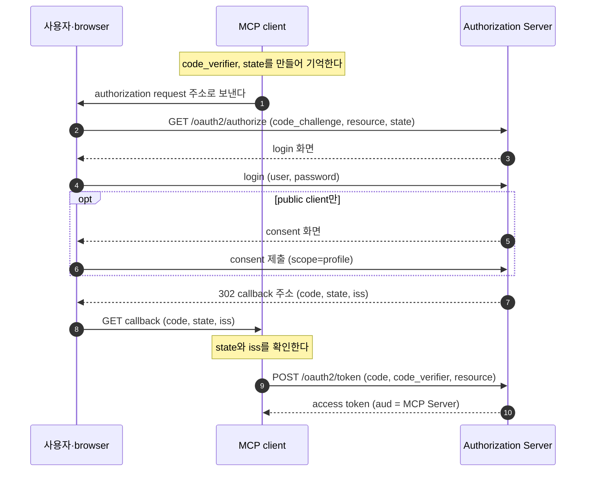

# 5. Authorization request와 token — client는 MCP Server 전용 token을 어떻게 받나

## 5.1 MCP가 authorization code 흐름에 더하는 것

client는 이제 Authorization Server의 endpoint(3장)와 자기 `client_id`(4장)를 가지고 있다.
이 장에서는 사용자를 Authorization Server로 보내 login하게 하고, 그 사용자를 대신할 access token을 받는다.

흐름은 OAuth의 authorization code grant 그대로다.
사용자가 Authorization Server에서 허락하면, client는 callback으로 돌아온 authorization code를 access token으로 바꾼다.

MCP는 이 흐름에 세 가지를 더한다.

| 더하는 것 | 이유 | 다루는 절 |
|---|---|---|
| PKCE를 반드시 쓴다(`S256`) | MCP client는 비밀이 없는 public client가 많다. 새어 나간 authorization code를 남이 token으로 바꾸지 못하게 한다 | 5.4 |
| `resource` parameter | 한 Authorization Server가 여러 MCP Server의 token을 발급할 수 있다. token을 이 MCP Server에서만 쓰게 좁힌다 | 5.3, 5.7, 5.8 |
| callback의 `iss` 확인 | client는 MCP Server가 알려 준 Authorization Server로 간다. 돌아온 응답이 그 Authorization Server의 것인지 확인한다 | 5.6 |

## 5.2 시퀀스 다이어그램

아래는 discovery(3장)와 client 등록(4장)이 끝난 뒤, client가 access token을 받기까지의 흐름이다.



[다이어그램 그림으로 보기](diagrams/05-authorization-and-token-1.png)

(1)(2)는 5.3·5.4, (3)~(6)은 5.5, (7)(8)은 5.6, (9)(10)은 5.7~5.9에서 다룬다.
아래 예시는 official practice를 실제로 띄워 받은 값이다.
여러 번 실행해 모은 값이라 `state`와 `code`는 절마다 다르다.

## 5.3 Authorization request를 보낸다

client는 사용자의 browser를 Authorization Server의 `authorization_endpoint`로 보낸다.
`shop-agent`가 `302`로 browser를 보내는 주소는 다음과 같다(보기 쉽게 parameter마다 줄을 나눴다).

```text
http://localhost:9010/oauth2/authorize
  ?response_type=code
  &client_id=official-shop-agent
  &scope=openid%20profile
  &state=3C1allspIhMjSc_tqFWW7iOvhCzryvgD9hh08ZbYJ3E%3D
  &redirect_uri=http://localhost:8110/login/oauth2/code/authserver
  &nonce=V3Gtfe-0MM7KwPlkMwvEMubJLZbwE7nlpfPWwqTh924
  &code_challenge=n50xckCBjg8zTfB43CXrPe9u72P70qaOkqzpvm2BNzg
  &code_challenge_method=S256
  &resource=http://localhost:8111/mcp
```

| parameter | 뜻 |
|---|---|
| `response_type=code` | authorization code를 달라는 뜻이다 |
| `client_id`, `redirect_uri` | 4장에서 등록한 client와 그 client의 callback 주소다 |
| `scope` | `openid`는 사용자가 누구인지 알려 주는 ID token을, `profile`은 사용자 정보를 읽는 권한을 달라는 뜻이다 |
| `state` | 무작위 값이다. callback에 그대로 돌아오고, client는 이 값으로 자기 요청의 응답인지 가린다(5.6) |
| `nonce` | ID token을 이 요청에 묶는 OpenID Connect 값이다. Spring Security가 `openid` 요청에 붙인다 |
| `code_challenge`, `code_challenge_method` | PKCE다(5.4) |
| `resource` | 이 token을 쓸 MCP Server다 |

`resource`를 뺀 나머지는 보통의 OAuth·OpenID Connect 요청과 같다.
`local-client`가 여는 주소는 `client_id`가 `local-mcp-client`, `redirect_uri`가 `http://127.0.0.1:<빈 포트>/callback`이고 `nonce`가 없다.

**`resource`의 뜻**

`resource`(RFC 8707)에는 3장에서 읽은 PRM의 `resource` 값을 넣는다.
Authorization Server는 먼저 이 값이 token을 발급해도 되는 곳인지 본다.
official의 `auth-server`는 `mcp.authorization.resources` 목록에 없는 값이면 code를 발급하지 않고 `invalid_target`으로 답한다.
그다음 token의 `aud`에 이 값을 넣어, 그 token이 이 MCP Server에서만 통하게 한다(5.8).

client는 Authorization Server가 `resource`를 지원하는지와 상관없이 항상 보낸다.
지원하지 않는 Authorization Server는 모르는 parameter를 무시하므로, 보내도 잃을 것이 없다.

## 5.4 PKCE

authorization code는 browser의 주소창을 거쳐 client에게 간다.
사용자 기기에서는 다른 프로그램이 loopback callback을 가로챌 수 있고, redirect 주소는 browser 기록이나 로그에도 남는다.
confidential client는 token request에 `client_secret`을 넣으므로, code만 가진 사람은 token을 받지 못한다.
public client에는 그런 비밀이 없다.
PKCE(Proof Key for Code Exchange)는 요청마다 한 번 쓰는 비밀을 client가 스스로 만들어 이 자리를 채운다.

1. client는 무작위 문자열 `code_verifier`를 만들어 밖으로 보내지 않고 간직한다.
2. `code_verifier`의 SHA-256 해시를 base64url로 쓴 값이 `code_challenge`다. authorization request에는 이 값을 보낸다.
3. token request에서 `code_verifier`를 보낸다. Authorization Server는 해시를 다시 계산해 받아 둔 `code_challenge`와 비교한다.

`local-client`의 `Pkce`가 이 계산을 한다.

```java
public record Pkce(String verifier, String challenge) {

    /** 32 byte 난수로 43자 verifier를 만든다. */
    public static Pkce generate() {
        byte[] bytes = new byte[32];
        RANDOM.nextBytes(bytes);                                     // SecureRandom
        return fromVerifier(BASE64URL.encodeToString(bytes));        // base64url, padding 없음
    }

    public static Pkce fromVerifier(String verifier) {
        /* try-catch 생략 */
        byte[] hash = MessageDigest.getInstance("SHA-256").digest(verifier.getBytes(StandardCharsets.US_ASCII));
        return new Pkce(verifier, BASE64URL.encodeToString(hash));   // challenge = BASE64URL(SHA-256(verifier))
    }
}
```

PKCE에는 `plain` 방식도 있지만, `plain`의 `code_challenge`는 `code_verifier` 그대로다.
authorization request의 주소를 본 사람이 `code_verifier`까지 알게 된다.
`S256`은 해시라서 `code_challenge`에서 `code_verifier`를 거꾸로 알아낼 수 없다.
그래서 MCP client는 `S256`을 쓰고, metadata의 `code_challenge_methods_supported`에 `S256`이 없으면 진행하지 않는다(3장).

| 막는 공격 | 공격 방법 | PKCE가 막는 이유 |
|---|---|---|
| code 가로채기 | 공격자가 새어 나간 code를 token endpoint에 직접 보낸다 | 공격자에게는 `code_verifier`가 없어서 `invalid_grant`로 거절된다 |
| code 주입 | 공격자가 자기 계정으로 받은 code를 피해자의 callback에 넣는다 | 피해자의 client가 보내는 `code_verifier`는 공격자의 code에 묶인 `code_challenge`와 맞지 않는다 |

official의 Authorization Server는 두 client 모두 `require-proof-key: true`여서, `code_challenge`가 없는 요청을 `invalid_request`로 거절한다.

## 5.5 Login과 consent

authorization request가 browser를 거쳐 도착하면, Authorization Server는 먼저 요청을 검증한다.
`client_id`, `redirect_uri`, `scope`, `resource`, PKCE는 login보다 먼저 검사하고, 하나라도 잘못되면 오류로 끝낸다(5.10).
요청이 올바르고 login한 session이 없으면 login 화면으로 보낸다.

login 뒤의 consent 화면은 어느 client가 어떤 권한을 원하는지 보여 주고 사용자의 허락을 받는다.
official은 `shop-agent`에게는 consent를 묻지 않고, `local-client`에게는 매번 묻는다(4장).
`local-client`의 consent 화면에는 `profile` 체크박스 하나만 있다.
`openid`는 consent 대상이 아니어서 체크박스가 없고, Authorization Server가 제출된 scope에 다시 붙인다.
사용자가 `profile`을 고르고 제출하면, code와 원래 요청의 `state`를 붙인 callback 주소로 redirect된다.

**public client가 consent를 건너뛰지 못하게 하기**

public client는 매번 consent를 받아야 한다(이유는 4장).
그런데 Spring Authorization Server는 `require-authorization-consent: true`여도 두 경우에 consent를 건너뛴다.
official은 경우마다 클래스 하나로 이 길을 막는다.

| Spring이 consent를 건너뛰는 경우 | official의 대응 |
|---|---|
| 같은 client에 예전에 consent했고, 저장된 consent가 이번 요청의 scope를 모두 덮는다 | `PublicClientConsentService`가 public client의 consent를 저장하지 않는다. 그래서 요청마다 consent 화면이 나온다 |
| 요청 scope가 `openid` 하나뿐이다 | `PublicClientScopeValidator`가 consent를 판단하기 전에 요청을 `invalid_scope`로 거절한다 |

Spring이 `openid`만 있는 요청에 consent를 묻지 않는 것은, `openid`가 사용자 데이터를 읽는 권한이 아니라 사용자가 누구인지 묻는 요청이기 때문이다.
그러나 public client에서는 이 길로 consent 없이 code가 나간다.
다른 프로그램이 `scope=openid`로 요청하면 사용자 모르게 code를 받는다.
그 code로 받은 access token의 `aud`도 MCP Server라서, 그 프로그램은 사용자를 대신해 MCP Server를 부를 수 있다.
그래서 official은 이런 요청을 다음처럼 거절한다.

```http
HTTP/1.1 302
Location: http://127.0.0.1:8123/callback?error=invalid_scope&error_description=A%20public%20client%20must%20request%20at%20least%20one%20scope%20other%20than%20openid&error_uri=https%3A%2F%2Fwww.rfc-editor.org%2Frfc%2Frfc6749%23section-3.3&state=public-state&iss=http%3A%2F%2Flocalhost%3A9010
```

scope를 아예 빼고 보낸 요청도 같은 오류로 거절된다.

consent 화면을 억지로 보여 주는 대신 거절하는 데는 이유가 있다.
Spring의 consent 화면에는 `openid` 체크박스가 없어서, `openid`만 요청하면 고를 것이 없는 화면이 나온다.
그 화면을 제출하면 Spring은 `access_denied`로 끝낸다.
어차피 실패할 요청이라면, 처음부터 `invalid_scope`를 돌려주는 편이 client에게 분명하다.
`local-client`가 `openid profile`을 요청하는 것도 이 때문이다.

## 5.6 Callback에서 `state`와 `iss`를 확인한다

callback 주소에는 누구나 요청을 보낼 수 있다.
그래서 client는 code를 token endpoint로 보내기 전에, 자기가 보낸 요청의 응답인지(`state`)와 자기가 요청을 보낸 Authorization Server에서 온 응답인지(`iss`)를 확인한다.
`shop-agent`에 돌아온 callback 주소는 다음과 같다.

```text
http://localhost:8110/login/oauth2/code/authserver
  ?code=26wTEdfg5_89...
  &state=rp0_FhLUTGKRwkDGY5qLuB97B6UmpDHcVyMmTyztvpw%3D
  &iss=http%3A%2F%2Flocalhost%3A9010
```

`iss`는 RFC 9207이 정한 parameter로, 응답을 보낸 Authorization Server의 issuer(`http://localhost:9010`)다.
Authorization Server는 metadata의 `authorization_response_iss_parameter_supported: true`로 `iss`를 넣는다고 알린다(3장).
official의 Authorization Server는 오류 응답에도 `iss`를 넣는다.

client는 authorization request를 보내기 전에 `state`, `code_verifier`, discovery에서 확인한 issuer를 요청 기록으로 남겨 둔다.
callback이 오면 다음 순서로 확인한다.

1. `state`가 요청 기록의 값과 같은지 본다. 없거나 다르면 응답을 버린다.
2. `iss`가 있으면 요청 기록의 issuer와 같은지 본다. metadata가 `iss`를 넣는다고 알렸는데 `iss`가 없어도 응답을 버린다.
3. 둘 다 통과한 뒤에야 `error`를 읽거나 `code`를 token endpoint로 보낸다.

`iss`는 URL 인코딩을 푼 뒤 글자 그대로 비교하고, 끝의 `/`나 대소문자를 맞추는 정규화는 하지 않는다.
오류 응답의 `iss`가 다르면 `error_description`도 사용자에게 보여 주지 않는다.
공격자가 써 넣은 문구일 수 있기 때문이다.

공격자가 자기 계정의 code를 붙인 callback 주소를 피해자의 browser에 열게 하는 공격(CSRF)은 PKCE도 막는다(5.4).
`state`를 보면 이런 응답을 code를 token endpoint로 보내기 전에 callback에서 먼저 걸러 낸다.

`iss`가 막는 것은 mix-up 공격이다.
authorization code에는 누가 발급했는지 적혀 있지 않다.
MCP client는 MCP Server가 알려 주는 대로 여러 Authorization Server를 만나고, 그중 하나가 공격자의 것일 수 있다.
그러면 공격자는 정상 Authorization Server가 발급한 code를 자기 token endpoint로 보내게 만들 수 있다.
공격의 절차는 [8장](08-security.md)에서 본다.

**agent의 `AuthorizationResponseIssuerFilter`**

Spring Security의 login filter(`OAuth2LoginAuthenticationFilter`)는 `state`를 확인하고 code를 token으로 바꾸지만, `iss`는 읽지 않는다.
그래서 agent는 `AuthorizationResponseIssuerFilter`를 login filter 바로 앞에 둔다.
이 filter는 `state`로 session의 요청 기록을 찾고, discovery에서 확인한 issuer와 `iss`를 `String.equals`로 비교한다.
어긋나면 요청 기록을 지우고 `401`(`로그인 실패: iss mismatch: ...`)으로 끝내며, code는 token endpoint로 가지 않는다.
`state`로 요청 기록을 찾지 못하면 Spring의 login filter가 `authorization_request_not_found`로 거절한다.
`local-client`도 `state` → `iss` → `error` → `code` 순서로 확인한다([7장](07-local-client.md)).

## 5.7 Token request

client는 callback에서 확인을 마친 code를 token endpoint에서 access token으로 바꾼다.
이 요청은 browser를 거치지 않고 client가 Authorization Server에 직접 보내므로, browser는 token을 보지 못한다.
아래 본문은 보기 쉽게 parameter마다 줄을 나눴다.
`code_verifier`는 캡처 스크립트가 쓰는 RFC 7636 부록 B의 예시 값이다.

**confidential client: `shop-agent`**

```http
POST /oauth2/token HTTP/1.1
Host: localhost:9010
Authorization: Basic <base64(official-shop-agent:official-shop-agent-secret)>
Content-Type: application/x-www-form-urlencoded

grant_type=authorization_code
&code=M1Q5-XA-2DoF...
&redirect_uri=http%3A%2F%2Flocalhost%3A8110%2Flogin%2Foauth2%2Fcode%2Fauthserver
&code_verifier=dBjftJeZ4CVP-mB92K27uhbUJU1p1r_wW1gFWFOEjXk
&resource=http%3A%2F%2Flocalhost%3A8111%2Fmcp
```

```json
{
  "access_token": "eyJraWQiOiJlZDY1ZWFl...",
  "refresh_token": "UqY5N0Bi3YAG...",
  "id_token": "eyJraWQiOiJlZDY1ZWFl...",
  "scope": "openid profile",
  "token_type": "Bearer",
  "expires_in": 299
}
```

**public client: `local-client`**

```http
POST /oauth2/token HTTP/1.1
Host: localhost:9010
Content-Type: application/x-www-form-urlencoded

grant_type=authorization_code
&client_id=local-mcp-client
&code=lMbNpgP99yyS...
&redirect_uri=http%3A%2F%2F127.0.0.1%3A8123%2Fcallback
&code_verifier=dBjftJeZ4CVP-mB92K27uhbUJU1p1r_wW1gFWFOEjXk
&resource=http%3A%2F%2Flocalhost%3A8111%2Fmcp
```

`local-client`가 받는 응답에는 `refresh_token`이 없다는 점만 다르다(5.9).
Authorization Server는 code의 주인과 사용 여부, `redirect_uri`, `code_verifier`, `resource`를 확인한다.
어긋날 때 오는 오류는 5.10에 모았다.

**`resource`를 다시 보내는 이유**

token의 `aud`는 token request를 처리할 때 정해진다.
RFC 8707에서는 authorization request에 `resource`를 여럿 넣고, token request마다 그중 하나를 골라 그 resource 전용 token을 받을 수도 있다.
그래서 token request에는 이번 token을 쓸 곳을 따로 적는다.
MCP는 authorization request와 token request 모두에 `resource`를 넣게 한다.

official의 Authorization Server는 token request의 `resource`가 authorization request와 다르면 `400` `invalid_target`으로 거절한다.
사용자가 허락한 대상은 authorization request에 적힌 MCP Server이기 때문이다.
authorization request에 없던 `resource`를 token request에서 처음 정해도 `invalid_target`이다.
두 요청 모두 `resource`가 없으면 `aud`는 `client_id`로 남고, MCP Server는 그 token을 거절한다(6장).

## 5.8 Token의 내용: access token과 ID token

token 응답에는 JWT가 둘 있다.
JWT의 가운데 부분(payload)을 base64url로 풀면 내용을 볼 수 있다.
access token의 payload는 다음과 같다.

```json
{
  "iss": "http://localhost:9010",
  "sub": "user",
  "aud": "http://localhost:8111/mcp",
  "scope": ["openid", "profile"],
  "iat": 1789903269,
  "exp": 1789903569,
  "...": "그 밖의 field는 생략"
}
```

ID token의 payload는 다음과 같다.

```json
{
  "sub": "user",
  "aud": "official-shop-agent",
  "azp": "official-shop-agent",
  "...": "그 밖의 field는 생략"
}
```

access token은 client가 MCP 요청마다 `Authorization: Bearer`로 붙여 MCP Server에 보낸다.
ID token은 login한 사용자가 누구인지 client 자신에게 알려 주는 token이라서, `aud`가 `client_id`다.
두 token의 `sub`는 모두 login한 사용자(`user`)다.
MCP Server는 `aud`에 자기 이름이 있는 token만 받으므로, ID token을 보내면 `401`로 거절한다(6장).
access token의 수명은 `exp`에서 `iat`를 뺀 300초이고, 응답의 `expires_in`은 `299`다.

## 5.9 만료와 refresh

access token의 수명이 짧으면, 새어 나갔을 때 쓸 수 있는 시간도 짧다.
그렇다고 5분마다 사용자를 login 화면으로 보낼 수는 없다.
confidential client인 `shop-agent`는 refresh token으로 새 access token을 받는다.

```http
POST /oauth2/token HTTP/1.1
Host: localhost:9010
Authorization: Basic <base64(official-shop-agent:official-shop-agent-secret)>
Content-Type: application/x-www-form-urlencoded

grant_type=refresh_token
&refresh_token=UqY5N0Bi3YAG...
&resource=http%3A%2F%2Flocalhost%3A8111%2Fmcp
```

새 access token의 `aud`도 `http://localhost:8111/mcp`이고, `jti`·`iat`·`exp`는 새로 정해진다.
캡처에서는 같은 초에 refresh해서 `iat`와 `exp`가 처음 token과 같게 찍혔다.
응답의 `refresh_token`은 처음 받은 값과 같다.

refresh request에도 `resource`를 넣는다.
새 access token의 `aud`도 이 요청에서 정해지기 때문이다.
official의 Authorization Server는 `resource`가 빠지면 처음 authorization request의 값을 쓰지만, 모든 Authorization Server가 그렇지는 않다.

`local-client`는 refresh token을 받지 않으므로, token이 만료되면 authorization request부터 다시 한다(4장).
refresh token을 줄지는 Authorization Server가 정하므로, MCP client는 refresh token이 없어도 동작해야 한다.

## 5.10 Authorization Server가 거절하는 경우

authorization request의 오류는 5.5의 `invalid_scope`처럼 browser를 거쳐 callback으로 돌아온다.
code 대신 `error`가 붙고, `state`와 `iss`도 함께 온다.
token request의 오류는 client에게 바로 JSON으로 온다.

| 상황 | 요청 | 응답 | `error` |
|---|---|---|---|
| `code_challenge`가 없다 | authorization request | `302` callback | `invalid_request` |
| `resource`가 Authorization Server가 모르는 MCP Server다 | authorization request | `302` callback | `invalid_target` |
| public client의 scope가 `openid` 하나뿐이거나 없다 | authorization request | `302` callback | `invalid_scope` |
| token request의 `resource`가 authorization request와 다르다 | token request | `400` JSON | `invalid_target` |
| `code_verifier`가 `code_challenge`와 맞지 않는다 | token request | `400` JSON | `invalid_grant` |
| `client_secret`이 틀렸거나, public client가 비밀을 보냈다 | token request | `401` JSON | `invalid_client` |

`redirect_uri`나 `client_id`가 등록된 값이 아니면 어느 주소로도 redirect하지 않는다.
login한 browser에는 `400`이, login하지 않은 browser에는 login 화면이 보인다([4장](04-client-registration.md)).

## 5.11 official 코드에서 보기

**shop-agent**

`SecurityConfig#authorizationRequestResolver`는 Spring Security가 만드는 authorization request에 `OAuth2AuthorizationRequestCustomizers.withPkce()`와 `ResourceIndicators.authorizationRequest(...)`를 더한다.
`McpSecurityConfig`는 token request와 refresh request를 보내는 두 bean(`authorizationCodeTokenResponseClient`, `refreshTokenTokenResponseClient`)에 `ResourceIndicators.tokenRequest(...)`를 더한다.
Spring의 `authorizedClientManager`는 기본 구성에 refresh가 없어서, `McpSecurityConfig`가 refresh provider를 직접 넣는다.

**auth-server: authorization request 검증과 `iss`**

`AuthorizationServerConfig`는 authorization endpoint에 검증기와 응답 handler를 연결한다.

```java
.authorizationEndpoint(authorization -> authorization
        .authorizationResponseHandler(responseHandler)       // 성공 redirect에 iss를 붙인다
        .errorResponseHandler(responseHandler)               // 오류 redirect에도 iss를 붙인다
        .authenticationProviders(providers -> providers.forEach(provider -> {
            if (provider instanceof OAuth2AuthorizationCodeRequestAuthenticationProvider codeProvider) {
                codeProvider.setAuthenticationValidator(
                        new OAuth2AuthorizationCodeRequestAuthenticationValidator()   // redirect_uri, scope
                                .andThen(resourceValidator)                           // 모르는 resource → invalid_target
                                .andThen(publicClientScopeValidator));                // openid만 → invalid_scope
            }
        })))
```

Spring이 `redirect_uri`와 `scope`를 검증한 뒤 두 검증기가 차례로 검사하고, 그 뒤에 Spring이 PKCE를 확인한다.
두 검증기 가운데 앞에 오는 `ResourceIndicatorValidator`는 `resource`가 없는 요청을 통과시킨다(5.7).
`PublicClientScopeValidator`는 등록된 인증 방식에 `none`이 있는 client만 검사한다.
`IssuerIdentifyingAuthorizationResponseHandler`는 Spring Security 7.1이 붙이지 않는 `iss`를 metadata의 `issuer`와 같은 값으로 붙인다.

**auth-server: access token의 `aud`**

`ResourceAudienceTokenCustomizer`는 JWT를 만들기 직전에 불려, Spring의 기본값 `client_id` 대신 `resource` 값을 access token의 `aud`에 넣는다.
5.7의 `invalid_target` 거절과 5.9의 refresh 규칙도 이 클래스가 처리하고, ID token은 건드리지 않는다.

## 5.12 직접 해 보기

```bash
cd practice/mcp-security-authn-official
./run.sh
```

```bash
# PKCE: code_verifier에서 code_challenge(S256)를 만든다
printf '%s' dBjftJeZ4CVP-mB92K27uhbUJU1p1r_wW1gFWFOEjXk \
  | openssl dgst -sha256 -binary | base64 | tr '+/' '-_' | tr -d '='

# 모르는 resource: login하지 않아도 invalid_target이 돌아온다
curl -s -o /dev/null -D - -G http://localhost:9010/oauth2/authorize \
  --data-urlencode response_type=code --data-urlencode client_id=official-shop-agent \
  --data-urlencode redirect_uri=http://localhost:8110/login/oauth2/code/authserver \
  --data-urlencode 'scope=openid profile' --data-urlencode state=try \
  --data-urlencode code_challenge=E9Melhoa2OwvFrEMTJguCHaoeK1t8URWbuGJSstw-cM \
  --data-urlencode code_challenge_method=S256 \
  --data-urlencode resource=http://localhost:9999/mcp | grep -i '^location'
```

마지막 명령의 `resource`를 `http://localhost:8111/mcp`로 고치면, 요청이 올바르므로 login 화면(`http://localhost:9010/login`)으로 간다.

login부터 token request, refresh까지 한 단계씩 기록하는 스크립트는 `docs/superpowers/captures/mcp-authorization-walkthrough.sh`다(출력의 4~6단계와 11단계).
public client의 consent 화면과 `invalid_scope`는 `docs/superpowers/captures/mcp-authorization-public-client.sh`로 볼 수 있다.

## 5.13 정리

- MCP의 authorization은 authorization code grant에 PKCE 필수, `resource`, `iss` 확인을 더한 것이다.
- client는 요청마다 `code_verifier`와 `state`를 만들고, authorization request에 `code_challenge`(`S256`)와 `resource`를 넣는다.
- public client는 매번 consent를 받는다. official은 public client의 consent를 저장하지 않고, `openid`만 있는 요청은 `invalid_scope`로 거절한다.
- callback에서는 `state`와 `iss`를 확인한 뒤에만 code를 token endpoint로 보낸다.
- token request와 refresh request에도 `resource`를 넣는다. access token의 `aud`는 MCP Server이고, ID token의 `aud`는 `client_id`다.

## 5.14 명세 근거

| 내용 | 명세 | 요구 수준 |
|---|---|---|
| client는 PKCE를 쓰고, 가능하면 `S256`을 쓰며, 진행하기 전에 metadata로 지원을 확인한다. Authorization Server는 PKCE를 강제하고, `code_challenge`가 없으면 `invalid_request`, 맞지 않으면 `invalid_grant`로 답한다 | [MCP 2025-11-25 Authorization — Authorization Code Protection](https://modelcontextprotocol.io/specification/2025-11-25/basic/authorization#authorization-code-protection), [RFC 7636 §4.1](https://www.rfc-editor.org/rfc/rfc7636#section-4.1), [§4.2](https://www.rfc-editor.org/rfc/rfc7636#section-4.2), [§4.4.1](https://www.rfc-editor.org/rfc/rfc7636#section-4.4.1), [§4.6](https://www.rfc-editor.org/rfc/rfc7636#section-4.6), [OAuth 2.1 §4.1.1](https://datatracker.ietf.org/doc/html/draft-ietf-oauth-v2-1-13#section-4.1.1), [§7.5.2](https://datatracker.ietf.org/doc/html/draft-ietf-oauth-v2-1-13#section-7.5.2) | MUST, REQUIRED |
| client는 authorization request와 token request 모두에 MCP Server의 canonical URI를 `resource`로 넣고, Authorization Server가 지원하지 않아도 보낸다. `resource`는 fragment 없는 절대 URI이고, 받아들일 수 없는 값은 `invalid_target`이며, access token은 특정 resource server로 대상을 제한한다 | [MCP 2025-11-25 Authorization — Resource Parameter Implementation](https://modelcontextprotocol.io/specification/2025-11-25/basic/authorization#resource-parameter-implementation), [RFC 8707 §2](https://www.rfc-editor.org/rfc/rfc8707#section-2), [§2.1](https://www.rfc-editor.org/rfc/rfc8707#section-2.1), [§2.2](https://www.rfc-editor.org/rfc/rfc8707#section-2.2), [OAuth 2.1 §7.3.2](https://datatracker.ietf.org/doc/html/draft-ietf-oauth-v2-1-13#section-7.3.2) | MUST, MUST NOT, SHOULD |
| client 신원을 확인할 수 없으면 이전 consent가 있어도 consent 없이 자동 처리하지 않는다. scope를 생략한 요청은 기본값으로 처리하거나 `invalid_scope`로 거절한다 | [OAuth 2.1 §7.3.1](https://datatracker.ietf.org/doc/html/draft-ietf-oauth-v2-1-13#section-7.3.1), [RFC 6749 §3.3](https://www.rfc-editor.org/rfc/rfc6749#section-3.3), [§4.1.2.1](https://www.rfc-editor.org/rfc/rfc6749#section-4.1.2.1) | SHOULD NOT, SHOULD, MUST |
| client는 `state`를 쓰고 확인해, 없거나 다른 결과는 버린다. client는 CSRF를 막는다 | [MCP 2025-11-25 Authorization — Open Redirection](https://modelcontextprotocol.io/specification/2025-11-25/basic/authorization#open-redirection), [OAuth 2.1 §2.3.3](https://datatracker.ietf.org/doc/html/draft-ietf-oauth-v2-1-13#section-2.3.3) | SHOULD, MUST |
| Authorization Server는 성공·오류 응답에 `iss`를 넣고, 넣으면 metadata로 알린다. client는 code를 보내기 전에 `iss`를 기록한 issuer와 정규화 없이 비교하고, 다르면 오류 내용도 쓰지 않는다 | [MCP 2026-07-28 Authorization — Authorization Response Validation](https://modelcontextprotocol.io/specification/2026-07-28/basic/authorization#authorization-response-validation), [RFC 9207 §2](https://www.rfc-editor.org/rfc/rfc9207#section-2), [§2.3](https://www.rfc-editor.org/rfc/rfc9207#section-2.3), [§2.4](https://www.rfc-editor.org/rfc/rfc9207#section-2.4) | SHOULD, MUST, MUST NOT |
| 여러 Authorization Server를 다루는 client는 mix-up을 막는다 | [OAuth 2.1 §2.3.4](https://datatracker.ietf.org/doc/html/draft-ietf-oauth-v2-1-13#section-2.3.4), [MCP 2026-07-28 Security — Mix-Up Attacks](https://modelcontextprotocol.io/specification/2026-07-28/basic/authorization/security-considerations#mix-up-attacks) | MUST |
| token request의 `code_verifier`는 `code_challenge`가 있었으면 필수이고, 인증하지 않는 client는 `client_id`를 보낸다. Authorization Server는 code 하나로 token을 한 번만 발급한다 | [OAuth 2.1 §4.1.3](https://datatracker.ietf.org/doc/html/draft-ietf-oauth-v2-1-13#section-4.1.3) | REQUIRED, MUST |
| OpenID Connect의 token 응답에는 ID token이 있고, ID token의 `aud`에는 `client_id`가 있다 | [OpenID Connect Core 1.0 §2](https://openid.net/specs/openid-connect-core-1_0.html#IDToken), [§3.1.3.3](https://openid.net/specs/openid-connect-core-1_0.html#TokenResponse) | MUST |
| Authorization Server는 수명이 짧은 access token을 발급한다. refresh token 발급은 Authorization Server가 정하고, public client에 주면 재사용을 잡아내는 장치를 쓴다. client는 발급을 가정하지 않는다 | [MCP 2026-07-28 Security — Token Theft](https://modelcontextprotocol.io/specification/2026-07-28/basic/authorization/security-considerations#token-theft), [OAuth 2.1 §1.3.2](https://datatracker.ietf.org/doc/html/draft-ietf-oauth-v2-1-13#section-1.3.2), [§4.3.1](https://datatracker.ietf.org/doc/html/draft-ietf-oauth-v2-1-13#section-4.3.1), [MCP 2026-07-28 Authorization — Refresh Tokens](https://modelcontextprotocol.io/specification/2026-07-28/basic/authorization#refresh-tokens) | SHOULD, MUST, MUST NOT |

[← 4장](04-client-registration.md) · [목차](README.md) · [6장 →](06-mcp-call-and-validation.md)
