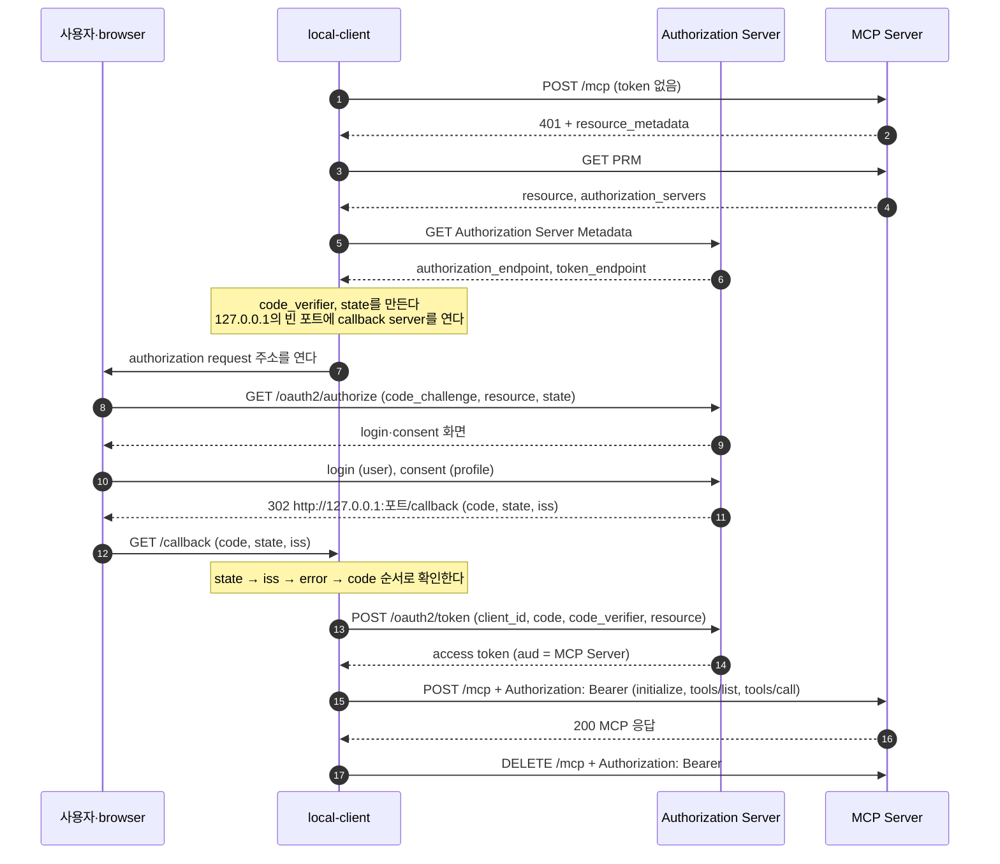

# 7. 로컬 MCP client — 사용자 기기의 앱은 원격 MCP Server에 어떻게 붙나

## 7.1 로컬 client의 필요성

MCP를 쓰는 가장 흔한 모습은 사용자가 자기 기기의 앱에 원격 MCP Server 주소를 넣는 것이다.
Claude Desktop, Cursor, Claude Code가 그런 앱이다.
주소를 받은 앱은 3~6장의 흐름을 혼자 모두 밟는다.
discovery로 Authorization Server를 찾고, 사용자의 login과 consent를 거쳐 token을 받은 뒤, 그 token으로 MCP Server를 부른다.

이런 앱은 서버에서 도는 agent와 세 가지가 다르다.

| 다른 점 | 서버에서 도는 agent | 사용자 기기의 앱 |
|---|---|---|
| 비밀 | `client_secret`을 서버 설정에 둔다 | 배포 파일에 비밀을 둘 수 없어서 public client다(2장) |
| browser | browser의 요청에 `302`로 답해 Authorization Server로 보낸다 | browser가 같은 기기에 있어서, 앱이 운영체제에 browser를 열어 달라고 한다 |
| callback | agent 서버가 callback 주소를 늘 열어 둔다 | 앱에는 늘 열린 서버가 없다. 실행 중에 `127.0.0.1`에 작은 서버를 잠깐 연다 |

비밀이 없는 자리는 PKCE와 매번 받는 consent가 채운다(4·5장).

official의 `local-client`는 이런 앱을 흉내 낸 명령줄 앱이다.
Spring Boot 없이 Java 21과 MCP Java SDK만 쓴다.
한 클래스가 한 단계를 맡는다.
3장의 discovery, 5장의 authorization request와 token request, 6장의 MCP 호출이 이 앱 하나에 모두 들어 있다.
이 장에서는 `local-client`의 클래스를 단계 순서로 읽고, 직접 돌려 본다.
단계를 차례로 부르는 `Main#run`은 [2장](02-why-oauth.md)의 2.8에 있다.

## 7.2 전체 흐름: 시퀀스 다이어그램



[다이어그램 그림으로 보기](diagrams/07-local-client-1.png)

| 단계 | 메시지 | 맡는 클래스 | 규칙을 다룬 장 |
|---|---|---|---|
| 1단계: discovery | (1)~(6) | `Discovery` | [3장](03-discovery.md) |
| 2단계: callback server 열기 | (7) 전 | `LoopbackCallbackServer` | [4장](04-client-registration.md) |
| 3단계: authorization request | (7)(8) | `Pkce`, `AuthorizationRequest`, `Browser` | [5장](05-authorization-and-token.md) |
| login·consent | (9)(10) | 사용자와 Authorization Server | [5장](05-authorization-and-token.md) |
| 4단계: callback 확인 | (11)(12) | `LoopbackCallbackServer`, `AuthorizationResponse` | [5장](05-authorization-and-token.md) |
| 5단계: token request | (13)(14) | `TokenClient` | [5장](05-authorization-and-token.md) |
| 6단계: MCP 호출 | (15)~(17) | `McpCalls` | [6장](06-mcp-call-and-validation.md) |

클래스는 모두 `practice/mcp-security-authn-official/local-client/src/main/java/dev/starryeye/localclient/`에 있다.
아래 인용은 흐름을 가리는 부분을 `/* ... */`로 줄였다.

## 7.3 1단계: discovery — `Discovery`

`local-client`가 미리 아는 것은 세 가지뿐이다.
MCP Server 주소(`--resource`), 자기 `client_id`인 `local-mcp-client`, 그 `client_id`가 등록된 issuer(`--issuer`)다.
Authorization Server의 endpoint는 3장의 순서대로 알아낸다.

```java
public AuthorizationServer discover(String resourceUrl, String trustedIssuer) {
    /* try-catch 생략 */
    // (1)~(4) 401의 resource_metadata → PRM. PRM의 resource가 resourceUrl과 다르면 멈춘다
    Map<String, Object> prm = protectedResourceMetadata(resourceUrl);
    /* authorization_servers를 servers로 꺼낸다. 비어 있으면 멈춘다 */
    if (servers.stream().map(String::valueOf).noneMatch(trustedIssuer::equals)) {
        // 등록된 issuer가 목록에 없으면 metadata도 요청하지 않는다
        throw new LocalClientException("이 client는 %s에 등록돼 있는데, PRM의 authorization_servers는 %s뿐이다" /* ... */);
    }
    // (5)(6) RFC 8414 → OpenID Connect 순서로 metadata를 읽는다. issuer 일치와 S256을 확인한다
    Map<String, Object> metadata = authorizationServerMetadata(trustedIssuer);
    return new AuthorizationServer((String) prm.get("resource"), trustedIssuer,
            requireEndpoint(metadata, "authorization_endpoint"),    // https, 개발용 loopback이면 http도
            requireEndpoint(metadata, "token_endpoint"),
            Boolean.TRUE.equals(metadata.get("authorization_response_iss_parameter_supported")));
}
```

확인하는 항목은 3장 3.6의 표와 같다.
PRM의 `resource`, metadata의 `issuer`, PKCE `S256` 지원, endpoint 주소의 형식을 본다.
하나라도 어긋나면 `LocalClientException`을 던지고, `Main`은 `실패:`로 시작하는 한 줄을 찍고 끝난다.

PRM의 `authorization_servers`에는 issuer가 여럿 있을 수 있다.
`local-client`는 목록의 순서와 상관없이 자기가 등록된 issuer를 찾는다.
`local-client`에는 지킬 비밀이 없지만, 이 확인은 그래도 필요하다.
`local-mcp-client`는 `http://localhost:9010`에만 등록된 `client_id`라서, 다른 Authorization Server에서는 쓸 수 없다(4장).
또 PRM을 조작한 MCP Server가 사용자의 browser를 자기가 고른 login 화면으로 보내는 일도 막는다.

## 7.4 2단계: callback server를 연다 — `LoopbackCallbackServer`

authorization code는 browser의 redirect를 타고 돌아온다.
agent는 자기 서버의 주소로 이 redirect를 받는다.
명령줄 앱에는 그런 주소가 없으므로, 이 기기 안에 작은 HTTP 서버를 연다.
RFC 8252가 정한 loopback redirect다.

```java
public static LoopbackCallbackServer start() throws IOException {
    // 127.0.0.1에만 bind한다. 포트 0은 운영체제가 빈 포트를 골라 달라는 뜻이다
    return new LoopbackCallbackServer(
            HttpServer.create(new InetSocketAddress(InetAddress.getByName("127.0.0.1"), 0), 0));
}

public URI redirectUri() {
    // PATH는 "/callback"
    return URI.create("http://127.0.0.1:" + this.server.getAddress().getPort() + PATH);
}

private void handle(HttpExchange exchange) throws IOException {
    /* path가 정확히 /callback이 아니면 404 */
    // 처음 온 callback의 query parameter만 결과로 쓴다
    boolean first = this.callback.complete(Form.decode(exchange.getRequestURI().getRawQuery()));
    /* browser에 "login이 끝났다. 이 창을 닫고 terminal로 돌아간다."를 보여 준다 */
}
```

포트를 정해 두지 않는 이유가 있다.
고정 포트는 다른 프로그램이 이미 쓰고 있을 수 있고, 그러면 callback server를 열 수 없다.
운영체제가 고른 빈 포트는 실행할 때마다 다르다.

그런데 `local-mcp-client`의 redirect URI는 `http://127.0.0.1:8123/callback`으로 등록돼 있다.
포트가 달라도 되는 이유는 Authorization Server가 loopback IP 주소(`127.x.x.x`, `[::1]`)의 redirect URI를 비교할 때 포트를 빼기 때문이다(4장).
scheme, host, path는 등록한 값과 정확히 같아야 한다.
Spring은 `localhost`라는 이름에는 이 예외를 두지 않으므로, `local-client`는 `127.0.0.1`을 쓴다.
`127.0.0.1`에만 bind하면 같은 네트워크의 다른 기기는 이 서버에 연결할 수 없다.

callback server는 처음 온 callback만 결과로 쓰고, browser가 함께 보내는 `/favicon.ico` 같은 요청에는 `404`로 답한다.
`Main`은 callback을 5분 동안 기다리고, 그 안에 login이 끝나지 않으면 멈춘다.

## 7.5 3단계: authorization request 주소를 만든다 — `AuthorizationRequest`

주소를 만들기 전에 `Main`은 요청 하나에만 쓸 값 두 개를 만든다.
`Pkce.generate()`는 `code_verifier`와 `code_challenge`를 만든다(코드는 5장).
`state`는 16 byte 난수를 base64url로 쓴 값이다.
두 값은 `Main`의 지역 변수로만 남고, 파일이나 다른 곳에 저장하지 않는다.

```java
public static URI uri(AuthorizationServer server, String clientId, URI redirectUri, String scope, String state,
        Pkce pkce) {
    Map<String, String> params = new LinkedHashMap<>();
    params.put("response_type", "code");
    params.put("client_id", clientId);                  // local-mcp-client
    params.put("redirect_uri", redirectUri.toString()); // http://127.0.0.1:빈 포트/callback
    params.put("scope", scope);                         // openid profile
    params.put("state", state);
    params.put("code_challenge", pkce.challenge());     // code_verifier는 보내지 않는다
    params.put("code_challenge_method", "S256");
    params.put("resource", server.resource());          // PRM의 resource
    /* authorization_endpoint 뒤에 query string으로 붙인다 */
}
```

parameter의 뜻은 5장과 같다.
같은 기기의 다른 프로그램이 loopback redirect의 code를 가로채도, `code_verifier`가 없으므로 token으로 바꾸지 못한다(5장).

**scope**

`scope`는 `Main`에 상수로 정해 두었다.

```java
/** public client는 openid 말고 consent할 scope가 하나는 있어야 한다. */
static final String SCOPE = "openid profile";
```

MCP client가 scope를 고르는 순서는 [5장](05-authorization-and-token.md)에서 봤다.
official의 MCP Server는 scope를 알려 주지 않으므로, 그 순서를 따르면 `local-client`는 `scope` 없이 요청하게 된다.
그런데 official의 Authorization Server에서는 `PublicClientScopeValidator`가 `openid` 말고 consent할 scope가 없는 public client의 요청을 `invalid_scope`로 거절한다(5장).
그래서 `local-client`는 이 순서를 따르지 않고 `openid profile`을 보낸다.
MCP Server가 `scope`나 `scopes_supported`를 알려 주면, client는 그 값을 쓰면 된다.

**browser 열기**

`Browser.open`은 `java.awt.Desktop`의 `browse`로 운영체제의 기본 browser를 연다.
앱 안에 login 화면을 직접 그리지 않는 데는 이유가 있다.
앱이 그린 화면이라면 앱은 사용자가 입력하는 password를 볼 수 있다.
사용자도 주소창을 볼 수 없어서, 진짜 Authorization Server의 화면인지 알 수 없다.
기본 browser로 열면 password는 Authorization Server에만 가고, browser에 남은 login session도 그대로 쓴다.

`local-client`는 browser를 열기 전에 주소를 terminal에도 찍는다.
browser를 열 수 없는 환경이면, 사용자가 그 주소를 같은 기기의 browser에 붙여 넣는다.
callback이 `127.0.0.1`로 오므로, browser는 `local-client`와 같은 기기에 있어야 한다.

## 7.6 4단계: callback을 확인한다 — `AuthorizationResponse`

사용자가 login과 consent를 마치면 browser는 callback 주소로 redirect된다.
`LoopbackCallbackServer`가 받은 query parameter를 `AuthorizationResponse`가 확인하고, 그다음에야 code를 꺼낸다.

```java
public static String code(Map<String, String> params, String expectedState, AuthorizationServer server) {
    // 1. state: 내가 보낸 요청의 응답인가
    if (!expectedState.equals(params.get("state"))) {
        throw new LocalClientException("callback의 state가 보낸 값과 다르다. 다른 요청의 응답이다");
    }
    // 2. iss: 요청을 보낸 Authorization Server의 응답인가. metadata가 iss를 알렸는데 없어도 멈춘다
    String iss = params.get("iss");
    if (iss != null ? !iss.equals(server.issuer()) : server.issParameterSupported()) {
        throw new LocalClientException(/* ... */);
    }
    // 3. error: 앞의 두 확인을 지난 오류만 사용자에게 보여 준다
    String error = params.get("error");
    if (error != null) {
        throw new LocalClientException(/* "Authorization Server가 거절했다: " + error, error_description */);
    }
    // 4. code
    String code = params.get("code");
    /* code가 없거나 비었으면 멈춘다 */
    return code;
}
```

순서와 이유는 5장에서 본 그대로다.
`iss`는 `String.equals`로 글자 그대로 비교한다.
`error`를 `iss`보다 뒤에 보는 것은, 다른 Authorization Server에서 온 오류의 `error_description`이 공격자가 써 넣은 문구일 수 있기 때문이다.

`local-client`는 한 번에 요청 하나만 보내므로, 요청 기록을 따로 저장하지 않고 `state`와 issuer를 메서드 인자로 넘긴다.

## 7.7 5단계: token request — `TokenClient`

확인을 마친 code를 token endpoint에서 access token으로 바꾼다.

```java
public TokenResponse exchange(AuthorizationServer server, String clientId, String code, URI redirectUri, Pkce pkce) {
    Map<String, String> form = new LinkedHashMap<>();
    form.put("grant_type", "authorization_code");
    form.put("code", code);
    form.put("redirect_uri", redirectUri.toString()); // authorization request와 같은 주소
    form.put("client_id", clientId);                  // 비밀 대신 client_id만
    form.put("code_verifier", pkce.verifier());       // 이 code를 요청한 client임을 증명한다
    form.put("resource", server.resource());          // token의 aud가 MCP Server가 된다

    // Authorization header 없이 보낸다
    HttpResponse<String> response = Http.send(this.http, HttpRequest.newBuilder(URI.create(server.tokenEndpoint()))
            .header("Content-Type", "application/x-www-form-urlencoded")
            /* ... */
            .POST(HttpRequest.BodyPublishers.ofString(Form.encode(form)))
            .build());
    /* 200이 아니면 상태 코드와 error를 알린다 */
    /* 200이면 Bearer access_token과 expires_in을 꺼낸다 */
}
```

confidential client인 `shop-agent`는 `Authorization: Basic` header로 `client_secret`을 보낸다(5장).
`local-client`의 요청에는 그 header가 없다.
`local-mcp-client`는 인증 방식 `none`으로 등록돼 있어서, Authorization Server는 비밀 대신 `code_verifier`가 `code_challenge`와 맞는지 본다.
보내는 parameter는 5장의 public client token request와 같다.

응답에는 `refresh_token`이 없다(4장).
`TokenResponse`는 access token과 `expires_in` 두 값만 가진다.

## 7.8 6단계: MCP 호출 — `McpCalls`

마지막으로 MCP Java SDK의 client로 MCP Server를 부른다.

```java
public static void run(String resourceUrl, String accessToken, PrintStream out) {
    URI uri = URI.create(resourceUrl);
    HttpClientStreamableHttpTransport transport = HttpClientStreamableHttpTransport
            .builder(uri.getScheme() + "://" + uri.getRawAuthority())   // http://localhost:8111
            .endpoint(uri.getRawPath())                                  // /mcp
            // 기본 요청에 Authorization header를 한 번 넣는다
            .requestBuilder(HttpRequest.newBuilder().header("Authorization", "Bearer " + accessToken))
            .build();
    McpSyncClient client = McpClient.sync(transport) /* clientInfo, requestTimeout */ .build();
    try {
        McpSchema.InitializeResult initialized = client.initialize();  // initialize, notifications/initialized
        /* protocolVersion과 서버 이름을 찍는다 */
        client.listTools().tools().forEach(/* tool 이름을 찍는다 */);    // tools/list
        McpSchema.CallToolResult result = client.callTool(              // tools/call
                McpSchema.CallToolRequest.builder("getStock").arguments(Map.of("productId", "p1")).build());
        /* 결과를 찍는다 */
    }
    /* catch: SDK의 오류를 LocalClientException으로 바꾼다 */
    finally {
        client.closeGracefully();                                       // session을 끝내는 DELETE
    }
}
```

`local-client`는 사용자 한 명이 쓰고, 한 번 실행하는 동안 token도 하나다.
그래서 agent처럼 요청마다 사용자의 token을 골라 붙이는 customizer가 필요 없다(6장).

transport는 요청을 보낼 때마다 이 기본 요청을 복사하고, 그 위에 `Mcp-Session-Id`·`MCP-Protocol-Version` header와 본문을 더한다.
그래서 모든 요청에 같은 `Authorization` header가 붙는다.
`initialize`부터 `tools/call`까지의 `POST`, SSE stream을 여는 `GET`, `closeGracefully`가 보내는 `DELETE`가 모두 그렇다.
MCP Server는 session을 끝내는 `DELETE`의 token도 검사하므로, 이 요청에 token이 없으면 `401`을 받는다.

## 7.9 실행해 보기

**서버 띄우기**

`local-client`에게는 `auth-server`와 `shop-mcp-server`만 있으면 된다.
`run.sh`는 official의 세 앱을 모두 띄운다.

```bash
# 저장소 최상위 폴더에서
cd practice/mcp-security-authn-official
./run.sh
```

`run.sh`는 `shop-agent`가 쓸 ollama와 `qwen3:8b` 모델도 준비한다.
두 서버만 띄우려면 terminal 두 개에서 `practice/mcp-security-authn-official/auth-server`와 `practice/mcp-security-authn-official/shop-mcp-server`로 가서 각각 `./gradlew bootRun`을 실행한다.
`run.sh`는 Java 21을 스스로 찾지만, `./gradlew bootRun`과 아래의 `./gradlew run`은 `JAVA_HOME`이 Java 21을 가리켜야 돈다.

**`local-client` 실행**

```bash
# 저장소 최상위 폴더에서
cd practice/mcp-security-authn-official/local-client
./gradlew run
```

browser가 열리면 다음 순서로 진행한다.

1. Authorization Server의 login 화면(`http://localhost:9010/login`)에서 `user`/`password`로 login한다.
2. consent 화면에서 `profile`을 고르고 제출한다.
3. browser에 `login이 끝났다. 이 창을 닫고 terminal로 돌아간다.`가 나온다. 이 글은 `local-client`의 callback server가 보여 준다.

terminal에는 다음이 나온다.
아래 출력은 browser 대신 curl이 login과 consent를 하는 스크립트 `docs/superpowers/captures/local-client-run.sh`로 받았다.
이 스크립트는 `local-client`를 `--no-browser`로 돌린다.
사람이 browser로 login해도 출력은 같다.
`./gradlew -q run`으로 실행하면 Gradle의 진행 메시지 없이 이 출력만 보인다.

```text
[1] discovery: http://localhost:8111/mcp
    Authorization Server: http://localhost:9010
[2] browser에서 login과 consent를 한다
    http://localhost:9010/oauth2/authorize?response_type=code&client_id=local-mcp-client&redirect_uri=http%3A%2F%2F127.0.0.1%3A59597%2Fcallback&scope=openid+profile&state=...&code_challenge=...&code_challenge_method=S256&resource=http%3A%2F%2Flocalhost%3A8111%2Fmcp
[3] callback으로 authorization code를 받았다: http://127.0.0.1:59597/callback
[4] client_secret 없이 access token을 받았다(299초 뒤 만료)
[5] MCP 호출
    initialize: protocolVersion=2025-11-25, server=official-shop-mcp-server
    tool: getStock
    tool: searchProducts
    getStock(p1): 상품 p1 (게이밍 노트북 15인치) 의 현재 재고는 7개입니다.
```

| 줄 | 볼 곳 |
|---|---|
| `[2]` | 7.5의 authorization request 주소다. `state`와 `code_challenge`는 캡처 스크립트가 `...`로 줄였고, 실제로는 전체 값이 나온다 |
| `[3]` | callback을 받은 주소다. 포트 `59597`은 운영체제가 고른 값이라 실행마다 다르다 |
| `[4]` | token 응답의 `expires_in`이다. refresh token이 없으므로 만료 뒤에는 처음부터 다시 실행한다 |

`run.sh`로 띄웠다면 `practice/mcp-security-authn-official/logs/shop-mcp-server.log`에 `getStock 호출 (productId=p1, 사용자=user)`가 남는다.
MCP Server가 보는 사용자는 `local-client`가 아니라 token의 `sub`, 곧 login한 `user`다.

**인자**

| 인자 | 기본값 | 뜻 |
|---|---|---|
| `--resource` | `http://localhost:8111/mcp` | MCP Server 주소. discovery의 출발점이다 |
| `--issuer` | `http://localhost:9010` | `local-mcp-client`가 등록된 issuer. PRM의 `authorization_servers`에 이 값이 있어야 한다 |
| `--no-browser` | 없음(browser를 연다) | browser를 열지 않고 `[2]`의 주소만 찍는다 |

```bash
# browser를 열지 않는다. [2]의 주소를 같은 기기의 browser에 붙여 넣는다
./gradlew run --args="--no-browser"

# 등록되지 않은 issuer를 믿게 하면 discovery에서 멈춘다
./gradlew run --args="--issuer http://localhost:9999"
```

**멈추는 경우**

`local-client`는 어느 단계에서든 어긋나면 `실패:`로 시작하는 한 줄을 찍고 끝난다.
그 뒤에 Gradle이 `FAILURE: Build failed with an exception.`으로 시작하는 안내를 덧붙인다.
앱이 종료 코드 1로 끝났다는 뜻이다.

| 상황 | terminal에 나오는 줄 |
|---|---|
| MCP Server가 꺼져 있다 | `실패: http://localhost:8111/mcp에 연결하지 못했다` |
| `--issuer`가 PRM의 issuer와 다르다 | `실패: 이 client는 http://localhost:9999에 등록돼 있는데, PRM의 authorization_servers는 [http://localhost:9010]뿐이다` |
| consent 화면에서 `profile`을 고르지 않고 제출했다 | `실패: Authorization Server가 거절했다: access_denied OAuth 2.0 Parameter: client_id` |
| 5분 안에 login을 마치지 않았다 | `실패: 300초 안에 login이 끝나지 않았다` |

## 7.10 실제 앱이 더 하는 것

`local-client`는 흐름을 한 번 보여 주려는 앱이라서, 실제 앱이 하는 일 몇 가지를 하지 않는다.
scope를 5장의 순서로 고르고 `403 insufficient_scope`에 step-up으로 답하는 것(6장) 말고도 네 가지가 있다.

**token 보관**

`local-client`는 token을 메모리에만 두고, 끝나면 버린다.
access token은 가진 사람이면 누구든 쓸 수 있다(6장).
평문 파일에 두면 같은 기기의 다른 프로그램이 읽어 갈 수 있다.
그래서 실제 앱은 macOS의 Keychain이나 Windows의 Credential Manager 같은 운영체제의 비밀 저장소에 token을 둔다.
token의 `aud`가 MCP Server마다 다르므로, token도 MCP Server마다 따로 둔다.

**만료 뒤 다시 login**

`local-client`는 token이 만료되기 전에 할 일을 마치고 끝난다.
실제 앱은 MCP Server에서 `401 invalid_token`을 받으면 새 token을 받는다.
refresh token이 없으면 authorization request부터 다시 한다.
official의 Authorization Server가 그런 경우로, public client에 refresh token을 주지 않는다(4장).
browser에 Authorization Server의 login session이 남아 있으면, login 화면 없이 consent 화면이 바로 나온다.
public client에도 refresh token을 주는 Authorization Server라면, 앱은 refresh token으로 새 token을 받고 refresh token도 비밀 저장소에 둔다.

**CIMD로 정하는 `client_id`**

`local-mcp-client`는 official의 Authorization Server 한 곳에 미리 등록한 `client_id`다.
Claude Desktop 같은 앱은 사용자가 어떤 MCP Server를 넣을지 모르므로, Authorization Server마다 미리 등록해 둘 수 없다.
그래서 앱의 metadata 문서를 자기 `https` 주소에 올리고, CIMD를 지원하는 Authorization Server에서는 그 주소를 `client_id`로 쓴다(4장).
문서의 `redirect_uris`에는 `local-client`처럼 loopback 주소를 적는다.

**issuer별 등록 상태**

`local-client`는 issuer 하나(`--issuer`)만 안다.
실제 앱은 CIMD를 지원하지 않는 Authorization Server에서 DCR로 `client_id`를 받는다.
그 `client_id`는 발급한 issuer에서만 쓸 수 있으므로, 앱은 등록 결과를 issuer를 key로 저장한다.
PRM이 저장된 것과 다른 issuer를 가리키면, 저장된 `client_id`를 그 issuer에 보내지 않는다(4장).

## 7.11 정리

- 사용자 기기의 MCP client는 비밀이 없는 public client다. 기본 browser를 열고, `127.0.0.1`의 빈 포트에 연 callback server로 code를 받는다.
- `local-client`에서는 클래스 하나가 한 단계씩 맡아, 3·5·6장의 흐름을 차례로 밟는다: discovery → callback server → authorization request → callback 확인 → token request → MCP 호출.
- token request에는 `client_secret` 대신 `client_id`와 `code_verifier`를 넣는다. MCP 요청에는 transport의 기본 요청에 넣은 `Authorization` header가 `DELETE`까지 모두 붙는다.
- official은 scope를 알려 주지 않으므로, `local-client`는 consent할 scope로 `profile`을 정해 보낸다.
- 실제 앱은 여기에 더해 token을 운영체제의 비밀 저장소에 두고, CIMD로 `client_id`를 정하고, 등록 상태를 issuer별로 나눠 둔다.

## 7.12 명세 근거

| 내용 | 명세 | 요구 수준 |
|---|---|---|
| 기기별 비밀이 없는 native app은 public client로 등록하고, Authorization Server는 client 종류를 기록한다. 배포 파일에 넣은 공유 비밀로 native app을 인증하게 하는 것은 권하지 않는다 | [OAuth 2.1 §8.1](https://datatracker.ietf.org/doc/html/draft-ietf-oauth-v2-1-13#section-8.1), [§8.1.1](https://datatracker.ietf.org/doc/html/draft-ietf-oauth-v2-1-13#section-8.1.1), [RFC 8252 §8.4](https://www.rfc-editor.org/rfc/rfc8252#section-8.4), [§8.5](https://www.rfc-editor.org/rfc/rfc8252#section-8.5) | MUST, NOT RECOMMENDED |
| native app은 authorization request를 앱 밖의 user agent로 연다. 권하는 user agent는 browser다 | [OAuth 2.1 §8.2](https://datatracker.ietf.org/doc/html/draft-ietf-oauth-v2-1-13#section-8.2), [§8.3](https://datatracker.ietf.org/doc/html/draft-ietf-oauth-v2-1-13#section-8.3), [RFC 8252 §6](https://www.rfc-editor.org/rfc/rfc8252#section-6) | MUST, RECOMMENDED |
| loopback redirect URI는 `http://127.0.0.1:{port}/{path}` 형식이고, Authorization Server는 요청의 어느 포트든 받는다. 포트 말고는 등록한 값과 정확히 같아야 하고, 이름 `localhost`는 권하지 않는다 | [RFC 8252 §7.3](https://www.rfc-editor.org/rfc/rfc8252#section-7.3), [§8.3](https://www.rfc-editor.org/rfc/rfc8252#section-8.3), [§8.4](https://www.rfc-editor.org/rfc/rfc8252#section-8.4), [OAuth 2.1 §8.4.2](https://datatracker.ietf.org/doc/html/draft-ietf-oauth-v2-1-13#section-8.4.2) | MUST, NOT RECOMMENDED |
| public native app은 PKCE를 쓰고, Authorization Server는 PKCE를 지원한다. PKCE 없는 native app의 요청은 거절한다 | [RFC 8252 §6](https://www.rfc-editor.org/rfc/rfc8252#section-6), [§8.1](https://www.rfc-editor.org/rfc/rfc8252#section-8.1), [RFC 7636 §4.1](https://www.rfc-editor.org/rfc/rfc7636#section-4.1), [§4.2](https://www.rfc-editor.org/rfc/rfc7636#section-4.2) | MUST, SHOULD |
| 인증하지 않는 client는 token request에 `client_id`를 넣고, `code_challenge`를 보냈으면 `code_verifier`도 넣는다 | [OAuth 2.1 §4.1.3](https://datatracker.ietf.org/doc/html/draft-ietf-oauth-v2-1-13#section-4.1.3) | REQUIRED |
| scope는 `401`의 `scope` → PRM의 `scopes_supported` 순서로 고르고, 둘 다 없으면 `scope` parameter를 뺀다 | [MCP 2025-11-25 Authorization — Scope Selection Strategy](https://modelcontextprotocol.io/specification/2025-11-25/basic/authorization#scope-selection-strategy) | SHOULD |
| client는 MCP Server로 가는 모든 HTTP 요청의 `Authorization` header에 access token을 넣는다 | [MCP 2025-11-25 Authorization — Token Requirements](https://modelcontextprotocol.io/specification/2025-11-25/basic/authorization#token-requirements) | MUST |
| client는 token을 안전하게 저장한다. refresh token이 발급된다고 가정하지 않고, 받았다면 저장할 때도 비밀로 지킨다 | [MCP 2025-11-25 Authorization — Token Theft](https://modelcontextprotocol.io/specification/2025-11-25/basic/authorization#token-theft), [MCP 2026-07-28 Authorization — Refresh Tokens](https://modelcontextprotocol.io/specification/2026-07-28/basic/authorization#refresh-tokens) | MUST, MUST NOT |
| client는 CIMD를 지원한다. 미리 등록했거나 DCR로 받은 credentials는 발급한 Authorization Server의 `issuer`에 묶고, 다른 서버에 쓰지 않는다 | [MCP 2025-11-25 Authorization — Client ID Metadata Documents](https://modelcontextprotocol.io/specification/2025-11-25/basic/authorization#client-id-metadata-documents), [MCP 2026-07-28 Client Registration — Authorization Server Binding](https://modelcontextprotocol.io/specification/2026-07-28/basic/authorization/client-registration#authorization-server-binding) | SHOULD, MUST, MUST NOT |

[← 6장](06-mcp-call-and-validation.md) · [목차](README.md) · [8장 →](08-security.md)
