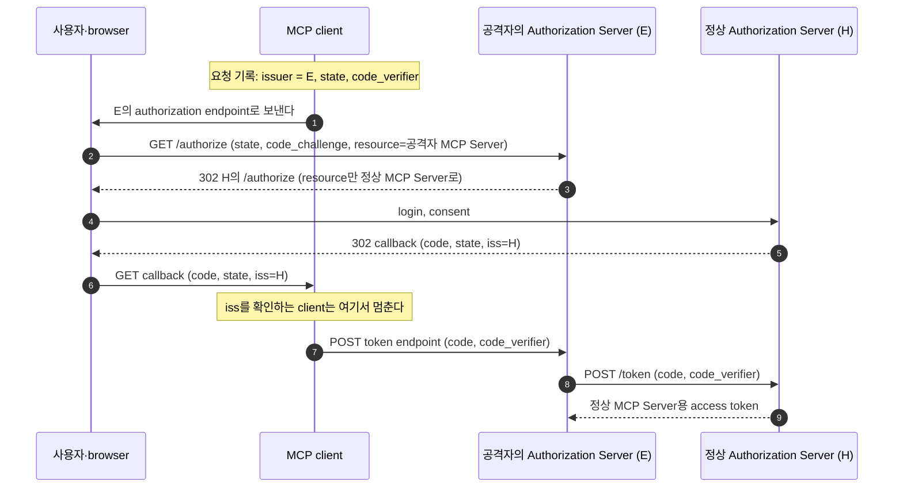

# 8. 보안 — 공격자는 어디를 노리고, 무엇이 막나

## 8.1 공격자의 자리에서 다시 보기

3~7장은 정상 흐름을 따라가며 단계마다 무엇을 확인하는지 봤다.
이 장은 같은 흐름을 공격자 쪽에서 본다.
확인 하나가 빠지면 누가 무엇을 얻는지 보면, 그 확인이 왜 있는지 분명해진다.

공격자가 서는 자리는 다섯 가지다.
악성 MCP Server, 사용자가 여는 악성 링크나 web page, 같은 기기의 다른 프로그램, 네트워크 경로, 그리고 새어 나간 token이나 session ID를 가진 사람이다.
막는 장치는 모두 앞 장에서 설명했으므로, 여기서는 그 장으로 가는 링크만 둔다.

| 절 | 공격 | 공격자 | 막는 것 |
|---|---|---|---|
| 8.2 | discovery SSRF, 위험한 주소 | 악성 MCP Server | issuer를 먼저 비교, endpoint 주소 확인 |
| 8.3 | redirect URI 바꿔치기, code 가로채기 | 악성 링크, 같은 기기의 프로그램 | redirect URI 정확 비교, PKCE `S256` |
| 8.4 | public client 사칭 | 같은 기기의 프로그램 | 매번 받는 consent |
| 8.5 | mix-up | 악성 MCP Server | callback의 `iss` 확인 |
| 8.6 | confused deputy (OAuth proxy) | 악성 링크 | proxy가 client마다 받는 consent |
| 8.6 | 다른 MCP Server용 token | 악성 MCP Server | `resource`와 `aud` |
| 8.7 | token passthrough | 새어 나간 token을 가진 사람 | 자기용 token만 받기 |
| 8.8 | DNS rebinding, 같은 네트워크, 도청 | 악성 web page, 네트워크 경로 | `Origin`·`Host`, `127.0.0.1` bind, HTTPS |
| 8.9 | session hijacking | 새어 나간 session ID를 가진 사람 | 요청마다 token 검사 |

## 8.2 Discovery SSRF와 위험한 authorization 주소

**공격**

discovery에서 client가 여는 주소는 `401`의 `resource_metadata`, PRM의 `authorization_servers`, Authorization Server Metadata의 endpoint다([3장](03-discovery.md)).
모두 MCP Server가 알려 준 값이라, 악성 MCP Server는 이 자리에 내부망 주소를 넣을 수 있다.

```json
{
  "resource": "https://mcp.example.com/mcp",
  "authorization_servers": ["http://169.254.169.254"]
}
```

`169.254.169.254`는 cloud 서버 안에서만 닿는 주소이고, 여기에는 그 서버의 credentials를 돌려주는 서비스가 있다.
client가 이 issuer의 metadata를 찾으면, 밖에서는 닿지 않는 이 주소로 요청이 나간다.
응답이나 오류 메시지가 공격자에게 돌아가면, 내부망의 구조나 그 서비스가 가진 정보가 새어 나간다.
이렇게 서버가 공격자 대신 요청을 보내게 만드는 공격이 SSRF(Server-Side Request Forgery)다.
SSRF는 서버에서 도는 client의 문제라서, official에서는 `shop-agent`가 이 공격의 대상이다.

`authorization_endpoint`가 `javascript:` 주소이면, 사용자 기기의 client가 그 주소를 여는 순간 공격자의 script가 돈다.

**막는 것**

agent는 PRM이 알려 준 issuer가 credentials를 발급한 issuer와 같은지 먼저 보고, 다르면 metadata도 요청하지 않는다([3장](03-discovery.md)).
위 PRM의 `http://169.254.169.254`는 credentials를 발급한 issuer가 아니므로, 그 주소로는 요청이 나가지 않는다.
metadata의 두 endpoint는 `https`이거나 loopback 주소의 `http`여야 해서, `javascript:`·`file:` 같은 주소가 오면 여기서 멈춘다.
`401`의 `resource_metadata`는 issuer를 비교하기 전에 요청하는 주소다.
이 주소는 사설 IP 차단과 egress proxy가 막고, official에는 둘 다 없다(8.10).

**official에서**

`McpAuthorizationDiscovery#discover`는 issuer를 비교한 뒤에야 metadata를 요청한다.
endpoint 주소는 `requireHttpUrl`이 확인한다.
`local-client`의 `Discovery`도 같은 순서로 확인한다([7장](07-local-client.md)).

## 8.3 Redirect URI 바꿔치기와 authorization code 가로채기

**공격**

공격자는 `client_id=local-mcp-client`와 자기 주소 `redirect_uri=http://evil.example/callback`을 넣은 authorization request 링크를 사용자에게 보낸다.
링크의 `code_challenge`는 공격자가 만든 값이라, 짝이 되는 `code_verifier`도 공격자에게 있다.
Authorization Server가 이 주소를 믿으면, 사용자가 login과 consent를 마친 뒤 code는 공격자에게 간다.
public client에는 비밀이 없으므로, 공격자는 그 code로 사용자의 token을 받는다.

redirect URI가 맞아도 code가 샐 수 있다.
loopback callback으로 오는 code는 같은 기기의 다른 프로그램이 가로챌 수 있고, redirect 주소는 browser 기록과 로그에도 남는다.

**막는 것**

Authorization Server는 `redirect_uri`를 등록한 값과 글자 그대로 비교하고, 다르면 그 주소로 redirect하지 않는다([4장](04-client-registration.md)).
loopback IP 주소만은 포트를 빼고 비교한다([4장](04-client-registration.md)).
8.4의 사칭은 이 포트 예외를 이용한다.

새어 나간 code는 PKCE가 막는다.
token request에는 요청을 시작한 client만 가진 `code_verifier`가 있어야 하기 때문이다([5장](05-authorization-and-token.md)).

**official에서**

`redirect_uri` 비교는 Spring의 `OAuth2AuthorizationCodeRequestAuthenticationValidator`가 `application.yml`의 `redirect-uris`로 한다.
두 client 모두 `require-proof-key: true`여서, `code_challenge`가 없는 요청은 `invalid_request`로 거절된다.
`shop-agent`는 `withPkce()`로, `local-client`는 `Pkce`로 `S256` 값을 만든다.

## 8.4 Public client 사칭

**공격**

같은 기기의 악성 프로그램이 `client_id=local-mcp-client`와 자기가 연 loopback 포트로 authorization request를 연다.
Authorization Server가 사용자의 예전 consent를 기억하면, 프로그램은 사용자 모르게 token을 받는다.
PKCE로도 막지 못하는 이유는 [4장](04-client-registration.md)에 있다.

**막는 것**

public client의 요청에는 매번 consent를 받는다([5장](05-authorization-and-token.md)).
사용자는 자기가 시작하지 않은 consent 화면을 보고 거절할 수 있다.

**official에서**

`local-mcp-client`는 `require-authorization-consent: true`로 등록되어 있다.
Spring이 consent를 건너뛰는 두 경우는 `PublicClientConsentService`와 `PublicClientScopeValidator`가 막는다([5장](05-authorization-and-token.md)).

## 8.5 Mix-up

**공격**

mix-up이 생기는 이유는 [5장](05-authorization-and-token.md)에서 봤다.

사용자가 client에 정상 MCP Server와 공격자의 MCP Server를 함께 넣어 두었다고 해 보자.
공격자 MCP Server의 PRM은 공격자의 Authorization Server(그림의 E)를, 정상 MCP Server의 PRM은 정상 Authorization Server(그림의 H)를 가리킨다.
client는 두 Authorization Server에서 같은 `client_id`를 쓰는 public client다.
CIMD의 `client_id`가 그렇다([4장](04-client-registration.md)).



[다이어그램 그림으로 보기](diagrams/08-security-1.png)

1. client는 E와 흐름을 시작하고, E의 issuer를 요청 기록에 남긴다 (1)(2).
2. E는 `resource`만 정상 MCP Server로 고치고, 나머지 parameter는 그대로 둔 채 browser를 H로 보낸다 (3).
3. 사용자는 진짜 H의 화면에서 consent하고, H는 code를 client의 callback으로 보낸다 (4)~(6).
4. client는 이 응답을 E의 응답으로 알고, code와 `code_verifier`를 E의 token endpoint로 보낸다 (7).
5. 공격자는 그 둘로 H에서 정상 MCP Server용 token을 받는다 (8)(9).

`state`는 client가 만든 값이 그대로 돌아오므로 맞는다.
PKCE도 막지 못한다.
client가 `code_verifier`를 E에게 직접 보내기 때문이다.

**막는 것**

Authorization Server는 callback에 자기 issuer를 `iss`로 넣는다.
client는 code를 보내기 전에 `iss`를 요청 기록의 issuer와 비교한다([5장](05-authorization-and-token.md)).
(6)의 `iss`는 H인데 기록은 E이므로, client는 code를 어느 token endpoint로도 보내지 않는다.

**official에서**

`auth-server`의 `IssuerIdentifyingAuthorizationResponseHandler`는 성공과 오류 redirect 모두에 `iss`를 붙인다.
`shop-agent`에서는 `AuthorizationResponseIssuerFilter`가, `local-client`에서는 `AuthorizationResponse#code`가 `iss`를 확인한다.
official의 두 client는 한 Authorization Server에만 등록되어 있어서, PRM이 다른 곳을 가리키면 discovery에서 먼저 멈춘다([4장](04-client-registration.md)).
`iss` 확인은 client가 여러 Authorization Server를 쓸 때도 통한다.

## 8.6 Confused deputy와 다른 MCP Server용 token

confused deputy는 남의 권한을 확인 없이 대신 행사하게 되는 프로그램을 말한다.
MCP 명세가 이 이름으로 설명하는 공격은 OAuth proxy인 MCP Server의 경우다.
한 MCP Server용 token이 다른 MCP Server에서 쓰이는 경우는 이와 다른 공격이고, `resource`와 `aud`가 막는다.

**공격: OAuth proxy인 MCP Server의 confused deputy**

이 공격은 MCP Server가 제3자 API 앞에 선 OAuth proxy일 때 생긴다.
proxy는 MCP client마다 DCR로 각자의 `client_id`를 준다.
그런데 제3자 Authorization Server에는 고정된 `client_id` 하나로만 등록되어 있다.
그래서 어느 MCP client의 요청이든, 제3자 Authorization Server에는 같은 proxy의 요청으로 보인다.
사용자가 한 번 consent하면, 제3자 Authorization Server는 proxy의 `client_id`에 대한 consent cookie를 browser에 남긴다.
공격자는 자기 redirect URI로 proxy에 DCR 등록을 하고, 그 `client_id`로 만든 authorization 링크를 사용자에게 보낸다.
제3자 Authorization Server는 이 요청도 proxy의 요청으로 보고, cookie가 있으므로 consent 화면을 건너뛴다.
proxy는 이 결과로 만든 MCP authorization code를 공격자의 redirect URI로 보낸다.
공격자는 그 code를 token으로 바꿔, 사용자로서 MCP Server와 그 뒤의 제3자 API를 쓴다.

**막는 것**

제3자 Authorization Server는 MCP client를 구별하지 못하므로, 구별은 proxy가 해야 한다.
proxy는 제3자 Authorization Server로 보내기 전에, MCP client마다 자기 consent 화면을 보여 주고 허락을 받는다.

**official에서**

official에는 이 공격의 조건이 없다.
`shop-mcp-server`는 제3자 API를 부르지 않고 authorization endpoint도 없다.
`auth-server`는 DCR을 켜지 않는다.

**공격: 다른 MCP Server용 token**

한 Authorization Server가 MCP Server A와 B의 token을 모두 발급한다고 해 보자.
사용자가 A를 쓰려고 받은 token을, 악성이거나 공격당한 A가 그대로 들고 B를 부른다.
B가 signature와 `iss`만 본다면, 이 token은 같은 Authorization Server가 같은 사용자에게 발급한 진짜 token이라 통과한다.
A는 사용자가 허락한 적 없는 B의 tool을 사용자 이름으로 부른다.

**막는 것**

client는 token을 요청할 때 `resource`로 쓸 곳을 밝히고, Authorization Server는 그 값을 token의 `aud`에 넣는다([5장](05-authorization-and-token.md)).
MCP Server는 `aud`에 자기가 없는 token을 `401`로 거절하므로, A용 token은 B에서 통하지 않는다([6장](06-mcp-call-and-validation.md)).

**official에서**

agent의 `ResourceIndicators`가 authorization·token·refresh request에 `resource`를 넣는다.
`auth-server`의 `ResourceIndicatorValidator`는 모르는 `resource`를 `invalid_target`으로 거절한다.
`ResourceAudienceTokenCustomizer`는 `resource`를 access token의 `aud`에 넣는다.
MCP Server는 `audiences: http://localhost:8111/mcp` 설정으로 `aud`를 본다.

## 8.7 Token passthrough

**공격**

token passthrough는 MCP Server가 받은 token을 확인하지 않고 그대로 downstream API에 넘기는 구현이다.
사내망에만 열린 문서 API가 있고, 밖에서는 MCP Server를 거쳐야 그 API에 닿는다고 해 보자.
로그 등에서 문서 API용 token을 얻은 공격자는 그 token을 MCP Server에 보내기만 하면 된다.
MCP Server가 그 token을 붙여 사내망의 문서 API를 대신 불러 준다.

**막는 것**

MCP Server는 `aud`에 자기가 있는 token만 받는다([6장](06-mcp-call-and-validation.md)).
문서 API용 token은 `aud`가 문서 API라서 MCP Server에서 `401`로 끝난다.
downstream API를 불러야 하면, MCP Server는 그 API의 OAuth client가 되어 그 API용 token을 따로 받는다.
client도 그 MCP Server의 Authorization Server가 발급한 token만 보낸다.

**official에서**

`shop-mcp-server`는 downstream API를 부르지 않고, tool은 메모리에 든 `ProductRepository`만 읽는다.
agent의 `OAuth2TokenAttachingRequestCustomizer`는 요청을 일으킨 사용자가 `official-shop-agent`로 받은 access token만 붙인다.
그 token의 `aud`는 이 MCP Server다([6장](06-mcp-call-and-validation.md)).

## 8.8 전송 단계: DNS rebinding, 같은 네트워크, 도청

**공격**

사용자가 연 악성 web page는 DNS rebinding으로 browser를 거쳐 `localhost`의 MCP Server를 부른다([6장](06-mcp-call-and-validation.md)).
authorization 없이 도는 로컬 MCP Server라면, page의 script가 tool을 마음대로 부른다.
서버가 모든 network interface(`0.0.0.0`)에서 연결을 받으면, 같은 네트워크의 다른 기기도 그 서버에 바로 연결한다.
요청이 평문 HTTP로 네트워크를 지나면, 경로에 있는 누구든 token과 authorization code, `client_secret`을 읽는다.

**막는 것**

MCP Server는 `Origin`이 허용 목록 밖이면 `403`, `Host`가 허용 목록 밖이면 `421`로 거절한다.
이 검사는 token과 상관없이 하므로, token을 요구하지 않는 서버에서도 통한다.
로컬 서버는 `127.0.0.1`에만 bind해 다른 기기의 연결을 받지 않는다.
Authorization Server의 endpoint는 모두 HTTPS로 열고, redirect URI는 `localhost`이거나 HTTPS를 쓴다.

**official에서**

`McpTransportSecurityFilter`가 SDK의 `DefaultServerTransportSecurityValidator`로 `Origin`과 `Host`를 본다.
`McpTransportConfig`는 이 filter를 Spring Security 앞에 둔다.
세 앱은 `application.yml`의 `server.address: 127.0.0.1`로 이 기기 안의 연결만 받는다.
official은 HTTPS를 쓰지 않고 `http://localhost`로 돈다(8.10).

## 8.9 Session hijacking

**공격**

공격자가 로그나 네트워크에서 다른 client의 `Mcp-Session-Id`를 알아내, 그 값을 붙여 요청을 보낸다.
session ID만 보고 요청을 처리하는 서버는 공격자를 원래 client로 여긴다.

**막는 것**

session ID는 어느 연결인지 가리킬 뿐 인증 수단이 아니다.
MCP Server는 session ID가 있어도 요청마다 token을 검사한다([6장](06-mcp-call-and-validation.md)).

**official에서**

`shop-mcp-server`의 `SecurityConfig`는 `anyRequest().authenticated()`로 모든 요청에 token을 요구한다.
SDK는 session ID를 `UUID.randomUUID()`로 만든다.
official이 session을 사용자에 묶지 않는 이유와 묶는 방법은 [6장](06-mcp-call-and-validation.md)에 있다.

## 8.10 official이 지키지 못한 것

| 항목 | official의 상태 | 이유 |
|---|---|---|
| HTTPS | 세 앱이 모두 `http://localhost`로 돈다 | 학습용으로 요청과 응답을 그대로 보려는 선택이다. 요청은 loopback 주소 안에서만 오간다 |
| SSE event `id` | 응답 event의 `id`가 모두 session ID라서, 끊긴 stream을 이어 받을 위치를 가리킬 수 없다([1장](01-mcp-basics.md)) | 값은 Spring AI의 `WebMvcStreamableServerTransportProvider`가 정한다. 이 클래스가 `final`이라 fork하지 않고는 바꿀 수 없다 |
| 서버에서 도는 agent의 SSRF 대응 | `401`의 `resource_metadata` 주소는 확인 없이 요청한다. 사설 IP 차단·redirect 대상 확인·egress proxy는 없다 | 모든 구성 요소가 한 기기의 `localhost`에서 도는 학습 환경이다 |

항목별 전체 판정은 [준수표](reference-compliance.md)에 있다.

## 8.11 다루지 않는 것

- Security Best Practices의 Local MCP Server Compromise와 stdio proxy 공격: 사용자 기기에서 client가 명령으로 띄우는 서버의 문제다. 이런 서버는 주로 stdio로 통신하고, stdio에는 OAuth를 쓰지 않는다([1장](01-mcp-basics.md)).
- Scope Minimization: official은 인증된 요청에 모든 tool을 허용한다. scope 설계와 step-up authorization은 별도 practice의 주제다.

## 8.12 직접 해 보기

```bash
cd practice/mcp-security-authn-official
./run.sh
```

mix-up을 막는 `iss` 확인은 agent의 callback에 다른 `iss`를 넣어 보면 된다.

```bash
# agent가 만든 authorization request의 state
STATE=$(curl -s -c /tmp/agent-cookies.txt -o /dev/null -w '%{redirect_url}' \
  http://localhost:8110/oauth2/authorization/authserver | sed -E 's/.*[?&]state=([^&]*).*/\1/')

# 다른 iss를 넣은 callback → 401
curl -si -b /tmp/agent-cookies.txt \
  "http://localhost:8110/login/oauth2/code/authserver?code=forged-code&state=$STATE&iss=http%3A%2F%2Fevil.example"
```

응답 본문은 `로그인 실패: iss mismatch: expected http://localhost:9010 but got http://evil.example`이다.

다른 공격은 앞 장에서 재현한다: `Origin`·`Host`와 ID token의 `aud`는 [6장](06-mcp-call-and-validation.md), 모르는 `resource`는 [5장](05-authorization-and-token.md), 다른 issuer는 [7장](07-local-client.md).

## 8.13 정리

- discovery는 issuer를 먼저 비교하고 endpoint 주소를 확인한다. code는 redirect URI 비교, PKCE, public client에게 매번 받는 consent, `iss` 확인이 지킨다.
- token은 `resource`와 `aud`로 한 MCP Server에 묶이고, MCP Server는 자기용 token만 받아 downstream으로 넘기지 않는다.
- official은 HTTPS, SSE event `id`, agent의 SSRF 대응 일부를 지키지 못한다.

## 8.14 명세 근거

| 내용 | 명세 | 요구 수준 |
|---|---|---|
| 서버에 배포된 MCP client는 OAuth 관련 주소의 SSRF에 대응한다. authorization 주소는 `https`와 개발용 loopback의 `http`만 받는다 | [Security Best Practices — SSRF](https://modelcontextprotocol.io/specification/2025-11-25/basic/security_best_practices#server-side-request-forgery-ssrf), [OAuth Authorization URL Validation](https://modelcontextprotocol.io/specification/2025-11-25/basic/security_best_practices#oauth-authorization-url-validation), [RFC 9728 §7.7](https://www.rfc-editor.org/rfc/rfc9728#section-7.7) | MUST, SHOULD |
| 미리 등록한 credentials는 발급한 Authorization Server의 `issuer`에 묶고, 다른 서버에 쓰지 않는다 | [MCP 2026-07-28 Client Registration — Authorization Server Binding](https://modelcontextprotocol.io/specification/2026-07-28/basic/authorization/client-registration#authorization-server-binding) | MUST, MUST NOT |
| redirect URI는 등록하고 정확히 비교하며, loopback 주소는 요청의 어느 포트든 받는다. client는 PKCE를 쓰고, 가능하면 `S256`을 쓴다 | [MCP 2025-11-25 Authorization — Open Redirection](https://modelcontextprotocol.io/specification/2025-11-25/basic/authorization#open-redirection), [Authorization Code Protection](https://modelcontextprotocol.io/specification/2025-11-25/basic/authorization#authorization-code-protection), [RFC 8252 §7.3](https://www.rfc-editor.org/rfc/rfc8252#section-7.3) | MUST |
| client 신원을 확인할 수 없으면 이전 consent가 있어도 consent 없이 자동 처리하지 않는다 | [OAuth 2.1 §7.3.1](https://datatracker.ietf.org/doc/html/draft-ietf-oauth-v2-1-13#section-7.3.1) | SHOULD NOT, SHOULD |
| 둘 이상의 Authorization Server를 다루는 client는 mix-up을 막는다 | [OAuth 2.1 §2.3.4](https://datatracker.ietf.org/doc/html/draft-ietf-oauth-v2-1-13#section-2.3.4), [MCP 2026-07-28 Security — Mix-Up Attacks](https://modelcontextprotocol.io/specification/2026-07-28/basic/authorization/security-considerations#mix-up-attacks) | MUST |
| MCP client는 code를 token endpoint로 보내기 전에 callback의 `iss`를 기록한 issuer와 비교한다 | [MCP 2026-07-28 Authorization — Authorization Response Validation](https://modelcontextprotocol.io/specification/2026-07-28/basic/authorization#authorization-response-validation), [RFC 9207 §2.4](https://www.rfc-editor.org/rfc/rfc9207#section-2.4) | MUST |
| 고정 `client_id`를 쓰는 OAuth proxy인 MCP Server는 제3자 Authorization Server로 보내기 전에 client마다 consent를 받는다 | [Security Best Practices — Confused Deputy Problem](https://modelcontextprotocol.io/specification/2025-11-25/basic/security_best_practices#confused-deputy-problem), [MCP 2025-11-25 Authorization — Confused Deputy Problem](https://modelcontextprotocol.io/specification/2025-11-25/basic/authorization#confused-deputy-problem) | MUST |
| MCP Server는 자기를 audience로 발급된 token만 받고, 다른 token을 넘기지 않는다. client는 `resource`를 넣고, 그 MCP Server의 Authorization Server가 발급한 token만 보낸다 | [MCP 2025-11-25 Authorization — Access Token Privilege Restriction](https://modelcontextprotocol.io/specification/2025-11-25/basic/authorization#access-token-privilege-restriction), [Token Handling](https://modelcontextprotocol.io/specification/2025-11-25/basic/authorization#token-handling), [Security Best Practices — Token Passthrough](https://modelcontextprotocol.io/specification/2025-11-25/basic/security_best_practices#token-passthrough) | MUST, MUST NOT |
| 서버는 모든 연결의 `Origin`을 검증하고, 로컬 서버는 `127.0.0.1`에만 bind한다. Authorization Server의 endpoint는 HTTPS이고, redirect URI는 `localhost`이거나 HTTPS다 | [MCP 2025-11-25 Transports — Security Warning](https://modelcontextprotocol.io/specification/2025-11-25/basic/transports#security-warning), [MCP 2025-11-25 Authorization — Communication Security](https://modelcontextprotocol.io/specification/2025-11-25/basic/authorization#communication-security) | MUST, SHOULD |
| MCP Server는 모든 요청을 검증하고 session을 인증에 쓰지 않는다. session ID는 추측할 수 없게 만들고 사용자 정보에 묶는다 | [Security Best Practices — Session Hijacking](https://modelcontextprotocol.io/specification/2025-11-25/basic/security_best_practices#session-hijacking) | MUST, MUST NOT, SHOULD |
| SSE event에 `id`를 붙일 수 있고, 붙이면 session 안의 모든 stream에서 유일하다 | [MCP 2025-11-25 Transports — Resumability and Redelivery](https://modelcontextprotocol.io/specification/2025-11-25/basic/transports#resumability-and-redelivery) | MAY, MUST |

[← 7장](07-local-client.md) · [목차](README.md) · [9장 →](09-versions.md)
