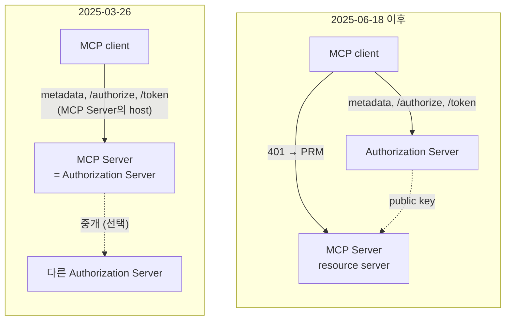
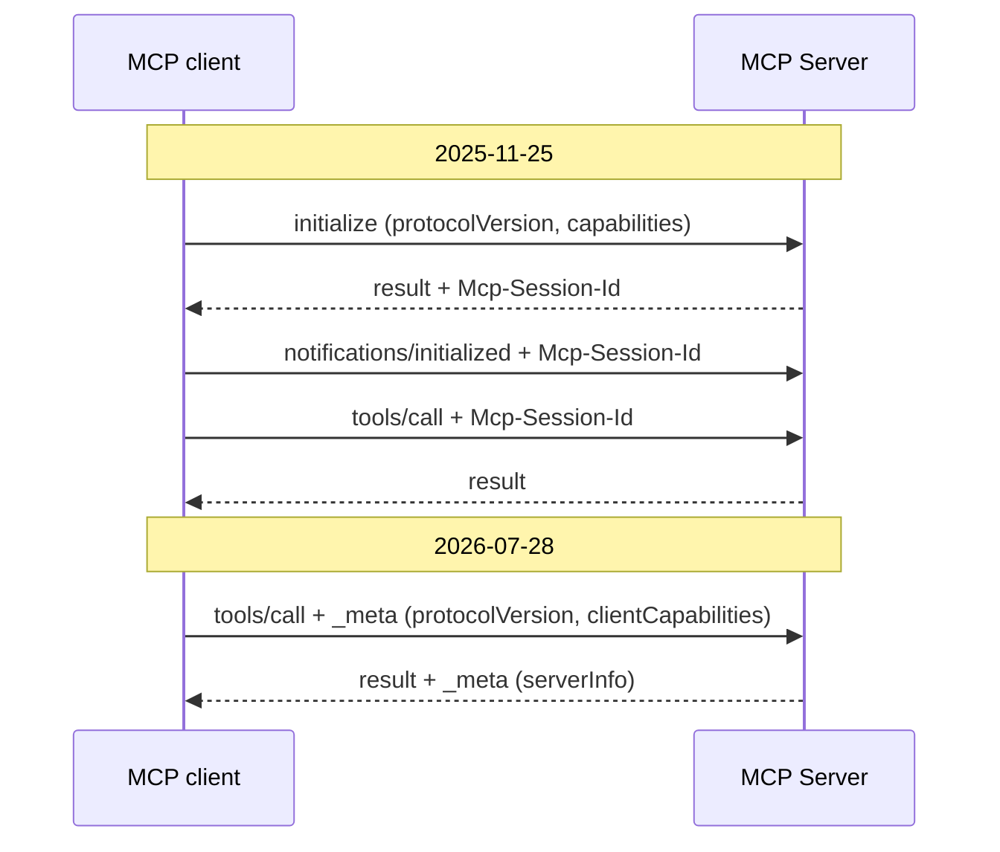

# 9. 버전 — MCP 명세는 버전마다 무엇이 달라졌나

## 9.1 버전 차이가 문제가 되는 경우

MCP 명세는 `2025-11-25`처럼 날짜로 버전을 나눈다.
client와 server는 같은 버전의 규칙을 따라야 서로를 이해한다([1장](01-mcp-basics.md)).
버전이 다르면 한쪽이 기대하는 단계를 다른 쪽이 모른다.
2025-03-26만 아는 client는 PRM을 찾지 않고, MCP Server와 같은 host에서 Authorization Server Metadata를 찾는다.
2026-07-28만 아는 client는 `initialize` 없이 처음부터 `tools/list`를 보낸다.
official의 MCP Server는 이 요청을 `400`으로 거절한다(9.9).

이 장은 authorization과 transport가 버전마다 어떻게, 왜 바뀌었는지 본다.
끝으로 official이 따르는 버전과 그 이유를 본다.

## 9.2 버전별 변화 한눈에 보기

첫 버전인 2024-11-05에는 authorization 규칙이 없고, HTTP transport도 지금과 다른 HTTP+SSE였다.
아래 표는 그 뒤 네 버전에서 이 안내서와 관련된 변화만 모았다.

| 버전 | authorization | transport·lifecycle |
|---|---|---|
| 2025-03-26 | authorization이 처음 생긴다. client는 MCP Server와 같은 host에서 metadata를 찾고, 없으면 `/authorize`·`/token` 기본 경로를 쓴다 | Streamable HTTP가 HTTP+SSE를 대신한다. `initialize`와 `Mcp-Session-Id`가 있다 |
| 2025-06-18 | MCP Server는 resource server가 되고, Authorization Server는 PRM으로 찾는다. client는 `resource`를 반드시 보낸다 | `initialize` 뒤 요청마다 `MCP-Protocol-Version` header를 보낸다 |
| 2025-11-25 | CIMD가 권장 등록 방식이 되고, DCR은 선택으로 내려간다 | 1장에서 본 흐름이 이 버전이다 |
| 2026-07-28 | callback의 `iss`를 확인하고, credentials를 발급한 issuer에 묶는다. DCR은 deprecated다 | `initialize`와 session이 없어진다. 요청마다 `_meta`에 버전과 capability를 넣는다 |

## 9.3 Authorization Server 분리와 PRM (2025-06-18)

**바뀐 이유**

2025-03-26의 client는 MCP Server 주소의 path를 떼고, 남은 주소에서 metadata를 찾았다.
MCP Server가 `https://api.example.com/v1/mcp`라면 metadata는 `https://api.example.com/.well-known/oauth-authorization-server`에 있어야 했다.
그래서 Authorization Server의 metadata는 MCP Server와 같은 host에 있어야 했다([2장](02-why-oauth.md)).

회사의 Authorization Server가 다른 host에 있으면 MCP Server가 중개를 맡아야 했다.
MCP Server는 바깥 Authorization Server의 token과 자기가 발급한 token의 짝, 그리고 두 token의 만료까지 관리해야 했다.
tool을 제공하려던 서버가 Authorization Server 하나를 통째로 구현하는 셈이었다.

**바뀐 것**

2025-06-18은 MCP Server를 OAuth resource server로 정했다.
MCP Server는 token을 검증만 하고, 자기용 token을 발급하는 Authorization Server의 위치는 PRM으로 알린다([3장](03-discovery.md)).
2025-11-25는 PRM 위치를 `401` header 없이 well-known 주소로만 알려도 되게 했다.
같은 버전부터 client는 OpenID Connect discovery 문서도 Authorization Server Metadata로 받는다.



[다이어그램 그림으로 보기](diagrams/09-versions-1.png)

**다른 버전을 만나면**

2025-03-26만 구현한 MCP Server에는 PRM이 없다.
새 client는 discovery를 이어 가지 못하고, 멈추거나 미리 설정해 둔 값을 쓴다.
반대로 2025-03-26 client는 새 MCP Server의 host에서 metadata를 찾으므로, 따로 떨어진 Authorization Server를 찾지 못한다.

## 9.4 `resource` 필수 (2025-06-18)

**바뀐 이유**

Authorization Server가 MCP Server에서 떨어져 나오자, 한 Authorization Server가 여러 MCP Server의 token을 발급하게 되었다.
token에 대상이 없으면 같은 Authorization Server를 믿는 MCP Server는 모두 그 token을 받는다.
악의적인 MCP Server는 사용자가 보낸 token을 다른 MCP Server에 그대로 보내 사용자 행세를 할 수 있다.

**바뀐 것**

client는 authorization request와 token request에 `resource`로 MCP Server 주소를 넣고, Authorization Server가 지원하지 않아도 보낸다([5장](05-authorization-and-token.md)).
MCP Server는 token의 `aud`에 자기가 있는지 확인한다([6장](06-mcp-call-and-validation.md)).

**다른 버전을 만나면**

`resource`를 보내지 않는 client가 official에서 token을 받으면 `aud`가 `client_id`로 남고, MCP Server는 그 token을 `401`로 거절한다.
`resource`를 모르는 Authorization Server는 이 parameter를 무시하므로, 새 client가 보내도 authorization 흐름은 깨지지 않는다.
다만 그 Authorization Server는 `aud`에 MCP Server를 넣지 않을 수 있어서, `aud`를 확인하는 MCP Server는 그 token을 거절할 수 있다.

## 9.5 CIMD의 등장과 DCR의 deprecated 지정 (2025-11-25, 2026-07-28)

**바뀐 이유**

MCP client에게는 처음 보는 Authorization Server에서 `client_id`를 얻을 방법이 필요하다.
2025-06-18까지는 그 방법으로 DCR을 권했다.
그런데 DCR로 등록된 client는 Authorization Server에 끝없이 쌓이고, 누가 등록했는지 알 수 없다.
CIMD는 client가 올린 `https` 문서의 주소를 `client_id`로 써서 이 문제가 없다([4장](04-client-registration.md)).

**바뀐 것**

| 버전 | DCR | CIMD |
|---|---|---|
| 2025-03-26, 2025-06-18 | 지원을 권한다 | 없다 |
| 2025-11-25 | 선택이다 | 지원을 권한다. 등록 방식의 순서(pre-registration → CIMD → DCR → 사용자 입력)도 이때 생긴다 |
| 2026-07-28 | 선택이지만 deprecated다. DCR을 쓰는 client는 `application_type`을 넣는다 | 지원을 권한다 |

deprecated는 아직 명세에 남아 있지만 앞으로 빠질 기능이라는 뜻이다.

**다른 버전을 만나면**

client는 Authorization Server의 버전이 아니라 metadata의 field로 등록 방식을 고른다([4장](04-client-registration.md)).
CIMD를 모르는 Authorization Server는 `client_id_metadata_document_supported`를 알리지 않으므로, client는 DCR이나 pre-registration으로 돌아간다.
official은 두 client를 모두 미리 등록해서 이 변화와 상관이 없다.

## 9.6 `iss` 확인과 issuer binding (2026-07-28)

**바뀐 이유**

PRM이 생기면서 client가 만나는 Authorization Server는 MCP Server가 정하게 되었고, 그중 하나는 공격자의 것일 수 있다.
2025-11-25의 MCP 명세는 OAuth 2.1의 보안 규칙을 따르라고만 했다.
이 상황에서 생기는 두 공격을 막는 구체적인 방법은 정하지 않았다.
하나는 정상 Authorization Server의 code를 공격자의 token endpoint로 보내게 하는 mix-up이다([8장](08-security.md)).
다른 하나는 PRM이 다른 Authorization Server를 가리킬 때, client가 미리 등록한 `client_secret`을 그 서버에 보내게 되는 것이다([4장](04-client-registration.md)).

**바뀐 것**

- Authorization Server는 callback에 자기 issuer를 `iss`(RFC 9207)로 넣고, metadata의 `authorization_response_iss_parameter_supported`로 이를 알린다.
- client는 authorization request 전에 issuer를 기록하고, code를 보내기 전에 `iss`와 비교한다([5장](05-authorization-and-token.md)).
- client는 credentials를 발급한 issuer에 묶어 두고, 다른 Authorization Server에는 쓰지 않는다.

**다른 버전을 만나면**

2025-11-25의 Authorization Server는 `iss`를 넣지 않고 metadata에도 알리지 않을 수 있다.
이때 2026-07-28의 client는 `iss` 없는 응답을 받아들인다.
metadata가 `iss`를 넣는다고 알렸는데 `iss`가 없을 때만 응답을 버린다.
그래서 옛 Authorization Server와도 동작하지만, mix-up을 `iss`로 막지는 못한다.

## 9.7 `initialize`와 session의 제거 (2026-07-28)

**바뀐 이유**

`initialize`로 협상한 버전과 capability는 그 연결의 상태로 server에 남는다.
서버가 여러 대면 다음 요청도 그 상태를 가진 서버로 가야 해서, 요청을 고르게 나눠 주는 보통의 load balancer를 쓰기 어렵다.
그 서버가 죽으면 client는 다시 `initialize`부터 해야 한다.
명세 변경 제안(SEP) 가운데 SEP-2575가 `initialize`를 없앤 이유다.

session은 언제 시작해 언제 끝나는지가 client마다 달랐다.
tool 호출마다 새로 여는 client도, 앱을 켤 때 열어 끌 때까지 쓰는 client도 있었다.
그래서 session에 둔 장바구니 같은 상태가 어떤 client에서는 다음 호출 때 사라지고, 어떤 client에서는 모든 대화가 그 상태를 함께 쓴다.
SEP-2567이 session을 없앤 이유다.

**바뀐 것**



[다이어그램 그림으로 보기](diagrams/09-versions-2.png)

| 항목 | 2025-11-25 | 2026-07-28 |
|---|---|---|
| 버전·capability | `initialize`에서 한 번 협상한다 | 요청마다 `_meta`에 넣는다. HTTP에서는 `MCP-Protocol-Version` header와 값이 같아야 한다 |
| server가 모르는 버전 | `initialize` 응답에 지원하는 다른 버전을 적는다 | `400`과 `UnsupportedProtocolVersionError`(`-32022`)에 지원 버전 목록을 담는다. `server/discover`로 미리 물을 수도 있다 |
| session | `Mcp-Session-Id`를 쓰고 `DELETE`로 끝낸다 | 없다 |
| 새 요청 header | — | `Mcp-Method`, `tools/call` 같은 요청에는 `Mcp-Name` |

요청 형식은 9.9의 curl 명령에서 본다.
`Authorization` header는 전처럼 요청마다 넣고, session이 없으니 server가 사용자를 아는 방법은 token뿐이다.

**상태는 tool 인자의 handle로**

호출 사이의 상태는 server가 만든 식별자(handle)로 가리킨다.
server는 handle을 tool 결과로 돌려주고, LLM은 다음 호출의 인자로 넘긴다.

```text
create_basket()                                → {"basket_id": "bsk_a1b2c3"}
add_item(basket_id="bsk_a1b2c3", sku="shoes")
checkout(basket_id="bsk_a1b2c3")
```

handle은 protocol의 기능이 아니라 tool을 설계하는 방법이다.
`basket_id`는 평범한 문자열 인자다.
session과 달리 LLM은 장바구니를 여럿 만들 수도, 한 `basket_id`를 여러 agent에게 나눠 줄 수도 있다.
handle은 채팅 기록에 남으므로, 가졌다는 것만으로 권한을 주지 않는다.
authorization을 쓰는 server는 호출마다 handle과 token의 사용자를 함께 보고, 그 사용자의 장바구니인지 확인한다.
[6장](06-mcp-call-and-validation.md)에서 session을 사용자에 묶던 일이 2026-07-28에서는 이 확인으로 바뀐다.
official의 tool은 호출 사이에 상태를 두지 않아서 handle이 필요 없다.

**다른 버전을 만나면**

2026-07-28은 `_meta` 방식만 구현하면 modern, `initialize` 방식만 구현하면 legacy, 둘 다 구현하면 dual-era라고 부른다.

| client | server | 결과 |
|---|---|---|
| dual-era | legacy | modern 요청을 먼저 보낸다. `400`의 본문이 modern 오류가 아니면 `initialize`로 돌아간다 |
| modern | legacy | 실패한다. client는 사용자에게 오류를 보여 준다 |
| legacy | modern | 필요한 header가 없어 `400`으로 실패한다. legacy client에게는 새 버전으로 넘어갈 방법이 없다 |
| legacy | dual-era | server가 `initialize`에 답하고 legacy 버전으로 통신한다 |

modern 오류란 `UnsupportedProtocolVersionError`처럼 2026-07-28이 정한 JSON-RPC 오류다.
modern만 지원하는 server는 옛 client의 `GET`·`DELETE`에 `405`로 답하고, `Mcp-Session-Id`는 무시한다.

## 9.8 official이 따르는 기준

| 영역 | 기준 버전 | 이유 |
|---|---|---|
| transport·lifecycle | 2025-11-25 | MCP Java SDK 2.0.0이 아는 가장 새 버전이다 |
| authorization | 2025-11-25와 2026-07-28 추가분(`iss`, issuer binding) | MCP 메시지와 따로 도는 HTTP 단계라서 SDK 버전과 상관이 없다 |

**transport: SDK가 아는 버전**

SDK가 아는 버전은 `io.modelcontextprotocol.spec.ProtocolVersions`의 상수 네 개다.

```java
public interface ProtocolVersions {             // MCP Java SDK 2.0.0 (mcp-core)
    String MCP_2024_11_05 = "2024-11-05";
    String MCP_2025_03_26 = "2025-03-26";
    String MCP_2025_06_18 = "2025-06-18";
    String MCP_2025_11_25 = "2025-11-25";       // 가장 새 버전
}
```

server는 `initialize`에서 이 가운데 하나로 협상하고, official의 `McpProtocolVersionFilter`도 이 네 값만 받는다([6장](06-mcp-call-and-validation.md)).
SDK와 Spring AI 2.0.0의 MCP module에는 `_meta`로 버전을 받는 처리도, `server/discover`도 없다.
`spring.ai.mcp.server.protocol: STATELESS`도 session ID를 주지 않을 뿐, `initialize`를 받는 2025-11-25 방식이다.

**authorization: HTTP 단계의 규칙**

discovery, login, token 발급은 MCP 메시지가 SDK에 닿기 전에 끝난다.
이 단계는 Spring Security와 Spring Authorization Server가 맡는다.
MCP Server의 token 검사도 SDK 앞의 Spring Security filter에서 한다.
어느 단계도 MCP 메시지의 버전을 읽지 않으므로, SDK가 2025-11-25에 머물러도 새 authorization 규칙을 따를 수 있다.
official에서 2026-07-28 추가분을 맡는 곳은 다음과 같다.

- `iss`를 넣는다: `auth-server`의 `IssuerIdentifyingAuthorizationResponseHandler`([5장](05-authorization-and-token.md))
- `iss`를 확인한다: `shop-agent`의 `AuthorizationResponseIssuerFilter`, `local-client`의 `AuthorizationResponse`([5장](05-authorization-and-token.md), [7장](07-local-client.md))
- credentials를 issuer에 묶는다: `shop-agent`의 `mcp.authorization.credentials-issuer`, `local-client`의 `--issuer`([4장](04-client-registration.md))

## 9.9 직접 해 보기

```bash
cd practice/mcp-security-authn-official
./run.sh
```

MCP Server는 token이 없는 요청을 버전 검사보다 먼저 `401`로 거절하므로([6장](06-mcp-call-and-validation.md)), 캡처 스크립트로 token을 받는다.
`PROTOCOL_VERSION`을 주면 `initialize`의 `protocolVersion`과 뒤 요청의 `MCP-Protocol-Version`이 그 값이 된다.

```bash
# 저장소 최상위 폴더에서. 출력에는 token 원문이 남는다
PROTOCOL_VERSION=2026-07-28 docs/superpowers/captures/mcp-authorization-walkthrough.sh > /tmp/walkthrough-2026.txt
```

출력의 7단계인 `initialize`의 응답은 다음과 같다.

```http
HTTP/1.1 200
Mcp-Session-Id: 8b9aaa29-a37f-4f3c-a2f8-bbd8793198d5

{"jsonrpc":"2.0","id":1,"result":{"protocolVersion":"2025-11-25","...":"그 밖의 field는 생략"}}
```

server는 모르는 버전을 거절하지 않고, 아는 가장 새 버전 `2025-11-25`로 답한다([1장](01-mcp-basics.md)의 버전 협상).
`2025-11-25`를 모르는 client라면 여기서 연결을 끊는다.
스크립트는 협상 결과와 달리 뒤 요청에도 `2026-07-28`을 보내므로, 8~10단계(`notifications/initialized`, `tools/list`, `tools/call`)는 모두 `400`이다.

이번에는 modern client처럼 `initialize` 없이 `_meta`를 넣은 요청을 보낸다.
access token의 수명은 300초라서, 스크립트를 돌린 뒤 5분 안에 보낸다.

```bash
ACCESS=$(sed -n 's/.*"access_token":"\([^"]*\)".*/\1/p' /tmp/walkthrough-2026.txt | head -1)
curl -i -X POST http://localhost:8111/mcp -H "Authorization: Bearer $ACCESS" \
  -H 'Content-Type: application/json' -H 'Accept: application/json, text/event-stream' \
  -H 'MCP-Protocol-Version: 2026-07-28' -H 'Mcp-Method: tools/list' \
  -d '{"jsonrpc":"2.0","id":1,"method":"tools/list","params":{"_meta":{"io.modelcontextprotocol/protocolVersion":"2026-07-28","io.modelcontextprotocol/clientInfo":{"name":"curl","version":"1.0"},"io.modelcontextprotocol/clientCapabilities":{}}}}'
```

```http
HTTP/1.1 400
Content-Type: application/json;charset=UTF-8

{"jsonrpc":"2.0","id":null,"error":{"code":-32600,"message":"Unsupported MCP-Protocol-Version: 2026-07-28"}}
```

8단계와 같은 `McpProtocolVersionFilter`의 응답이다.
`-32600`은 `UnsupportedProtocolVersionError`(`-32022`)가 아니고, 지원 버전 목록도 없다.
그래서 dual-era client는 official을 legacy server로 보고 `initialize`로 돌아간다.

## 9.10 정리

- 2025-06-18은 MCP Server를 resource server로 정하고 Authorization Server를 PRM으로 찾게 했다. 한 Authorization Server가 여러 MCP Server를 맡게 되어 `resource`도 필수가 되었다.
- client 등록은 2025-11-25부터 CIMD를 권하고, DCR은 2026-07-28에서 deprecated다.
- 2026-07-28은 `iss` 확인과 issuer binding을 더하고, `initialize`와 session을 없앤다. 호출 사이의 상태는 handle로 가리키고, 호출마다 token의 사용자로 확인한다.
- official은 transport를 SDK가 아는 2025-11-25로, authorization은 2025-11-25에 2026-07-28 추가분을 더해 따른다.

## 9.11 명세 근거

| 내용 | 명세 | 요구 수준 |
|---|---|---|
| 2025-03-26의 client는 MCP Server 주소에서 path를 뗀 base URL에서 metadata를 찾고, 없으면 기본 경로를 쓴다. 다른 Authorization Server는 MCP Server가 중개해 쓸 수 있다 | [MCP 2025-03-26 Authorization — Authorization Base URL](https://modelcontextprotocol.io/specification/2025-03-26/basic/authorization#authorization-base-url), [Third-Party Authorization Flow](https://modelcontextprotocol.io/specification/2025-03-26/basic/authorization#third-party-authorization-flow) | MUST, MAY |
| MCP Server는 PRM을 구현한다. 위치는 2025-06-18에서는 `401` header로, 2025-11-25부터는 header나 well-known URI로 알린다 | [MCP 2025-06-18 Authorization — Authorization Server Location](https://modelcontextprotocol.io/specification/2025-06-18/basic/authorization#authorization-server-location), [MCP 2025-11-25 Authorization — Protected Resource Metadata Discovery Requirements](https://modelcontextprotocol.io/specification/2025-11-25/basic/authorization#protected-resource-metadata-discovery-requirements) | MUST |
| client는 두 요청에 `resource`를 넣고, Authorization Server가 지원하지 않아도 보낸다 | [MCP 2025-06-18 Authorization — Resource Parameter Implementation](https://modelcontextprotocol.io/specification/2025-06-18/basic/authorization#resource-parameter-implementation) | MUST |
| DCR 지원은 2025-06-18까지 권장, 2025-11-25부터 선택이고 CIMD 지원을 권한다. 2026-07-28에서 DCR은 deprecated다 | [MCP 2025-06-18 Authorization — Dynamic Client Registration](https://modelcontextprotocol.io/specification/2025-06-18/basic/authorization#dynamic-client-registration), [MCP 2025-11-25 Authorization — Overview](https://modelcontextprotocol.io/specification/2025-11-25/basic/authorization#overview), [MCP 2026-07-28 Key Changes — Deprecated](https://modelcontextprotocol.io/specification/2026-07-28/changelog#deprecated) | SHOULD, MAY |
| Authorization Server는 callback에 `iss`를 넣는다. client는 issuer를 기록하고, code를 보내기 전에 `iss`가 있으면 기록한 issuer와 비교한다 | [MCP 2026-07-28 Authorization — Authorization Response Validation](https://modelcontextprotocol.io/specification/2026-07-28/basic/authorization#authorization-response-validation) | SHOULD, MUST |
| credentials는 발급한 issuer에 묶고 다른 서버에 다시 쓰지 않는다. 맞지 않으면 오류를 보여 준다 | [MCP 2026-07-28 Client Registration — Authorization Server Binding](https://modelcontextprotocol.io/specification/2026-07-28/basic/authorization/client-registration#authorization-server-binding) | MUST, MUST NOT, SHOULD |
| 2025-11-25의 server는 요청받은 버전을 모르면 지원하는 다른 버전으로 답한다 | [MCP 2025-11-25 Lifecycle — Version Negotiation](https://modelcontextprotocol.io/specification/2025-11-25/basic/lifecycle#version-negotiation) | MUST |
| 2026-07-28은 `initialize`를 없애고 요청마다 `_meta`와 header(`MCP-Protocol-Version`·`Mcp-Method`·`Mcp-Name`)를 보내며, header의 버전이 `_meta`와 다르면 server는 `400`과 `HeaderMismatch`로 거절한다. 모르는 버전에는 `400`과 `UnsupportedProtocolVersionError`로 답하고, server는 `server/discover`를 구현한다 | [MCP 2026-07-28 Key Changes](https://modelcontextprotocol.io/specification/2026-07-28/changelog#major-changes), [Streamable HTTP — Request Metadata](https://modelcontextprotocol.io/specification/2026-07-28/basic/transports/streamable-http#request-metadata), [Versioning](https://modelcontextprotocol.io/specification/2026-07-28/basic/versioning#protocol-version-negotiation), [SEP-2575](https://modelcontextprotocol.io/seps/2575-stateless-mcp) | MUST, REQUIRED |
| 2026-07-28은 session을 없애고, 상태는 tool 인자의 handle로 다룬다. modern만 지원하는 server는 옛 client의 `GET`·`DELETE`에 `405`로 답한다 | [SEP-2567](https://modelcontextprotocol.io/seps/2567-sessionless-mcp), [Streamable HTTP — Earlier Streamable HTTP Revisions](https://modelcontextprotocol.io/specification/2026-07-28/basic/transports/streamable-http#earlier-streamable-http-revisions) | SHOULD |
| dual-era client는 modern 요청을 먼저 보내고, `400`의 본문이 modern 오류가 아니면 `initialize`로 돌아간다 | [MCP 2026-07-28 Streamable HTTP — Backward Compatibility](https://modelcontextprotocol.io/specification/2026-07-28/basic/transports/streamable-http#backward-compatibility) | MAY, SHOULD |

[← 8장](08-security.md) · [목차](README.md) · [부록: API 레퍼런스 →](reference-api.md)
