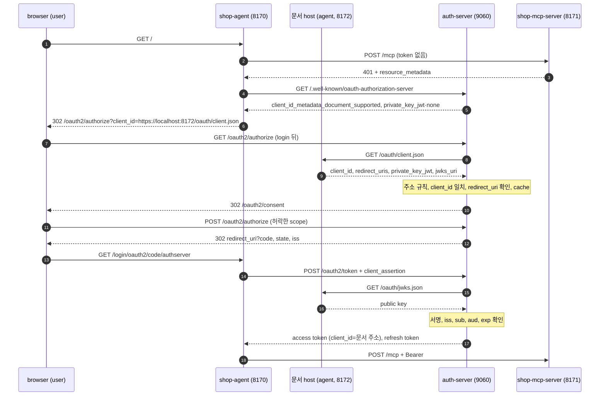
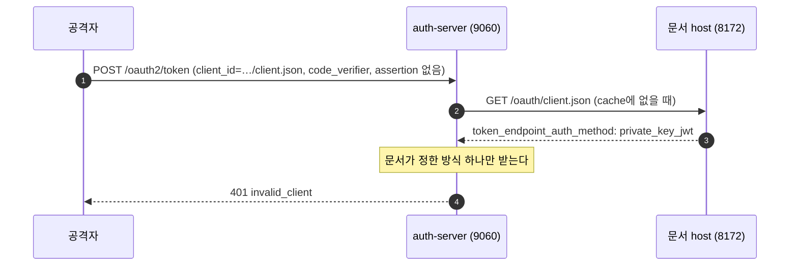

# 13. CIMD — 처음 보는 client를 문서로 알아본다

이 장부터는 사용자 기기의 앱 대신, 서버에서 도는 두 제품(ChatGPT와 Claude)이 Authorization Server에 붙는 방식을 web agent로 본다.
MCP Server를 두 제품에 붙이려면 먼저 이 두 client에 맞춰야 하고, 두 제품은 사용자 기기가 아니라 자기 회사 서버에서 token을 받는다.
사용자 기기의 앱이 CIMD로 붙는 방식(Claude Code(CLI))은 실제 문서로만 본다.
예시 값은 `mcp-cimd` practice(`http://localhost:9060`, `http://localhost:8171/mcp`, `http://localhost:8170`, `https://localhost:8172`)를 띄워 받은 캡처다.

## 13.1 CIMD의 필요성

[4장](04-client-registration.md)에서 본 대로 Authorization Server는 자기가 아는 `client_id`만 받는다.
ChatGPT나 Claude의 사용자는 아무 MCP Server 주소나 붙이고, 두 제품은 그 MCP Server의 Authorization Server를 그때 처음 만난다.
세상의 모든 Authorization Server에 미리 등록해 둘 수는 없다.

DCR은 연결할 때마다 `registration_endpoint`에 등록을 요청해 새 `client_id`를 받는다.
그러면 등록된 client가 Authorization Server에 계속 쌓이고, 누가 등록했는지도 알 수 없다.
2026-07-28 버전은 DCR을 deprecated로 정하고, 새 구현에는 CIMD를 쓰라고 한다.

CIMD는 등록 요청이 없다.
client는 자기 정보를 담은 JSON 문서를 자기 `https` 주소에 올리고, 그 주소를 `client_id`로 쓴다.
Authorization Server는 처음 보는 주소를 만나면 그 문서를 가져와 등록 정보로 쓰므로, 따로 저장해 둘 것이 없다.
문서의 내용은 그 domain의 주인만 바꿀 수 있다.
CIMD의 기본 규칙은 [4장 CIMD](04-client-registration.md#45-cimd)에서 보았고, 이 장은 그 규칙을 실제로 돌려 본다.

CIMD가 정하는 것은 client가 누구인지 알리는 방법이다.
token endpoint에서 자기를 어떻게 증명할지는 client가 문서의 `token_endpoint_auth_method`로 고른다.
문서는 누구나 읽을 수 있어서 비밀을 미리 나눌 수 없으므로, CIMD는 `client_secret_basic` 같은 공유 비밀 방식만 금지한다.
private key로 signature를 만드는 `private_key_jwt`와, 증명 없이 `client_id`만 보내는 public client의 `none`은 둘 다 쓸 수 있다.
이 장의 agent는 두 제품을 본뜬 client type 둘 가운데 하나로 붙는다.

| client type | 문서 주소(`client_id`) | 증명 수단 | refresh | consent 저장 |
|---|---|---|---|---|
| ChatGPT형(`chatgpt`, 기본) | `https://localhost:8172/oauth/client.json` | `private_key_jwt`다. token request마다 private key로 signature를 만든 client assertion을 붙인다 | assertion을 붙여 refresh하고, 새 refresh token을 받는다 | 저장한다. step-up에서는 새 scope만 묻는다 |
| Claude형(`claude`) | `https://localhost:8172/oauth/public-client.json` | `none`이다. `client_id`와 PKCE의 `code_verifier`만 보낸다 | `client_id`만으로 refresh하고, 새 refresh token을 받는다 | 저장하지 않는다. login과 step-up 때마다 모든 scope를 다시 묻는다 |

Authorization Server에는 미리 등록한 client도, client type 설정도 없고, 어떤 인증 방식을 받을지는 client가 올린 문서가 정한다.

## 13.2 실제 제품의 문서

아래는 ChatGPT와 Claude Code(CLI)가 실제로 올려 둔 CIMD 문서를 curl로 받은 값이다(2026-10-08).

| field | ChatGPT | Claude Code(CLI) |
|---|---|---|
| `client_id` | `https://chatgpt.com/oauth/client.json` | `https://claude.ai/oauth/claude-code-client-metadata` |
| `token_endpoint_auth_method` | `private_key_jwt` | `none` |
| `jwks_uri` | `https://chatgpt.com/oauth/jwks.json` | 없다 |
| `redirect_uris` | `https://chatgpt.com/connector_platform_oauth_redirect` | `http://localhost/callback`, `http://127.0.0.1/callback` |
| `token_endpoint_auth_methods_supported` | `["none", "private_key_jwt"]` | 없다 |

두 응답 모두 `cache-control: public, max-age=300`이고, ChatGPT 문서에는 `token_endpoint_auth_signing_alg: RS256`과 `logo_uri`도 있다.

**ChatGPT: key로 증명하고, 서버가 받는 방식과의 교집합에서 고른다**

`token_endpoint_auth_methods_supported`는 CIMD에 없는 확장 field다.
[OpenAI 문서](https://developers.openai.com/plugins/build/auth#client-registration)는 이 field가 ChatGPT가 쓸 수 있는 방식의 목록이라고 설명한다.
ChatGPT는 이 목록과 Authorization Server metadata의 같은 이름 field가 겹치는 방식 가운데 하나를 고른다.
단수 field `token_endpoint_auth_method`의 값이 교집합에 있으면, 단수 field를 정해진 방식으로 보는 Authorization Server와 맞추려고 그 값을 쓴다.
이 practice의 Authorization Server도 단수 field만 읽고, 복수 field는 모르는 field로 보아 무시한다.
같은 문서에 따르면 ChatGPT가 이 고정 문서 주소를 쓰는 것은, Authorization Server가 authorization response마다 `iss`를 넣고 metadata로 알릴 때다([5장](05-authorization-and-token.md)).

**Claude: public client로 붙고, refresh token rotation을 요구한다**

claude.ai·Claude Desktop 같은 Claude 앱도 CIMD로 붙을 때 public client다.
[Claude 문서](https://claude.com/docs/connectors/building/authentication#dcr-and-cimd-details)에 따르면 Claude는 metadata에 `client_id_metadata_document_supported: true`와 `none`이 함께 있을 때만 CIMD를 쓴다.
`none`은 `token_endpoint_auth_methods_supported`에 있어야 하고, 둘 중 하나라도 없으면 Claude는 DCR로 간다.
Claude 앱의 redirect 주소는 `https://claude.ai/api/mcp/auth_callback`이다.
같은 문서의 [token refresh](https://claude.com/docs/connectors/building/authentication#token-refresh) 항목은 public client 연결의 refresh token을 rotation하고, 더는 쓸 수 없는 refresh token에는 `invalid_grant`로 답하라고 한다.

두 제품이 다른 방식을 고른 것은 표준 안의 선택이고, Authorization Server가 metadata에 두 방식을 모두 알리면 두 제품이 모두 붙는다.
이 practice의 ChatGPT형 문서는 ChatGPT 문서처럼 `private_key_jwt`·`RS256`·`jwks_uri`를 적고, Claude형 문서는 Claude Code 문서처럼 `none`을 적는다.

## 13.3 시퀀스 다이어그램



[다이어그램 그림으로 보기](diagrams/13-cimd-1.png)

| 단계 | 볼 값 |
|---|---|
| 1단계 (1)\~(6): metadata와 두 문서 | metadata의 CIMD 표시와 인증 방식, agent가 올린 문서 |
| 2단계 (7)\~(9): 문서를 가져와 믿기까지 | 주소 검사, 문서 내용 검사, cache |
| 3단계 (10)(11): consent 화면 | client 이름, 문서 host, redirect host, loopback 경고 |
| 4단계 (12)\~(17): 두 인증 방식 | ChatGPT형의 client assertion과 JWKS, Claude형의 `client_id`만 있는 token request |
| 5단계(그림 밖): refresh | public client에게도 주는 refresh token과 rotation |
| (18): MCP 호출 | access token의 `client_id`가 문서 주소다 |

(3)과 (4) 사이의 PRM 요청은 3장과 같아서 그림에서 뺐다.
그림은 login을 마친 browser로 그렸고, login하지 않은 browser라면 Authorization Server는 첫 authorization request에서 문서를 가져와 검사한 뒤 login 화면으로 보낸다.
Claude형은 (8)에서 `/oauth/public-client.json`을 가져오고, (14)에 assertion을 넣지 않으므로 (15)(16)이 없다.

아래 예시는 `practice/mcp-cimd`를 실제로 띄워 받은 값이고, token이 필요한 요청은 agent 대신 캡처 스크립트가 curl로 보냈다.
ChatGPT형의 assertion은 agent와 같은 private key로 `openssl`이 만들었고, JWT는 앞 20자, refresh token과 code는 앞 12자만 남겼다.

## 13.4 1단계: metadata와 두 문서

**Authorization Server metadata**

agent는 [3장](03-discovery.md)의 discovery로 찾은 Authorization Server의 metadata(`/.well-known/oauth-authorization-server`)를 읽는다.

```json
{
  "issuer": "http://localhost:9060",
  "client_id_metadata_document_supported": true,
  "token_endpoint_auth_methods_supported": ["private_key_jwt", "none"],
  "token_endpoint_auth_signing_alg_values_supported": ["RS256"],
  "code_challenge_methods_supported": ["S256"],
  "...": "그 밖의 field는 생략"
}
```

`client_id_metadata_document_supported: true`는 문서 주소를 `client_id`로 받는다는 표시다.
token endpoint의 인증 방식은 이 서버가 문서에서 받는 두 방식만, signature 알고리즘은 이 서버가 assertion을 검증하는 `RS256`만 알린다.
Spring은 기본으로 인증 방식 여섯 가지와 알고리즘 여러 개를 알리지만, 이 서버는 실제로 받는 것만 알린다.
revocation·introspection endpoint는 client 인증이 있어야 쓸 수 있으므로, 인증 방식으로 `private_key_jwt`만 알린다.

agent는 3장의 확인(`resource`·`issuer` 일치, PKCE `S256`, endpoint 주소 형식)에 두 가지를 더한다.
`client_id_metadata_document_supported`가 `true`인지, `token_endpoint_auth_methods_supported`에 고른 방식(ChatGPT형은 `private_key_jwt`, Claude형은 `none`)이 있는지 보고, 아니면 이유를 남기고 멈춘다.
CIMD를 모르는 서버로 사용자를 보내면 사용자는 login 화면 대신 모르는 client라는 오류를 보게 된다.
고른 방식을 받지 않는 서버라면 사용자가 login과 consent를 다 마친 뒤에야 token request가 거절된다.

**issuer에 묶지 않는 이유**

[4장](04-client-registration.md#47-credentials를-issuer에-묶기)에서는 `client_secret`이 다른 Authorization Server로 가지 않도록, 미리 등록한 credentials를 issuer에 묶었다.
CIMD의 `client_id`는 어느 Authorization Server든 가져갈 수 있는 공개 주소라서 특정 서버에 묶이지 않고, 새어 나갈 비밀도 없다.
ChatGPT형의 assertion은 `aud`에 그 서버의 token endpoint를 넣으므로 다른 서버에 보낸 assertion은 진짜 서버에서 통하지 않고, 그래서 이 agent에는 issuer 비교가 없다.

**남는 위험: discovery의 SSRF**

issuer 비교는 PRM이 모르는 Authorization Server를 가리킬 때 metadata 요청까지 막아 주었다([8장](08-security.md)).
이 비교가 없으므로 agent는 PRM의 `authorization_servers` 첫 값에 scheme과 host를 보지 않고 metadata를 요청하고, `401`의 `resource_metadata` 주소도 전처럼 확인 없이 요청한다.
악성 MCP Server는 이 자리에 내부망 주소를 넣어 agent가 그곳에 요청하게 만들 수 있으므로, 실제 배포라면 사설 주소로 가는 요청을 막는 egress proxy를 두거나 쓸 Authorization Server를 정한 목록으로 좁힌다.
이 위험은 [부록: 명세 준수표](reference-compliance.md)의 SSRF 행에 남는다.

**두 문서와 JWKS**

agent가 `https://localhost:8172/oauth/client.json`에 올린 ChatGPT형 문서는 다음과 같다.

```http
HTTP/1.1 200 OK
Content-type: application/json
Cache-control: max-age=300

{
  "client_id": "https://localhost:8172/oauth/client.json",
  "client_name": "Shop Agent (ChatGPT형)",
  "redirect_uris": ["http://localhost:8170/login/oauth2/code/authserver"],
  "token_endpoint_auth_method": "private_key_jwt",
  "token_endpoint_auth_signing_alg": "RS256",
  "jwks_uri": "https://localhost:8172/oauth/jwks.json",
  "...": "그 밖의 field는 생략"
}
```

Claude형 문서(`/oauth/public-client.json`)는 `client_name`이 `Shop Agent (Claude형)`이고, `token_endpoint_auth_method`가 `none`이며 `jwks_uri`가 없다.
JWKS(`/oauth/jwks.json`)에는 public key 하나만 있다.

```json
{"keys":[{"kty":"RSA","e":"AQAB","use":"sig","kid":"xwrgfUx2wJS8xaZf9lJU67GcYKSg1eFglGecY89efB0","alg":"RS256","n":"lC-cuNmRoqXvc3WuSUDe..."}]}
```

private key 값 `d`는 없고, `kid`는 public key의 RFC 7638 thumbprint라서 같은 key 파일이면 실행마다 같다.
Authorization Server는 두 문서를 `Cache-Control: max-age=300`에 따라 5분 동안 cache한다.
JWKS 응답에도 같은 header가 있지만, JWKS는 cache하지 않고 assertion을 검증할 때마다 새로 가져온다(13.10).
agent는 문서의 redirect 주소를 authorization request에도 그대로 쓰므로, browser에서는 `http://localhost:8170`을 연다.
`http://127.0.0.1:8170`으로 열면 callback이 `localhost`로 돌아와 `127.0.0.1`에서 받은 session cookie가 가지 않고, login이 실패한다.

**localhost 학습 환경의 타협**

CIMD의 `client_id`는 path가 있는 `https` 주소여야 하고 localhost 예외가 없으므로, agent는 process 안에 작은 HTTPS 서버를 따로 연다.
이 서버는 self-signed 인증서로 `127.0.0.1:8172`에서 문서를 주며, 채팅 화면(8170, `http`)과 다른 공개 web site 역할을 한다.
Authorization Server는 `certs/client-metadata-trust.p12`의 그 인증서 하나만 믿고, loopback 주소로는 `https://localhost:8172`만 가져온다(13.5).
실제 배포에서는 공인 인증서를 쓰는 공개 주소에 문서를 올리고, truststore 설정과 loopback 예외를 지운다.

**DPoP를 알리지 않는 이유**

Spring의 기본 metadata는 `dpop_signing_alg_values_supported`와 `tls_client_certificate_bound_access_tokens`를 알린다.
Spring이 기본으로 구성하는 token generator는 DPoP proof나 client 인증서가 있으면 access token을 그 key(`cnf.jkt`)나 인증서(`cnf.x5t#S256`)에 묶기 때문이다.
이 서버는 public client에게도 refresh token을 주려고 token generator를 직접 만들고(13.8), 그 generator는 두 binding을 하지 않는다.
그래서 묶이지 않은 token을 묶인 것처럼 기대하게 하지 않도록 두 field를 metadata에서 지운다.
그래도 DPoP proof를 붙여 오면 `Bearer` token을 주고, proof를 붙인 public client의 refresh는 `invalid_dpop_proof`로 실패한다.

## 13.5 2단계: 문서를 가져와 믿기까지

authorization request는 login보다 먼저 검사된다([5장](05-authorization-and-token.md)).
그래서 login하지 않은 누구든 `client_id`에 주소 하나를 적어 보내면, Authorization Server가 그 주소로 요청을 보내게 할 수 있다.
Authorization Server는 처음 보는 주소를 아래 항목으로 검사하고, 하나라도 어긋나면 그 client를 모르는 client로 다룬다.

| 확인 | 자리 | 어기면 생기는 일 |
|---|---|---|
| `https`이고 path가 있으며, `.`·`..` path 조각(`%2e%2e`도 풀어서 본다), fragment, 사용자 정보, query가 없다 | `ClientIdUrlValidator` | 같은 문서를 여러 이름으로 가리키거나, 평문으로 오가는 문서를 중간에서 바꿔치기한다 |
| DNS로 푼 주소가 loopback·사설·link-local·any-local·multicast가 아니다. IPv4-mapped IPv6 주소도 풀어서 본다 | `ClientIdUrlValidator` | `client_id`에 내부망 주소를 적어 Authorization Server가 그곳에 요청하게 한다(SSRF) |
| loopback 예외는 `https://localhost:8172` 하나이고, scheme·host·port가 모두 같아야 한다 | `ClientIdUrlValidator` | `https://localhost:8173`이나 `http://localhost:8172`처럼 같은 기기의 다른 서비스로 요청이 간다 |
| redirect를 따라가지 않는다 | `HttpsClientMetadataFetcher` | 검사를 통과한 공개 주소가 `302`로 내부망을 가리키면, 검사하지 않은 곳으로 요청이 간다 |
| 응답은 5120 byte까지, 연결은 2초, header와 본문을 합친 응답 전체는 3초까지다 | `HttpsClientMetadataFetcher` | 아주 큰 문서나 본문을 조금씩 흘리는 응답으로 서버의 memory와 thread를 묶는다 |
| 상태가 `200`이고 `Content-Type`이 `application/json`이나 `+json`이다 | `HttpsClientMetadataFetcher` | HTML 오류 page 같은 응답을 문서로 읽는다 |
| 문서의 `client_id`가 문서 주소와 글자까지 같다 | `ClientMetadataValidator` | 남의 문서를 복사해 자기 주소에 올린 client가 그 client 행세를 한다 |
| `client_name`과 `redirect_uris`(fragment 없는 절대 주소)가 있고, `client_secret`·`client_secret_expires_at`은 없다 | `ClientMetadataValidator` | consent 화면에 보일 이름이나 code를 보낼 주소가 없다. 누구나 읽는 문서의 비밀은 비밀이 아니다 |
| 인증 방식은 `none`이나 `private_key_jwt`다. `private_key_jwt`면 `jwks_uri`가 위의 주소 규칙을 지키고 알고리즘은 `RS256`이다 | `ClientMetadataValidator` | 공유 비밀 방식은 비밀 없이 흉내 낼 수 있다. `jwks_uri`가 내부 주소면 key를 가져올 때 SSRF가 된다 |

ChatGPT 문서의 `token_endpoint_auth_methods_supported` 같은 모르는 field는 무시한다.

문서가 통과하면 Spring의 authorization request 검증이 요청의 `redirect_uri`를 문서의 `redirect_uris`와 비교한다.
`redirect_uri`를 문서에 없는 `http://localhost:8170/elsewhere`로 바꾸면 `Location` 없이 `HTTP/1.1 400`으로 끝난다.
문서에 없는 주소는 믿을 수 없으므로, 오류도 그 주소로 보내지 않는다([4장](04-client-registration.md)).

통과한 문서는 Spring의 client 정보(`RegisteredClient`)로 바뀌고, `id`와 `clientId`는 둘 다 문서 주소다.
인증 방식은 문서의 것 하나뿐이고(13.7), scope는 문서에 없으므로 서버 정책 `openid products:read products:write orders:write`다.
처음 보는 client라서 PKCE를 반드시 쓰게 하고 consent도 받으며, refresh token은 refresh할 때마다 새것을 준다(13.8).

**cache 규칙**

| 문서 응답 | cache 기간 |
|---|---|
| `Cache-Control: max-age=N` | N초다. 1시간을 넘으면 1시간이다 |
| `Cache-Control`이 없다 | 5분이다 |
| `no-store`이거나 `max-age=0`이다 | cache하지 않는다 |
| 가져오지 못했거나 잘못된 문서다 | cache하지 않는다. 다음 요청에서 다시 가져온다 |

상한을 두는 것은 client가 문서를 바꾸었을 때, 길어도 1시간 안에는 새 문서를 쓰기 위해서다.
실패를 cache하지 않으므로 한 번의 실패가 cache 기간 내내 이어지지 않고, client가 문서를 고치면 다음 요청에서 바로 다시 가져온다.

`client_id`는 요청하는 쪽이 정하는 주소라서, 인증 없는 authorization request만으로 서로 다른 주소를 얼마든지 보낼 수 있다.
그래서 cache에는 client를 1000개까지만 두고, 새 항목을 넣기 전에 만료된 항목을 치운 뒤에도 가득 차 있으면 그 client는 요청에 쓰되 cache하지 않는다.
로그에 남기는 `client_id`와 예외 메시지도 요청하는 쪽이 정한 값이므로, 가짜 줄을 끼워 넣지 못하게 제어 문자를 `?`로 바꾸고 200자에서 자른다.

캡처 스크립트를 마친 뒤 `auth-server` 로그에서 `client 문서를`이 든 줄을 모으면 다음 순서다(이어지는 같은 줄은 하나로 줄였다).

```text
client 문서를 가져왔다 (client_id=https://localhost:8172/oauth/client.json, 인증 방식=private_key_jwt, cache=300초)
client 문서를 cache에서 꺼낸다 (client_id=https://localhost:8172/oauth/client.json)
client 문서를 가져왔다 (client_id=https://localhost:8172/oauth/public-client.json, 인증 방식=none, cache=300초)
client 문서를 cache에서 꺼낸다 (client_id=https://localhost:8172/oauth/public-client.json)
```

문서마다 "가져왔다"는 처음 한 번이고, 그 뒤로는 "cache에서 꺼낸다"가 이어진다.
한 흐름 안에서도 authorization request, consent 화면, token request가 저마다 client를 찾기 때문이다.
문서를 쓸 수 없으면 `client 문서를 쓸 수 없다 (client_id=…, 이유=…)`가 경고로 찍힌다.

**남는 위험: DNS rebinding**

`ClientIdUrlValidator`는 host를 DNS로 풀어 검사하지만, 실제 연결은 JDK `HttpClient`가 이름을 다시 풀어서 한다.
공격자의 DNS 서버가 검사할 때는 공개 IP를, 연결할 때는 내부 IP를 돌려주면 요청이 내부망으로 간다.
이 practice는 검사한 IP로 연결을 고정하지 않아 이 경우를 막지 않으며, 실제 배포라면 검사한 IP로 직접 연결하거나 egress proxy를 둔다.

## 13.6 3단계: consent 화면

문서를 믿은 뒤 Authorization Server는 login한 사용자를 consent 화면으로 보낸다(`state`는 줄였다).

```http
HTTP/1.1 302
Location: http://localhost:9060/oauth2/consent?scope=openid%20products:read&client_id=https://localhost:8172/oauth/client.json&state=XS5nN8un9Y9t...
```

consent 화면의 핵심 줄은 다음과 같다.

```html
<h1>권한 요청: Shop Agent (ChatGPT형)</h1>
<p>client 문서: <code>localhost:8172</code>
<p>허락하면 돌아갈 주소: <code>localhost:8170</code>
<strong>이 client는 이 기기의 주소(localhost)로만 돌아갑니다. 같은 기기의 다른 프로그램도 이 client의 이름을 댈 수 있으니, 직접 시작한 요청인지 확인하세요.</strong>
<input type="checkbox" name="scope" value="products:read" id="products:read"> products:read</label>
```

제목의 이름은 문서의 `client_name`이고, 두 host는 `client_id`와 이 요청 `redirect_uri`의 host와 port다.
체크박스는 요청 scope에서 `openid`와 이미 허락한 scope를 뺀 것이다.
`client_name`은 client가 마음대로 적는 값이라, 공격자는 자기 문서에 `ChatGPT`라고 적을 수 있다.
그래서 화면은 이름과 함께, 문서를 올린 domain과 code가 갈 곳을 보여 준다.
host는 Java `URI`가 가려낸 host와 port만 쓰므로, `https://good.example@evil.example/cb`의 앞부분 사용자 정보가 진짜 host를 가리지 못한다.
영문·숫자가 아닌 글자가 섞인 host는 punycode(`xn--`로 시작하는 표기)로 보여 주어, 눈으로 구별되지 않는 글자도 구별된다.
redirect host는 `state`로 찾은 대기 중인 요청이 이 client의 것일 때만 보여 준다.
다른 client의 `state`를 붙여 와서 그 client의 redirect host를 이 화면에 띄우지 못하게 하려는 것이다.

**loopback 경고**

[4장 CIMD](04-client-registration.md#45-cimd)에서 본 대로, 진짜 client의 문서에 `localhost` redirect 주소만 있으면 공격자는 그 문서 주소를 `client_id`에 넣고 사용자 기기의 `localhost` 포트로 code를 받을 수 있다.
사용자는 화면에서 진짜 client의 이름과 문서 host를 보게 되므로, redirect 주소가 모두 loopback(`localhost`, `*.localhost`, loopback IP)이면 경고를 더한다.
실제 문서로 보면 Claude Code 문서에는 경고가 나오고, `https://chatgpt.com`으로 돌아가는 ChatGPT 문서에는 나오지 않는다.
이 practice의 두 문서는 redirect가 `http://localhost:8170` 하나뿐이라 둘 다 경고가 나온다.

**consent할 scope가 없는 요청**

Spring은 요청 scope가 `openid` 하나면 consent 화면을 건너뛰고, [5장](05-authorization-and-token.md)에서는 public client만 이 길을 막았다.
이 서버의 client는 모두 자기 문서로 스스로 등록하므로, 누구나 문서를 올려 `private_key_jwt` client가 될 수 있다.
그대로 두면 아무도 확인하지 않은 client가 `scope=openid` 하나로 consent 화면 없이 code, ID token, refresh token을 받는다.
그래서 `ConsentableScopeValidator`는 client 종류와 상관없이, `openid` 말고 scope가 하나도 없는 요청과 scope를 뺀 요청을 `invalid_scope`로 거절한다.

**consent를 저장하는 client와 저장하지 않는 client**

ChatGPT형(`private_key_jwt`)의 consent는 저장한다.
저장한 consent로 화면 없이 code가 나가도 code는 문서의 redirect 주소로만 가고, 그 code를 token으로 바꾸려면 문서의 key로 만든 assertion이 있어야 한다.
browser로 step-up을 해 보면 새로 고를 항목은 `products:write` 하나이고, `products:read`는 "이미 허락한 권한" 아래에 나온다.

Claude형(`none`)의 consent는 저장하지 않는다.
public client는 누구나 그 `client_id`를 댈 수 있어 이전에 허락한 그 client인지 확인할 수 없으므로, 이전 consent가 없는 것처럼 처리한다.
그래서 방금 허락한 Claude형도 같은 요청을 다시 보내면 consent 화면이 다시 나온다.

```http
HTTP/1.1 302
Location: http://localhost:9060/oauth2/consent?scope=openid%20products:read&client_id=https://localhost:8172/oauth/public-client.json&state=z7BRo8EhanlD...
```

browser의 step-up에서도 `products:read`와 `products:write`가 모두 체크박스로 나온다.

## 13.7 4단계: 두 인증 방식

**ChatGPT형: client assertion(`private_key_jwt`)**

ChatGPT형의 token request에는 `client_assertion_type`과 `client_assertion`이 더 붙는다.

```text
POST /oauth2/token
  grant_type=authorization_code
  code=O1mEPsQPC3gw...
  redirect_uri=http://localhost:8170/login/oauth2/code/authserver
  code_verifier=dBjftJeZ4CVP-mB92K27uhbUJU1p1r_wW1gFWFOEjXk
  resource=http://localhost:8171/mcp
  client_id=https://localhost:8172/oauth/client.json
  client_assertion_type=urn:ietf:params:oauth:client-assertion-type:jwt-bearer
  client_assertion=eyJhbGciOiJSUzI1NiIs...
→ HTTP 200
{"access_token":"eyJraWQiOiI5NjZhZjE3...","refresh_token":"gdYnl0Z52KRj...","scope":"products:read openid","id_token":"eyJraWQiOiI5NjZhZjE3...","token_type":"Bearer","expires_in":299}
```

client assertion은 client가 자기 private key로 signature를 만든 JWT다.
스크립트가 만든 assertion의 header와 payload를 풀면 다음과 같다(`jti`·`iat`·`exp`는 요청마다 달라 자리만 적었다).

```json
{"alg":"RS256","kid":"xwrgfUx2wJS8xaZf9lJU67GcYKSg1eFglGecY89efB0","typ":"JWT"}
{
  "iss": "https://localhost:8172/oauth/client.json",
  "sub": "https://localhost:8172/oauth/client.json",
  "aud": "http://localhost:9060/oauth2/token",
  "jti": "<요청마다 새 UUID>",
  "iat": "<보낸 시각>",
  "exp": "<iat + 60초>"
}
```

`iss`와 `sub`는 `client_id`, `aud`는 이 Authorization Server의 token endpoint이고, header의 `kid`는 JWKS에 올린 key의 `kid`다.
agent도 같은 claim으로 assertion을 만들고, 60초 뒤에 만료되게 한다(Spring client의 기본값).

Authorization Server는 `client_id`로 찾은 문서의 인증 방식이 `private_key_jwt`인지 보고, 문서의 `jwks_uri`에서 JWKS를 가져온다.
JWKS를 가져올 때도 주소 규칙과 크기·시간 제한은 문서를 가져올 때와 같다.
header의 `kid`로 고른 key로 `RS256` signature를 확인하고, `iss`·`sub`가 `client_id`인지, `aud`가 이 서버인지, `exp`가 지나지 않았는지 본다.
미리 나눈 비밀 없이도 client가 자기를 증명할 수 있는 것은, 문서의 주인만 `jwks_uri`의 public key를 정할 수 있기 때문이다.
Spring의 기본 검사는 `jti`를 기억하지 않으므로, 같은 assertion을 만료 전에 다시 보내도 받는다.

**Claude형: `client_id`만(`none`)**

```text
POST /oauth2/token
  grant_type=authorization_code
  code=zCnXgvPLuGcg...
  redirect_uri=http://localhost:8170/login/oauth2/code/authserver
  code_verifier=dBjftJeZ4CVP-mB92K27uhbUJU1p1r_wW1gFWFOEjXk
  resource=http://localhost:8171/mcp
  client_id=https://localhost:8172/oauth/public-client.json
→ HTTP 200
{"access_token":"eyJraWQiOiI5NjZhZjE3...","refresh_token":"Yd5J4GMprZsR...","scope":"products:read openid","id_token":"eyJraWQiOiI5NjZhZjE3...","token_type":"Bearer","expires_in":299}
```

Claude형은 자기를 증명하지 않는다.
`code_verifier`는 code를 token으로 바꾸려는 쪽이 authorization request를 시작한 쪽인지만 증명한다([5장](05-authorization-and-token.md)).
응답에 `refresh_token`이 있는 것은 13.8에서 본다.

**인증 방식 낮추기**

metadata는 `private_key_jwt`와 `none`을 둘 다 알린다.
공격자가 ChatGPT형의 `client_id`로 assertion 없이, public client처럼 token request를 보내면 다음과 같다.



[다이어그램 그림으로 보기](diagrams/13-cimd-2.png)

Authorization Server는 문서에서 만든 `RegisteredClient`에 문서의 인증 방식 하나만 넣으므로, `private_key_jwt`를 선언한 client는 `none`으로 인증할 수 없다.
이 방식을 받아 주면 그 client의 refresh token을 손에 넣은 공격자가 key 없이 새 token을 받는다.
CIMD도 `private_key_jwt`를 선언한 client를 confidential client로 보고, 요청마다 그 방식으로 인증하게 한다.

| 요청 | 결과 |
|---|---|
| assertion 없이 `client_id`와 `code_verifier`만 보낸다 | `401`, `{"error":"invalid_client"}` |
| 문서의 `jwks_uri`에 없는 key로 signature를 만든 assertion을 보낸다 | `401`, `{"error":"invalid_client"}` |
| refresh request에 assertion 없이 `client_id`만 보낸다 | `401 invalid_client`다. refresh의 public client 인증은 문서가 `none`을 선언한 client만 받는다(13.8) |

## 13.8 5단계: public client의 refresh와 rotation

[4장](04-client-registration.md#44-public-client의-규칙)의 official은 public client에게 refresh token을 주지 않았다.
refresh token은 오래 쓰이는데, public client는 그것을 쓸 때도 자기를 증명하지 못해 새어 나가면 누구든 쓸 수 있기 때문이다.
그런데 Claude 앱은 CIMD로 붙을 때 public client이고, refresh token이 없으면 access token(5분)이 끝날 때마다 사용자가 다시 login해야 한다.
OAuth 2.1은 refresh token을 줄지를 Authorization Server에 맡기고, public client에게 준다면 refresh token의 재사용을 잡아낼 방법을 쓰게 한다.
방법은 refresh token을 key에 묶는 sender-constrained token과 rotation 두 가지이고, MCP 2026-07-28은 public client에게 rotation을 정했다.

rotation은 refresh할 때마다 새 refresh token을 주고 옛것을 쓸 수 없게 하는 것이다.
도둑과 진짜 client가 같은 refresh token을 쓰면, 늦은 쪽은 이미 버린 token을 내밀게 되어 도난을 알아챌 수 있다.
Claude형이 처음 받은 refresh token(`Yd5J4GMprZsR...`)으로 `client_id`만 넣어 refresh하면 새 refresh token이 온다.

```text
POST /oauth2/token
  grant_type=refresh_token
  refresh_token=Yd5J4GMprZsR...
  resource=http://localhost:8171/mcp
  client_id=https://localhost:8172/oauth/public-client.json
→ HTTP 200
{"access_token":"eyJraWQiOiI5NjZhZjE3...","refresh_token":"sI0iCiozPaMi...","scope":"products:read openid","id_token":"eyJraWQiOiI5NjZhZjE3...","token_type":"Bearer","expires_in":299}
```

같은 요청을 한 번 더 보내면, 이제 옛것이 된 refresh token이라 `→ HTTP 400`, `{"error":"invalid_grant"}`다.
다른 client가 받은 refresh token을 자기 `client_id`로 보내도 `invalid_grant`다.
refresh token은 받은 client에서만 통하기 때문이다.

모든 CIMD client를 `reuseRefreshTokens(false)`로 만들므로, ChatGPT형도 assertion을 붙여 refresh하면 새 refresh token이 온다(`gdYnl0Z52KRj...` → `bt-TqHaItAPP...`).
[5장](05-authorization-and-token.md)의 official은 confidential client에게 처음 받은 refresh token을 그대로 돌려주었다.
Spring은 authorization마다 지금의 refresh token 하나만 기억하므로, 옛 refresh token은 찾을 수 없는 token처럼 `invalid_grant`로 끝난다.
OAuth 2.1은 이때 지금 쓰는 refresh token까지 끊어 도난을 멈추는 방법을 설명하지만, 이 practice는 옛것만 거절한다.

**Spring이 기본으로 주지 않는 이유와 바꾼 곳**

Spring의 refresh token generator는 public client의 authorization code 요청에는 refresh token을 만들지 않는다.
Spring의 public client 인증은 `code_verifier`가 있는 요청만 받으므로, `code_verifier`가 없는 refresh 요청은 client 인증에서 실패한다.
그래서 이 서버는 세 곳을 직접 만든다.

| 클래스 | 하는 일 |
|---|---|
| `PublicClientRefreshTokenGenerator` | client의 grant에 `refresh_token`이 있으면 public client에게도 refresh token을 만든다 |
| `PublicClientRefreshTokenAuthenticationConverter` | token endpoint로 온 `POST`의 `grant_type=refresh_token` 요청에 다른 client 인증이 없고 `client_id`가 하나면, public client 인증으로 넘긴다 |
| `PublicClientRefreshTokenAuthenticationProvider` | 문서가 `none`을 선언한 client만 인증한다. refresh token이 이 client의 것인지, 이미 버린 것인지는 Spring이 이어서 본다 |

Spring의 client 인증 filter는 introspection, revocation, PAR, device authorization endpoint에서도 돌기 때문에 converter는 token endpoint만 맡는다.
그 endpoint까지 맡으면 `client_id`만으로 public client 행세를 할 수 있고, 예를 들어 introspection endpoint로 아무 token이나 읽을 수 있게 된다.

browser로 확인하면, Claude형으로 재고를 바꾸고 6분 뒤에 질문을 보내도 login 화면 없이 답이 온다.
access token이 끝나 agent가 `client_id`만 보내는 refresh로 새 token을 받았고, 문서 cache(5분)도 끝나 `auth-server` 로그에 `client 문서를 가져왔다`가 한 줄 더 찍힌다.

## 13.9 MCP Server에서 보이는 client_id

access token의 `client_id` claim은 문서 주소다.
ChatGPT형 token의 payload는 다음과 같다(`nbf`·`iat`·`exp`·`jti`는 뺐다).

```json
{"sub":"user","aud":"http://localhost:8171/mcp","scope":["products:read","openid"],"iss":"http://localhost:9060","client_id":"https://localhost:8172/oauth/client.json"}
```

Claude형 token은 `client_id`만 `https://localhost:8172/oauth/public-client.json`이다.
ChatGPT형 token으로 `tools/list`를 보내면 `200`이 오고, MCP Server 로그에는 `tools/list — 사용자=user, 역할=STAFF, 보인 tool=7/7`이 찍힌다.
browser로 ChatGPT형 step-up을 해 보면 MCP Server 로그에 다음 줄이 남는다.

```text
scope 부족 — 사용자=user, client_id=https://localhost:8172/oauth/client.json, tool=updateStock, 필요한 scope=products:write, 가진 scope=[openid, products:read]
updateStock 호출 (productId=p1, quantity=10, 사용자=user)
```

Claude형으로 띄우면 같은 줄의 `client_id=`가 `https://localhost:8172/oauth/public-client.json`이다.
MCP Server의 코드는 [12장](12-tool-visibility.md)과 같고, token의 `iss`·`aud`·signature·scope를 볼 뿐 client가 어떻게 등록되었는지는 보지 않는다.
12장에서 `visibility-shop-agent`였던 `client_id` 값이 주소로 바뀌었을 뿐이고, 주소의 host가 그 client를 올린 domain이다.

## 13.10 Authorization Server 코드에서 보기

클래스는 `practice/mcp-cimd/auth-server/src/main/java/dev/starryeye/cimd/authserver/` 아래에 있다.

**`ClientIdMetadataDocumentRegisteredClientRepository.findByClientId`: 문서에서 client를 만든다**

```java
public RegisteredClient findByClientId(String clientId) {
    /* 주소 형식이 아니면 null. now를 구하고, cache에 살아 있는 항목이 있으면 그것을 돌려준다 */
    try {
        URI url = this.urlValidator.validate(clientId);               // 주소 규칙과 SSRF 검사
        FetchedDocument fetched = this.http.get(url);                 // redirect 없음, 크기·시간 제한
        ClientMetadata metadata = this.metadataValidator.validate(url, parse(fetched.body()));
        RegisteredClient client = toRegisteredClient(metadata);       // 인증 방식은 문서의 것 하나
        Duration ttl = cacheTtl(fetched);                             // max-age(상한 1시간), 없으면 5분
        boolean stored = !ttl.isZero() && remember(clientId, new Entry(client, now.plus(ttl)), now);
        /* "client 문서를 가져왔다" 로그 */
        return client;
    }
    catch (InvalidClientMetadataException ex) {
        /* "client 문서를 쓸 수 없다" 로그 */
        return null;                                                  // 실패는 cache하지 않는다
    }
}
```

`findById`도 이 메서드를 부르고, `save`는 지원하지 않는다.
`remember`는 만료된 항목을 치운 뒤 1000개 상한을 보고, `forLog`는 로그에 남길 외부 값을 다듬는다.
`ClientIdUrlValidator.validate`는 13.5 표의 주소 규칙을 차례로 보고, `loopback-exception`과 scheme·host·port가 모두 같은 주소가 아니면 DNS로 푼 주소를 검사한다.
path 조각은 percent-encoding을 푼 `getPath()`로 나눠 보므로 `%2e%2e`도 `..`로 잡힌다.

**`HttpsClientMetadataFetcher.get`: 문서와 JWKS를 가져온다**

```java
this.urlValidator.validate(uri.toString());                          // 가져오기 직전에 다시 검사한다
CompletableFuture<HttpResponse<byte[]>> future = this.http.sendAsync(request,
        info -> new BoundedBodySubscriber(limit + 1));                // 상한보다 1 byte만 더 모은다
response = future.get(this.properties.readTimeout().toNanos(), TimeUnit.NANOSECONDS);
/* 3초를 넘기면 future.cancel(true)로 연결을 닫는다. 이어서 200, JSON Content-Type, 크기를 본다 */
```

`HttpClient`는 `followRedirects(NEVER)`, 연결 시간 2초, `trust-bundle`의 truststore로 만든 `SSLContext`로 만든다.
시간 제한을 응답 전체에 하나만 두는 것은, header만 빨리 보내고 본문을 조금씩 흘리는 응답도 3초에 끊기 위해서다.

**`CimdJwtClientAssertionDecoderFactory`: assertion을 검증한다**

```java
public JwtDecoder createDecoder(RegisteredClient client) {
    String jwkSetUrl = client.getClientSettings().getJwkSetUrl();     // 문서의 jwks_uri
    /* 없으면 invalid_client */
    return build(client, jwkSetUrl);                                  // cache하지 않고 검증할 때마다 만든다
}

private JwtDecoder build(RegisteredClient client, String jwkSetUrl) {
    JWKSource<SecurityContext> keys = /* this.http.get(jwks_uri)로 JWKS를 가져와 header에 맞는 key를 고른다 */;
    NimbusJwtDecoder decoder = NimbusJwtDecoder.withJwkSource(keys).jwsAlgorithm(SignatureAlgorithm.RS256).build();
    // iss·sub는 client_id, aud는 이 서버, exp는 지나지 않았는지 본다(Spring 기본 규칙)
    decoder.setJwtValidator(JwtClientAssertionDecoderFactory.DEFAULT_JWT_VALIDATOR_FACTORY.apply(client));
    return decoder;
}
```

Spring의 `JwtClientAssertionDecoderFactory`는 JVM 기본 truststore를 쓰는 HTTP client로 JWKS를 받아, self-signed 인증서의 문서 host를 읽지 못하고 주소 검사도 거치지 않는다.
이 factory는 문서와 같은 `ClientMetadataHttp`로 JWKS를 받고, 검증 규칙만 Spring의 것을 그대로 쓴다.
decoder는 client 인증이 끝나기 전에 만들어지므로, cache하면 요청하는 쪽이 고른 `client_id`마다 쌓인다.
key 목록을 들고 있지 않아 만드는 비용이 작고, key 목록도 검증할 때마다 가져오므로 client가 key를 바꾸면 바로 적용된다.

**`PublicClientRefreshTokenAuthenticationProvider`: refresh의 public client 인증**

```java
RegisteredClient client = this.clients.findByClientId(String.valueOf(token.getPrincipal()));
if (client == null) {
    throw invalidClient("모르는 client다");
}
if (!client.getClientAuthenticationMethods().contains(ClientAuthenticationMethod.NONE)) {
    throw invalidClient("문서가 none을 선언하지 않은 client다");       // 인증 방식 낮추기를 막는다
}
/* refresh_token grant가 없는 client도 invalid_client */
return new OAuth2ClientAuthenticationToken(client, ClientAuthenticationMethod.NONE, null);
```

converter가 만든 refresh 요청의 인증만 맡고, authorization code 요청은 맡지 않는다.
그 요청은 Spring의 public client 인증이 PKCE와 함께 검사하므로, 이 provider가 대신하면 PKCE 검사를 건너뛰게 된다.

**`AuthorizationServerConfig`: 연결**

authorization endpoint에는 consent 화면 `/oauth2/consent`(`ConsentController`)와, 기본 검증 뒤의 `ResourceIndicatorValidator` → `ConsentableScopeValidator`를 넣는다.
client 인증에는 refresh converter·provider를 더하고, `JwtClientAssertionAuthenticationProvider`에 `CimdJwtClientAssertionDecoderFactory`를 넣는다.
`advertise`는 두 discovery 문서에 CIMD 표시, 두 인증 방식, `RS256`을 넣고 DPoP·mTLS binding 알림을 지운다.
bean으로는 CIMD 저장소, `trust-bundle`의 truststore를 쓰는 fetcher, 세 generator를 묶은 token generator, `PublicClientConsentService`를 둔다.
token generator는 `JwtGenerator`(`ResourceAudienceTokenCustomizer`), `OAuth2AccessTokenGenerator`, `PublicClientRefreshTokenGenerator` 순서다.

## 13.11 agent 코드에서 보기

클래스는 `practice/mcp-cimd/shop-agent/src/main/java/dev/starryeye/cimd/agent/` 아래에 있다.

**`ClientType`과 문서 host**

`ClientType`은 `CHATGPT`(`/oauth/client.json`, `PRIVATE_KEY_JWT`)와 `CLAUDE`(`/oauth/public-client.json`, `NONE`)다.
`clientId(baseUrl)`는 `https://localhost:8172`에 path를 붙인 문서 주소이고, `mcp.authorization.client-type`(기본 `chatgpt`)이나 `./run.sh claude`로 고른다.
`ClientMetadataDocuments`는 두 문서와 JWKS의 JSON을 만들고, JWKS에는 `toPublicJWK()`로 private key 값을 뺀 public key만 넣는다.
`ClientMetadataServer`는 JDK `HttpsServer`로 `127.0.0.1:8172`를 열어, 세 주소만 `GET`으로 주고 다른 주소는 `404`, 다른 method는 `405`로 답한다.
요청은 virtual thread로 따로 처리해, handshake만 하고 멈춘 연결(browser의 preconnect 같은) 하나가 Authorization Server의 문서 요청을 막지 못하게 한다.
`ClientSigningKey`는 `certs/client-signing.p12`의 RSA key를 읽고, `keyIDFromThumbprint()`로 `kid`를 정한다.

**`DiscoveredClientRegistrationRepository.registration`: client 등록 정보**

```java
return ClientRegistration.withRegistrationId(this.registrationId)
        .clientId(clientType.clientId(this.clientMetadata.baseUrl()))   // 문서 주소가 client_id
        .clientAuthenticationMethod(clientType.authenticationMethod())   // PRIVATE_KEY_JWT나 NONE
        .authorizationGrantType(AuthorizationGrantType.AUTHORIZATION_CODE)
        .redirectUri(this.clientMetadata.redirectUri())                  // 문서에 올린 주소 그대로
        /* scope, endpoint, issuer, metadata는 discovery에서 */
        .build();
```

`clientSecret`이 없고, redirect 주소는 문서의 목록과 달라지지 않도록 요청 host로 만들지 않고 문서의 값을 그대로 쓴다.

**`McpAuthorizationDiscovery`: CIMD 확인**

```java
if (!Boolean.TRUE.equals(metadata.get(CLIENT_ID_METADATA_DOCUMENT_SUPPORTED))) {
    throw new McpDiscoveryException(/* CIMD를 알리지 않는다 */);
}
if (!(metadata.get("token_endpoint_auth_methods_supported") instanceof List<?> authMethods)
        || !authMethods.contains(authenticationMethod.getValue())) {
    throw new McpDiscoveryException(/* 문서에 적은 인증 방식을 받지 않는다 */);
}
```

`discover`는 `authorization_servers`의 첫 값을 issuer로 쓰고, 미리 정한 issuer와 비교하지 않는다(13.4).

**`McpSecurityConfig`: token request에 assertion을 붙인다**

```java
static Function<ClientRegistration, JWK> clientAssertionKey(ClientSigningKey signingKey) {
    return registration -> ClientAuthenticationMethod.PRIVATE_KEY_JWT
            .equals(registration.getClientAuthenticationMethod()) ? signingKey.key() : null;
}
```

authorization code와 refresh의 token response client 둘 다 이 함수로 만든 `NimbusJwtClientAuthenticationParametersConverter`를 더한다.
ChatGPT형이면 converter가 이 key로 assertion을 만들어 `client_assertion_type`과 `client_assertion`을 붙이고, Claude형이면 parameter를 더하지 않는다.
step-up의 token request도 같은 client를 쓰므로 assertion이 붙는다.

## 13.12 다루지 않는 것

- 사용자 기기 앱의 CIMD: Claude Code(CLI)의 방식이고, 13.2에서 실제 문서만 보았다.
- DCR과 사용자가 client 정보를 입력하는 방식: 2026-07-28에서 DCR은 deprecated다.
- 문서 안의 `jwks`: key를 문서에 직접 넣는 방식은 받지 않고, ChatGPT처럼 `jwks_uri`만 받는다.
- DPoP 같은 sender-constrained token: public client의 refresh token은 rotation으로만 지킨다.
- client host 신뢰 정책: 허용 domain 목록이나 새 domain 경고 없이, 예외 주소 하나만 둔다.
- `logo_uri`: consent 화면에 보여 주지 않고, 가져오지도 않는다.
- DNS rebinding: 검사한 IP로 연결을 고정하지 않는다(13.5).
- discovery의 SSRF: agent는 `resource_metadata`와 PRM이 가리킨 Authorization Server의 metadata를 주소 확인 없이 요청한다(13.4).
- assertion의 재사용과 refresh token 도난 뒤의 대응: `jti`를 기억하지 않고, 옛 refresh token이 오면 그 요청만 거절한다.
- 공개 HTTPS 배포: 학습용 localhost에 머문다.

## 13.13 직접 해 보기

```bash
# 저장소 최상위 폴더에서. 처음 실행하면 세 서버가 모두 뜨기까지 2~3분 걸린다
practice/mcp-cimd/run.sh

# 1단계: agent가 올린 두 문서와 JWKS. 인증서는 run.sh가 만든 self-signed 인증서다
curl -i --cacert practice/mcp-cimd/certs/client-metadata.crt https://localhost:8172/oauth/client.json
curl -i --cacert practice/mcp-cimd/certs/client-metadata.crt https://localhost:8172/oauth/public-client.json
curl -i --cacert practice/mcp-cimd/certs/client-metadata.crt https://localhost:8172/oauth/jwks.json

# 1단계: Authorization Server metadata. CIMD 표시와 두 인증 방식이 있다
curl -s http://localhost:9060/.well-known/oauth-authorization-server
```

**token이 필요한 요청**: 캡처 스크립트로 보고, 처음 보는 client의 consent 화면이 나와야 하므로 서버를 다시 띄운 직후에 돌린다.

```bash
# 저장소 최상위 폴더에서. 출력의 JWT는 앞 20자, refresh token과 code는 앞 12자만 남는다
practice/mcp-cimd/stop.sh
practice/mcp-cimd/run.sh
docs/superpowers/captures/mcp-cimd-walkthrough.sh > /tmp/cimd-walkthrough.txt
```

두 client type의 token request, 인증 방식 낮추기와 다른 key의 assertion, 문서에 없는 redirect 주소, refresh rotation이 한 번에 기록된다.
스크립트는 ChatGPT형의 consent를 남기므로, 그 뒤에 browser로 처음부터 해 보려면 서버를 다시 띄운다.

**browser**: `http://localhost:8170`을 열고(`127.0.0.1`이 아니다), 아래 순서대로 하며 `practice/mcp-cimd/logs/`의 로그를 본다.

| 할 일 | 볼 것 |
|---|---|
| `user`/`password`로 login | consent 화면에 `권한 요청: Shop Agent (ChatGPT형)`, `client 문서: localhost:8172`, `허락하면 돌아갈 주소: localhost:8170`, loopback 경고가 나온다 |
| `products:read`를 체크해 제출하고 `노트북 재고 있어?` 보내기 | 재고를 알려 주는 답이 온다. `auth-server.log`에 `인증 방식=private_key_jwt, cache=300초`인 `client 문서를 가져왔다` 줄이 있다 |
| `p1 재고를 10개로 바꿔 줘` 뒤 "권한 허용" | consent 화면의 새 체크박스는 `products:write` 하나다. `shop-mcp-server.log`의 `scope 부족` 줄에 `client_id=https://localhost:8172/oauth/client.json`이 있다 |
| `practice/mcp-cimd/stop.sh` 뒤 `practice/mcp-cimd/run.sh claude`, 같은 순서로 login과 재고 변경 | 제목이 `Shop Agent (Claude형)`이고, step-up의 consent 화면에 `products:read`와 `products:write`가 모두 체크박스로 나온다. 로그의 `client_id`는 `…/public-client.json`이다 |
| Claude형의 재고 변경이 끝나고 6분 뒤 `노트북 재고 있어?` 보내기 | login 화면 없이 답이 온다. `client_id`만 보내는 refresh로 새 token을 받았다 |

해 볼 것과 기대 결과의 전체 목록은 [practice README의 직접 확인할 것](../mcp-cimd/README.md#직접-확인할-것)에 있다.

## 13.14 정리

- CIMD에서는 client가 자기 `https` 주소에 올린 문서의 주소가 `client_id`다. Authorization Server는 처음 보는 주소를 만나면 문서를 가져오므로, 미리 등록하거나 등록을 저장할 필요가 없다.
- Authorization Server는 모르는 client가 준 주소로 요청을 보내므로, 주소 규칙·내부 주소·redirect·크기·시간을 먼저 막고, 문서의 `client_id` 일치와 필수 field를 본 뒤에 cache한다. 실패는 cache하지 않는다.
- consent 화면은 client가 마음대로 적는 이름과 함께 문서 host와 redirect host를 보여 주고, `localhost`로만 돌아가는 client에는 경고를 더한다.
- CIMD는 공유 비밀만 금지하므로 ChatGPT형 `private_key_jwt`와 Claude형 `none`이 모두 가능하다. Authorization Server는 metadata에 두 방식을 알리되, client마다 문서가 정한 방식 하나만 받는다.
- public client에게도 refresh token을 주려면 rotation한다. 옛 refresh token은 `invalid_grant`이고, 다른 client의 refresh token도 쓸 수 없다.

## 13.15 명세 근거

| 내용 | 명세 | 요구 수준 |
|---|---|---|
| client는 `https` 주소에 문서를 올리고, 문서의 `client_id`는 문서 주소와 정확히 같다. `client_id`는 path가 있는 `https` 주소로 `.`·`..` 조각·fragment·사용자 정보가 없고 query를 권하지 않으며, 문서에는 `client_id`·`client_name`·`redirect_uris`가 있다 | [MCP 2026-07-28 Client Registration — Client ID Metadata Documents](https://modelcontextprotocol.io/specification/2026-07-28/basic/authorization/client-registration#client-id-metadata-documents), [CIMD draft-00 §3](https://www.ietf.org/archive/id/draft-ietf-oauth-client-id-metadata-document-00.html#section-3), [§4.1](https://www.ietf.org/archive/id/draft-ietf-oauth-client-id-metadata-document-00.html#section-4.1) | MUST, MUST NOT, SHOULD NOT |
| Authorization Server는 metadata에 `client_id_metadata_document_supported`를 넣고, client는 이 값으로 지원을 확인한다 | [MCP 2026-07-28 Client Registration — Advertising CIMD Support](https://modelcontextprotocol.io/specification/2026-07-28/basic/authorization/client-registration#advertising-cimd-support), [CIMD draft-00 §5](https://www.ietf.org/archive/id/draft-ietf-oauth-client-id-metadata-document-00.html#section-5) | MUST(서버), SHOULD(client) |
| Authorization Server는 URL 형식의 `client_id`를 만나면 문서를 가져오고, `client_id` 일치·redirect URI·JSON 구조와 필수 field를 검증한다. HTTP cache header를 따라 cache하되 상한·하한을 둘 수 있고, 오류 응답과 잘못된 문서는 cache하지 않는다 | [MCP 2026-07-28 Client Registration — Implementation Requirements](https://modelcontextprotocol.io/specification/2026-07-28/basic/authorization/client-registration#implementation-requirements), [CIMD draft-00 §4.4](https://www.ietf.org/archive/id/draft-ietf-oauth-client-id-metadata-document-00.html#section-4.4) | SHOULD, MUST, MAY, MUST NOT |
| 문서와 문서 안의 주소를 가져올 때 사설·loopback 주소를 피하고, 응답 크기를 제한한다(권장 상한 5KB) | [CIMD draft-00 §6.5](https://www.ietf.org/archive/id/draft-ietf-oauth-client-id-metadata-document-00.html#section-6.5), [§6.6](https://www.ietf.org/archive/id/draft-ietf-oauth-client-id-metadata-document-00.html#section-6.6), [MCP 2026-07-28 Security Considerations — Authorization Server Abuse Protection](https://modelcontextprotocol.io/specification/2026-07-28/basic/authorization/security-considerations#authorization-server-abuse-protection) | SHOULD |
| 문서에는 공유 비밀 방식의 인증과 `client_secret`·`client_secret_expires_at`을 쓰지 않는다. client는 문서에 `private_key_jwt`와 `jwks_uri`를 적어 key로 인증할 수 있다 | [MCP 2026-07-28 Client Registration — Implementation Requirements](https://modelcontextprotocol.io/specification/2026-07-28/basic/authorization/client-registration#implementation-requirements), [CIMD draft-00 §4.1](https://www.ietf.org/archive/id/draft-ietf-oauth-client-id-metadata-document-00.html#section-4.1), [§6.2](https://www.ietf.org/archive/id/draft-ietf-oauth-client-id-metadata-document-00.html#section-6.2) | MUST NOT, MAY |
| 문서에 `private_key_jwt`를 선언한 client는 confidential client이고, Authorization Server와 주고받는 요청에는 선언한 방식의 client 인증이 있다 | [CIMD draft-00 §6.2](https://www.ietf.org/archive/id/draft-ietf-oauth-client-id-metadata-document-00.html#section-6.2) | MUST |
| client assertion은 `client_assertion`에 JWT 하나로 보낸다. `sub`는 `client_id`, `aud`는 Authorization Server(token endpoint 주소도 된다)이고 `exp`가 있으며, `private_key_jwt`에서는 `iss`도 `client_id`이고 `jti`가 있다 | [RFC 7523 §2.2](https://www.rfc-editor.org/rfc/rfc7523#section-2.2), [§3](https://www.rfc-editor.org/rfc/rfc7523#section-3), [OpenID Connect Core 1.0 §9](https://openid.net/specs/openid-connect-core-1_0.html#ClientAuthentication) | MUST, MUST NOT, MAY, REQUIRED |
| token endpoint가 `private_key_jwt`를 받는다고 알리면 `token_endpoint_auth_signing_alg_values_supported`도 알리고, 이 목록에 `none`을 쓰지 않는다. 서버는 `RS256`을 지원한다 | [RFC 8414 §2](https://www.rfc-editor.org/rfc/rfc8414#section-2) | MUST, MUST NOT, SHOULD |
| consent 화면에 redirect URI의 host를 분명히 보여 주고, `localhost`로만 돌아가는 요청에는 경고를 더한다. `client_id`의 host도 보여 준다 | [MCP 2025-11-25 Authorization — Localhost Redirect URI Risks](https://modelcontextprotocol.io/specification/2025-11-25/basic/authorization#localhost-redirect-uri-risks), [CIMD draft-00 §6.4](https://www.ietf.org/archive/id/draft-ietf-oauth-client-id-metadata-document-00.html#section-6.4) | MUST, SHOULD |
| client 신원을 확인할 수 없으면 consent 없이 자동 처리하지 않고, 이전 consent가 있어도 처음처럼 처리한다 | [OAuth 2.1 §7.3.1](https://datatracker.ietf.org/doc/html/draft-ietf-oauth-v2-1-13#section-7.3.1) | SHOULD NOT, SHOULD |
| refresh token을 줄지는 Authorization Server가 정한다. public client의 refresh token은 rotation하며, OAuth 2.1은 rotation과 sender-constrained token 가운데 하나를 고르게 하고 MCP 2026-07-28은 rotation으로 정한다 | [MCP 2026-07-28 Security Considerations — Token Theft](https://modelcontextprotocol.io/specification/2026-07-28/basic/authorization/security-considerations#token-theft), [OAuth 2.1 §1.3.2](https://datatracker.ietf.org/doc/html/draft-ietf-oauth-v2-1-13#section-1.3.2), [§4.3.1](https://datatracker.ietf.org/doc/html/draft-ietf-oauth-v2-1-13#section-4.3.1) | —(발급), MUST(rotation) |
| refresh request의 client 인증이나 `client_id`가 그 refresh token을 받은 client와 맞는지 확인한다 | [OAuth 2.1 §4.3.1](https://datatracker.ietf.org/doc/html/draft-ietf-oauth-v2-1-13#section-4.3.1) | MUST |
| 미리 등록했거나 DCR로 받은 credentials는 발급한 Authorization Server의 `issuer`에 묶는다. CIMD `client_id`는 Authorization Server가 그때그때 가져오는 주소라서 어느 서버에서나 쓰고, 서버가 바뀌어도 다시 등록하지 않는다 | [MCP 2026-07-28 Client Registration — Authorization Server Binding](https://modelcontextprotocol.io/specification/2026-07-28/basic/authorization/client-registration#authorization-server-binding) | MUST(미리 등록·DCR), —(CIMD) |
| Authorization Server는 DPoP proof가 와도 DPoP에 묶이지 않은 access token을 줄 수 있고, 그때 `token_type`은 `Bearer`다 | [RFC 9449 §5](https://www.rfc-editor.org/rfc/rfc9449#section-5) | MAY |

[← 12장](12-tool-visibility.md) · [목차](README.md) · [부록: API 레퍼런스 →](reference-api.md)
