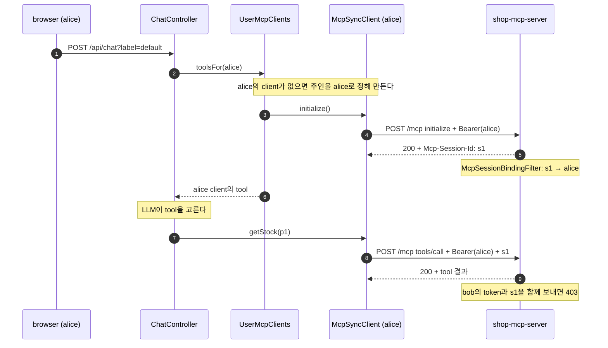
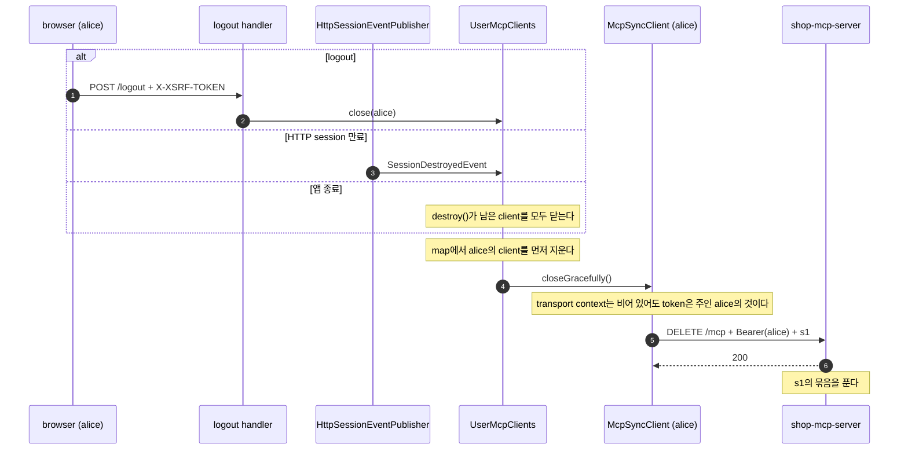

# mcp-security-authn-chat-memory

이 practice는 [official practice](../mcp-security-authn-official/README.md)에 사용자별 대화 기억을 더한다.
agent는 대화를 사용자마다 따로 기억하고, MCP client도 사용자마다 따로 연다.
MCP Server는 MCP session을 그 session을 연 사용자에 묶는다.
login부터 MCP 호출까지의 흐름은 official과 같은 클래스로 만들고, 그 흐름은 [MCP 안내서](../mcp-guide/README.md)가 설명한다.
이 README에서는 official과 다른 점만 본다.

## official과 다른 점

| 항목 | official | 이 practice |
|---|---|---|
| login 계정 | `user` 한 명 | `alice`와 `bob` 두 명 |
| 대화 기억 | 없다 | 사용자와 label마다 대화를 기억한다([대화 기억](#대화-기억)) |
| agent의 MCP client | Spring AI 자동 구성이 만든 client 하나를 모든 사용자가 같이 쓴다 | `UserMcpClients`가 사용자마다 client를 연다([사용자별 MCP client의 필요성](#사용자별-mcp-client의-필요성)) |
| MCP session | 사용자에 묶지 않는다 | `McpSessionBindingFilter`가 session을 연 사용자에 묶는다([MCP Server의 session 묶기](#mcp-server의-session-묶기)) |
| MCP 요청에 붙이는 token | 요청을 일으킨 사용자를 transport context에서 찾아 그 token을 붙인다 | client를 연 사용자(주인)의 token을 붙인다([token을 client 주인에게 묶는 이유](#token을-client-주인에게-묶는-이유)) |
| session 종료 `DELETE` | 앱이 끝날 때 token 없이 나간다 | logout, HTTP session 종료, 앱 종료 때 주인의 token을 붙여 보낸다([client를 닫는 때](#client를-닫는-때)) |

`auth-server`는 login 계정을 두는 `UserConfig`만 다르다.
MCP Server의 token 검증과 `Origin`·`Host`·`MCP-Protocol-Version` 검사, agent의 discovery·login·token request는 official과 같은 클래스다.
그 클래스들은 package 이름(`dev.starryeye.memoryauthn.*`)과 포트·client_id 같은 설정 값만 다르다.

## 구성

| module | 포트 | 역할 |
|---|---|---|
| `auth-server` | 9020 | Authorization Server다. `alice`와 `bob`의 login을 받고, `memory-agent`와 `local-mcp-client`에 token을 발급한다 |
| `shop-mcp-server` | 8131 | MCP Server(`/mcp`)다. official의 검사에 더해 MCP session을 연 사용자에 묶는다 |
| `shop-agent` | 8130 | browser 채팅 화면이 있는 agent다. 대화를 사용자마다 기억하고, MCP client를 사용자마다 연다 |

issuer는 `http://localhost:9020`이고, MCP Server의 resource는 `http://localhost:8131/mcp`다.
agent의 confidential client는 `memory-agent`이고, redirect URI는 `http://localhost:8130/login/oauth2/code/authserver`다.
public client `local-mcp-client`도 official과 같은 설정으로 등록돼 있다.
세 앱 모두 `127.0.0.1`에서만 연결을 받는다.

## 대화 기억

**`conversationId`는 서버가 만든다**

Spring AI의 `ChatMemory`는 `conversationId`마다 대화를 따로 저장한다.
client가 이 값을 정하게 하면, 다른 사용자의 `conversationId`를 넣어 그 대화를 읽을 수 있다.
그래서 `ChatController`는 login한 사용자의 `Authentication`에서 `conversationId`를 만든다.
client는 대화를 구분하는 이름인 label만 고른다.

`ConversationId.of(authentication, label)`은 `<사용자 이름>:<label>` 형식의 ID를 만든다.
label에서 영문, 숫자, 한글, `_`, `-`가 아닌 글자는 모두 `_`로 바꾼다.
구분자 `:`도 바뀌므로, bob이 label에 `alice:default`를 넣어도 ID는 `bob:alice_default`가 된다.
label이 비어 있으면 `default`를 쓴다.
MCP가 없는 [chat-memory practice](../chat-memory/README.md)는 client가 `conversationId` 전체를 보낸다.
그 practice는 사용자가 한 명이라서 이 방식으로도 문제가 없다.

**대화 API**

| 요청 | 하는 일 |
|---|---|
| `POST /api/chat?label=default` | 본문의 질문을 LLM에 보내고, 답을 `text/plain` stream으로 돌려준다 |
| `GET /api/conversations` | 내 `conversationId` 목록이다. 저장소 전체의 ID 가운데 `<사용자 이름>:`으로 시작하는 것만 남긴다 |
| `GET /api/conversations/{label}` | 내 대화 하나의 메시지 목록이다. 메시지마다 `role`과 `text`가 있다 |
| `DELETE /api/conversations/{label}` | 내 대화 하나를 비우고 `204`로 답한다 |

대화를 가리키는 API는 경로에서 label만 받고, 사용자 이름은 서버가 붙인다.
전체 `conversationId`를 받는 API가 없으므로, 다른 사용자의 대화를 가리킬 방법이 없다.
`DELETE /api/conversations/{label}`도 `/api/chat`처럼 CSRF를 검사하고, `index.html`이 `X-XSRF-TOKEN` header를 붙인다.
검사 방식은 [official README](../mcp-security-authn-official/README.md#안내서에서-다루지-않는-것)의 CSRF 항목과 같다.

**tool 결과가 남는 형식**

`ChatClientConfig`는 `MessageChatMemoryAdvisor`를 기본 advisor로 둔다.
이 advisor는 사용자의 질문과 LLM의 최종 답만 저장하고, tool 호출 결과 메시지는 저장하지 않는다.
그래서 tool이 조회한 재고 숫자는 LLM이 옮겨 적은 답 안에만 남는다.
저장 내용을 보면 `role`은 `user`와 `assistant`뿐이다.

## MCP session을 사용자에 묶기

session을 사용자에 묶어야 하는 이유와 official이 묶지 않는 이유는 [6장 session과 사용자](../mcp-guide/06-mcp-call-and-validation.md#67-session과-사용자)에 있다.
이 절은 이 practice가 묶는 방법을 agent 쪽과 MCP Server 쪽으로 나눠 본다.



[다이어그램 그림으로 보기](diagrams/README-1.png)

### 사용자별 MCP client의 필요성

official의 agent는 MCP client 하나를 모든 사용자가 같이 쓴다.
그 client의 session에는 채팅한 사용자마다 다른 token이 붙는다.
MCP Server가 session을 처음 연 사용자에 묶으면, 다른 사용자의 요청은 모두 막힌다.
그래서 이 practice의 agent는 사용자마다 MCP client를 따로 연다.

`application.yml`의 `spring.ai.mcp.client.enabled: false`가 Spring AI의 MCP client 자동 구성을 끈다.
대신 `UserMcpClients`가 사용자 이름마다 `McpSyncClient`를 하나씩 만든다.
연결 주소는 discovery의 출발점인 `mcp.authorization.resource-url`(`http://localhost:8131/mcp`)이다.
client는 그 사용자의 첫 채팅 때 만들고, 곧바로 `initialize`를 보낸다.
같은 사용자의 첫 요청이 동시에 와도 client는 하나만 열린다.
`initialize`가 실패하면 그 client를 닫고 오류를 그대로 올리며, 다음 채팅이 다시 연다.

`ChatClientConfig`는 MCP tool을 기본 tool로 두지 않는다.
`ChatController`가 요청마다 그 사용자 client의 tool만 LLM에 넘긴다.
그래서 LLM이 tool을 고르면, 요청한 사용자의 client가 그 사용자의 session으로 `tools/call`을 보낸다.

### MCP Server의 session 묶기

`shop-mcp-server`의 `SecurityConfig`는 `McpSessionBindingFilter`를 Spring Security의 `AuthorizationFilter` 뒤에 둔다.
그래서 이 filter에는 token 검증을 통과한 요청만 온다.
요청한 사용자는 `Authentication#getName()`, 곧 token의 `sub`다.

| 때 | filter가 하는 일 |
|---|---|
| transport가 `initialize` 응답에 `Mcp-Session-Id` header를 쓸 때 | 그 session ID를 요청한 사용자에 묶는다. 응답 본문이 나가기 전이라, client의 다음 요청 때는 이미 묶여 있다 |
| 요청의 `Mcp-Session-Id`가 다른 사용자에 묶여 있을 때 | method와 상관없이 `403`으로 거절한다. 다른 사용자는 남의 session을 `DELETE`로 끝낼 수도 없다 |
| 묶은 사용자의 `DELETE`가 `2xx`로 끝났을 때 | 묶음을 푼다. 그 뒤 이 session ID로 오는 요청은 transport가 모르는 session이라 `404`다 |
| 요청의 session ID가 누구에게도 묶여 있지 않을 때 | 그대로 통과시키고, 판단은 transport에 맡긴다 |

한 사용자가 여러 session을 열면 session마다 그 사용자에 묶인다.
묶음은 서버 메모리의 map에 있고, 성공한 `DELETE`로만 지워진다.

### token을 client 주인에게 묶는 이유

official의 `OAuth2TokenAttachingRequestCustomizer`는 요청마다 transport context에서 사용자를 찾는다([6장 token 붙이기](../mcp-guide/06-mcp-call-and-validation.md#68-agent가-token을-붙이는-방법)).
그 context는 MCP 요청을 일으킨 thread의 `SecurityContext`에서 온다.
그런데 client를 닫을 때 SDK가 보내는 session 종료 `DELETE`에는 빈 transport context가 넘어온다.
그래서 official의 agent는 앱이 끝날 때 이 `DELETE`를 token 없이 보낸다([8장 official이 지키지 못한 것](../mcp-guide/08-security.md#810-official이-지키지-못한-것)).

이 practice의 `OAuth2TokenAttachingRequestCustomizer`는 client를 만들 때 주인의 `Authentication`을 받는다.
요청마다 transport context를 보지 않고, 그 주인으로 token을 찾는다.
이렇게 하면 세 가지가 달라진다.

- session 종료 `DELETE`에도 주인의 token이 붙는다.
  그래서 `DELETE`가 `McpSessionBindingFilter`를 통과하고, MCP Server의 session과 묶음이 함께 정리된다.
- client 하나에는 한 사용자의 token만 붙는다.
  한 session에 다른 사용자의 token이 섞이지 않는다.
- reactor thread로 `SecurityContext`를 옮길 필요가 없다.
  official의 `SecurityMcpTransportContextProvider`와 `Hooks.enableAutomaticContextPropagation()`은 이 practice에 없다.

token을 찾는 manager는 official과 같은 `AuthorizedClientServiceOAuth2AuthorizedClientManager`다.
이 manager는 servlet 요청 없이 `Authentication`만으로 token을 찾는다.
그래서 HTTP session 만료나 앱 종료처럼 요청 밖에서 client를 닫을 때도 token을 붙인다.
이 차이는 [준수표](../mcp-guide/reference-compliance.md#준수표)의 36번 행에 있다.

### client를 닫는 때



[다이어그램 그림으로 보기](diagrams/README-2.png)

| 때 | 닫는 곳 |
|---|---|
| agent에서 logout할 때 | `SecurityConfig`가 더한 logout handler가 `UserMcpClients#close`를 부른다 |
| HTTP session이 끝날 때 | `HttpSessionEventPublisher`가 `SessionDestroyedEvent`를 알리고, `UserMcpClients#onSessionDestroyed`가 그 session 사용자의 client를 닫는다 |
| 앱이 끝날 때 | `UserMcpClients#destroy`가 남은 client를 모두 닫는다 |

client는 `closeGracefully()`로 닫고, 이때 SDK가 session 종료 `DELETE`를 보낸다([1장 `DELETE`로 session 끝내기](../mcp-guide/01-mcp-basics.md#18-5단계-delete로-session을-끝낸다)).
logout도 HTTP session을 끝내지만, client는 map에서 이미 지워져 있어 두 번 닫히지 않는다.
그 사용자의 다음 채팅은 새 client를 열고, 새 `initialize`로 새 session을 받는다.

이 방식에는 대가가 두 가지 있다.

- client는 사용자 이름마다 하나다.
  한 browser에서 logout하면, 같은 사용자가 다른 browser에서 쓰던 client도 닫힌다.
- 묶음은 성공한 `DELETE`로만 지워진다.
  agent가 `DELETE` 없이 끝나면, 그 session의 묶음은 MCP Server가 내려갈 때까지 남는다.

## 실행

준비물과 `run.sh`가 하는 일은 [official의 실행](../mcp-security-authn-official/README.md#실행)과 같다.

```bash
# 저장소 최상위 폴더에서
cd practice/mcp-security-authn-chat-memory
./run.sh
```

`run.sh`는 `auth-server`(9020) → `shop-mcp-server`(8131) → `shop-agent`(8130) 순서로 띄운다.
직접 띄울 때 순서를 지키지 않아도 되는 것도 official과 같다.
앱의 로그는 `practice/mcp-security-authn-chat-memory/logs/<module>.log`에 남는다.

browser에서 `http://localhost:8130/`을 열고 `alice`/`alice` 또는 `bob`/`bob`으로 login한다.
화면의 "대화 label" 칸이 label이고, "저장 내용 보기"와 "이 대화 비우기" 단추가 위의 대화 API를 부른다.

같은 browser의 창들은 cookie를 같이 써서 한 사용자로만 login된다.
두 사용자를 함께 쓰려면 한 사람은 일반 창, 다른 사람은 private 창에서 연다.
agent의 logout은 `auth-server`의 login session(`MEMAUTHSESSIONID` cookie)을 끝내지 않는다.
그래서 사용자를 바꿀 때도 창을 나눠서 연다.

**멈추기**

```bash
# practice/mcp-security-authn-chat-memory에서
./stop.sh
```

`stop.sh`는 9020·8131·8130 포트에서 연결을 기다리는 process를 내린다.
`./stop.sh --ollama`는 ollama도 함께 내린다.

## 코드 지도

official과 같은 클래스는 [official README의 코드 지도](../mcp-security-authn-official/README.md#코드-지도)에 있다.
아래는 이 practice에만 있거나 official과 다른 클래스다.
클래스는 `<module>/src/main/java/dev/starryeye/memoryauthn/<package>/`에 있고, `application.yml`은 `<module>/src/main/resources/`에 있다.

| module | 클래스 | 하는 일 | 설명 |
|---|---|---|---|
| `shop-agent` | `ConversationId` | `Authentication`과 label로 `<사용자 이름>:<label>` 형식의 ID를 만든다 | [대화 기억](#대화-기억) |
| | `ConversationController`, `MessageView` | 대화 목록·조회·비우기 API다. 사용자 이름은 서버가 붙인다 | [대화 기억](#대화-기억) |
| | `ChatMemoryConfig` | `MessageWindowChatMemory`로 대화마다 최근 메시지를 `chat.memory.max-messages`개(기본 20개)까지 둔다 | [대화 기억](#대화-기억) |
| | `ChatClientConfig` | `MessageChatMemoryAdvisor`를 기본 advisor로 둔다. MCP tool은 기본 tool로 두지 않는다 | [대화 기억](#대화-기억) |
| | `ChatController` | 요청마다 `conversationId`를 만들고, 그 사용자 client의 tool을 LLM에 넘긴다 | [사용자별 MCP client의 필요성](#사용자별-mcp-client의-필요성) |
| | `UserMcpClients` | 사용자 이름마다 `McpSyncClient`를 하나 만들어 첫 채팅 때 `initialize`한다. logout, HTTP session 종료, 앱 종료 때 닫는다 | [client를 닫는 때](#client를-닫는-때) |
| | `McpSecurityConfig` | `UserMcpClients` bean과 client마다의 transport, `HttpSessionEventPublisher`를 등록한다 | [사용자별 MCP client의 필요성](#사용자별-mcp-client의-필요성) |
| | `OAuth2TokenAttachingRequestCustomizer` | client를 만들 때 받은 주인의 token을 모든 MCP 요청에 붙인다 | [token을 client 주인에게 묶는 이유](#token을-client-주인에게-묶는-이유) |
| | `SecurityConfig` | official의 설정에 그 사용자의 client를 닫는 logout handler를 더한다 | [client를 닫는 때](#client를-닫는-때) |
| | `application.yml` | `spring.ai.mcp.client.enabled: false`로 MCP client 자동 구성을 끈다 | [사용자별 MCP client의 필요성](#사용자별-mcp-client의-필요성) |
| `shop-mcp-server` | `McpSessionBindingFilter` | `Mcp-Session-Id`를 token의 `sub`에 묶고, 다른 사용자의 요청을 `403`으로 거절한다 | [MCP Server의 session 묶기](#mcp-server의-session-묶기) |
| | `SecurityConfig` | official의 설정에 `McpSessionBindingFilter`를 더한다 | [MCP Server의 session 묶기](#mcp-server의-session-묶기) |
| `auth-server` | `UserConfig` | login 계정 `alice`/`alice`와 `bob`/`bob`을 둔다 | [구성](#구성) |

## 직접 확인할 것

`run.sh`로 띄운 뒤 `practice/mcp-security-authn-chat-memory`에서 실행한다.

| 해 볼 것 | 기대 결과 |
|---|---|
| `curl -i -X POST http://localhost:8131/mcp` | `401`과 `WWW-Authenticate: Bearer resource_metadata="http://localhost:8131/.well-known/oauth-protected-resource/mcp"` |
| alice가 label `default`로 `내 이름은 앨리스야`를 보낸 뒤, bob이 label `default`로 `내 이름 뭐야?`를 묻는다 | bob은 이름을 모른다고 답한다. bob의 "저장 내용 보기"에도 alice의 메시지가 없다 |
| bob이 label에 `alice:default`를 넣고 채팅한 뒤, 같은 창에서 `http://localhost:8130/api/conversations`를 연다 | `bob:default`와 `bob:alice_default`만 보인다. alice의 `default` 대화는 그대로다 |
| alice가 label `work`로 `내 취미는 등산이야`를 보낸 뒤, label `default`로 `내 취미 뭐야?`를 묻는다 | 모른다고 답한다. 같은 사용자라도 label이 다르면 대화가 섞이지 않는다 |
| `grep '질문 수신' logs/shop-agent.log` | `conversationId=alice:default`처럼 사용자 이름이 앞에 붙은 ID가 찍힌다 |
| `grep '호출' logs/shop-mcp-server.log` | tool을 부른 사람에 따라 `사용자=alice`나 `사용자=bob`이 찍힌다 |
| `shop-mcp-server`와 `shop-agent` 폴더에서 각각 `./gradlew test` | session 묶기와 `403`, 사용자별 client, 닫을 때 `DELETE`에 붙는 token을 확인하는 테스트가 통과한다 |

LLM의 답은 `qwen3:8b`의 출력이라 문장이 매번 조금씩 다르다.
`./gradlew test` 전에는 `JAVA_HOME`을 Java 21로 맞춘다.
sdkman으로 설치했다면 [official의 실행](../mcp-security-authn-official/README.md#실행)에 있는 `export JAVA_HOME=...` 줄을 쓴다.

token이 필요한 요청은 캡처 스크립트로 기록해 본다.
스크립트의 기본값은 official이므로, 이 practice의 주소와 계정을 환경 변수로 넘긴다.

```bash
# practice/mcp-security-authn-chat-memory에서. 출력에는 token 원문이 남는다
AS=http://localhost:9020 MCP_BASE=http://localhost:8131 \
  CLIENT_ID=memory-agent CLIENT_SECRET=memory-agent-secret \
  REDIRECT_URI=http://localhost:8130/login/oauth2/code/authserver \
  LOGIN_USERNAME=alice LOGIN_PASSWORD=alice \
  ../../docs/superpowers/captures/mcp-authorization-walkthrough.sh > /tmp/chat-memory-walkthrough.txt

# public client local-mcp-client의 흐름. JWT는 앞 20자만 남는다
AS=http://localhost:9020 MCP_BASE=http://localhost:8131 \
  LOGIN_USERNAME=alice LOGIN_PASSWORD=alice \
  CONFIDENTIAL_CLIENT_ID=memory-agent CONFIDENTIAL_CLIENT_SECRET=memory-agent-secret \
  CONFIDENTIAL_REDIRECT_URI=http://localhost:8130/login/oauth2/code/authserver \
  ../../docs/superpowers/captures/mcp-authorization-public-client.sh > /tmp/chat-memory-public-client.txt
```

첫 스크립트의 access token payload에서 `sub`가 `alice`이고 `aud`가 `http://localhost:8131/mcp`인 것을 볼 수 있다.
같은 방법으로 받은 기록이 [chat-memory 캡처](../../docs/superpowers/captures/2026-09-12-chat-memory.txt)와 [chat-memory public client 캡처](../../docs/superpowers/captures/2026-09-25-chat-memory-public-client.txt)에 있다.

## 더 읽을 것

- [MCP 안내서](../mcp-guide/README.md): official practice로 MCP와 MCP authorization을 설명한다.
- [6장 session과 사용자](../mcp-guide/06-mcp-call-and-validation.md#67-session과-사용자): session을 사용자에 묶는 이유를 설명한다.
- [8장 session hijacking](../mcp-guide/08-security.md#89-session-hijacking): session ID를 가로챈 공격과 그 방어를 설명한다.
- [부록: 명세 준수표](../mcp-guide/reference-compliance.md): 세 practice가 명세 항목을 어디까지 지키는지 모았다.
- [mcp-security-authn-official](../mcp-security-authn-official/README.md): 이 practice의 바탕이 된 practice다.
- [chat-memory](../chat-memory/README.md): MCP 없이 대화 기억만 다루는 practice다.
