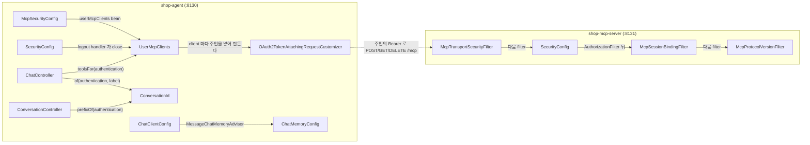
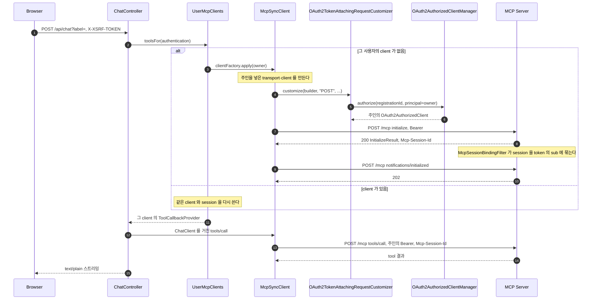
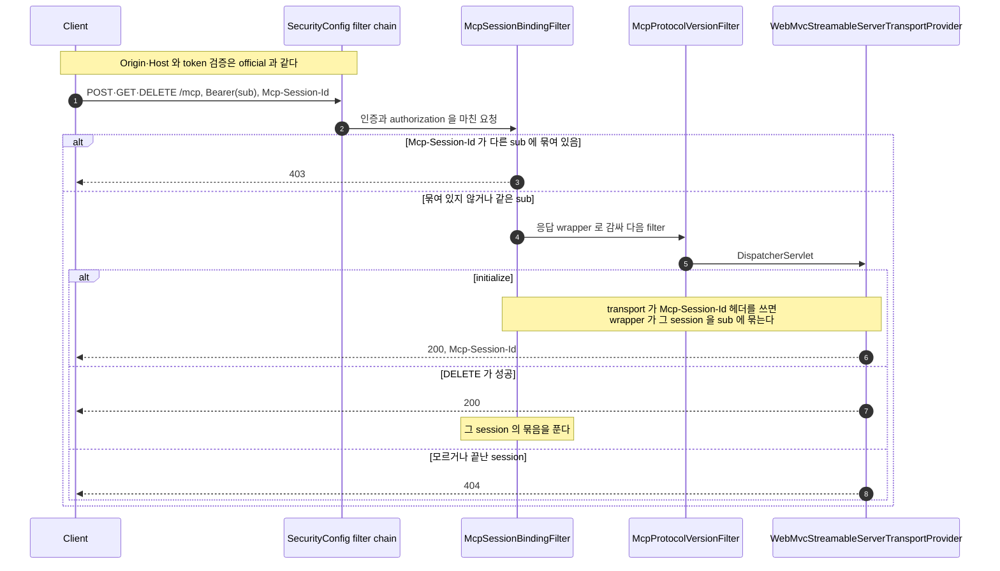
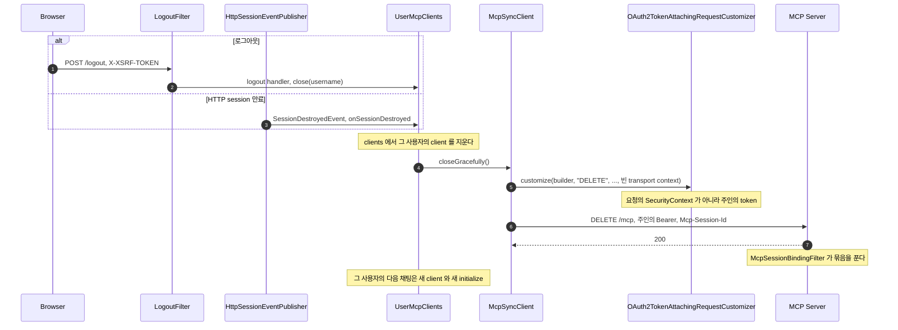
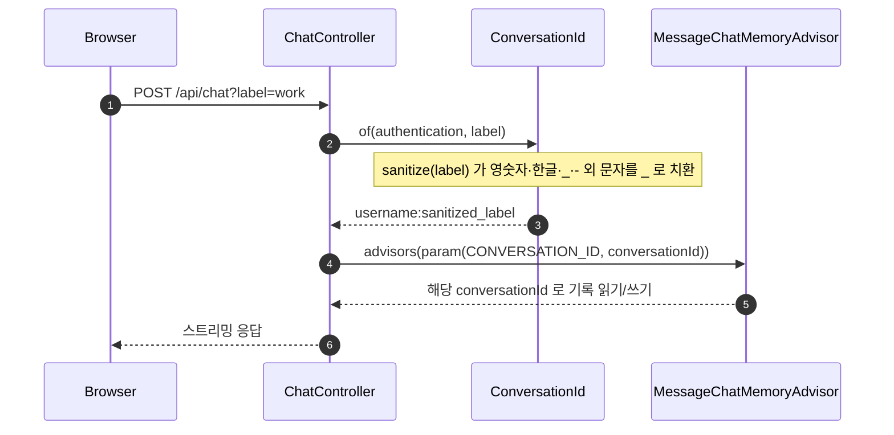
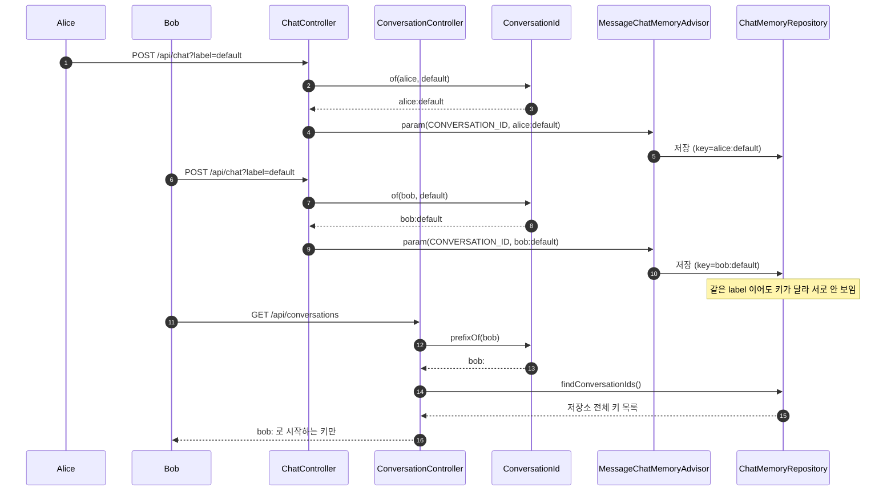
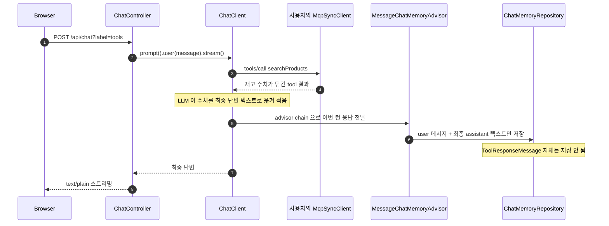

# mcp-security-authn-chat-memory 시퀀스

이 practice 는 [official 의 SEQUENCES.md](../mcp-security-authn-official/SEQUENCES.md) 와 같은 클래스로 authorization 흐름을 만든다. official 과 같은 절은 링크 한 줄로 두고, 사용자별 MCP client·session binding·대화 기억처럼 다른 점만 그린다.

## 목차

| 앵커 | 다이어그램 | 담는 것 |
|---|---|---|
| [`modules`](#modules) | flowchart | 구성 — official 에 더하거나 바꾼 클래스 |
| [`registration`](#registration) | 없음 | 등록 — official 과 같음, 값만 다르다 |
| [`authorization`](#authorization) | 없음 | 로그인·discovery·token request — official 과 같음 |
| [`mcp-call`](#mcp-call) | sequence | 첫 채팅의 사용자별 client 생성·`initialize`·session binding, tool 호출 |
| [`mcp-server-validation`](#mcp-server-validation) | sequence | MCP Server 의 `McpSessionBindingFilter` 판정 |
| [`mcp-session-end`](#mcp-session-end) | sequence | 로그아웃·HTTP session 종료 때 client 를 닫고 `DELETE` 로 session 을 끝낸다 |
| [`conversation-id`](#conversation-id) | sequence | `Authentication` → `ConversationId` → `ChatClient` advisor |
| [`memory-read-write`](#memory-read-write) | sequence | alice·bob 이 같은 label 로 요청해도 저장소 키가 달라 안 섞이는 흐름, 조회 API 의 접두사 강제 |
| [`tool-memory`](#tool-memory) | sequence | tool 호출 결과가 memory 에 어떤 메시지로 남는지 |

---

## 1. 구성 — 더하거나 바꾼 클래스

official 의 [구성](../mcp-security-authn-official/SEQUENCES.md#modules) 에서 Agent 의 MCP client 구성과 MCP Server 의 filter 하나가 다르다. official 의 `SecurityMcpTransportContextProvider` 는 없고, token 은 client 를 만들 때 정한 주인의 것을 붙인다. 실선은 같은 프로세스 안의 호출이나 filter 순서, 점선은 프로세스 사이 HTTP 호출이다.

각 클래스의 역할은 [README.md 의 직접 쓴 코드 표](README.md#직접-쓴-코드)에 있다.

---

## 2. 등록

official 의 [등록](../mcp-security-authn-official/SEQUENCES.md#registration) 과 같다. `auth-server` 의 yml pre-registration, 검증기 체인(`ResourceIndicatorValidator` → `PublicClientScopeValidator`), Agent 의 자격증명 binding 이 모두 같은 클래스다.

다른 것은 값뿐이다. confidential client 는 `memory-agent` 이고, 로그인 계정은 `UserConfig` 의 `alice`·`bob` 두 명이다. 값 전체는 [허브의 포트·계정 표](../MCP-AUTHORIZATION.md#s2-ports) 에 있다.

---

## 3. Authorization — 로그인·discovery·token request

Agent 로그인, discovery, Authorization Server 의 내부 호출 순서는 official 과 같은 클래스라 흐름도 같다. 흐름은 official 의 [Agent 로그인](../mcp-security-authn-official/SEQUENCES.md#agent-login) · [Discovery 내부 순서](../mcp-security-authn-official/SEQUENCES.md#discovery) · [Authorization Server 내부](../mcp-security-authn-official/SEQUENCES.md#as-internals) 에 있다.

로그인으로 받은 `OAuth2AuthorizedClient` 는 official 처럼 `InMemoryOAuth2AuthorizedClientService` 에 저장된다. 사용자별 MCP client 의 customizer 가 요청 thread 밖에서도 주인의 `Authentication` 으로 이 token 을 꺼낸다([MCP 호출](#mcp-call)).

---

## 4. `/api/chat` 에서 MCP Server 호출까지

official 의 [MCP 호출](../mcp-security-authn-official/SEQUENCES.md#mcp-call) 과 달리, 모든 사용자가 나눠 쓰는 client 가 없다. `UserMcpClients` 가 사용자의 첫 채팅 때 그 사용자만의 client 를 만들고 `initialize` 하며, MCP Server 는 그때 받은 session 을 그 사용자에 묶는다. 표준 흐름은 [MCP session](../MCP-SEQUENCES.md#rt-mcp-session) 이다.

**단계**

1. Browser 가 `X-XSRF-TOKEN` 을 실어 `/api/chat` 을 부른다. CSRF 와 로그인 확인은 official 과 같다([API](API-SPEC.md#api-chat)).
2. `ChatController` 가 `UserMcpClients#toolsFor(authentication)` 을 부른다. principal 이름을 키로 `computeIfAbsent` 하므로, 같은 사용자의 동시 첫 요청도 client 를 하나만 연다.
3. client 가 없으면 `McpSecurityConfig` 가 준 factory 가 `HttpClientStreamableHttpTransport` 와 `McpSyncClient` 를 만든다. transport 의 `OAuth2TokenAttachingRequestCustomizer` 에는 이 사용자의 `Authentication` 이 주인으로 들어간다.
4. transport 는 요청마다 customizer 를 부른다. customizer 는 요청의 `SecurityContext` 가 아니라 주인으로 token 을 찾는다.
5. `OAuth2AuthorizedClientManager#authorize` 에 registration ID 와 주인을 넘긴다.
6. 매니저가 주인의 token 을 돌려주고, 만료가 가까우면 refresh 한다. refresh 는 official 과 같다([만료와 refresh](../MCP-SEQUENCES.md#rt-refresh)).
7. `UserMcpClients` 가 `initialize` 를 부른다. 실패하면 client 를 닫고 예외를 올려, 다음 요청이 다시 연다(테스트 `UserMcpClientsTest#initialize_가_실패하면_client_를_닫고_다음_요청에서_다시_연다`).
8. MCP Server 가 `Mcp-Session-Id` 를 발급한다. 응답 헤더를 쓰는 순간 `McpSessionBindingFilter` 가 그 session 을 token 의 `sub` 에 묶는다([요청 검증](#mcp-server-validation)).
9. SDK client 가 `notifications/initialized` 를 보낸다. 이때부터 요청에 `Mcp-Session-Id` 와 `MCP-Protocol-Version` 이 실린다.
10. MCP Server 가 `202` 로 받는다. 이 client 와 session 은 이제 이 사용자 전용이다(테스트 `#사용자마다_다른_client_를_열고_initialize_한다`).
11. `UserMcpClients` 가 그 client 의 `ToolCallbackProvider` 를 돌려준다. client 가 이미 있으면 3~10 없이 그대로 쓴다(테스트 `#같은_사용자는_client_를_다시_쓴다`).
12. `ChatController` 는 이 provider 를 `toolCallbacks(...)` 로 이번 요청에만 넘기고, `ChatClientConfig` 는 MCP tool 을 기본값으로 두지 않는다. LLM 이 tool 을 고르면 그 사용자의 client 가 `tools/call` 을 보낸다(테스트 `ChatControllerTest#요청한_사용자의_MCP_tool_을_넘긴다`).
13. 요청에는 주인의 Bearer 와 그 session 의 `Mcp-Session-Id` 가 실린다. reactor thread 에서 돌아도 token 은 주인의 것이라 context propagation 이 필요 없다.
14. token 의 `sub` 가 session 을 연 사용자와 같아 `McpSessionBindingFilter` 를 통과하고, tool 결과가 돌아온다.
15. 최종 답은 official 처럼 `text/plain` 으로 스트리밍된다. 대화 기억은 [conversationId 파생](#conversation-id) 에 있다.

---

## 5. MCP Server 의 요청 검증 — session binding

`Origin`·`Host`, token, `MCP-Protocol-Version`, transport 의 검증은 official 의 [요청 검증](../mcp-security-authn-official/SEQUENCES.md#mcp-server-validation) 과 같다. 다른 것은 Spring Security filter chain 안 `AuthorizationFilter` 뒤에 선 `McpSessionBindingFilter` 다. 인증된 요청만 이 filter 에 닿고, `MCP-Protocol-Version` 검증은 그 뒤에 온다.

**단계**

1. 요청은 official 과 같이 `McpTransportSecurityFilter` 와 Bearer token 검증을 먼저 통과한다. 실패하면 `403`·`421`·`401` 로 끝나 이 filter 에 닿지 않는다.
2. `SecurityConfig` 는 `addFilterAfter(new McpSessionBindingFilter(), AuthorizationFilter.class)` 로 이 filter 를 인증과 authorization 뒤에 건다. 요청한 사용자는 `Authentication#getName()`, 곧 token 의 `sub` 다.
3. 요청의 `Mcp-Session-Id` 가 다른 사용자에게 묶여 있으면 method 와 관계없이 `403` 이다. 테스트: `McpAuthorizationStandardTest#다른_사용자가_남의_MCP_session_ID_를_쓰면_403이다`, `#다른_사용자는_남의_MCP_session_을_끝낼_수_없다`.
4. 묶여 있지 않거나 같은 사용자면 응답을 wrapper 로 감싸 다음 filter 로 넘긴다. `McpProtocolVersionFilter` 는 `FilterRegistrationBean` 기본 순서라 Spring Security 다음에 돈다.
5. 요청이 transport 에 닿는다. session ID 와 `400`·`404` 판단은 official 과 같다.
6. `initialize` 응답에서 transport 가 `Mcp-Session-Id` 헤더를 쓰면, wrapper 가 본문보다 먼저 그 session 을 사용자에 묶는다. 같은 사용자가 연 여러 session 은 모두 그 사용자에 묶인다(테스트 `#한_사용자가_연_여러_session_은_모두_그_사용자에_묶인다`).
7. 묶은 사용자의 `DELETE` 가 `2xx` 로 끝나면 filter 가 묶음을 푼다. 묶음은 이 경로로만 지워진다.
8. 끝난 session ID 는 묶음이 없어 filter 를 지나고, transport 가 `404` 를 준다(테스트 `#DELETE_로_끝난_session_은_묶음이_풀리고_transport_가_모르는_session_으로_404_를_준다`). client 는 새 `initialize` 로 다시 시작해야 한다([허브 4.8](../MCP-AUTHORIZATION.md#s4-8)).

---

## 6. 로그아웃과 HTTP session 종료 — MCP session 끝내기

사용자의 client 는 로그아웃, HTTP session 종료, 애플리케이션 종료 때 닫힌다. 닫힐 때 SDK 가 `DELETE /mcp` 로 MCP session 을 끝내고, 이 요청에도 주인의 token 이 실린다. 표준 흐름은 [MCP session](../MCP-SEQUENCES.md#rt-mcp-session) 의 `DELETE` 다.

**단계**

1. 사용자가 `X-XSRF-TOKEN` 을 실어 `POST /logout` 을 보낸다([API](API-SPEC.md#logout)).
2. `SecurityConfig` 가 더한 logout handler 가 `UserMcpClients#close(authentication.getName())` 을 부른다(테스트 `ChatControllerTest#로그아웃하면_그_사용자의_MCP_client_를_닫는다`).
3. HTTP session 이 만료되면 `HttpSessionEventPublisher` 가 `SessionDestroyedEvent` 를 내고, `UserMcpClients#onSessionDestroyed` 가 그 session 사용자의 client 를 닫는다(테스트 `UserMcpClientsTest#HTTP_session_이_끝나면_그_session_사용자의_client_를_닫는다`). 로그아웃도 HTTP session 을 끝내지만, client 는 이미 지워져 두 번 닫지 않는다.
4. `UserMcpClients` 는 map 에서 client 를 먼저 지우고 `closeGracefully()` 를 부른다. 애플리케이션 종료 때는 `destroy()` 가 모든 client 를 닫는다(테스트 `#종료할_때_모든_client_를_닫는다`).
5. SDK transport 는 session 종료 `DELETE` 에 빈 `McpTransportContext` 를 넘긴다. customizer 는 요청 thread 의 `SecurityContext` 대신 주인으로 token 을 찾아 붙인다(테스트 `OAuth2TokenAttachingRequestCustomizerTest#transport_context_없이_나가는_session_종료_DELETE_에도_토큰을_붙인다`).
6. `DELETE /mcp` 는 session 을 연 사용자의 token 을 실어 `McpSessionBindingFilter` 를 통과한다.
7. transport 가 `200` 으로 session 을 끝내고([`DELETE /mcp`](../MCP-API-SPEC.md#mcp-delete)), filter 가 묶음을 푼다. 이후 그 session ID 는 `404` 다.

client 는 principal 이름마다 하나라, 한 browser 의 로그아웃은 같은 사용자가 다른 browser 에서 쓰던 client 도 닫는다.
그 사용자의 다음 채팅은 [MCP 호출](#mcp-call) 의 첫 채팅처럼 새 client 와 새 session 을 연다(테스트 `UserMcpClientsTest#닫으면_session_을_끝내고_다음_요청은_새_client_를_연다`).
서버의 묶음은 성공한 `DELETE` 로만 지워지므로, `DELETE` 없이 끝난 client 의 session 은 서버가 끝날 때까지 묶음 표에 남는다.

---

## 7. conversationId 파생

로그인한 사용자의 `Authentication` 이 `label` 과 합쳐져 `ChatMemory` 가 쓰는 conversationId 가 되는 과정이다.

**단계**

1. Browser 가 `label` 을 담아 `/api/chat` 을 호출한다. `label` 을 생략하면 3단계의 `sanitize` 가 `default` 를 쓴다.
2. `ChatController#chat` 이 `ConversationId.of(authentication, label)` 을 부른다. API 는 [`api-chat`](API-SPEC.md#api-chat).
3. `ConversationId.sanitize` 가 `label` 의 영숫자·한글·`_`·`-` 외 문자를 모두 `_` 로 바꾼다. 구분자 `:` 도 바뀌므로 이 한 단계가 네임스페이스 위조를 막는다.
4. 완성된 `<username>:<sanitized_label>` 을 `.advisors(a -> a.param(ChatMemory.CONVERSATION_ID, conversationId))` 로 넘긴다.
5. `MessageChatMemoryAdvisor` 가 그 conversationId 로 기존 대화를 읽고, 응답 후 새 메시지를 같은 키로 저장한다.

---

## 8. 두 사용자, 같은 label

alice 와 bob 이 같은 `label`(`default`)로 요청해도 저장소 키가 달라 섞이지 않는 흐름과, 목록 조회 API 가 접두사를 강제하는 흐름이다.

**단계**

1. alice 가 `label=default` 로 채팅을 보내면 `ConversationId.of` 가 `alice:default` 를 만들고, `MessageChatMemoryAdvisor` 가 그 키로 저장한다.
2. bob 이 같은 `label=default` 로 보내도 `ConversationId.of` 가 `bob:default` 를 만들어 `MessageChatMemoryAdvisor` 가 다른 키로 저장한다 — `label` 이 같아도 접두사가 다르면 완전히 다른 대화다.
3. bob 이 `GET /api/conversations` 를 호출하면 `ConversationController` 가 `ConversationId.prefixOf(bob)`(`bob:`)를 구한다. API 는 [`api-conversations`](API-SPEC.md#api-conversations).
4. `ChatMemoryRepository.findConversationIds()` 는 저장소 전체 키를 알지만, `ConversationController` 가 `bob:` 로 시작하는 것만 걸러 돌려준다.
5. bob 이 label 에 `alice:default` 를 넣어도 `sanitize` 가 `:` 를 `_` 로 바꿔 `bob:alice_default` 가 되므로 alice 의 네임스페이스에는 닿지 않는다.

---

## 9. tool 호출 결과가 memory 에 남는 형태

MCP tool 호출 결과가 원본 형식이 아니라 최종 답변 텍스트로 저장소에 남는 흐름이다.

**단계**

1. Browser 가 `/api/chat` 으로 재고를 묻는다. `ChatController` 는 메시지를 그대로 `ChatClient` 에 넘긴다.
2. LLM 이 `searchProducts` 를 부르기로 결정하면 그 사용자의 MCP client 가 `tools/call` 을 보내고, 재고 수치가 담긴 결과를 받는다([MCP 호출](#mcp-call)).
3. LLM 은 그 결과를 소비해 최종 답변 텍스트를 만든다 — 수치(예: 7, 23)가 텍스트 안에 그대로 옮겨진다.
4. `MessageChatMemoryAdvisor` 는 이번 턴의 user 메시지와 최종 assistant 텍스트만 `ChatMemoryRepository` 에 저장한다. `ToolResponseMessage` 는 저장 대상이 아니다.
5. 그 결과 저장소에는 `user`·`assistant` 두 역할만 남고, tool 이 조회한 값은 assistant 텍스트를 통해서만 남는다. 예시는 [`api-conversation-get`](API-SPEC.md#api-conversation-get).
