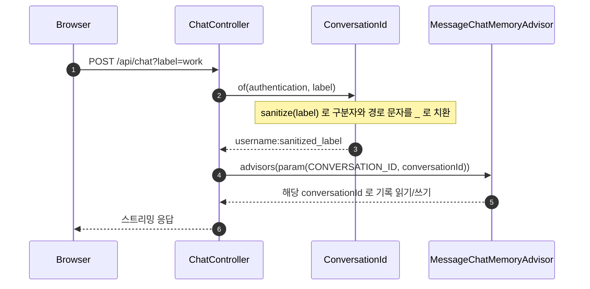
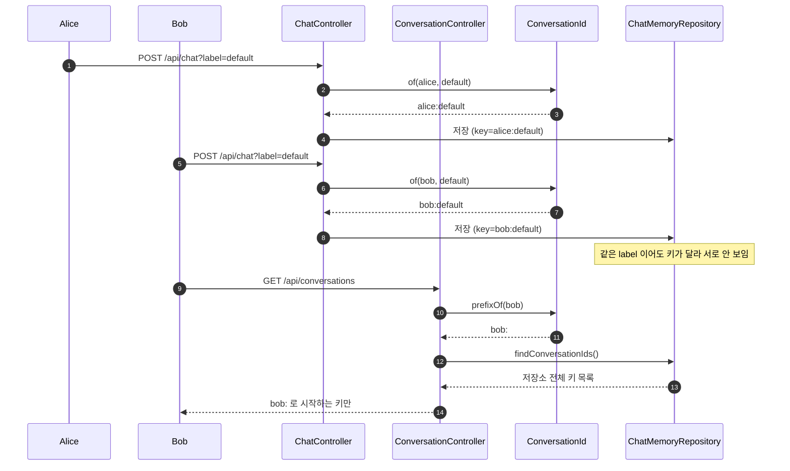
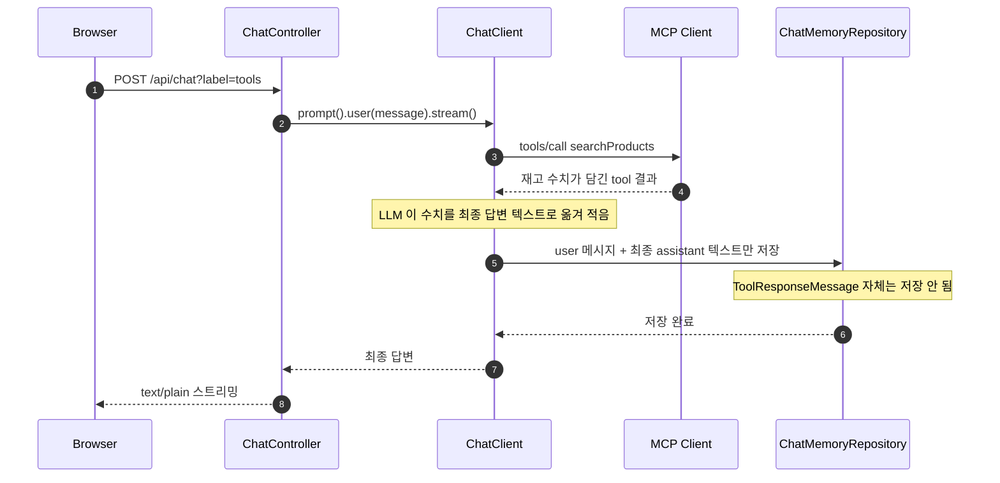

# mcp-security-authn-chat-memory 시퀀스

authorization 흐름(discovery·로그인·token 교환)은 official 과 같은 클래스로 이미 그려져 있다 — [`agent-login`](../mcp-security-authn-official/SEQUENCES.md#agent-login) 으로 링크한다. 이 문서는 그 위에 얹은 대화 기억·격리만 그린다.

## 목차

| 앵커 | 다이어그램 | 담는 것 |
|---|---|---|
| [`conversation-id`](#conversation-id) | sequence | `Authentication` → `ConversationId` → `ChatClient` advisor |
| [`memory-read-write`](#memory-read-write) | sequence | alice·bob 이 같은 label 로 요청해도 저장소 키가 달라 안 섞이는 흐름, 조회 API 의 접두사 강제 |
| [`tool-memory`](#tool-memory) | sequence | tool 호출 결과가 memory 에 어떤 메시지로 남는지 |

---

## 1. conversationId 파생

로그인한 사용자의 `Authentication` 이 `label` 과 합쳐져 `ChatMemory` 가 쓰는 conversationId 가 되는 과정이다. 호출 순서는 `ChatController`·`ConversationId` 소스를 대조해 확인했다.

**단계**

1. Browser 가 `label` 을 담아 `/api/chat` 을 호출한다. `label` 을 생략하면 3단계의 `sanitize` 가 `default` 를 쓴다.
2. `ChatController#chat` 이 `ConversationId.of(authentication, label)` 을 부른다. API 는 [`api-chat`](API-SPEC.md#api-chat).
3. `ConversationId.sanitize` 가 `label` 의 구분자(`:`)와 경로 문자를 모두 `_` 로 바꾼다 — 이 한 단계가 네임스페이스 위조를 막는다.
4. 완성된 `<username>:<sanitized_label>` 을 `.advisors(a -> a.param(ChatMemory.CONVERSATION_ID, conversationId))` 로 넘긴다.
5. `MessageChatMemoryAdvisor` 가 그 conversationId 로 기존 대화를 읽고, 응답 후 새 메시지를 같은 키로 저장한다.

---

## 2. 두 사용자, 같은 label

alice 와 bob 이 같은 `label`(`default`)로 요청해도 저장소 키가 달라 섞이지 않는 흐름과, 목록 조회 API 가 접두사를 강제하는 흐름이다.

**단계**

1. alice 가 `label=default` 로 채팅을 보내면 `ConversationId.of` 가 `alice:default` 를 만들고 그 키로 저장된다.
2. bob 이 같은 `label=default` 로 보내도 `ConversationId.of` 가 `bob:default` 를 만들어 서로 다른 키로 저장된다 — `label` 이 같아도 접두사가 다르면 완전히 다른 대화다.
3. bob 이 `GET /api/conversations` 를 호출하면 `ConversationController` 가 `ConversationId.prefixOf(bob)`(`bob:`)를 구한다. API 는 [`api-conversations`](API-SPEC.md#api-conversations).
4. `ChatMemoryRepository.findConversationIds()` 는 저장소 전체 키를 알지만, `ConversationController` 가 `bob:` 로 시작하는 것만 걸러 돌려준다.
5. bob 이 label 에 `alice:default` 를 넣어도 `sanitize` 가 `:` 를 `_` 로 바꿔 `bob:alice_default` 가 되므로 alice 의 네임스페이스에는 닿지 않는다.

---

## 3. tool 호출 결과가 memory 에 남는 형태

MCP tool 호출 결과가 원본 형식이 아니라 최종 답변 텍스트로 저장소에 남는 흐름이다.

**단계**

1. Browser 가 `/api/chat` 으로 재고를 묻는다. `ChatController` 는 메시지를 그대로 `ChatClient` 에 넘긴다.
2. LLM 이 `searchProducts` 를 부르기로 결정하면 MCP Client 가 `tools/call` 을 보내고, 재고 수치가 담긴 결과를 받는다.
3. LLM 은 그 결과를 소비해 최종 답변 텍스트를 만든다 — 수치(예: 7, 23)가 텍스트 안에 그대로 옮겨진다.
4. `MessageChatMemoryAdvisor` 는 이번 턴의 user 메시지와 최종 assistant 텍스트만 `ChatMemoryRepository` 에 저장한다. `ToolResponseMessage` 는 저장 대상이 아니다.
5. 그 결과 저장소에는 `user`·`assistant` 두 역할만 남고, tool 이 조회한 값은 assistant 텍스트를 통해서만 남는다. 예시는 [`api-conversation-get`](API-SPEC.md#api-conversation-get).
