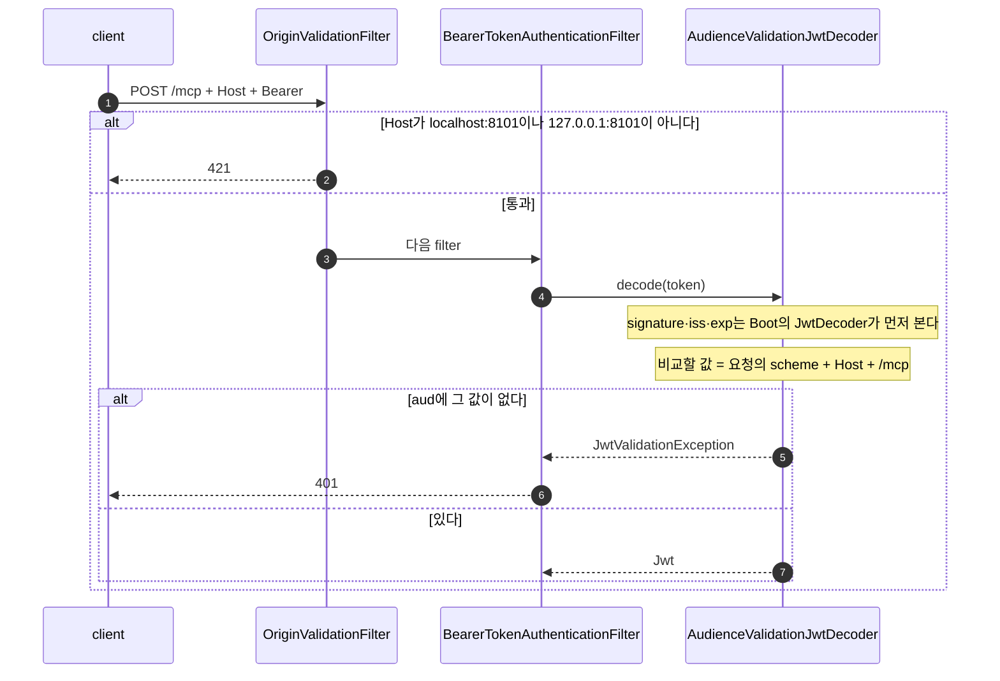

# mcp-security-authn-community

이 practice는 [official practice](../mcp-security-authn-official/README.md)와 같은 MCP authorization 흐름을 spring-ai-community의 MCP 보안 module 0.1.14로 만든다.
module의 자동 구성이 filter chain과 token 처리의 뼈대를 만들고, 이 practice는 module이 열어 둔 확장점에 설정을 더한다.
module이 하지 않는 일은 official과 같은 클래스로 채운다.
흐름과 규칙은 [MCP 안내서](../mcp-guide/README.md)에서 읽고, 이 README에서는 official과 다른 점만 본다.
module의 소스와 문서는 [spring-ai-community/mcp-security](https://github.com/spring-ai-community/mcp-security)에 있다.

## official과 다른 점

- 세 앱의 보안 설정을 module의 자동 구성과 확장점으로 만든다.
  official의 클래스가 무엇으로 바뀌었는지는 [대체 표](#대체-표)에 있다.
- MCP Server는 token의 `aud`와 비교할 값을 설정이 아니라 요청 URL로 계산한다.
  그래서 `Host` 검사가 audience 검증의 전제가 된다([Host 검증과 audience 계산](#host-검증과-audience-계산)).
- agent는 PRM을 요청하기 전에 그 URL의 scheme을 module의 검증기로 확인한다([준수표에서 official과 다른 곳](#준수표에서-official과-다른-곳)).
- MCP Server가 `Origin`이나 `Host`를 거절할 때 본문이 JSON-RPC 오류 형식이다.
- 포트와 client_id가 official과 달라서 두 practice를 함께 띄울 수 있다.

## 구성

| module | 포트 | 역할 | 쓰는 보안 module |
|---|---|---|---|
| `auth-server` | 9000 | Authorization Server다. `user`의 login을 받고, `shop-agent`와 `local-mcp-client`에 token을 발급한다 | `mcp-authorization-server-spring-boot` |
| `shop-mcp-server` | 8101 | MCP Server(`/mcp`)다. 요청마다 token을 검증하고, `getStock`·`searchProducts` tool을 제공한다 | `mcp-server-security-spring-boot` |
| `shop-agent` | 8100 | browser 채팅 화면이 있는 agent다. confidential client `shop-agent`로 받은 token을 MCP 요청에 붙인다 | `mcp-client-security-spring-boot` |

issuer는 `http://localhost:9000`이고, MCP Server의 resource는 `http://localhost:8101/mcp`다.
agent의 redirect URI는 `http://localhost:8100/login/oauth2/code/authserver`이고, login 계정은 official과 같은 `user`/`password`다.
session cookie 이름은 `AUTHSERVERSESSIONID`와 `SHOPAGENTSESSIONID`다.
세 앱은 Spring Boot 4.1.0의 servlet 앱이고, `127.0.0.1`에서만 연결을 받는다.

## module 소개

세 앱은 이름이 `-spring-boot`로 끝나는 module을 하나씩 쓴다.
이 module은 이름에 `-spring-boot`가 없는 core module을 함께 가져오고, 그 위에 Spring Boot 자동 구성을 더한다.

| module | 자동 구성이 만드는 것 |
|---|---|
| `mcp-authorization-server-spring-boot` | Authorization Server용 filter chain과 form login용 filter chain을 만든다. token의 `aud`를 `resource`로 정하는 기본 customizer와 consent 판정도 넣는다 |
| `mcp-server-security-spring-boot` | `issuer-uri`가 있으면 모든 요청에 token을 요구하는 filter chain을 만든다. PRM, `401`의 `resource_metadata`, `Origin` 검사가 들어 있다 |
| `mcp-client-security-spring-boot` | MCP client에 인증을 담는 context provider를, transport에 token을 붙이는 customizer를 넣는다 |

module을 확장하는 방법은 앱마다 다르다.
`auth-server`는 `Customizer<McpAuthorizationServerConfigurer>` bean을 등록하고, 자동 구성이 그 bean을 순서대로 적용한다.
`shop-mcp-server`는 filter chain을 직접 정의하고 `McpServerOAuth2Configurer`를 적용한다.
MCP Server의 자동 구성에는 audience 검증을 켜는 설정이 없기 때문이다.
`shop-agent`는 module이 만드는 client 등록 정보(`ClientRegistrationRepository`)를 자기 bean으로 대신하고, token을 붙이는 일은 자동 구성에 맡긴다.

**오류 없이 기능이 빠지는 조건**

아래 조건을 어기면 오류 없이 module의 기능이 빠진다.

| 조건 | 어기면 생기는 일 |
|---|---|
| `spring.ai.mcp.client.type`이 `SYNC`다 | client 보안 자동 구성 전체가 빠져, MCP 요청에 token이 붙지 않는다 |
| `spring.security.oauth2.client.registration`의 등록이 정확히 하나다 | module의 token customizer는 WARN 한 줄을 남기고 아무 일도 하지 않는다. 이 practice에서는 `DiscoveredClientRegistrationRepository`가 먼저 기동을 멈춘다 |
| `auth-server`에는 `SecurityFilterChain` bean을 직접 정의하지 않는다 | `@ConditionalOnDefaultWebSecurity`가 module의 Authorization Server 설정 전체를 끈다 |
| `ChatController`가 `.contextWrite(...)`를 부른다 | reactor thread에서 인증을 찾지 못해 token이 붙지 않는다. agent에 남는 흔적은 DEBUG 한 줄뿐이다 |

MCP Server의 자동 구성에도 `@ConditionalOnDefaultWebSecurity`가 있다.
`shop-mcp-server`는 이 조건을 일부러 이용한다.
직접 정의한 filter chain이 자동 구성을 끄고, 그 자리에서 audience 검증을 켠다.
client 보안 자동 구성에는 이 조건이 없어서, `shop-agent`는 `SecurityFilterChain`을 직접 정의해도 된다.

## 대체 표

official의 클래스마다 module이 하는 일이나 확장점, 그리고 이 practice가 그 위에 얹은 것을 적는다.
"같은 클래스"는 official과 코드가 같은 클래스다.
클래스는 `<module>/src/main/java/dev/starryeye/<package>/`에 있다.

**`auth-server`** — package `authserver`

| official | module이 하는 일 또는 확장점 | 이 practice가 얹은 것 |
|---|---|---|
| `AuthorizationServerConfig`의 filter chain 두 개 | `McpAuthorizationServerAutoConfiguration`이 Authorization Server용과 form login용 filter chain을 만든다 | `McpAuthorizationStandardConfig`와 `OidcDiscoveryConfig`가 customizer bean으로 설정을 더한다 |
| `ResourceIndicatorValidator` | `McpAuthorizationServerConfigurer#authorizationCodeRequestValidator` | 같은 클래스를 Spring 기본 검증기 뒤에 잇는다 |
| `PublicClientScopeValidator` | 같은 확장점이다. module의 `McpNoScopeClientConsentNotRequired`는 scope가 없거나 `openid` 하나뿐인 요청의 consent를 건너뛴다 | 같은 클래스를 `ResourceIndicatorValidator` 뒤에 잇는다. 그런 public client 요청을 consent 판정 전에 `invalid_scope`로 거절한다 |
| `PublicClientConsentService` | Spring Authorization Server가 `OAuth2AuthorizationConsentService` bean을 쓴다 | 같은 클래스를 bean으로 등록한다 |
| `ResourceAudienceTokenCustomizer` | module의 `ResourceIdentifierAudienceTokenCustomizer`가 먼저 돌고, `OAuth2TokenCustomizer<JwtEncodingContext>` bean이 그 뒤에 돈다 | 같은 이름의 클래스를 bean으로 등록한다. ID token의 `aud`를 client_id로 되돌리는 분기가 있다(아래 설명) |
| token request의 `resource`가 여러 개일 때의 거절(`ResourceAudienceTokenCustomizer`) | `tokenEndpoint`의 `accessTokenRequestConverter` | `SingleResourceTokenRequestConverter`가 module customizer보다 먼저 `invalid_target`으로 거절한다 |
| `IssuerIdentifyingAuthorizationResponseHandler` | `authorizationEndpoint`의 `authorizationResponseHandler`·`errorResponseHandler` | 같은 클래스 |
| `ClientAuthenticationChallengeFailureHandler` | `clientAuthentication`의 `errorResponseHandler` | 같은 클래스 |
| metadata customizer(`iss` 지원, `none`, client 인증 signature 알고리즘) | Authorization Server Metadata와 OIDC discovery 문서의 customizer | `McpAuthorizationStandardConfig`가 official과 같은 값을 넣는다 |
| `.oidc(...)`로 켜는 OpenID Connect | module은 켜지 않는다. `/.well-known/openid-configuration`이 `404`다 | `OidcDiscoveryConfig`가 켠다 |
| `McpResourceProperties`, `UserConfig` | form login 화면은 module의 filter chain이 만든다 | 같은 클래스 |
| DCR을 켜지 않는다 | module은 DCR을 기본으로 켠다 | `spring.ai.mcp.authorizationserver.dynamic-client-registration.enabled: false`로 끈다. client는 Boot가 `application.yml`에서 등록한다 |

module의 `ResourceIdentifierAudienceTokenCustomizer`는 `openid`가 승인된 access token을 건너뛴다.
ID token에는 token request의 `resource`를 `aud`로 넣는다.
이 practice의 agent는 OIDC login으로 token을 받으므로, module만 쓰면 두 token의 `aud`가 뒤바뀐다.
access token의 `aud`는 client_id로 남고, ID token의 `aud`는 `resource`가 된다.
`ResourceAudienceTokenCustomizer`는 module customizer 뒤에 돌아 access token의 `aud`를 `resource`로 정하고, ID token의 `aud`를 client_id로 되돌린다.
두 token의 `aud`가 무엇이어야 하는지는 [5장 token의 내용](../mcp-guide/05-authorization-and-token.md#58-token의-내용-access-token과-id-token)에 있다.

**`shop-mcp-server`** — package `shopmcpserver`

| official | module이 하는 일 또는 확장점 | 이 practice가 얹은 것 |
|---|---|---|
| `SecurityConfig`의 filter chain | `McpServerSecurityAutoConfiguration`은 `issuer-uri`만으로 filter chain을 만들지만, audience 검증을 켜는 설정이 없다 | `SecurityConfig`가 filter chain을 직접 정의하고 `McpServerOAuth2Configurer`를 적용한다 |
| `issuer-uri`로 만든 JWT decoder(signature, `iss`, `exp`) | `McpServerOAuth2Configurer#jwtDecoder`에 넘긴 decoder를 쓴다. 넘기지 않으면 `NimbusJwtDecoder.withIssuerLocation(...)`으로 만든다 | Boot가 `issuer-uri`로 만든 `JwtDecoder`를 넘긴다 |
| `audiences` 설정의 `aud` 검증 | `validateAudienceClaim(true)`면 `AudienceValidationJwtDecoder`가 decoder를 감싼다. 비교할 값은 요청 URL로 계산한다 | 이 설정을 켠다([Host 검증과 audience 계산](#host-검증과-audience-계산)) |
| PRM(`protectedResourceMetadata`) | `McpServerOAuth2Configurer`가 PRM endpoint를 켠다 | `protectedResourceMetadataCustomizer`로 `authorization_servers`, `resource_name`, mTLS 미사용을 정한다 |
| `401`의 `resource_metadata`(`resourceMetadataEntryPoint`) | module의 `BearerResourceMetadataTokenAuthenticationEntryPoint`는 URL 값을 따옴표로 감싸지 않는다 | `oauth2ResourceServer(...)`로 official과 같은 entry point를 넣는다. `:`와 `/`가 든 값은 따옴표로 감싼다([RFC 9110 §11.2](https://www.rfc-editor.org/rfc/rfc9110#section-11.2)) |
| `McpTransportSecurityFilter`, `McpTransportConfig`(`Origin`·`Host` 검사) | `allowedOrigins`를 주면 `OriginValidationFilter`를 `CorsFilter` 뒤, 인증 filter 앞에 넣는다 | 허용 `Origin`은 `http://localhost:8101`이고, 허용 `Host`는 `localhost:8101`과 `127.0.0.1:8101`이다 |
| `McpProtocolVersionFilter` | 대응하는 기능이 없다 | 같은 클래스를 `McpProtocolVersionFilterConfig`가 MCP endpoint에만 등록한다. Spring Security 뒤에서 돈다 |
| session을 사용자에 묶지 않는다 | `McpServerOAuth2Configurer#sessionBinding(...)`이 있다 | 켜지 않는다. agent가 MCP client 하나를 모든 사용자와 같이 쓰기 때문이다 |
| `ProductTools`, `ProductRepository` | 없음 | 같은 클래스 |

**`shop-agent`** — package `shopagent`

| official | module이 하는 일 또는 확장점 | 이 practice가 얹은 것 |
|---|---|---|
| `McpAuthorizationDiscovery`(`401` → PRM → issuer 비교 → metadata) | `McpMetadataDiscoveryService`가 `401` challenge와 PRM을 읽고, PRM의 `resource`를 확인한다 | `McpAuthorizationDiscovery`가 challenge와 PRM은 module에 맡기고, 그 뒤의 issuer 비교와 Authorization Server Metadata 확인을 official과 같은 코드로 한다 |
| `DiscoveredClientRegistrationRepository` | module의 `mcpClientRegistrationRepository`는 `ClientRegistrationRepository` bean이 없을 때만 생긴다 | 같은 클래스를 bean으로 등록한다 |
| `McpSecurityConfig` | transport customizer와 context provider는 module이 등록한다 | discovery, client 등록 정보, token request client, `DefaultOAuth2AuthorizedClientManager`만 등록한다. module customizer가 servlet 요청을 함께 넘기므로 요청을 보는 manager를 쓴다 |
| `OAuth2TokenAttachingRequestCustomizer` | `HttpClientStreamableHttpTransportAutoConfiguration`이 `OAuth2AuthorizationCodeSyncHttpRequestCustomizer`를 transport에 넣는다 | 없음 |
| `SecurityMcpTransportContextProvider` | `McpOAuth2ClientAutoConfiguration`이 `AuthenticationMcpTransportContextProvider`를 MCP client에 넣는다 | 없음 |
| `ShopAgentApplication`의 `Hooks.enableAutomaticContextPropagation()` | `AuthenticationMcpTransportContextProvider.writeToReactorContext()` | `ChatController`가 `.contextWrite(...)`로 요청 thread의 인증을 reactor context에 넣는다 |
| `SecurityConfig`, `ResourceIndicators`, `AuthorizationResponseIssuerFilter`, `LoginFailureHandler` | 이 practice가 쓰는 자동 구성은 login과 authorization request를 다루지 않는다 | 같은 클래스 |
| `DiscoveredAuthorization`, `McpAuthorizationProperties`, `McpDiscoveryException`, `ChatClientConfig` | 없음 | 같은 클래스 |

## module이 하지 않는 것

이 practice는 client를 pre-registration으로 등록한다.
이 방식에서 module은 아래 일을 하지 않으므로, official과 같은 클래스가 채운다.

| module이 하지 않는 일 | 채우는 클래스 | 안내서 |
|---|---|---|
| Authorization Server Metadata를 찾고, issuer·`S256`·endpoint scheme을 확인한다 | `McpAuthorizationDiscovery` | [3장 client가 확인하는 것](../mcp-guide/03-discovery.md#36-client가-반드시-확인하는-것) |
| credentials를 등록된 issuer에만 쓴다 | `McpAuthorizationDiscovery`, `DiscoveredClientRegistrationRepository` | [4장 credentials와 issuer](../mcp-guide/04-client-registration.md#47-credentials를-issuer에-묶기) |
| authorization request, token request, refresh request에 `resource`를 넣는다 | `ResourceIndicators` | [5장 authorization request](../mcp-guide/05-authorization-and-token.md#53-authorization-request를-보낸다) |
| 모르는 `resource`를 거절하고, token request의 `resource`를 authorization request와 맞춰 본다 | `ResourceIndicatorValidator`, `ResourceAudienceTokenCustomizer` | [5장 token request](../mcp-guide/05-authorization-and-token.md#57-token-request) |
| authorization response에 `iss`를 넣고, callback에서 `iss`를 확인한다 | `IssuerIdentifyingAuthorizationResponseHandler`, `AuthorizationResponseIssuerFilter` | [5장 callback 확인](../mcp-guide/05-authorization-and-token.md#56-callback에서-state와-iss를-확인한다) |
| public client가 consent를 건너뛰지 못하게 한다 | `PublicClientScopeValidator`, `PublicClientConsentService` | [5장 login과 consent](../mcp-guide/05-authorization-and-token.md#55-login과-consent) |
| `Authorization` header로 한 client 인증이 실패하면 `401`에 `WWW-Authenticate`를 붙인다 | `ClientAuthenticationChallengeFailureHandler` | [부록 API의 token endpoint](../mcp-guide/reference-api.md#post-oauth2token--authorization_code) |
| metadata에 `none`과 `iss` 지원을 알리고, OpenID Connect를 켠다 | `McpAuthorizationStandardConfig`, `OidcDiscoveryConfig` | [4장 official 코드](../mcp-guide/04-client-registration.md#48-official-코드에서-보기) |
| 모르는 `MCP-Protocol-Version`을 `400`으로 거절한다 | `McpProtocolVersionFilter` | [6장 버전과 session 검사](../mcp-guide/06-mcp-call-and-validation.md#66-34단계-mcp-protocol-version과-session-검사) |

module에도 `resource`를 넣는 `McpClientOAuth2Configurer`가 있다.
이 configurer는 module이 DCR이나 CIMD로 등록한 client에만 `resource`를 넣고, refresh request에는 넣지 않는다.
이 practice는 pre-registration을 쓰므로 이 configurer를 쓰지 않는다.

## Host 검증과 audience 계산

official의 MCP Server는 token의 `aud`와 비교할 값을 설정(`audiences: http://localhost:8111/mcp`)으로 고정한다.
module의 `AudienceValidationJwtDecoder`는 그 값을 요청마다 계산한다.
계산에는 요청 URL의 scheme, host, port와 resource 경로 `/mcp`를 쓴다.
servlet은 요청 URL의 host와 port를 `Host` header에서 읽는다.
그래서 `Host`를 바꾼 요청은 비교할 값도 바뀐다.



[다이어그램 그림으로 보기](diagrams/README-1.png)

같은 Authorization Server가 다른 MCP Server `http://other.example:8101/mcp`의 token도 발급한다고 해 보자.
공격자가 그 token을 `Host: other.example:8101`과 함께 이 MCP Server로 보내면, 계산한 값이 `http://other.example:8101/mcp`가 되어 token의 `aud`와 맞는다.
[8장](../mcp-guide/08-security.md#86-confused-deputy와-다른-mcp-server용-token)에서 본 다른 MCP Server용 token이 통과하는 셈이다.
`OriginValidationFilter`는 인증 filter보다 앞에서 `Host`를 보고 `421`로 거절하므로, 이런 요청은 audience 계산까지 가지 않는다.
그래서 이 구성에서 `Host` 검사는 DNS rebinding 방어이면서 audience 검증의 전제다.
`Host` 검사가 DNS rebinding을 막는 방법은 [6장 `Origin`·`Host` 검사](../mcp-guide/06-mcp-call-and-validation.md#64-1단계-originhost-검사)에 있다.

같은 이유로 agent와 client는 이 MCP Server를 `http://localhost:8101/mcp`로 부른다.
`127.0.0.1:8101`로 부르면 `Host` 검사는 통과하지만, 비교할 값이 `http://127.0.0.1:8101/mcp`가 된다.
Authorization Server는 `http://localhost:8101/mcp`용 token만 발급하므로, 그 요청은 `401`이다.

## 준수표에서 official과 다른 곳

세 practice의 판정은 [준수표](../mcp-guide/reference-compliance.md#준수표)에 있다.
community의 판정 근거가 official과 갈리는 행은 아래와 같다.

| 행 | 항목 | community의 동작 |
|---|---|---|
| 8 | token audience 검증 | 비교할 `aud`를 요청 URL로 계산한다. 그래서 `Host` 검사가 먼저 온다([Host 검증과 audience 계산](#host-검증과-audience-계산)) |
| 11 | `Origin`·`Host` 검사 | module의 `OriginValidationFilter`가 filter chain 안, 인증 filter 앞에서 검사한다. 허용 `Origin`은 `http://localhost:8101` 하나다 |
| 27 | 서버에 배포된 MCP client의 SSRF 대응 | module의 `McpMetadataDiscoveryService`는 PRM URL을 `DefaultUrlValidator(true)`로 확인한다. `https`와 loopback 주소의 `http`만 받고 경로의 `..`를 거절하지만, 사설 IP는 막지 않는다 |
| 28 | MCP session을 사용자에 묶기 | module의 `sessionBinding(...)`을 켜지 않는다. 이유는 official과 같다 |
| 36 | 모든 MCP 요청의 `Authorization` header | module의 `OAuth2AuthorizationCodeSyncHttpRequestCustomizer`는 transport context에 `Authentication`과 servlet 요청이 모두 있어야 token을 붙인다. 앱이 끝날 때 나가는 session 종료 `DELETE`에는 둘 다 없어 token 없이 나간다 |

official의 agent는 PRM URL을 확인 없이 요청한다([8장 official이 지키지 못한 것](../mcp-guide/08-security.md#810-official이-지키지-못한-것)).
session 종료 `DELETE`에 token을 붙이는 방법은 [chat-memory practice](../mcp-security-authn-chat-memory/README.md#token을-client-주인에게-묶는-이유)에 있다.

## 실행

준비물과 `run.sh`가 하는 일은 [official의 실행](../mcp-security-authn-official/README.md#실행)과 같다.

```bash
# 저장소 최상위 폴더에서
cd practice/mcp-security-authn-community
./run.sh
```

`run.sh`는 `auth-server`(9000) → `shop-mcp-server`(8101) → `shop-agent`(8100) 순서로 띄운다.
직접 띄울 때 순서를 지키지 않아도 되는 것은 official과 같다.
이 practice에서는 `SecurityConfig`가 Boot의 `JwtDecoder`를 module에 넘기기 때문에 이 성질이 유지된다.
Boot의 decoder는 Authorization Server의 metadata를 첫 token 검증 때 읽는다.
module이 직접 만드는 `NimbusJwtDecoder.withIssuerLocation(...).build()`는 앱이 뜰 때 metadata를 읽는다.
그래서 이 decoder를 쓰면 `auth-server`가 떠 있지 않을 때 `shop-mcp-server`가 뜨지 않는다.
앱의 로그는 `practice/mcp-security-authn-community/logs/<module>.log`에 남는다.

browser에서 `http://localhost:8100/`을 열고 `user`/`password`로 login한 뒤 상품 재고를 묻는다.

**멈추기**

```bash
# practice/mcp-security-authn-community에서
./stop.sh
```

`stop.sh`는 9000·8101·8100 포트에서 연결을 기다리는 process를 내린다.
`./stop.sh --ollama`는 ollama도 함께 내린다.

## 직접 확인할 것

`run.sh`로 띄운 뒤 `practice/mcp-security-authn-community`에서 실행한다.

| 해 볼 것 | 기대 결과 |
|---|---|
| `curl -i -X POST http://localhost:8101/mcp` | `401`과 `WWW-Authenticate: Bearer resource_metadata="http://localhost:8101/.well-known/oauth-protected-resource/mcp"` |
| `curl -s http://localhost:8101/.well-known/oauth-protected-resource/mcp` | `authorization_servers`가 `["http://localhost:9000"]`이고, official에 없는 `"resource_name":"shop-mcp-server"`가 있다 |
| `curl -i -X POST http://localhost:8101/mcp -H 'Origin: http://evil.example'` | token이 없어도 `401`보다 먼저 `403`이다. 본문은 `{"jsonrpc":"2.0","error":{"code":-32000,"message":"Invalid Origin header"},"id":null}` 형식이다 |
| `curl -i -X POST http://localhost:8101/mcp -H 'Host: evil.example:8101'` | token이 없어도 `421`이다. 본문의 `message`는 `Invalid Host header`다 |
| `curl -s http://localhost:9000/.well-known/openid-configuration` | OpenID Connect discovery 문서가 온다. `OidcDiscoveryConfig`가 없으면 `404`다 |
| login하지 않은 browser로 `http://localhost:8100` 열기 | `auth-server`의 login 화면(`http://localhost:9000/login`)으로 간다 |
| login한 뒤 `노트북 재고 있어?`와 `무선 기계식 키보드 살 수 있어?` 묻기 | official과 같이 p1 7개, p2 23개로 답하고, 재고가 0인 p3는 품절이라고 답한다 |
| `grep '호출' logs/shop-mcp-server.log` | `사용자=user`가 찍힌다. MCP Server가 보는 사용자는 agent가 아니라 login한 사람이다 |
| `grep 'Adding token to header' logs/shop-agent.log` | module의 token customizer가 MCP 요청마다 남기는 DEBUG 줄이 찍힌다 |

token이 필요한 요청은 캡처 스크립트로 기록해 본다.
스크립트의 기본값은 official이므로, 이 practice의 주소와 client를 환경 변수로 넘긴다.

```bash
# practice/mcp-security-authn-community에서. 출력에는 token 원문이 남는다
AS=http://localhost:9000 MCP_BASE=http://localhost:8101 \
  CLIENT_ID=shop-agent CLIENT_SECRET=shop-agent-secret \
  REDIRECT_URI=http://localhost:8100/login/oauth2/code/authserver \
  ../../docs/superpowers/captures/mcp-authorization-walkthrough.sh > /tmp/community-walkthrough.txt

# public client local-mcp-client의 흐름. JWT는 앞 20자만 남는다
AS=http://localhost:9000 MCP_BASE=http://localhost:8101 \
  CONFIDENTIAL_CLIENT_ID=shop-agent CONFIDENTIAL_CLIENT_SECRET=shop-agent-secret \
  CONFIDENTIAL_REDIRECT_URI=http://localhost:8100/login/oauth2/code/authserver \
  ../../docs/superpowers/captures/mcp-authorization-public-client.sh > /tmp/community-public-client.txt
```

같은 방법으로 받은 기록이 [community 캡처](../../docs/superpowers/captures/2026-09-12-community.txt)와 [community public client 캡처](../../docs/superpowers/captures/2026-09-25-community-public-client.txt)에 있다.

## 더 읽을 것

- [MCP 안내서](../mcp-guide/README.md): official practice로 MCP와 MCP authorization을 설명한다.
- [부록: 명세 준수표](../mcp-guide/reference-compliance.md): 세 practice가 명세 항목을 어디까지 지키는지 모았다. 구현 위치 지도에는 official과 community의 클래스가 나란히 있다.
- [mcp-security-authn-official](../mcp-security-authn-official/README.md): 같은 흐름을 module 없이 만든 practice다.
- [mcp-security-authn-chat-memory](../mcp-security-authn-chat-memory/README.md): official에 사용자별 대화 기억을 더하고, MCP session을 사용자에 묶는다.
- [spring-ai-community/mcp-security](https://github.com/spring-ai-community/mcp-security): module의 저장소다.
