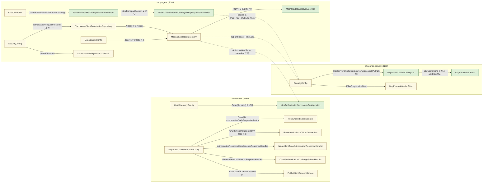
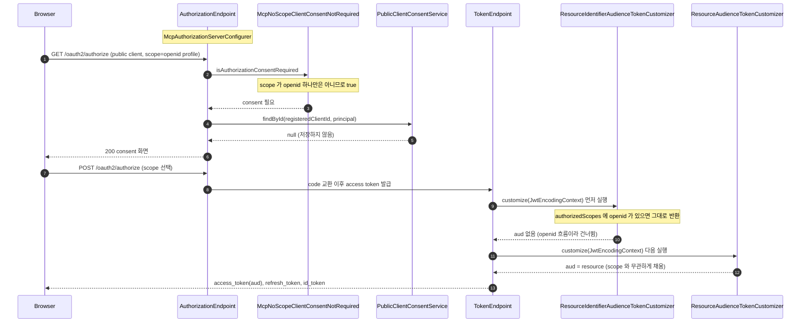
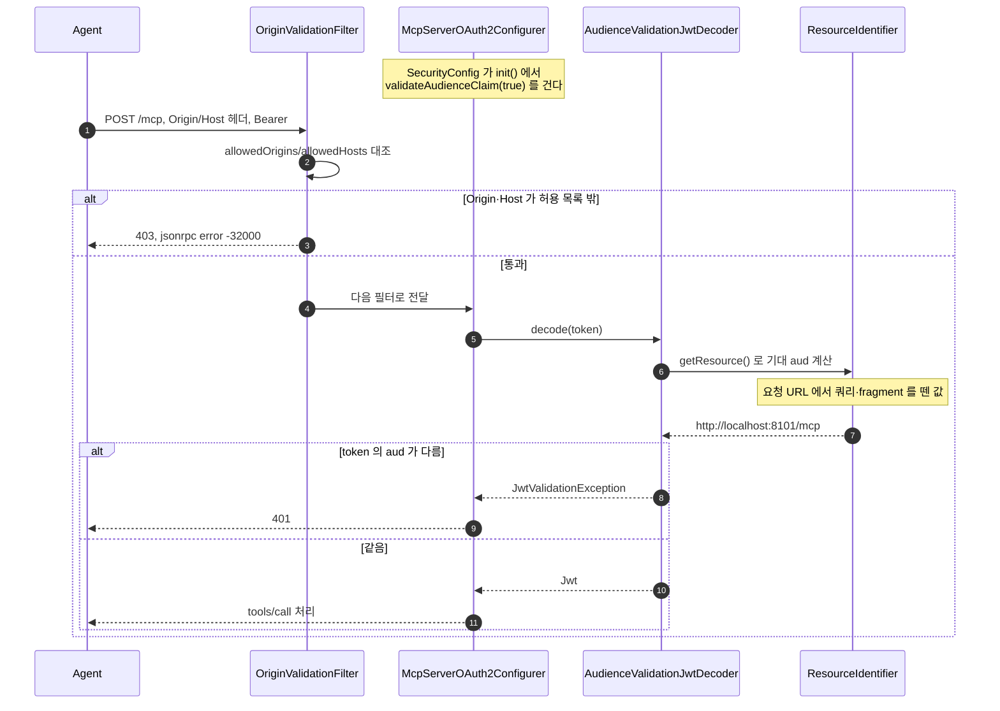
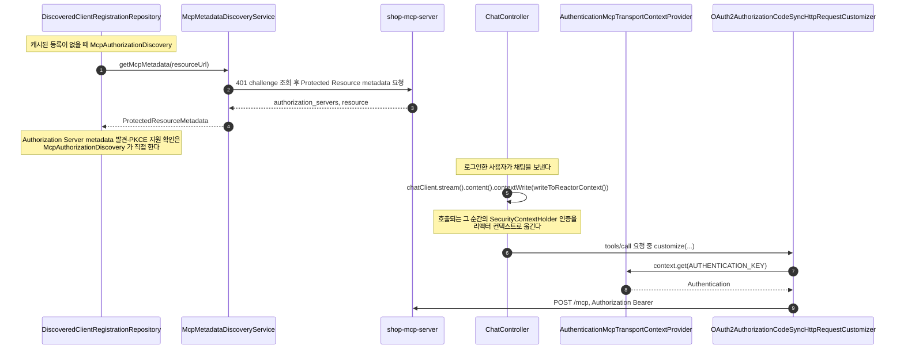

# mcp-security-authn-community 시퀀스

[official 의 SEQUENCES.md](../mcp-security-authn-official/SEQUENCES.md) 가 그리는 흐름은 이 practice 에서도 같다.
이 문서는 module 이 자동으로 하는 부분과 module 의 확장점에 얹은 부분이 갈라지는 지점만 그린다.
같은 흐름은 official 문서의 앵커로 링크한다.

## 목차

| 앵커 | 다이어그램 | 담는 것 |
|---|---|---|
| [`modules`](#modules) | flowchart | 세 앱의 module 자동 구성 bean 과 직접 얹은 클래스 구분 |
| [`diff-authorization-server`](#diff-authorization-server) | sequence | `McpAuthorizationServerConfigurer` 확장점, module 기본 token customizer 와 `ResourceAudienceTokenCustomizer` 의 관계, `McpNoScopeClientConsentNotRequired` |
| [`diff-mcp-server`](#diff-mcp-server) | sequence | `McpServerOAuth2Configurer`, `AudienceValidationJwtDecoder`, `OriginValidationFilter` |
| [`diff-agent`](#diff-agent) | sequence | `McpMetadataDiscoveryService`, `OAuth2AuthorizationCodeSyncHttpRequestCustomizer`, `ChatController` 의 `.contextWrite(...)` |

---

## 1. Module 과 클래스

`classDef` 두 개로 구분한다 — module 자동 구성(자동설정이 등록하는 bean, 코드 없이 생긴다)과 직접 얹은 확장(우리가 쓴 클래스, 확장점에 꽂는다)이다.

module 자동 구성 클래스는 각 모듈의 `-spring-boot` 변형이 `ObjectProvider` 로 모아 적용하고, 직접 얹은 확장 클래스의 역할은 [README.md 의 대체 표](README.md#대체-표)에 있다.

---

## 2. Authorization Server 내부 — module 확장점

official 의 [`as-internals`](../mcp-security-authn-official/SEQUENCES.md#as-internals) 와 같은 자리(resource 검증, `iss` 발급, client 인증 실패 응답)를 이 practice 는 filter chain 을 직접 만들지 않고 `McpAuthorizationServerConfigurer` 의 확장점(`Customizer`)으로 얹는다.
이 다이어그램은 그 확장점이 실행되는 순서와, module 기본 token customizer 가 `ResourceAudienceTokenCustomizer` 와 부딪히지 않는 이유를 보여준다.

**단계**

1. `McpAuthorizationServerConfigurer#init()` 은 기동 시점에 `authServerCustomizer` 목록(`OidcDiscoveryConfig`·`McpAuthorizationStandardConfig` 가 등록한 두 개)을 순서대로 적용하고, 그 안에서 `RIV`·`PCCS`·token customizer 를 건다.
2. public client(`local-mcp-client`)가 `scope=openid profile` 로 authorization request 를 보내면, module 이 무조건 거는 `McpNoScopeClientConsentNotRequired` 는 scope 가 `openid` 하나뿐일 때만 consent 를 생략하므로 이 요청은 생략되지 않는다.
3. `PublicClientConsentService#findById` 는 항상 `null` 을 돌려줘 이전 consent 를 무시하고, 매 요청이 consent 화면을 거치게 한다([5.6](../MCP-AUTHORIZATION.md#s5-6)).
4. token 발급 직전, module 이 기본으로 붙여 둔 `ResourceIdentifierAudienceTokenCustomizer` 가 먼저 실행된다. `authorizedScopes` 에 `openid` 가 있으면(이 practice 의 모든 client 가 그렇다) 아무 것도 하지 않고 반환한다.
5. 그 뒤 사용자 customizer 목록(`getJwtCustomizers`)이 실행되고, `ResourceAudienceTokenCustomizer` 가 scope 와 무관하게 `aud` 를 `resource` 로 채운다. 두 customizer 가 실행되는 순서는 `McpAuthorizationServerConfigurer#getTokenGenerator` 의 `jwtGenerator.setJwtCustomizer(...)` 호출 순서 그대로다.

---

## 3. `shop-mcp-server` — audience·Origin 검증

official 의 [`modules`](../mcp-security-authn-official/SEQUENCES.md#modules) 에서 `SecurityConfig`·`McpTransportConfig` 가 직접 하던 audience·Origin 검증을, 이 practice 는 module 의 `McpServerOAuth2Configurer` 확장점에 값만 넣어 얹는다.

**단계**

1. `SecurityConfig` 는 `McpServerOAuth2Configurer.mcpServerOAuth2()` 를 적용하며 `validateAudienceClaim(true)` 와 `allowedOrigins`/`allowedHosts` 를 설정한다. 후자는 `init()` 에서 `OriginValidationFilter` 를 `addFilterAfter(CorsFilter.class)` 로 자동 등록한다.
2. `Origin`/`Host` 헤더가 허용 목록 밖이면 `OriginValidationFilter` 가 JSON-RPC 오류 본문과 함께 거부하고, MCP Server 안쪽 filter 는 실행되지 않는다.
3. 통과하면 `McpServerOAuth2Configurer#getJwtDecoder` 가 감싼 `AudienceValidationJwtDecoder` 가 위임 decoder(서명·`iss`·`exp` 검증)를 먼저 부른다.
4. `AudienceValidationJwtDecoder` 는 `ResourceIdentifier#getResource()` 로 기대 `aud` 를 계산한다. 이 메서드는 저장된 값이 아니라, 현재 요청 URL 에서 쿼리·fragment 를 뗀 값을 매 요청마다 다시 만든다.
5. token 의 `aud` claim 이 이 값과 다르면 `JwtValidationException` 이 던져지고 `401` 로 끝나며, 같으면 `tools/call` 처리로 이어진다.

---

## 4. `shop-agent` — module 이 대신하는 discovery·token 부착

official 의 [`agent-login`](../mcp-security-authn-official/SEQUENCES.md#agent-login) · [`mcp-call`](../mcp-security-authn-official/SEQUENCES.md#mcp-call) 에서 `OAuth2TokenAttachingRequestCustomizer`·`SecurityMcpTransportContextProvider` 가 직접 하던 일을 module 이 자동으로 하고, discovery 의 저수준 HTTP 호출도 module 클래스에 맡긴다.

**단계**

1. `DiscoveredClientRegistrationRepository#findByRegistrationId` 에 캐시된 등록이 없으면 `McpAuthorizationDiscovery#discover` 가 호출된다.
2. 401 challenge 조회와 Protected Resource metadata 요청은 module 의 `McpMetadataDiscoveryService#getMcpMetadata` 가 대신한다. 이 서비스가 `resource_metadata` 를 따라가고 metadata 의 `resource` 가 요청한 URL 과 같은지도 확인한다.
3. Authorization Server metadata 발견(RFC 8414 우선순위)과 PKCE(S256) 지원 확인, `iss` 비교는 module 이 다루지 않으므로 `McpAuthorizationDiscovery` 가 직접 한다.
4. 로그인한 사용자가 채팅을 보내면 `ChatController` 가 `.contextWrite(AuthenticationMcpTransportContextProvider.writeToReactorContext())` 를 호출해, 호출되는 그 순간의 `SecurityContextHolder` 인증을 리액터 컨텍스트로 옮긴다.
5. MCP client 가 `tools/call` 을 보내기 전 module 자동 구성이 꽂아 둔 `OAuth2AuthorizationCodeSyncHttpRequestCustomizer#customize` 가 그 컨텍스트에서 인증을 꺼내(`AuthenticationMcpTransportContextProvider.AUTHENTICATION_KEY`) `OAuth2AuthorizedClientManager` 로 token 을 구한다.
6. 구한 token 을 `Authorization: Bearer` 헤더로 붙여 `POST /mcp` 를 보낸다. 컨텍스트에 인증이 없으면 이 customizer 는 DEBUG 로그 한 줄만 남기고 헤더를 붙이지 않는다.
