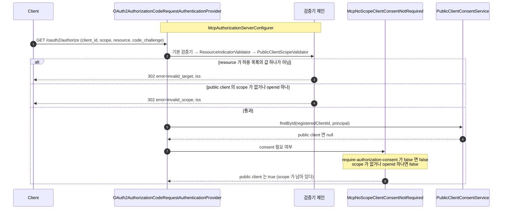
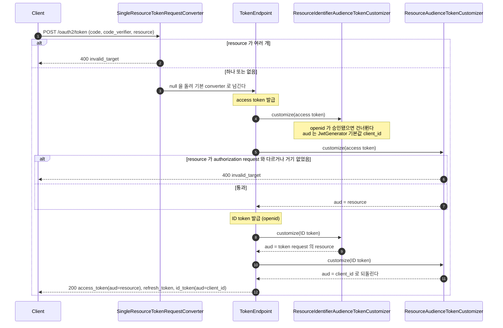
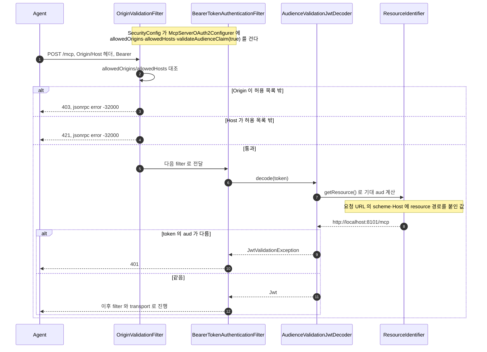
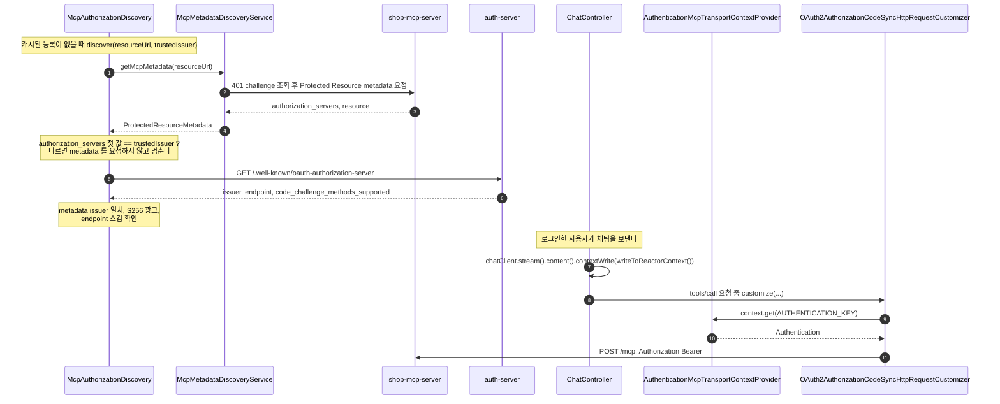

# mcp-security-authn-community 시퀀스

[official 의 SEQUENCES.md](../mcp-security-authn-official/SEQUENCES.md) 가 그리는 흐름은 이 practice 에서도 같다.
이 문서는 module 이 자동으로 하는 부분과 module 의 확장점에 얹은 부분이 갈라지는 지점만 그린다.
같은 흐름은 official 문서의 앵커로 링크한다.

## 목차

| 앵커 | 다이어그램 | 담는 것 |
|---|---|---|
| [`modules`](#modules) | flowchart | 세 앱의 module 자동 구성 bean 과 직접 얹은 클래스 구분 |
| [`registration`](#registration) | sequence | pre-registration 과 검증기 체인 — module 의 consent 판정 `McpNoScopeClientConsentNotRequired` 와의 관계 |
| [`diff-authorization-server`](#diff-authorization-server) | sequence | token 발급 — module 기본 token customizer 와 `ResourceAudienceTokenCustomizer`, access token·ID token 의 `aud` 분기 |
| [`diff-mcp-server`](#diff-mcp-server) | sequence | MCP Server 의 요청 검증 — `OriginValidationFilter`, `AudienceValidationJwtDecoder` |
| [`diff-agent`](#diff-agent) | sequence | `McpMetadataDiscoveryService`, `OAuth2AuthorizationCodeSyncHttpRequestCustomizer`, `ChatController` 의 `.contextWrite(...)` |

---

## 1. module 과 클래스

`classDef` 두 개로 구분한다 — module 자동 구성(자동 구성이 등록하는 bean, 코드 없이 생긴다)과 직접 얹은 확장(이 practice 가 쓴 클래스, 확장점에 꽂는다)이다.

```mermaid
flowchart LR
    classDef moduleAuto fill:#dff0d8,stroke:#3c763d
    classDef customExt fill:#fcf8e3,stroke:#8a6d3b
    subgraph as["auth-server (:9000)"]
        ASAC["McpAuthorizationServerAutoConfiguration"]:::moduleAuto
        NSC["McpNoScopeClientConsentNotRequired"]:::moduleAuto
        RIATC["ResourceIdentifierAudienceTokenCustomizer"]:::moduleAuto
        OIDC["OidcDiscoveryConfig"]:::customExt
        MSTD["McpAuthorizationStandardConfig"]:::customExt
        RIV["ResourceIndicatorValidator"]:::customExt
        PSV["PublicClientScopeValidator"]:::customExt
        SRTC["SingleResourceTokenRequestConverter"]:::customExt
        RATC["ResourceAudienceTokenCustomizer"]:::customExt
        IIH["IssuerIdentifyingAuthorizationResponseHandler"]:::customExt
        CACFH["ClientAuthenticationChallengeFailureHandler"]:::customExt
        PCCS["PublicClientConsentService"]:::customExt
    end
    subgraph mcp["shop-mcp-server (:8101)"]
        MSOC["McpServerOAuth2Configurer"]:::moduleAuto
        OVF["OriginValidationFilter"]:::moduleAuto
        AVJD["AudienceValidationJwtDecoder"]:::moduleAuto
        MSEC["SecurityConfig"]:::customExt
        MPVFC["McpProtocolVersionFilterConfig"]:::customExt
        MPVF["McpProtocolVersionFilter"]:::customExt
    end
    subgraph agent["shop-agent (:8100)"]
        ATCP["AuthenticationMcpTransportContextProvider"]:::moduleAuto
        OACSHRC["OAuth2AuthorizationCodeSyncHttpRequestCustomizer"]:::moduleAuto
        MDS["McpMetadataDiscoveryService"]:::moduleAuto
        ASC["SecurityConfig"]:::customExt
        DR["DiscoveredClientRegistrationRepository"]:::customExt
        MAD["McpAuthorizationDiscovery"]:::customExt
        MSC["McpSecurityConfig"]:::customExt
        ARIF["AuthorizationResponseIssuerFilter"]:::customExt
        CC["ChatController"]:::customExt
    end
    ASAC -->|"init() 에서 consent 판정으로 건다"| NSC
    ASAC -->|"기본 token customizer"| RIATC
    OIDC -->|"Order(0), oidc() 를 켠다"| ASAC
    MSTD -->|"Order(1), authorizationCodeRequestValidator"| RIV
    RIV -->|"andThen"| PSV
    MSTD -->|"tokenEndpoint.accessTokenRequestConverter"| SRTC
    MSTD -->|"OAuth2TokenCustomizer bean 으로 등록"| RATC
    RIATC -->|"다음 customizer"| RATC
    MSTD -->|"authorizationResponseHandler·errorResponseHandler"| IIH
    MSTD -->|"clientAuthentication.errorResponseHandler"| CACFH
    MSTD -->|"authorizationConsentService bean"| PCCS
    MSEC -->|"McpServerOAuth2Configurer.mcpServerOAuth2() 적용"| MSOC
    MSOC -->|"allowedOrigins 설정 시 addFilterAfter"| OVF
    MSOC -->|"validateAudienceClaim(true)"| AVJD
    MPVFC -->|"FilterRegistrationBean, MCP endpoint 에만"| MPVF
    ASC -->|"addFilterBefore"| ARIF
    ASC -->|"authorizationRequestResolver 가 씀"| DR
    DR -->|"등록이 없으면 호출"| MAD
    MAD -->|"401/PRM 조회를 위임"| MDS
    MSC -->|"discovery bean 으로 등록"| MAD
    CC -->|".contextWrite(writeToReactorContext())"| ATCP
    ATCP -.->|"McpTransportContext 로 전달"| OACSHRC
    OACSHRC -.->|"Bearer 로 POST/GET/DELETE /mcp"| OVF
    MDS -.->|"401 challenge, PRM 조회"| MSEC
    MAD -.->|"Authorization Server metadata 조회"| ASAC
```

module 자동 구성 클래스는 각 module 의 `-spring-boot` 변형이 `ObjectProvider` 로 모아 적용한다. 직접 얹은 확장 클래스와 official 의 대응 관계는 [README.md 의 대체 표](README.md#대체-표)에 있다.

---

## 2. 등록 — pre-registration 과 검증기 체인

yml pre-registration 과 검증기 체인은 official 의 [등록](../mcp-security-authn-official/SEQUENCES.md#registration) 과 같다. DCR 을 끄면 module 의 `dcrRegisteredClientRepository` 가 생기지 않아, official 처럼 Boot 의 `registeredClientRepository` 가 yml 의 두 client 를 `RegisteredClient` 로 바꾼다. 다른 점은 체인을 거는 자리와, module 이 consent 판정을 `McpNoScopeClientConsentNotRequired` 로 바꾼다는 것이다.

**단계**

1. authorization request 가 온다. 필드는 [`authorize`](../MCP-API-SPEC.md#authorize) 에 있다. 기동 때 `McpAuthorizationServerConfigurer#init()` 이 `McpAuthorizationStandardConfig` 가 넘긴 `authorizationCodeRequestValidator` 와 `McpNoScopeClientConsentNotRequired` 를 provider 에 걸어 두었다.
2. 체인은 official 과 같다. 기본 검증기(redirect URI·scope) 다음에 `ResourceIndicatorValidator` 가 `resource` 를, `PublicClientScopeValidator` 가 public client 의 scope 를 본다.
3. `resource` 가 허용 목록의 값 하나가 아니면 `invalid_target` 이다(테스트 `AuthorizationServerStandardTest#인가_요청의_resource_가_여러_개면_invalid_target_이다`).
4. public client 가 scope 를 생략하거나 `openid` 하나만 요청하면 `invalid_scope` 다(테스트 `#공개_클라이언트가_scope_없이_요청하면_invalid_scope_다`, `#공개_클라이언트가_openid_만_요청하면_invalid_scope_다`). module 판정은 scope 가 없어도 consent 를 건너뛰므로, 이 검증기가 그 경로를 consent 판정 전에 막는다.
5. 통과하면 provider 가 저장된 consent 를 찾는다.
6. `PublicClientConsentService#findById` 는 public client 일 때만 `null` 을 돌려준다. confidential client 는 위임한 저장소의 값을 받고, public client 는 이전 consent 가 없는 것처럼 처리된다([5.6](../MCP-AUTHORIZATION.md#s5-6)).
7. provider 가 module 판정에 consent 필요 여부를 묻는다. `require-authorization-consent: false` 인 confidential client(`shop-agent`)는 consent 없이 code 를 받는다.
8. 여기까지 온 public client 요청은 `openid` 말고 scope 가 있어 consent 가 필요하다(테스트 `#공개_클라이언트는_이전에_동의했어도_매번_동의_화면을_거친다`).

---

## 3. token 발급 — module token customizer 와 `aud`

official 의 [`as-internals`](../mcp-security-authn-official/SEQUENCES.md#as-internals) 의 token request 부분이다. 이 practice 는 module 이 기본으로 붙인 `ResourceIdentifierAudienceTokenCustomizer` 뒤에 `ResourceAudienceTokenCustomizer` 를 실행한다. module customizer 는 access token 과 ID token 을 다르게 다루므로, 두 token 의 `aud` 는 서로 다른 분기로 정해진다.

**단계**

1. token request 는 `McpAuthorizationStandardConfig` 가 `tokenEndpoint.accessTokenRequestConverter` 로 건 `SingleResourceTokenRequestConverter` 를 먼저 거친다.
2. `resource` 가 여러 개면 `400 invalid_target` 이다. module customizer 가 값을 `(String)` 으로 캐스트해 `500` 이 나기 전에 막는다(테스트 `AuthorizationServerStandardTest#토큰_요청의_resource_가_여러_개면_invalid_target_이다`, `#openid_없는_토큰_요청의_resource_가_여러_개여도_invalid_target_이다`).
3. 하나이거나 없으면 converter 는 `null` 을 돌려 Spring 기본 converter 에 넘긴다. 이후 client 인증과 code 검증은 official 과 같다.
4. access token 발급 직전 module 의 `ResourceIdentifierAudienceTokenCustomizer` 가 먼저 돈다. `openid` 가 승인된 access token 은 건너뛰므로, 두 client 의 access token `aud` 는 Spring `JwtGenerator` 기본값인 client_id 로 남는다.
5. `ResourceAudienceTokenCustomizer` 는 module 의 `getTokenGenerator` 가 기본 customizer 뒤에 이어 붙인 bean 이다. official 과 같은 규칙으로 `resource` 를 authorization request 와 대조한다.
6. 다르거나 authorization request 에 없던 값이면 `400 invalid_target` 이다(테스트 `#토큰_요청의_resource_가_인가_요청과_다르면_invalid_target_이다`, `#인가_요청에_없던_resource_를_토큰_요청에서_정하면_invalid_target_이다`).
7. 통과하면 access token 의 `aud` 를 `resource` 로 바꾼다([허브 4.7](../MCP-AUTHORIZATION.md#s4-7)).
8. `openid` 가 승인됐으면 ID token 도 발급하고, module customizer 가 다시 먼저 돈다. 이 customizer 는 ID token 을 건너뛰지 않는다.
9. ID token 의 `aud` 가 token request 의 `resource` 로 덮어써진다.
10. `ResourceAudienceTokenCustomizer` 가 ID token 을 받는다.
11. ID token 의 `aud` 를 OIDC 가 요구하는 client_id 로 되돌린다.
12. 응답의 access token `aud` 는 `resource`, ID token `aud` 는 client_id 다(테스트 `#access_token_의_aud_는_resource_이고_id_token_은_client_id_다`).

---

## 4. MCP Server 의 요청 검증 — Origin·Host 와 audience

filter 순서와 `MCP-Protocol-Version`·transport 검증은 official 의 [요청 검증](../mcp-security-authn-official/SEQUENCES.md#mcp-server-validation) 과 같다. 다른 것은 module 이 두 곳을 맡는다는 점이다: `OriginValidationFilter` 가 filter chain 안 인증 filter 앞에서 `Origin`·`Host` 를 보고, `AudienceValidationJwtDecoder` 가 기대 `aud` 를 요청 URL 로 계산한다. 그래서 Host 검증이 audience 계산보다 먼저 와야 한다.

**단계**

1. Agent 의 요청이 온다. `SecurityConfig` 가 `McpServerOAuth2Configurer.mcpServerOAuth2()` 에 `allowedOrigins`/`allowedHosts` 를 주면, module 이 `init()` 에서 `OriginValidationFilter` 를 `addFilterAfter(CorsFilter.class)` 로 건다.
2. `OriginValidationFilter` 는 SDK `DefaultServerTransportSecurityValidator` 로 헤더를 대조한다. token 인증보다 앞이라 token 이 없어도 먼저 막는다(테스트 `McpAuthorizationStandardTest#token_이_없어도_허용되지_않은_Origin_은_인증보다_먼저_403이다`).
3. `Origin` 이 허용 목록(`http://localhost:8101`) 밖이면 `403` 을 JSON-RPC 오류 본문과 함께 돌려준다.
4. `Host` 가 `localhost:8101`·`127.0.0.1:8101` 이 아니면 `421` 이다(테스트 `#token_이_없어도_허용되지_않은_Host_는_인증보다_먼저_421이다`).
5. 통과하면 Bearer token 인증으로 넘어간다.
6. 위임 decoder(Boot `JwtDecoder`)가 서명·`iss`·`exp` 를 먼저 보고, `AudienceValidationJwtDecoder` 가 `aud` 를 본다.
7. `ResourceIdentifier#getResource()` 가 기대 `aud` 를 계산한다. 저장된 설정이 아니라 요청마다 요청 URL 의 scheme·Host 에 resource 경로를 붙여 만든다.
8. official 은 `jwt.audiences` 고정 값과 비교한다([허브 4.9](../MCP-AUTHORIZATION.md#s4-9)). 여기서는 Host 를 바꾸고 그 Host 용 token 을 실으면 계산한 값과 `aud` 가 맞아 버려, 4번의 Host 검증이 audience 계산 전에 `421` 로 막아야 한다(테스트 `#Host_를_바꾸고_그_Host_용_token_을_실어도_audience_계산_전에_421이다`).
9. token 의 `aud` 가 계산한 값과 다르면 `JwtValidationException` 이다.
10. 결과는 `401` 이다(테스트 `#aud_가_다른_토큰은_거부한다`).
11. 같으면 `Jwt` 를 돌려준다.
12. 인증된 요청은 `McpProtocolVersionFilter` 와 transport 로 이어진다. 이 순서는 official 과 같다.

---

## 5. `shop-agent` — module 이 대신하는 discovery·token 부착

official 의 [`discovery`](../mcp-security-authn-official/SEQUENCES.md#discovery) · [`mcp-call`](../mcp-security-authn-official/SEQUENCES.md#mcp-call) 에서 직접 쓴 클래스가 하던 일 가운데, 401 challenge·PRM 조회와 token 부착을 module 이 한다. issuer binding·Authorization Server Metadata discovery·PKCE 지원 확인은 `McpAuthorizationDiscovery` 가 직접 한다.

**단계**

1. `DiscoveredClientRegistrationRepository` 에 캐시된 등록이 없으면 `McpAuthorizationDiscovery#discover(resourceUrl, trustedIssuer)` 가 불린다. 401 challenge 조회와 PRM 요청은 module 의 `McpMetadataDiscoveryService#getMcpMetadata` 가 대신한다.
2. 이 서비스가 token 없는 요청의 `401` 에서 `resource_metadata` 를 따라가고, 없으면 well-known 경로를 차례로 시도한다.
3. PRM 의 `resource` 가 요청한 URL 과 같은지도 이 서비스가 확인한다.
4. `McpAuthorizationDiscovery` 는 PRM 의 `authorization_servers` 첫 값을 `trustedIssuer`(`credentials-issuer`)와 비교한다. 다르면 Authorization Server Metadata 를 요청하지 않고 멈춘다([허브 5.4](../MCP-AUTHORIZATION.md#s5-4)).
5. 같으면 RFC 8414 경로를 먼저 GET 하고, 없으면 OIDC Discovery 경로로 넘어간다.
6. module 이 다루지 않는 확인을 직접 한다: metadata `issuer` 일치, `S256` 광고, `authorization_endpoint`·`token_endpoint` 의 `https` 또는 loopback `http`. 순서와 실패 처리는 official 의 [Discovery 내부 순서](../mcp-security-authn-official/SEQUENCES.md#discovery) 와 같다.
7. 로그인한 사용자가 채팅을 보내면 `ChatController` 가 `.contextWrite(AuthenticationMcpTransportContextProvider.writeToReactorContext())` 를 호출한다. 호출되는 그 순간의 `SecurityContextHolder` 인증이 reactor context 로 옮겨진다.
8. MCP client 가 `tools/call` 을 보내기 전, module 자동 구성이 꽂아 둔 `OAuth2AuthorizationCodeSyncHttpRequestCustomizer#customize` 가 불린다.
9. customizer 가 그 context 에서 인증을 꺼낸다(`AuthenticationMcpTransportContextProvider.AUTHENTICATION_KEY`).
10. 꺼낸 인증으로 `OAuth2AuthorizedClientManager` 에서 token 을 구한다.
11. 구한 token 을 `Authorization: Bearer` 헤더로 붙여 `POST /mcp` 를 보낸다. context 에 인증이 없으면 이 customizer 는 DEBUG 로그 한 줄만 남기고 헤더를 붙이지 않는다.
