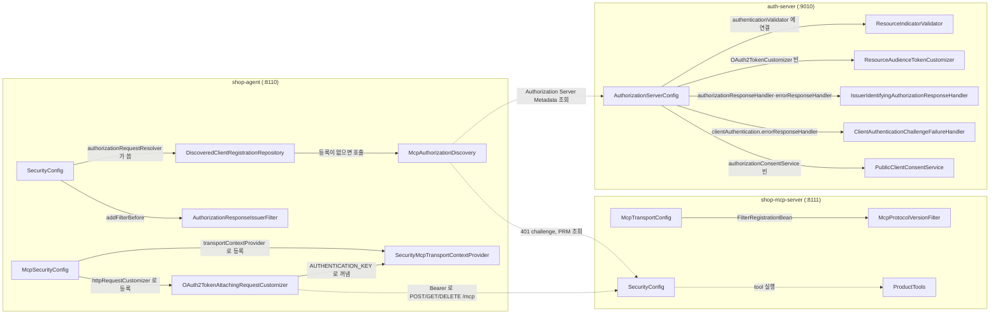
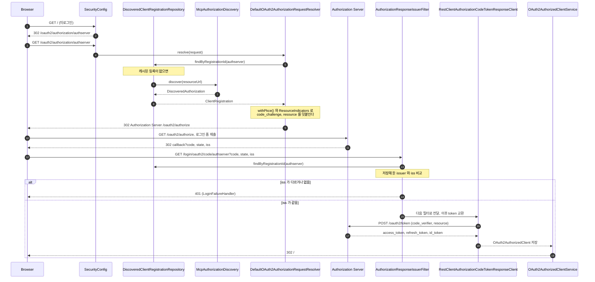
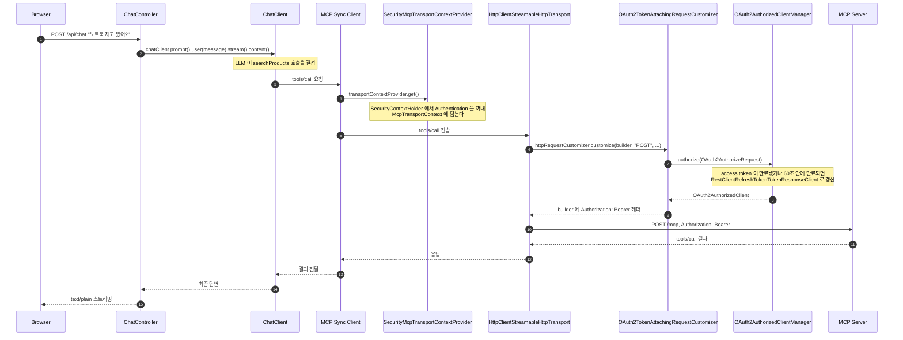
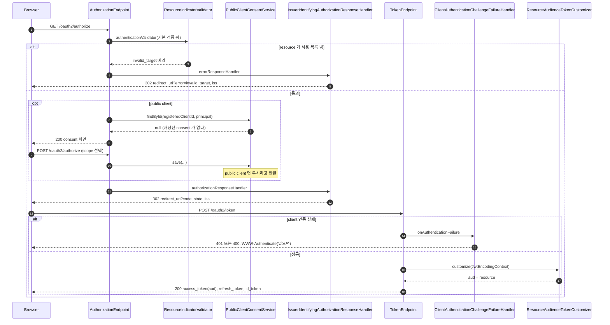

# mcp-security-authn-official 시퀀스

[MCP-SEQUENCES.md](../MCP-SEQUENCES.md) 의 표준 흐름을 이 practice 의 클래스 이름으로 다시 그린다. 요청·응답 필드는 [API-SPEC.md](API-SPEC.md) 에 있고, 여기서는 클래스 사이 호출 순서만 다룬다.

## 목차

| 앵커 | 다이어그램 | 담는 것 |
|---|---|---|
| [`modules`](#modules) | flowchart | 세 앱의 클래스와 연결 |
| [`agent-login`](#agent-login) | sequence | discovery + confidential client authorization + token request |
| [`mcp-call`](#mcp-call) | sequence | `/api/chat` 에서 MCP Server 호출까지 token 부착 |
| [`as-internals`](#as-internals) | sequence | Authorization Server 내부의 확장점 호출 순서 |

---

## 1. 모듈과 클래스

세 앱은 filter chain·bean 을 직접 정의한다. 실선은 같은 프로세스 안의 호출이고, 점선은 프로세스 사이 HTTP 호출이다.

각 클래스의 역할은 [README.md 의 직접 쓴 코드 표](README.md#직접-쓴-코드)에 있다.

---

## 2. Agent 로그인

표준 [Discovery](../MCP-SEQUENCES.md#rt-discovery) · [Authorization — confidential client](../MCP-SEQUENCES.md#rt-authz-confidential) · [Token request](../MCP-SEQUENCES.md#rt-token) 를 Agent 의 실제 클래스 이름으로 그린다. `shop-agent` 는 client 가 하나뿐이라 미로그인 요청을 곧바로 이 흐름으로 보낸다.

**단계**

1. 미로그인 사용자가 `shop-agent` 를 연다. `SecurityConfig` 의 `loginPage` 가 `/oauth2/authorization/authserver` 하나뿐이라 로그인 화면 없이 그 경로로 보낸다.
2. `DefaultOAuth2AuthorizationRequestResolver` 가 `DiscoveredClientRegistrationRepository#findByRegistrationId` 를 부른다. 캐시된 결과가 없으면 여기서 처음으로 [discovery](../MCP-SEQUENCES.md#rt-discovery) 가 일어난다.
3. `McpAuthorizationDiscovery#discover` 가 401 challenge → PRM → Authorization Server Metadata 순서로 조회하고, `DiscoveredAuthorization` 을 돌려준다. discovery 로 얻은 issuer 가 `credentials-issuer` 와 다르면 여기서 `McpDiscoveryException` 이 던져지고 등록을 만들지 않는다([issuer binding](../MCP-SEQUENCES.md#issuer-binding)).
4. `authorizationRequestResolver`(`SecurityConfig` 의 private 메서드)가 `OAuth2AuthorizationRequestCustomizers.withPkce()` 와 `ResourceIndicators.authorizationRequest(...)` 를 이어 붙여 `code_challenge`·`resource` 를 싣는다.
5. Browser 가 Authorization Server 의 authorization endpoint 를 열고 로그인한다. 이 구간은 [4.5](../MCP-AUTHORIZATION.md#s4-5) 그대로다.
6. Authorization Server 가 code·`state`·`iss` 를 실어 callback 으로 redirect 한다.
7. `AuthorizationResponseIssuerFilter` 가 `OAuth2LoginAuthenticationFilter` 보다 먼저 요청을 받아, 저장해 둔 `ClientRegistration` 의 issuer 와 `iss` 파라미터를 비교한다([4.6](../MCP-AUTHORIZATION.md#s4-6)).
8. 다르거나(광고된 경우) 없으면 `LoginFailureHandler` 가 `401` 로 끝내고 code 를 교환하지 않는다.
9. 같으면 다음 필터로 넘어가 `RestClientAuthorizationCodeTokenResponseClient`(`ResourceIndicators.tokenRequest(...)` 로 `resource` 를 실음)가 token request 를 보낸다([Token request](../MCP-SEQUENCES.md#rt-token)).
10. 발급받은 `OAuth2AuthorizedClient` 는 서블릿 session 이 아니라 `OAuth2AuthorizedClientService`(`InMemoryOAuth2AuthorizedClientService`)에 저장된다. 서블릿 요청 없이 `Authentication` 만으로 꺼낼 수 있어야 리액터 스레드에서도 token 을 붙일 수 있기 때문이다.

---

## 3. `/api/chat` 에서 MCP Server 호출까지

로그인 뒤 채팅 요청이 MCP tool 호출로 이어지는 경로다. token 은 `SecurityContextHolder` 에서 `McpTransportContext` 로, 다시 HTTP 요청 헤더로 옮겨진다.

**단계**

1. Browser 가 `/api/chat` 에 메시지를 보낸다. `ChatController#chat` 은 인증된 요청만 받는다(`SecurityConfig#anyRequest().authenticated()`).
2. `ChatController` 는 요청 본문을 그대로 `ChatClient` 의 `user(...)` 에 넣고 스트리밍을 시작한다. tool 정의는 `ChatClientConfig` 가 `defaultTools(...)` 로 미리 꽂아 두었다.
3. LLM 이 `searchProducts`(또는 `getStock`)를 부르기로 결정하면 Spring AI 가 등록된 MCP client 로 `tools/call` 을 보낸다. 이 호출은 리액터 체인 위에서 일어난다.
4. MCP client 는 요청을 만들기 전에 `SecurityMcpTransportContextProvider.get()` 을 부른다. `Hooks.enableAutomaticContextPropagation()`(`ShopAgentApplication`)이 켜져 있어야 이 시점에도 원래 요청 스레드의 `SecurityContext` 가 보인다.
5. transport(`HttpClientStreamableHttpTransport`)는 HTTP 요청을 만든 뒤 보내기 전에 `OAuth2TokenAttachingRequestCustomizer.customize(...)` 에 요청 builder 와 `McpTransportContext` 를 넘긴다. 컨텍스트에 인증이 없으면 customizer 는 DEBUG 로그 한 줄만 남기고 헤더를 붙이지 않는다.
6. 인증이 있으면 `OAuth2AuthorizedClientManager.authorize(...)` 를 부른다. `AuthorizedClientServiceOAuth2AuthorizedClientManager` 는 `OAuth2AuthorizedClientService` 에서 기존 token 을 찾는다.
7. access token 이 만료됐거나 60초 안에 만료되면 매니저가 등록된 refresh provider(`RestClientRefreshTokenTokenResponseClient`, `resource` 포함)로 새 token 을 받는다([만료와 refresh](../MCP-SEQUENCES.md#rt-refresh)).
8. customizer 가 builder 에 `Authorization: Bearer <access token>` 을 붙이면 transport 가 `POST /mcp` 로 보낸다. token 의 `sub` 는 로그인한 사용자이고, `client_id` claim 은 없다([4.7](../MCP-AUTHORIZATION.md#s4-7)).
9. MCP Server 가 [token 을 검증](../MCP-SEQUENCES.md#rt-token-validation)하고 `ProductTools` 의 메서드를 실행한 결과를 돌려준다.
10. 결과가 `ChatClient` 를 거쳐 최종 답으로 이어지고, `ChatController` 가 `text/plain;charset=UTF-8` 로 스트리밍한다.

---

## 4. Authorization Server 내부 확장점 호출 순서

`AuthorizationServerConfig` 가 Spring Authorization Server 의 확장점에 건 클래스들이 언제 불리는지 정리한다. [`agent-login`](#agent-login) 의 `Authorization Server` 한 상자를 펼친 것이다.

**단계**

1. authorization request 가 온다. `AuthorizationServerConfig` 는 `OAuth2AuthorizationCodeRequestAuthenticationProvider` 의 `authenticationValidator` 를 기본 검증기 뒤에 `ResourceIndicatorValidator` 를 이어 붙인 것으로 바꿔 둔다.
2. `resource` 가 `McpResourceProperties` 의 허용 목록 밖이면 `ResourceIndicatorValidator` 가 예외를 던진다. `IssuerIdentifyingAuthorizationResponseHandler` 의 `errorResponseHandler` 가 `error=invalid_target` 과 `iss` 를 실어 redirect 한다(C16).
3. 통과하면 client 유형에 따라 갈린다. public client(`local-mcp-client`)는 `authorizationConsentService` 로 등록된 `PublicClientConsentService#findById` 를 부르는데, 이 클래스는 항상 `null` 을 돌려줘 이전 consent 를 무시한다.
4. `null` 이면 consent 화면을 보여주고, 사용자가 scope 를 골라 제출하면 `PublicClientConsentService#save` 가 불리지만 public client 면 실제로 저장하지 않는다. confidential client(`official-shop-agent`)는 `require-authorization-consent: false` 라 이 단계 전체를 건너뛴다.
5. authorization code 발급이 확정되면 `IssuerIdentifyingAuthorizationResponseHandler` 의 `authorizationResponseHandler` 가 code·`state`·`iss` 를 실어 redirect 한다(C5). 이 핸들러 하나가 성공·오류 두 경로 모두를 맡는다.
6. token request 가 온다. client 인증에 실패하면(예: 잘못된 `client_secret`, public client 에 실린 비밀) `OAuth2ClientAuthenticationFilter` 가 `ClientAuthenticationChallengeFailureHandler` 를 부른다.
7. 이 핸들러는 요청이 `Authorization` 헤더로 인증을 시도했을 때만 `WWW-Authenticate` 를 붙이고(RFC 6749 §5.2), 오류 코드가 `invalid_client` 일 때만 `401` 이다(S8, P12, P14).
8. client 인증이 성공하면 access token 발급 직전에 `resourceAudienceTokenCustomizer` 빈(`ResourceAudienceTokenCustomizer`)이 `JwtEncodingContext` 를 받는다.
9. 요청·인가된 `resource` 가 있으면 access token 의 `aud` 로 넣고, 서로 다르면 `invalid_target` 예외를 던진다(RFC 8707 §2.2). ID token 은 건드리지 않아 `aud` 는 client_id 로 남는다(C6-1·C6-2).
