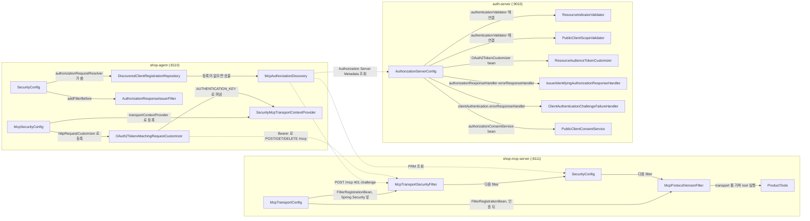
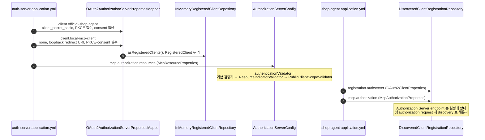
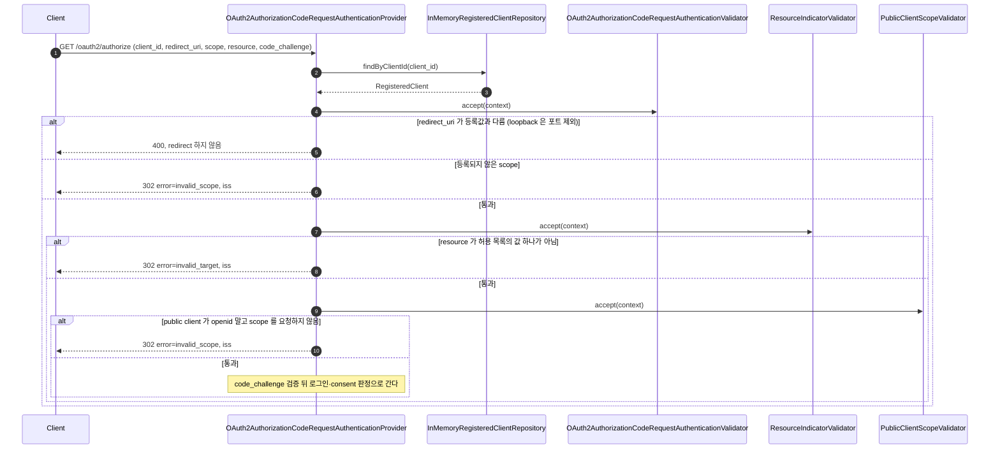
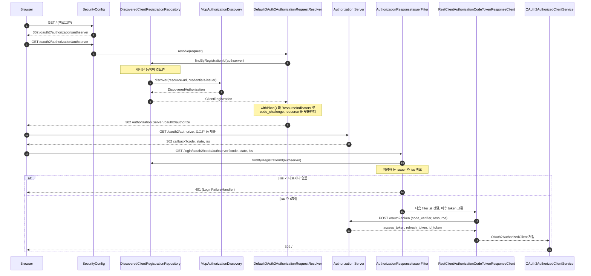
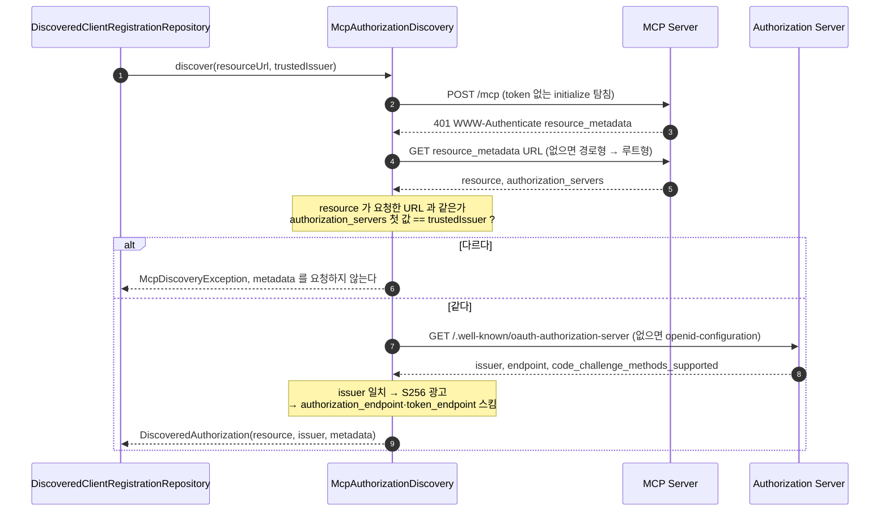
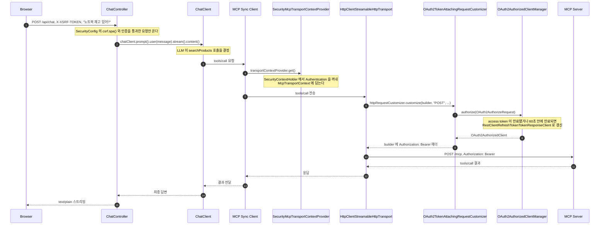
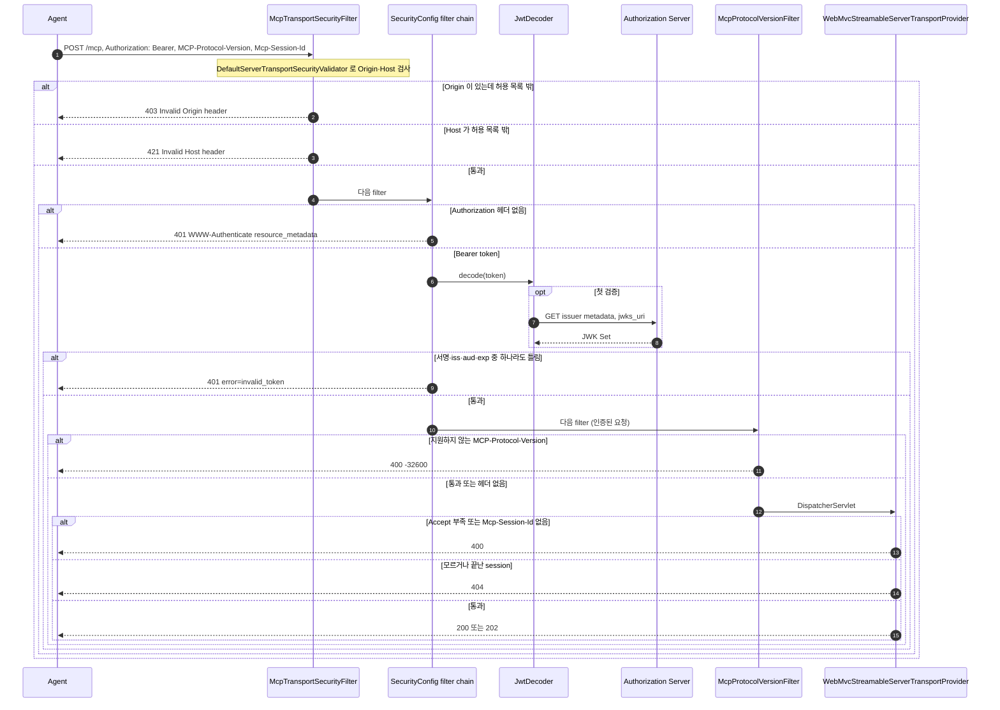
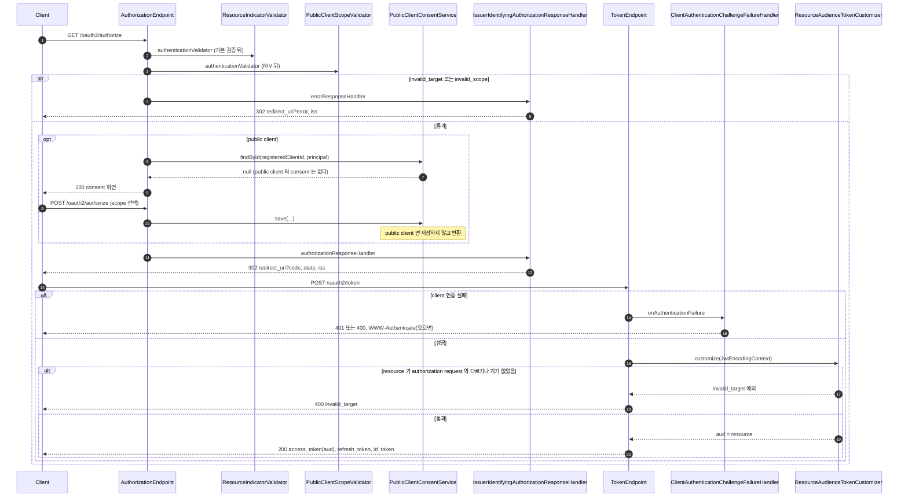

# mcp-security-authn-official 시퀀스

[MCP-SEQUENCES.md](../MCP-SEQUENCES.md) 의 표준 흐름을 이 practice 의 클래스 이름으로 다시 그린다. 요청·응답 필드는 [API-SPEC.md](API-SPEC.md) 에 있고, 여기서는 클래스 사이 호출 순서만 다룬다.

## 목차

| 앵커 | 다이어그램 | 담는 것 |
|---|---|---|
| [`modules`](#modules) | flowchart | 구성 — 세 앱의 클래스와 연결 |
| [`registration`](#registration) | sequence | 등록 — yml pre-registration 과 authorization request 검증기 체인 |
| [`agent-login`](#agent-login) | sequence | discovery + confidential client authorization + token request |
| [`discovery`](#discovery) | sequence | `McpAuthorizationDiscovery#discover` 내부 순서 |
| [`mcp-call`](#mcp-call) | sequence | `/api/chat` 에서 MCP Server 호출까지 token 부착 |
| [`mcp-server-validation`](#mcp-server-validation) | sequence | MCP Server 가 요청을 검증하는 filter 순서 |
| [`as-internals`](#as-internals) | sequence | Authorization Server 내부의 확장점 호출 순서 |

---

## 1. 구성 — 앱과 클래스

세 앱은 filter chain·bean 을 직접 정의한다. 실선은 같은 프로세스 안의 호출이나 filter 순서이고, 점선은 프로세스 사이 HTTP 호출이다.

각 클래스의 역할은 [README.md 의 직접 쓴 코드 표](README.md#직접-쓴-코드)에 있다.

---

## 2. 등록 — pre-registration 과 authorization request 검증기

두 client 는 `auth-server` 의 `application.yml` 에 pre-registration 으로 들어 있고, Boot 가 기동할 때 `RegisteredClient` 로 바꾼다. Agent 설정에는 같은 자격증명과 그 issuer 만 있고, 모든 authorization request 는 이 등록을 기준으로 검증기 체인을 거친다. 표준 흐름은 [confidential client](../MCP-SEQUENCES.md#reg-confidential) · [public client](../MCP-SEQUENCES.md#reg-public) 이다.

### 2.1 기동 — yml 에서 `RegisteredClient` 로

**단계**

1. `official-shop-agent` 는 confidential client 다. `client_secret_basic`, redirect URI 하나, `authorization_code`·`refresh_token`, `require-proof-key: true`, `require-authorization-consent: false` 로 등록한다.
2. `local-mcp-client` 는 `client-authentication-methods: [none]` 인 public client 다. client secret 없이 loopback redirect URI `http://127.0.0.1:8123/callback`, `require-proof-key: true`, `require-authorization-consent: true` 로 등록한다.
3. Boot `OAuth2AuthorizationServerConfiguration#registeredClientRepository` 가 `OAuth2AuthorizationServerPropertiesMapper#asRegisteredClients()` 결과로 `InMemoryRegisteredClientRepository` 를 만든다. `none` 도 그대로 `ClientAuthenticationMethod` 가 되어, `RegisteredClientRepository` bean 을 따로 두지 않는다.
4. `McpResourceProperties` 가 token 을 발급할 resource 목록을 받는다. `AuthorizationServerConfig` 는 `OAuth2AuthorizationCodeRequestAuthenticationProvider` 의 `authenticationValidator` 를 기본 검증기 뒤에 `ResourceIndicatorValidator`·`PublicClientScopeValidator` 를 이은 체인으로 바꾼다.
5. Agent 의 `spring.security.oauth2.client.registration.authserver` 에는 같은 `client_id`·`client_secret`·redirect URI·scope 가 있다. `McpSecurityConfig` 가 `OAuth2ClientProperties` 를 켜서 `DiscoveredClientRegistrationRepository` 에 넘긴다.
6. `McpAuthorizationProperties` 는 discovery 출발점(`resource-url`)과 자격증명의 issuer(`credentials-issuer`)다. endpoint 는 첫 authorization request 때 [discovery](#discovery) 로 채우고, issuer 가 다르면 멈춘다([허브 4.4](../MCP-AUTHORIZATION.md#s4-4)).

### 2.2 authorization request 의 검증기 체인

`OAuth2AuthorizationCodeRequestAuthenticationProvider#authenticate` 는 사용자 로그인 확인보다 먼저 검증기 체인을 부른다. 체인은 앞 검증기가 예외를 던지면 거기서 끝나고, redirect URI 가 확인된 뒤의 오류는 `IssuerIdentifyingAuthorizationResponseHandler` 가 `iss` 를 실어 redirect 한다.

**단계**

1. authorization request 가 Browser 를 거쳐 온다. 필드는 [`authorize`](../MCP-API-SPEC.md#authorize) 에 있다.
2. `client_id` 로 등록을 찾는다. 없으면 redirect 없이 `invalid_request` 다.
3. `RegisteredClient` 에 등록된 redirect URI·scope·인증 방식·client 설정이 담겨 있다.
4. 기본 검증기가 redirect URI 와 scope 를 등록값과 대조한다. loopback redirect URI 는 포트를 요청 값으로 바꿔 비교한다([허브 5.5](../MCP-AUTHORIZATION.md#s5-5)).
5. redirect URI 가 다르면 그 URI 로 보내지 않고 `400` 이다(S4, P10-1).
6. 등록 밖 scope 는 `invalid_scope` redirect 다.
7. `ResourceIndicatorValidator` 가 `resource` 를 `McpResourceProperties#isAllowed` 로 본다. 값이 없으면 통과하고(RFC 8707 §2.1 의 MAY), 값이 여러 개면 `String[]` 이라 허용되지 않는다.
8. 허용 목록 밖이거나 여러 개면 `invalid_target` redirect 다(C16).
9. `PublicClientScopeValidator` 는 인증 방식이 `none` 인 client 만 본다. confidential client 는 그대로 통과한다.
10. 요청 scope 에서 `openid` 를 뺀 것이 비어 있으면 `invalid_scope` 이고, `error_uri` 는 RFC 6749 §3.3 이다(P8-1). 통과하면 `require-proof-key` 로 `code_challenge` 를 본 뒤 [consent 판정](#as-internals)으로 간다.

---

## 3. Agent 로그인

표준 [Discovery](../MCP-SEQUENCES.md#rt-discovery) · [Authorization — confidential client](../MCP-SEQUENCES.md#rt-authz-confidential) · [Token request](../MCP-SEQUENCES.md#rt-token) 를 Agent 의 실제 클래스 이름으로 그린다. `shop-agent` 는 client 가 하나뿐이라 미로그인 요청을 곧바로 이 흐름으로 보낸다.

**단계**

1. 미로그인 사용자가 `shop-agent` 를 연다. `SecurityConfig` 의 `loginPage` 가 `/oauth2/authorization/authserver` 하나뿐이라 로그인 화면 없이 그 경로로 보낸다.
2. `DefaultOAuth2AuthorizationRequestResolver` 가 `DiscoveredClientRegistrationRepository#findByRegistrationId` 를 부른다. 캐시된 결과가 없으면 여기서 처음으로 discovery 가 일어난다.
3. `McpAuthorizationDiscovery#discover` 가 `credentials-issuer` 를 받아 PRM 의 issuer 를 metadata 요청 전에 대조하고, `DiscoveredAuthorization` 을 돌려준다. 내부 순서는 [Discovery](#discovery) 에 있다.
4. `authorizationRequestResolver`(`SecurityConfig` 의 private 메서드)가 `OAuth2AuthorizationRequestCustomizers.withPkce()` 와 `ResourceIndicators.authorizationRequest(...)` 를 이어 붙여 `code_challenge`·`resource` 를 싣는다.
5. Browser 가 Authorization Server 의 authorization endpoint 를 열고 로그인한다. Authorization Server 쪽 검증은 [검증기 체인](#registration)과 [내부 호출 순서](#as-internals)에 있다.
6. Authorization Server 가 code·`state`·`iss` 를 실어 callback 으로 redirect 한다.
7. `AuthorizationResponseIssuerFilter` 가 `OAuth2LoginAuthenticationFilter` 보다 먼저 요청을 받아, 저장해 둔 `ClientRegistration` 의 issuer 와 `iss` 파라미터를 비교한다([4.6](../MCP-AUTHORIZATION.md#s4-6)).
8. 다르거나(광고된 경우) 없으면 `LoginFailureHandler` 가 `401` 로 끝내고 code 를 교환하지 않는다.
9. 같으면 다음 filter 로 넘어가 `RestClientAuthorizationCodeTokenResponseClient`(`ResourceIndicators.tokenRequest(...)` 로 `resource` 를 실음)가 token request 를 보낸다([Token request](../MCP-SEQUENCES.md#rt-token)).
10. 발급받은 `OAuth2AuthorizedClient` 는 servlet session 이 아니라 `OAuth2AuthorizedClientService`(`InMemoryOAuth2AuthorizedClientService`)에 저장된다. servlet 요청 없이 `Authentication` 만으로 꺼낼 수 있어야 reactor thread 에서도 token 을 붙일 수 있기 때문이다.

---

## 4. Discovery 내부 순서

`McpAuthorizationDiscovery#discover(resourceUrl, trustedIssuer)` 는 MCP Server URL 하나에서 Authorization Server Metadata 까지 찾는다. PRM 의 issuer 를 `trustedIssuer`(`credentials-issuer`)와 먼저 대조해, 다르면 Authorization Server Metadata 를 요청하지 않는다. 표준 흐름은 [Discovery](../MCP-SEQUENCES.md#rt-discovery) 와 [Issuer binding](../MCP-SEQUENCES.md#issuer-binding) 이다.

**단계**

1. `DiscoveredClientRegistrationRepository` 가 `McpAuthorizationProperties` 의 `resource-url`·`credentials-issuer` 를 넘긴다. 테스트: `DiscoveredClientRegistrationRepositoryTest#자격증명이_묶인_issuer_를_discovery_에_넘긴다`.
2. token 없이 `initialize` 탐침을 `POST` 한다. 응답이 `401` 이 아니면 `McpDiscoveryException` 이다.
3. `WWW-Authenticate` 의 `resource_metadata` 가 PRM 위치다(C1).
4. 헤더에 URL 이 있으면 그 URL 을 쓰고, 없으면 경로형 → 루트형 well-known 순서로 시도한다([허브 4.1](../MCP-AUTHORIZATION.md#s4-1)).
5. PRM 의 `resource` 가 metadata URL 을 만든 식별자와 다르면 실패한다(루트형은 서버 루트와 대조). 이어서 `authorization_servers` 의 첫 값을 `trustedIssuer` 와 문자열로 비교한다.
6. 다르면 Authorization Server Metadata 를 GET 하지 않고 멈춘다([허브 5.4](../MCP-AUTHORIZATION.md#s5-4)). 테스트: `McpAuthorizationDiscoveryTest#PRM_의_Authorization_Server_가_자격증명의_issuer_가_아니면_metadata_를_요청하지_않는다`.
7. 같으면 RFC 8414 경로를 먼저 GET 하고, `2xx` 가 아니면 OIDC Discovery 경로로 넘어간다([허브 4.3](../MCP-AUTHORIZATION.md#s4-3)).
8. metadata 의 `issuer` 가 요청한 issuer 와 같은지, `code_challenge_methods_supported` 에 `S256` 이 있는지 본다(C3).
9. `#requireHttpUrl` 은 `authorization_endpoint`·`token_endpoint` 가 `https` 이거나 loopback 주소(`localhost`·127.0.0.0/8·`::1`)의 `http` 일 때만 받는다. 통과하면 `DiscoveredAuthorization` 을 돌려주고, 실패는 캐시하지 않아 다음 요청에서 다시 시도한다(`DiscoveredClientRegistrationRepositoryTest#실패는_캐시하지_않는다`).

---

## 5. `/api/chat` 에서 MCP Server 호출까지

로그인 뒤 채팅 요청이 MCP tool 호출로 이어지는 경로다. token 은 `SecurityContextHolder` 에서 `McpTransportContext` 로, 다시 HTTP 요청 헤더로 옮겨진다. MCP client 는 Spring AI 자동 구성의 하나를 모든 사용자가 나눠 쓴다([허브 5.8](../MCP-AUTHORIZATION.md#s5-8)).

**단계**

1. Browser 가 `/api/chat` 에 메시지와 `X-XSRF-TOKEN` 헤더를 보낸다. `csrf.spa()` 가 헤더를 `XSRF-TOKEN` 쿠키와 대조하고, `anyRequest().authenticated()` 가 로그인한 요청만 넘긴다([API](API-SPEC.md#api-chat)).
2. `ChatController` 는 요청 본문을 그대로 `ChatClient` 의 `user(...)` 에 넣고 스트리밍을 시작한다. tool 정의는 `ChatClientConfig` 가 `defaultTools(...)` 로 미리 꽂아 두었다.
3. LLM 이 `searchProducts`(또는 `getStock`)를 부르기로 결정하면 Spring AI 가 등록된 MCP client 로 `tools/call` 을 보낸다. 이 호출은 reactor 체인 위에서 일어난다.
4. MCP client 는 요청을 만들기 전에 `SecurityMcpTransportContextProvider.get()` 을 부른다. `Hooks.enableAutomaticContextPropagation()`(`ShopAgentApplication`)이 켜져 있어야 이 시점에도 원래 요청 thread 의 `SecurityContext` 가 보인다.
5. transport(`HttpClientStreamableHttpTransport`)는 HTTP 요청을 만든 뒤 보내기 전에 `OAuth2TokenAttachingRequestCustomizer.customize(...)` 에 요청 builder 와 `McpTransportContext` 를 넘긴다. context 에 인증이 없으면 customizer 는 DEBUG 로그 한 줄만 남기고 헤더를 붙이지 않는다.
6. 인증이 있으면 `OAuth2AuthorizedClientManager.authorize(...)` 를 부른다. `AuthorizedClientServiceOAuth2AuthorizedClientManager` 는 `OAuth2AuthorizedClientService` 에서 기존 token 을 찾는다.
7. access token 이 만료됐거나 60초 안에 만료되면 매니저가 등록된 refresh provider(`RestClientRefreshTokenTokenResponseClient`, `resource` 포함)로 새 token 을 받는다([만료와 refresh](../MCP-SEQUENCES.md#rt-refresh)).
8. customizer 가 builder 에 `Authorization: Bearer <access token>` 을 붙이면 transport 가 `POST /mcp` 로 보낸다. token 의 `sub` 는 로그인한 사용자이고, `client_id` claim 은 없다([4.7](../MCP-AUTHORIZATION.md#s4-7)).
9. MCP Server 가 [요청을 검증](#mcp-server-validation)하고 `ProductTools` 의 메서드를 실행한 결과를 돌려준다.
10. 결과가 `ChatClient` 를 거쳐 최종 답으로 이어지고, `ChatController` 가 `text/plain;charset=UTF-8` 로 스트리밍한다.

---

## 6. MCP Server 의 요청 검증

`shop-mcp-server` 의 `/mcp` 요청은 `McpTransportSecurityFilter` → `SecurityConfig` 의 filter chain(Bearer token) → `McpProtocolVersionFilter` → transport 순서로 검증된다. `Origin`·`Host` 는 token 과 무관하게 인증 전에 막고, `MCP-Protocol-Version` 은 인증된 요청만 본다. 표준 흐름은 [MCP Server 의 요청 검증](../MCP-SEQUENCES.md#rt-token-validation) 이다.

**단계**

1. Agent 의 transport 가 모든 요청에 `Authorization: Bearer` 를 싣는다. discovery 탐침만 token 이 없다([Discovery](#discovery)).
2. `McpTransportSecurityFilter` 는 `McpTransportConfig` 가 `SecurityFilterProperties.DEFAULT_FILTER_ORDER - 1` 순서로 MCP endpoint 에만 건 servlet filter 다. 허용 Origin 을 두지 않아, `Origin` 이 실리면 `403` 이다(C13).
3. `Host` 가 `localhost:8111`·`127.0.0.1:8111` 이 아니면 `421` 이다(S14). 두 검사 사이의 순서는 헤더를 담은 `HashMap` 순서를 따른다. 테스트: `McpAuthorizationStandardTest#token_이_없어도_허용되지_않은_Host_는_인증보다_먼저_421이다`.
4. 통과하면 Spring Security filter chain 으로 넘어간다. `SecurityConfig` 는 `anyRequest().authenticated()` 와 `oauth2ResourceServer(jwt)` 를 건다.
5. `Authorization` 헤더가 없으면 `SecurityConfig#resourceMetadataEntryPoint` 가 `error` 없는 `401` challenge 를 준다(C1).
6. Bearer token 은 Boot 자동 구성의 `JwtDecoder` 가 검증한다. `issuer-uri` 가 신뢰할 issuer, `audiences` 가 기대 `aud` 다([허브 4.9](../MCP-AUTHORIZATION.md#s4-9)).
7. decoder 는 첫 검증 때 issuer 의 metadata 를 읽어 `jwks_uri` 를 얻는다([README](README.md#issuer-uri-는-없으면-기동이-실패하고-틀리면-첫-token-검증에서-실패한다)).
8. 받은 JWK Set 으로 서명을 검증한다.
9. 서명·`iss`·`aud`·`exp` 중 하나라도 틀리면 `401 invalid_token` 이다(S3·C12). 테스트: `McpAuthorizationStandardTest#aud_가_다른_토큰은_거부한다`, `#iss_가_다른_토큰은_거부한다`, `#만료된_토큰은_거부한다`, `#다른_키로_서명한_토큰은_거부한다`.
10. 인증된 요청은 Spring Security 뒤의 `McpProtocolVersionFilter` 로 간다. 이 filter 는 `FilterRegistrationBean` 기본 순서라 Spring Security 다음에 돈다.
11. 헤더 값이 SDK 가 아는 버전이 아니면 `400` `-32600` 이다(C15). 헤더가 없으면 `2025-03-26` 을 가정하는 것과 같아 통과시킨다.
12. `DispatcherServlet` 을 거쳐 Spring AI 자동 구성의 `WebMvcStreamableServerTransportProvider` 가 요청을 받는다.
13. `Accept` 에 `text/event-stream` 이 없거나(S15), `initialize` 가 아닌데 `Mcp-Session-Id` 가 없으면(C14) `400` 이다.
14. 모르는 session(S13)과 `DELETE` 로 끝낸 session(S16)은 `404` 다. session 을 연 사용자는 보지 않아, 다른 사용자의 유효한 token 도 통과한다([허브 5.8](../MCP-AUTHORIZATION.md#s5-8)).
15. 모두 통과하면 request 는 `200`, notification 은 `202` 다(C7·C8). tool 실행은 [MCP 호출](#mcp-call)에 있다.

---

## 7. Authorization Server 내부 확장점 호출 순서

`AuthorizationServerConfig` 가 Spring Authorization Server 의 확장점에 건 클래스들이 언제 불리는지 정리한다. [`agent-login`](#agent-login) 의 `Authorization Server` 한 상자를 펼친 것이고, 검증기 체인의 자세한 분기는 [등록](#registration)에 있다.

**단계**

1. authorization request 가 Browser 를 거쳐 온다. `AuthorizationServerConfig` 가 바꿔 둔 `authenticationValidator` 가 기본 검증 뒤에 `ResourceIndicatorValidator`·`PublicClientScopeValidator` 를 차례로 부른다.
2. `resource` 가 허용 목록 밖(C16)이거나 여러 개면 `invalid_target`, public client 에 consent 할 scope 가 없으면 `invalid_scope`(P8-1)다. `IssuerIdentifyingAuthorizationResponseHandler` 의 `errorResponseHandler` 가 `error` 와 `iss` 를 실어 redirect 한다.
3. 통과하면 client 유형에 따라 갈린다. public client(`local-mcp-client`)면 `PublicClientConsentService#findById` 가 `null` 을 돌려줘 저장된 consent 를 무시한다(P8).
4. `null` 이면 consent 화면을 보여 주고, 사용자가 scope 를 골라 제출하면 `PublicClientConsentService#save` 가 불리지만 public client 면 저장하지 않는다. confidential client(`official-shop-agent`)는 `require-authorization-consent: false` 라 이 단계 전체를 건너뛴다.
5. authorization code 발급이 확정되면 `IssuerIdentifyingAuthorizationResponseHandler` 의 `authorizationResponseHandler` 가 code·`state`·`iss` 를 실어 redirect 한다(C5). 이 handler 하나가 성공·오류 두 경로 모두를 맡는다.
6. token request 가 온다. client 인증에 실패하면(예: 잘못된 `client_secret`, public client 에 실린 비밀) `OAuth2ClientAuthenticationFilter` 가 `ClientAuthenticationChallengeFailureHandler` 를 부른다.
7. 이 handler 는 요청이 `Authorization` 헤더로 인증을 시도했을 때만 `WWW-Authenticate` 를 붙이고(RFC 6749 §5.2), 오류 코드가 `invalid_client` 일 때만 `401` 이다(S8, P12, P14).
8. client 인증이 성공하면 access token 발급 직전에 `resourceAudienceTokenCustomizer` bean(`ResourceAudienceTokenCustomizer`)이 `JwtEncodingContext` 를 받는다.
9. token request 의 `resource` 가 authorization request 와 다르거나(S6), authorization request 에 없던 값이거나, 여러 개면 `400 invalid_target` 이다(RFC 8707 §2.2). 통과하면 `resource` 를 access token 의 `aud` 로 넣고, ID token 은 건드리지 않아 `aud` 는 client_id 로 남는다(C6-1·C6-2).
