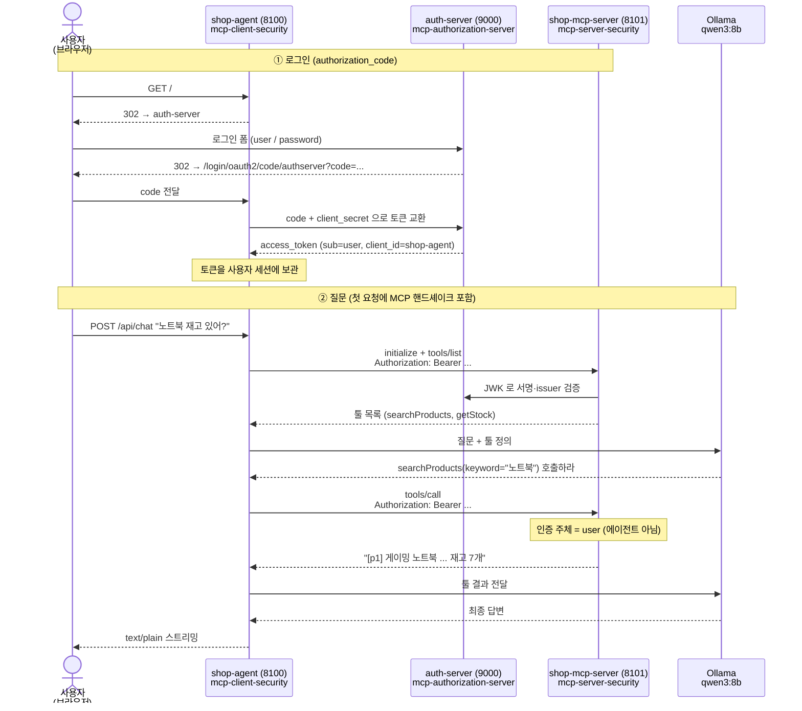

# mcp-security-authn

**사용자가 브라우저로 로그인하고, 에이전트가 그 사용자를 대신해 보호된 MCP 서버를 호출한다.**

`org.springaicommunity` 의 MCP 보안 모듈 3종(`0.1.14`)을 최소로 연동해 보는 practice.

## 왜 만들었나

직전 practice `agent-mcps` 의 최종 리뷰가 남긴 지적이 출발점이다.

> `McpToolFilter` 는 클라이언트측 허용목록이지 서버측 인가가 아니다.
> `cancelOrder` 는 여전히 `POST localhost:8092/mcp` 로 누구나 호출할 수 있다.

`agent-mcps` 에서 필터로 위험한 툴을 가렸지만, 그건 **에이전트에게 뭘 보여줄지** 고른 것뿐이었다.
서버는 그대로 열려 있어서 curl 로 직접 두드리면 다 됐다.
**가린 것과 실제로 잠근 것의 차이**를 보여주는 것이 이 practice 다.

## 학습 목표

| # | 목표 | 확인 방법 |
|---|---|---|
| 1 | MCP 서버를 토큰 없이 못 부르게 만든다 | 시나리오 1 — `curl :8101/mcp` → `401` |
| 2 | 그 401 이 **MCP 보안 모듈** 때문임을 구분한다 | `WWW-Authenticate` 가 `Bearer` (Boot 기본 보안이면 `Basic`) |
| 3 | 에이전트가 **사용자를 대신해** 호출하게 만든다 | 시나리오 4 — 서버 로그의 `사용자=user` |
| 4 | 라이브러리 3개가 각각 무엇을 자동화하는지 안다 | 아래 "모듈별 자동화" 절 |

**인증(authn)까지만 한다.** 토큰이 유효한지만 보고, 스코프 검사나 "이 사용자가 이 툴을 쓸 수 있나"
같은 판단은 하지 않는다. 그건 후속 practice(`mcp-security-authz`)의 몫이다.

> 헷갈리기 쉬운 지점 — grant 이름이 `authorization_code` 라 인가를 하는 것처럼 보이지만,
> **grant 종류의 이름일 뿐**이다. 여기서 하는 일은 토큰 검증(인증)까지다.

## 구성

| 프로젝트 | 포트 | 역할 | 보안 모듈 |
|---|---|---|---|
| `auth-server` | 9000 | 토큰을 **발급**한다 | `mcp-authorization-server-spring-boot` |
| `shop-mcp-server` | 8101 | 토큰을 **검증**한다. 없으면 401 | `mcp-server-security-spring-boot` |
| `shop-agent` | 8100 | 토큰을 **얻어서 붙인다**. 브라우저 UI + Ollama LLM | `mcp-client-security-spring-boot` |

앱 하나가 보안 3요소(발급 / 검증 / 사용) 중 하나씩만 담당한다.
`shop-mcp-server` 는 LLM 을 모르고, `auth-server` 는 MCP 를 모른다.

세 앱 모두 Spring Boot 4.1.0 · Spring AI 2.0.0 · servlet 스택.

## 전체 흐름



핵심은 ②의 `Authorization: Bearer` 다. 이 토큰의 `sub` 는 **로그인한 사람**이고
`client_id` 가 에이전트다. 그래서 MCP 서버가 보는 신원은 에이전트가 아니라 사용자다.

```
sub       = user        ← 권한의 출처 (로그인한 사람)
client_id = shop-agent  ← 발급 대상 (에이전트)
```

`client_credentials` 를 골랐다면 `sub` 도 에이전트가 되어 "에이전트 인증"이 되었을 것이다.
`authorization_code` 를 고른 이유가 이것이고, 폴더 이름을 `agent-auth` 에서 바꾼 이유이기도 하다.

---

# 모듈별 — 하는 일과 자동화되는 것

각 모듈은 `-spring-boot` 접미 변형을 쓴다. 접미 없는 코어 모듈(`mcp-server-security` 등)을
전이 의존으로 끌어오면서 **자동설정**을 얹어 준다. 코어만 직접 쓰면 필터체인을 손으로 조립해야 한다.

아래 "자동으로 생기는 것"은 전부 각 모듈의 자동설정 소스를 직접 읽고 정리한 것이다.

## 1. `mcp-authorization-server-spring-boot` — 토큰 발급

MCP 용으로 손본 Spring Authorization Server. 표준 OAuth2 인가 서버에
DCR(동적 클라이언트 등록), CIMD, localhost 리다이렉트 검증을 얹은 것이다.

```gradle
implementation 'org.springaicommunity:mcp-authorization-server-spring-boot:0.1.14'
```

**자동으로 생기는 것** (`McpAuthorizationServerAutoConfiguration`)

| 빈 / 기능 | 설명 |
|---|---|
| `authorizationServerSecurityFilterChain` | `@Order(HIGHEST_PRECEDENCE)`. `/oauth2/**` 인가 엔드포인트 전체 |
| `defaultSecurityFilterChain` | **폼 로그인 화면**. `/login` 을 직접 만들 필요가 없다 |
| `dcrRegisteredClientRepository` | `spring.security.oauth2.authorizationserver.client.*` 를 `RegisteredClient` 로 매핑. DCR 도 기본 활성 |

**내가 직접 쓴 것**은 `application.yml` 의 클라이언트 등록과 `UserDetailsService` 빈 하나가 전부다.

**주의 — 자동설정이 `.oidc()` 를 켜지 않는다.** 필터체인의 `securityMatcher` 에
`/.well-known/openid-configuration` 은 포함되는데 정작 그 경로를 서빙하는 필터는 등록되지 않아
404 가 난다. 이 practice 는 `openid` 스코프로 `oauth2Login` 을 하므로 id_token 이 필요하다.
그래서 `OidcDiscoveryConfig` 로 확장점(`Customizer<McpAuthorizationServerConfigurer>`)을 통해 켠다.

## 2. `mcp-server-security-spring-boot` — 토큰 검증

MCP 서버를 OAuth2 리소스 서버로 만든다.

```gradle
implementation 'org.springaicommunity:mcp-server-security-spring-boot:0.1.14'
```

```yaml
spring:
  security:
    oauth2:
      resourceserver:
        jwt:
          issuer-uri: http://localhost:9000   # ← 이 줄이 스위치다
```

**자동으로 생기는 것** (`McpServerSecurityAutoConfiguration`)

`mcpServerSecurityFilterChain` 빈 하나가 만들어지고, 그 안에서 이만큼이 딸려 온다:

| 기능 | 설명 |
|---|---|
| `anyRequest().authenticated()` | 모든 경로에 인증 요구 |
| JWT 디코더 | `NimbusJwtDecoder.withIssuerLocation(issuer)` — JWK 조회·서명·issuer 검증 |
| `BearerResourceMetadataTokenAuthenticationEntryPoint` | 401 응답의 `WWW-Authenticate: Bearer resource_metadata=...` |
| 보호 리소스 메타데이터 엔드포인트 | `/.well-known/oauth-protected-resource/mcp` (RFC 9728) |
| Origin 검증 필터 | `spring.ai.mcp.server.security.allowed-origins` 설정 시 (DNS rebinding 방어) |
| 세션 바인딩 | 옵션 |

**활성화 조건 3가지 — 하나라도 어긋나면 조용히 안 뜬다:**

```java
@ConditionalOnWebApplication(type = SERVLET)   // servlet 전용. WebFlux 대응물 없음
@ConditionalOnDefaultWebSecurity               // 내가 SecurityFilterChain 을 만들면 물러남
@ConditionalOnProperty(... "jwt.issuer-uri", matchIfMissing = false)   // 이 속성이 없으면 안 뜸
```

**감사(audience) 검증은 기본 꺼져 있다** (`validateAudienceClaim = false`).
최소 연동에서는 issuer 검증만 하므로 `resource` 파라미터를 넘길 필요가 없다.

## 3. `mcp-client-security-spring-boot` — 토큰 획득·부착

에이전트가 MCP 를 호출할 때 `Authorization` 헤더를 붙여 준다.

```gradle
implementation 'org.springaicommunity:mcp-client-security-spring-boot:0.1.14'
implementation 'org.springframework.boot:spring-boot-starter-oauth2-client'
```

**자동으로 생기는 것** (`McpOAuth2ClientAutoConfiguration` + `HttpClientStreamableHttpTransportAutoConfiguration`)

| 빈 | 설명 |
|---|---|
| `McpClientRegistrationRepository` | `spring.security.oauth2.client.registration.*` 로부터 생성 |
| `McpClientCustomizer<SyncSpec>` | 모든 MCP 클라이언트에 `AuthenticationMcpTransportContextProvider` 를 꽂는다 |
| `preRegisteredClientCustomizer` | 전송 계층에 `OAuth2AuthorizationCodeSyncHttpRequestCustomizer` 를 꽂아 **토큰을 헤더에 붙인다** |
| (DCR 켜면) `DynamicClientRegistrationService` 외 | 동적 클라이언트 등록 경로 |

동작 순서는 이렇다:

1. `AuthenticationMcpTransportContextProvider` 가 **thread-local**(`SecurityContextHolder`,
   `RequestContextHolder`)에서 현재 인증과 요청을 꺼내 `McpTransportContext` 에 담는다
2. `OAuth2AuthorizationCodeSyncHttpRequestCustomizer` 가 그 컨텍스트로
   `OAuth2AuthorizedClientManager.authorize()` 를 불러 액세스 토큰을 얻는다
3. `Authorization: Bearer <token>` 을 요청에 붙인다

**활성화 조건:**

```java
@ConditionalOnWebApplication(type = SERVLET)
@ConditionalOnProperty(prefix = "spring.ai.mcp.client", name = "type", havingValue = "SYNC")
```

**이 모듈에는 `@ConditionalOnDefaultWebSecurity` 가 없다.** 그래서 에이전트는
자기 `SecurityFilterChain`(`oauth2Login` + `oauth2Client`)을 직접 정의해도 된다 —
서버·인가 서버 두 모듈과 다른 점이다. `SecurityConfig` 의 javadoc 참고.

---

# 직접 해보기

## 준비

- Java 21 (시스템 기본이 17이면 sdkman 등으로 21 설치 — Gradle toolchain 이 자동 탐지한다)
- [Ollama](https://ollama.com) + 모델

```bash
brew install ollama
ollama serve &
ollama pull qwen3:8b
```

## 1. 띄우기

```bash
cd practice/mcp-security-authn
./run.sh
```

`auth-server → shop-mcp-server → shop-agent` 순서로 뜬다. **순서가 강제된다** —
이유는 아래 학습 포인트 3번.

## 2. 서버가 실제로 잠겼는지 먼저 확인 (로그인 없이)

```bash
curl -s -D - -o /dev/null -X POST http://localhost:8101/mcp \
  -H 'Content-Type: application/json' \
  -d '{"jsonrpc":"2.0","id":1,"method":"tools/list"}' | head -5
```

기대: `HTTP/1.1 401` 과 `WWW-Authenticate: Bearer resource_metadata=...`

> **`Bearer` 인지 꼭 확인할 것.** `Basic` 이 나오면 MCP 보안 모듈이 아니라
> Boot 기본 보안이 막은 것이다 — 401 은 똑같이 나오지만 의도한 보호가 아니다.
> 학습 포인트 2번 참고.

비교해 볼 만한 것 — 보안 모듈이 없는 이웃 practice:

```bash
cd ../agent-mcps && ./run.sh          # :8091 에 뜬다
# initialize 로 세션을 만든 뒤 tools/list 를 부르면 툴 스키마가 그대로 나온다
```

## 3. 브라우저에서 로그인하고 질문

```
http://localhost:8100/
```

로그인: **`user` / `password`**

질문해 볼 것:

| 질문 | 기대 |
|---|---|
| `노트북 재고 있어?` | 답변에 **실제 숫자** — p1 7개, p2 23개 |
| `무선 기계식 키보드 살 수 있어?` | p3 는 재고 0 → **품절**이라고 답 |

숫자가 없거나 "확인할 수 없다"고 하면 툴이 호출되지 않은 것이다.

> **첫 질문은 느리다** (30초 안팎). `spring.ai.mcp.client.initialized: false` 때문에
> MCP 핸드셰이크와 툴 목록 조회가 기동 시점이 아니라 **첫 채팅 요청** 중에 일어난다.
> 이유는 학습 포인트 4번.

## 4. 누가 툴을 불렀는지 확인 — 이게 결론이다

```bash
grep '호출' logs/shop-mcp-server.log
```

기대:

```
searchProducts 호출 (keyword=노트북, 사용자=user)
```

**`사용자=user`.** MCP 서버에 도착한 신원이 에이전트(`shop-agent`)가 아니라
로그인한 사람이다. `(인증정보 없음)` 이 찍히면 인증이 전달되지 않은 것이다.

토큰이 붙는 과정은 에이전트 로그에서 볼 수 있다:

```bash
grep 'Adding token to header' logs/shop-agent.log
```

## 5. 테스트

```bash
cd auth-server && ./gradlew test        # 4개
cd ../shop-mcp-server && ./gradlew test # 10개
cd ../shop-agent && ./gradlew test      # 4개
```

**`auth-server` 가 떠 있어야 한다** — 이유는 학습 포인트 3번.

## 종료

```bash
./stop.sh
```

---

# 검증 결과 (실측)

2026-08-26, 실제로 세 앱을 함께 띄우고 관측한 값이다. 예측값이 아니다.

## 시나리오 1 — 토큰 없이 MCP 직접 호출

```
$ curl -s -o /dev/null -w '%{http_code}\n' -X POST http://localhost:8101/mcp \
    -H 'Content-Type: application/json' \
    -d '{"jsonrpc":"2.0","id":1,"method":"tools/list"}'
401
```

전체 헤더:

```
HTTP/1.1 401
WWW-Authenticate: Bearer resource_metadata=http://localhost:8101/.well-known/oauth-protected-resource/mcp
```

**`agent-mcps` 의 같은 요청과 나란히 비교.** `agent-mcps/product-mcp-server`
(:8091, 보안 모듈 없음)에 똑같은 방식으로 요청을 두 단계로 실측했다.

| | `mcp-security-authn` (:8101) | `agent-mcps` (:8091) |
|---|---|---|
| `tools/list` 만 보냄 (세션 없음) | `401`, `WWW-Authenticate: Bearer ...` | `400`, `{"message":"Session ID missing"}` — 인증이 아니라 **프로토콜** 단계에서 걸림 |
| `initialize` 로 세션을 먼저 만든 뒤 `tools/list` | (토큰 없인 애초에 `initialize` 조차 401) | `200 OK`, `searchProducts`/`getStock` 스키마가 **그대로 반환됨** |

즉 `agent-mcps` 쪽은 토큰이 전혀 없어도 프로토콜 절차(`initialize` → 세션ID
발급)만 지키면 툴 목록을 통째로 받아간다 — 보안 계층이 아예 없다는 뜻이다.
`mcp-security-authn` 쪽은 `initialize` 시도 자체가 인증 단계에서 막힌다.

## 시나리오 2 — 로그인 없이 브라우저로 접근

`http://localhost:8100/` 에 세션 없이 접근하면 302 로 `http://localhost:9000`
(auth-server)의 "Please sign in" 폼으로 이동한다. 브라우저 자동화로 실제
확인했다 (스크린샷상 `Please sign in` / `Username` / `Password` / `Sign in`
버튼, URL `localhost:9000`).

curl 로 리다이렉트 체인을 따라가도 동일하다:

```
localhost:8100/          → 302 → localhost:8100/oauth2/authorization/authserver
localhost:8100/oauth2/authorization/authserver → 302 → localhost:9000/oauth2/authorize?...
localhost:9000/oauth2/authorize?... (Accept: text/html) → 302 → localhost:9000/login
```

## 시나리오 3 — 로그인 후 질문

**최초 시도에서 실제로 겪은 문제:** 브라우저 자동화로 로그인 폼까지는 정상
도달했으나, 자격증명 제출 후 매번 `Invalid credentials` 오류 페이지로 튕겼다.
원인은 curl 재현으로 추적했다 — 세 앱이 모두 `localhost` 라는 **같은
호스트명**을 쓰고 포트만 다른데, 기본 `JSESSIONID` 쿠키는 **포트를 구분하지
않고 호스트명에만 스코프된다**(RFC 6265 특성). 그래서 브라우저가
`localhost:8100`(에이전트)의 세션 쿠키로 원래 authorization request 를 저장해
두어도, 로그인을 위해 `localhost:9000`(인가 서버)을 거치는 동안 같은 이름의
쿠키가 인가 서버의 세션ID 로 덮어써지고, 콜백으로 `localhost:8100` 에
돌아왔을 때 에이전트가 자신이 저장했던 세션을 더 이상 찾지 못해
`/login?error` 로 떨어졌다. 자동화 도구만의 문제가 아니라 **일반 사용자가
그냥 브라우저로 따라 해도 매번 재현되는 실제 결함**이었다 —
`authorization_code` 는 브라우저 전제 설계이므로 이 흐름 자체가 이 practice
의 핵심 경로다. curl 로 우회하는 것으로는 답이 될 수 없어서, `auth-server`
와 `shop-agent` 에 각각 고유한 세션 쿠키 이름을 지정해 근본 수정했다
(`server.servlet.session.cookie.name` — `AUTHSERVERSESSIONID` /
`SHOPAGENTSESSIONID`). `shop-mcp-server` 는 브라우저가 직접 접근하지 않는
JWT 리소스 서버(에이전트 백엔드가 서버 대 서버로 호출)라 변경이 필요 없었다.

**수정 후, 실제 브라우저(Claude_Browser 자동화, curl 아님)로 처음부터 끝까지
재검증했다.** 로그인 폼 제출 → `shop-agent` 홈(`/?continue`)으로 정상
복귀 → 채팅창 표시까지 한 번에 통과했다.

질문 1: `노트북 재고 있어?` (브라우저 화면에 렌더된 답변을 그대로 옮김)

```
노트북 관련 상품 재고 정보입니다:

1. [p1] 게이밍 노트북 15인치 - 1,890,000원 / 재고 7개
2. [p2] 사무용 노트북 14인치 - 990,000원 / 재고 23개

필요하신 상품이 있으시면 상품 ID(p1/p2)를 알려주시면 더 자세히 안내드릴 수 있습니다.
```

**p1=7개, p2=23개 — 실제 재고 숫자가 정확히 나왔다.**

질문 2 (품절 케이스): `무선 기계식 키보드 살 수 있어?`

```
현재 '무선 기계식 키보드'는 품절된 상태입니다. 재고가 있을 경우 안내드리겠습니다. 다른 상품을 찾아보시겠어요?
```

p3(무선 기계식 키보드, 재고 0)를 정확히 품절로 답했다. 두 질문 모두 브라우저
탭에서 직접 입력·전송하고 화면에 렌더된 답을 확인했다 — API 를 curl 로 찌른
것이 아니다. 체감 지연(10초 간격 폴링으로 관측한 근사치): 질문 1은
전송 후 화면이 "생각 중..." 상태에서 약 30초 뒤 답으로 바뀌었고(핸드셰이크가
겹친 첫 요청), 질문 2는 약 20초 뒤 바뀌었다 — 폴링 간격 때문에 실제 값과
±10초 오차가 있을 수 있는 대략치이며, 브리핑이 안내한 30~100초 범위보다
짧게 관측된 경우(질문 2)도 있었다.

## 시나리오 4 — 서버 로그에서 호출자 확인

```
$ grep '호출' logs/shop-mcp-server.log
searchProducts 호출 (keyword=노트북, 사용자=user)
searchProducts 호출 (keyword=무선 기계식 키보드, 사용자=user)
```

세션 쿠키 이름을 바꾼 뒤 재검증한 결과이며 (경로가 바뀌었으니 재확인이
필요했다), 결과는 동일하다. **`사용자=user` 가 이 practice 의 결론이다.** MCP 서버에 도착한 신원은
에이전트(`client_id=shop-agent`)가 아니라 로그인한 사람(`user`)이다.
`shop-agent.log` 에도 토큰이 실제로 요청에 붙는 과정이 DEBUG 로 그대로 남는다:

```
DEBUG ...AuthorizationCodeSyncHttpRequestCustomizer : Requesting access token for client [authserver]
DEBUG ...AuthorizationCodeSyncHttpRequestCustomizer : Token scopes match requested scopes [openid, profile]
DEBUG ...AuthorizationCodeSyncHttpRequestCustomizer : Adding token to header
```

# 학습 포인트

전부 **실제로 돌려봐야만** 드러난 것들이다. 1·2·3·4번은 계획서에 적어둔 예상을 뒤집었다.

## 1. 필터로 가리는 것과 서버에서 잠그는 것은 다르다

`agent-mcps` 의 `McpToolFilter` 는 에이전트가 **어떤 툴을 볼지** 고르는 클라이언트측 장치다.
서버는 그대로 열려 있어서, MCP 프로토콜 절차(`initialize` → 세션ID)만 지키면
누구든 툴 목록을 통째로 받아간다. 시나리오 1의 비교표가 그 차이다.

## 2. `issuer-uri` 를 지워도 "열리지" 않는다 — 보호가 조용히 바뀐다

계획서에는 "`issuer-uri` 를 지우면 401 테스트가 깨져서 무방비임이 드러난다"고 적었다.
**틀렸다.** 실제로 지우고 돌려보니 테스트가 전부 통과했다.

`spring-boot-starter-security` 가 클래스패스에 있는 한, MCP 보안 자동설정이 안 떠도
**Boot 기본 보안(HTTP Basic + 무작위 비밀번호)** 이 대신 들어와 여전히 401 을 준다.

| 상태 | 응답 | `WWW-Authenticate` |
|---|---|---|
| 모듈 활성 | 401 | `Bearer resource_metadata=...` |
| `issuer-uri` 없음 | 401 | `Basic realm="Realm"` |

즉 **상태 코드만 보는 테스트는 보안 모듈을 통째로 지워도 초록이다.**
겉으로는 잠겨 보이니 더 나쁜 종류의 실패다.

그래서 `ShopMcpServerApplicationTests` 의 401 테스트는 헤더 스킴까지 검증한다:

```java
.andExpect(status().isUnauthorized())
.andExpect(header().string("WWW-Authenticate", startsWith("Bearer")));
```

이 단언을 넣기 전과 후로 실제 빨간불/초록불을 확인했다.

## 3. JWT 디코더는 issuer 메타데이터를 **즉시** 가져온다

`NimbusJwtDecoder.withIssuerLocation(issuer).build()` 의 `.build()` 가
`SecurityFilterChain` 빈을 만드는 시점에 HTTP 로 discovery 문서를 조회한다.

결과:

- `auth-server` 없이 `shop-mcp-server` 를 띄우면 `ConnectException` 으로 **기동 자체가 실패**한다
- `shop-mcp-server` · `shop-agent` 의 `./gradlew test` 도 auth-server 가 떠 있어야 통과한다

"지연 조회일 것"이라 짐작했다가 틀린 항목이다.

## 4. 토큰으로 보호된 MCP 서버는 부팅 시점에 핸드셰이크를 못 한다

`McpClientAutoConfiguration` 은 빈 생성 시점에 `McpSyncClient.initialize()` 를 즉시 부른다.
그런데 그 시점에는 **요청 스레드도, 로그인한 사용자도 없다.** 서버는 모든 요청에 401 을 주므로
핸드셰이크가 실패하고 애플리케이션 컨텍스트가 통째로 죽는다.

```yaml
spring:
  ai:
    mcp:
      client:
        initialized: false   # 핸드셰이크를 첫 요청으로 미룬다
```

이건 우회가 아니라 **사용자 토큰으로 MCP 를 보호하면 필연적으로 생기는 결과**다 —
부팅 시점에는 대신할 사용자가 없다. 대가로 첫 질문이 느려진다(툴 목록 조회가 그때 일어난다).

## 5. 스트리밍에는 `.contextWrite(...)` 가 필수다

`AuthenticationMcpTransportContextProvider` 는 **thread-local** 에서 인증을 읽는데,
`ChatClient.stream()` 의 리액터 체인은 요청 스레드 밖에서 돈다. 그대로 두면 컨텍스트가 비어
토큰이 안 붙고, 흔적은 **DEBUG 로그 한 줄**뿐이다:

```
No authentication or request context found: not requesting token
```

라이브러리 javadoc 이 직접 지시하는 해법을 그대로 쓴다:

```java
chatClient.prompt().user(message).stream().content()
        .contextWrite(AuthenticationMcpTransportContextProvider.writeToReactorContext());
```

`writeToReactorContext()` 는 **호출되는 그 순간의** thread-local 을 캡처하므로
반드시 컨트롤러 메서드 본문(요청 스레드)에서 불러야 한다.

> 앞 practice 의 `Mono.fromCallable(...).subscribeOn(boundedElastic())` 감싸기는 여기서
> **쓰면 안 된다.** 그건 WebFlux 이벤트 루프를 막지 않으려던 조치인데 servlet 에는 이벤트 루프가
> 없고, 오히려 캡처 시점이 어긋나 해가 된다.

## 6. `localhost` 에 OAuth2 앱을 여러 개 띄우면 세션 쿠키 이름을 나눠야 한다

쿠키는 **포트를 구분하지 않고 호스트명에만 스코프된다**(RFC 6265).
세 앱이 모두 `localhost` 라 기본 `JSESSIONID` 가 서로 덮어썼다. 증상은 로그인 시
`Invalid credentials` — 브라우저로 그냥 따라 해도 매번 재현되는 실제 결함이었다.

```yaml
server:
  servlet:
    session:
      cookie:
        name: AUTHSERVERSESSIONID   # shop-agent 는 SHOPAGENTSESSIONID
```

`shop-mcp-server` 는 브라우저가 직접 접근하지 않으므로 변경이 필요 없다.
**종단 검증을 안 했으면 못 찾았을 문제다** — curl 로만 확인했다면 통과했을 것이다.

## 7. 조용히 죽는 스위치 정리

전부 오류 없이 기능만 사라진다.

| 스위치 | 안 지키면 |
|---|---|
| `spring.ai.mcp.client.type: SYNC` | 클라이언트 보안 자동설정이 통째로 사라진다 (토큰 안 붙음) |
| `spring.security.oauth2.resourceserver.jwt.issuer-uri` | MCP 서버 보안이 아예 안 뜬다 (Boot 기본 보안이 대신) |
| OAuth2 클라이언트 등록이 **정확히 1개** | 0개·2개 이상이면 커스터마이저가 WARN 한 줄 남기고 no-op |
| 서버·인가 서버에 `SecurityFilterChain` 직접 정의 | `@ConditionalOnDefaultWebSecurity` 가 꺼져 모듈 설정이 물러난다 |
| `ChatController` 의 `.contextWrite(...)` | 토큰이 안 붙는다 (DEBUG 한 줄만) |

에이전트는 예외다 — 클라이언트 모듈에는 `@ConditionalOnDefaultWebSecurity` 가 없어서
`SecurityFilterChain` 을 직접 정의해도 된다.

## 8. SYNC 서버는 `@McpTool` 반환이 평문 `String` 이다 — 앞 practice 와 반대

| | agent-mcp / agent-mcps | **여기** |
|---|---|---|
| MCP 서버 타입 | `type: ASYNC` | `type: SYNC` |
| `@McpTool` 반환 | `Mono<String>` | **`String`** |

SYNC 서버는 리액티브 반환 타입을 **조용히 걸러낸다.** `Mono<String>` 으로 바꾸면 오류 없이
툴이 등록에서 빠진다. `MCP_툴이_실제로_등록된다` 테스트가 이 사고를 잡는다 —
실제로 반환 타입을 뒤집어 빨간불을 확인했다.

# 트러블슈팅

| 증상 | 확인할 곳 |
|---|---|
| `shop-mcp-server` 기동 실패 (`ConnectException`) | `auth-server` 를 먼저 띄웠는가 (학습 포인트 3) |
| `./gradlew test` 가 컨텍스트 로드부터 실패 | 같은 이유. `auth-server` 가 떠 있어야 한다 |
| 401 인데 `WWW-Authenticate: Basic` | `issuer-uri` 설정 누락 — 모듈이 안 떴다 (학습 포인트 2) |
| 답변에 재고 숫자가 없다 | 툴 미호출. `logs/shop-mcp-server.log` 에 `호출` 기록이 있는가 |
| 로그에 `사용자=(인증정보 없음)` | 인증 미전달. 아래 3줄을 순서대로 확인 |
| 로그인이 `Invalid credentials` 로 튕김 | 세션 쿠키 이름이 겹쳤는가 (학습 포인트 6) |
| 첫 질문이 유난히 느리다 | 정상. 첫 요청에 MCP 핸드셰이크가 포함된다 (학습 포인트 4) |
| 포트가 이미 사용 중 | `./stop.sh` 후 재실행 |

인증이 전달되지 않을 때 순서대로:

```bash
grep -i 'not requesting token' logs/shop-agent.log              # → .contextWrite 누락
grep -i 'expected exactly 1' logs/shop-agent.log                # → 등록이 1개가 아님
grep -i 'transport customizer' logs/shop-agent.log              # → 없으면 type 이 SYNC 가 아님
```

# 비목표

- 스코프 검사, 툴 단위 인가 → 후속 `mcp-security-authz`
- 사용자 여러 명, 역할 분리
- 토큰 저장소 영속화 (in-memory 로 충분)
- UI 완성도 — `index.html` 은 OAuth 리다이렉트를 브라우저에 맡기기 위한 최소 장치다
- `client_credentials`, `hybrid` grant
- DCR(동적 클라이언트 등록) — 라이브러리는 지원하지만 여기서는 사전 등록 하나만 쓴다.
  브라우저 로그인에 client registration 이 어차피 필요하므로 DCR 은 덧붙는 절차가 된다

# 참고

- [설계 스펙](../../docs/superpowers/specs/2026-08-25-mcp-security-authn-design.md)
- [구현 계획](../../docs/superpowers/plans/2026-08-26-mcp-security-authn.md)
- [spring-ai-community/mcp-security](https://github.com/spring-ai-community/mcp-security)
- 앞 practice: [agent-mcp](../agent-mcp) · [agent-mcps](../agent-mcps)
