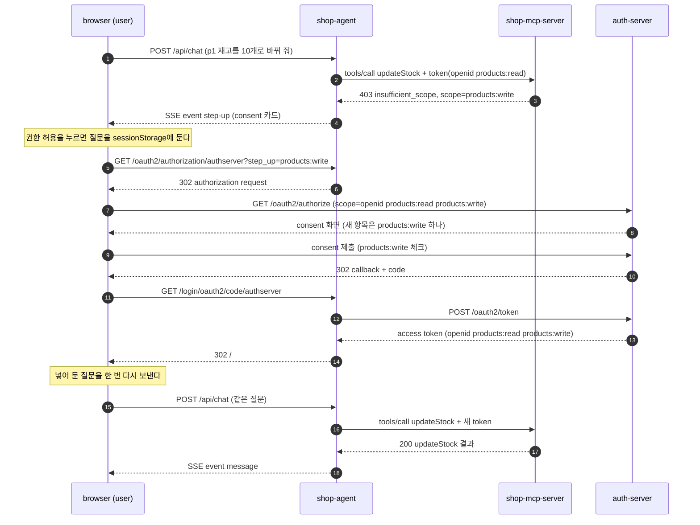

# mcp-security-authz

이 practice는 [official practice](../mcp-security-authn-official/README.md)에 tool별 scope와 step-up을 더한다.
client는 처음에 조회 scope `products:read`만 받는다.
재고를 바꾸는 tool을 처음 부르면 MCP Server가 `403 insufficient_scope`로 `products:write`를 요구한다.
그러면 client는 사용자에게 consent를 다시 받아 scope를 늘린다.
이 과정을 step-up이라 한다.
흐름과 규칙은 [안내서 10장](../mcp-guide/10-scope-and-step-up.md)이 설명한다.
이 README에서는 official과 다른 점만 본다.

## official과 다른 점

| 바뀐 곳 | official | 이 practice | 안내서 절 |
|---|---|---|---|
| `auth-server`의 scope 등록 | 두 client 모두 `openid profile`이다 | `products:read`(조회)와 `products:write`(재고 변경)다. `authz-shop-agent`에는 login에 쓰는 `openid`도 있다 | [10장 처음 요청할 scope](../mcp-guide/10-scope-and-step-up.md#103-1단계-처음에는-조회-scope만-받는다) |
| `auth-server`의 agent consent 화면 | `require-authorization-consent: false`라서 consent 화면이 없다 | `true`다. step-up 때 사용자가 새 scope를 직접 보고 허락한다 | [10장 합친 scope](../mcp-guide/10-scope-and-step-up.md#105-3단계-합친-scope로-다시-authorization을-받는다) |
| access token의 `client_id` | 없다 | `ResourceAudienceTokenCustomizer`가 넣는다. MCP Server는 이 값으로 어느 client를 거친 요청인지 안다 | [10장 처음 요청할 scope](../mcp-guide/10-scope-and-step-up.md#103-1단계-처음에는-조회-scope만-받는다) |
| MCP Server의 tool과 scope | 인증된 요청은 모든 tool을 부를 수 있다 | `@RequiredScope`로 tool마다 scope를 적고, `ToolScopeRegistry`가 모은다. 재고를 바꾸는 `updateStock`(`products:write`)이 더 있다 | [10장 서버 코드](../mcp-guide/10-scope-and-step-up.md#108-서버-코드에서-보기) |
| MCP Server의 scope 검사 | 없다 | `ToolScopeFilter`가 모든 MCP 요청에 `products:read`를, `tools/call`에는 그 tool의 scope를 요구한다. 모자라면 `403 insufficient_scope`로 답한다 | [10장 `403 insufficient_scope`](../mcp-guide/10-scope-and-step-up.md#104-2단계-쓰기를-처음-시도하면-403이-온다) |
| MCP Server의 `401`과 PRM | `401`에는 `resource_metadata`만 있고, PRM에는 `scopes_supported`가 없다 | `401`에 `scope="products:read"`가, PRM에 `"scopes_supported":["products:read"]`가 있다. 쓰기 scope는 미리 알리지 않는다 | [10장 처음 요청할 scope](../mcp-guide/10-scope-and-step-up.md#103-1단계-처음에는-조회-scope만-받는다) |
| agent가 요청하는 scope | 설정에 적은 `openid profile`이다 | discovery가 `401`의 `scope` → PRM의 `scopes_supported` → 생략 순서로 고른 scope에 `openid`를 더한다 | [10장 처음 요청할 scope](../mcp-guide/10-scope-and-step-up.md#103-1단계-처음에는-조회-scope만-받는다) |
| agent의 `403` 처리 | 따로 다루지 않는다 | `StepUpAuthorizationErrorHandler`가 `403 insufficient_scope`를 예외로 바꾼다. `StepUpToolExecutionExceptionProcessor`는 그 예외를 LLM에게 넘기지 않고 채팅 응답까지 그대로 전한다 | [10장 consent 카드](../mcp-guide/10-scope-and-step-up.md#106-웹-agent-대화-안-consent-카드) |
| agent의 채팅 응답 | `text/plain` stream이다 | SSE event(`message`, `step-up`, `step-up-declined`)다. `ChatEvents`가 만들고, `index.html`이 consent 카드를 보여 준다 | [10장 consent 카드](../mcp-guide/10-scope-and-step-up.md#106-웹-agent-대화-안-consent-카드) |
| agent의 authorization request | 설정에 적은 scope(`openid profile`) 그대로다 | `StepUpAuthorizationRequestResolver`가 요청 scope에 지금 token의 scope와 `step_up` parameter의 scope를 더한다. 진행 상태와 결과는 `StepUpState`와 `StepUpLoginSuccessHandler`가 기록한다 | [10장 합친 scope](../mcp-guide/10-scope-and-step-up.md#105-3단계-합친-scope로-다시-authorization을-받는다), [거절과 일부 허락](#거절과-일부-허락) |
| `local-client`가 요청하는 scope | `Main`에 정해 둔 `openid profile`이다 | `ScopeSelection`이 `401`의 `scope` → PRM의 `scopes_supported` → 생략 순서로 고른다 | [10장 처음 요청할 scope](../mcp-guide/10-scope-and-step-up.md#103-1단계-처음에는-조회-scope만-받는다) |
| `local-client`의 MCP 호출 | `getStock(p1)`까지 부른다 | `updateStock(p1, 10)`도 부른다. `403`이면 `StepUp`이 합친 scope로 authorization을 다시 받고, `McpCalls`가 같은 호출을 새 요청으로 다시 보낸다 | [10장 다시 login](../mcp-guide/10-scope-and-step-up.md#107-사용자-기기의-앱-그-자리에서-다시-login) |
| `local-client`의 token 붙이기 | transport의 기본 요청에 한 번 넣는다 | 요청을 만들 때마다 `TokenHolder`에서 지금 token을 읽는다 | [10장 client 코드](../mcp-guide/10-scope-and-step-up.md#109-client-코드에서-보기) |

`auth-server`의 `resource`·`iss`·PKCE·public client 규칙은 official과 같다.
MCP Server의 token 검증과 `Origin`·`Host`·`MCP-Protocol-Version` 검사, agent의 token request와 callback `iss` 확인, token 붙이기도 official과 같은 클래스다.
그 클래스들은 package 이름(`dev.starryeye.authz.*`)과 포트·client_id 같은 설정 값만 다르다.

agent는 official처럼 MCP 요청마다 그 사용자의 authorized client에서 token을 찾는다.
그래서 step-up으로 받은 새 token은 다음 MCP 요청부터 바로 붙는다.

tool 목록은 scope와 상관없이 모두에게 같다.
조회 token으로 `tools/list`를 보내도 `updateStock`이 보이고, scope는 tool을 부를 때 검사한다.

### step-up 흐름

아래는 웹 agent에서 재고 변경을 처음 시도할 때의 흐름이다.



[다이어그램 그림으로 보기](diagrams/README-1.png)

agent는 더 넓은 scope의 token을 혼자서 받아 올 수 없다.
더 넓은 scope는 사용자가 자기 browser에서 직접 consent해야 하기 때문이다.
그래서 tool 호출이 `403`을 받으면(3), agent는 그 결과를 LLM에게 오류 문장으로 넘기지 않는다.
채팅 응답을 멈추고, 대신 consent 카드 event를 보낸다(4).
사용자가 "권한 허용"을 누르면 browser는 질문을 `sessionStorage`에 넣어 둔다.
그다음 agent의 login 시작 주소 `/oauth2/authorization/authserver`로 간다(5).
agent는 `step_up`의 scope를 지금 token의 scope와 합쳐 authorization request를 만든다(6)(7).
scope를 합쳐 요청하는 이유는 새 token이 옛 token을 대신하기 때문이다.
`products:write`만 요청하면 새 token에는 모든 MCP 요청에 필요한 `products:read`가 없다.

consent 화면에서 새로 고를 항목은 `products:write` 하나다(8).
`authz-shop-agent`는 confidential client라서 Authorization Server가 그 consent를 저장한다.
그래서 전에 허락한 scope는 다시 묻지 않는다.
agent는 callback(11)의 code로 새 token을 받고(12)(13), 그 사용자의 authorized client를 새 token으로 바꾼다.
그다음 browser를 채팅 화면으로 돌려보낸다(14).
화면은 넣어 둔 질문을 한 번 다시 보내고(15), 이번 `tools/call`에는 새 token이 붙는다(16).

`local-client`는 사용자가 바로 앞에 있는 앱이라서 카드를 띄우지 않는다.
그 자리에서 browser를 다시 열고, 새 token을 받으면 질문이 아니라 같은 MCP 호출을 새 요청으로 다시 보낸다.
`local-mcp-client`는 public client라서 Authorization Server가 consent를 저장하지 않는다.
그래서 step-up의 consent 화면도 `products:read`와 `products:write`를 모두 묻는다.

### 거절과 일부 허락

Spring Authorization Server의 consent 화면은 scope마다 checkbox를 둔다.
그래서 사용자는 요청받은 scope 가운데 일부만 허락할 수 있다.
step-up의 consent 화면에서 `products:write`를 체크하지 않고 제출해도, Cancel을 눌러도 agent는 오류가 아니라 새 token을 받는다.
Authorization Server는 전에 허락받은 scope를 새 token에도 넣는다.
그래서 이 token의 scope는 `openid products:read`다.
요청보다 좁은 scope의 token을 주는 이 경우를 일부 허락(down-scoping)이라 한다.
`StepUpLoginSuccessHandler`는 새 token에서 빠진 step-up scope를 로그에 남긴다.

거절한 권한을 묻고 또 물으면, 사용자는 무엇을 허락하는지 읽지 않고 누르기 쉽다.
그래서 두 client는 한 번 요청했는데도 받지 못한 scope로 step-up을 되풀이하지 않는다.

- agent의 `StepUpState`는 이 HTTP session에서 step-up을 시작한 scope를 기록한다.
  같은 scope로 다시 `403`이 오면 `ChatEvents`는 카드 대신 거절 안내(`step-up-declined`)를 보낸다.
  안내의 "다시 요청" 버튼을 눌러야 `StepUpController`가 기록을 지우고 step-up을 다시 시작한다.
- `local-client`의 `StepUp`은 새 token에도 필요한 scope가 없으면 더 시도하지 않는다.
  서버가 이미 가진 scope를 모자라다고 할 때도 같다.
  이때 앱은 `실패: products:write 권한을 받지 못했다`를 찍고 끝난다.

agent의 step-up 기록에는 HTTP session 저장 방식에 대한 전제가 하나 있다.
agent는 HTTP session에 넣어 둔 `StepUpState` 객체의 값만 바꾸고, `setAttribute`를 다시 부르지 않는다.
기본 설정인 메모리 session에서는 이것으로 충분하다.
Spring Session(Redis 등)은 기본 설정에서 `setAttribute`로 넣은 attribute만 저장한다.
그래서 Spring Session을 쓰면 값을 바꿀 때마다 `setAttribute`를 다시 불러야 한다.

## 실행

준비물과 `run.sh`가 하는 일은 [official의 실행](../mcp-security-authn-official/README.md#실행)과 같다.

```bash
# 저장소 최상위 폴더에서
cd practice/mcp-security-authz
./run.sh
```

`run.sh`는 `auth-server`(9030) → `shop-mcp-server`(8141) → `shop-agent`(8140) 순서로 띄운다.
앱의 로그는 `practice/mcp-security-authz/logs/<module>.log`에 남는다.
issuer는 `http://localhost:9030`이고, MCP Server의 resource는 `http://localhost:8141/mcp`다.
agent의 confidential client는 `authz-shop-agent`이고, `local-client`는 public client `local-mcp-client`로 token을 받는다.

browser에서 `http://localhost:8140`을 열고 `user`/`password`로 login한다.
official과 달리 login 뒤에 consent 화면이 나오고, 선택 항목은 `products:read` 하나다.
`products:read`를 체크해 제출한 뒤 재고를 묻는다.
이어서 `p1 재고를 10개로 바꿔 줘`처럼 재고 변경을 부탁한다.
그러면 답 대신 채팅 아래에 consent 카드가 뜬다.

`auth-server`는 consent를, agent는 token과 step-up 기록을 메모리에 둔다.
흐름을 처음부터 다시 보려면 `./stop.sh`로 내리고 `./run.sh`로 다시 띄운다.

**`local-client` 실행**

`local-client`에게는 `auth-server`와 `shop-mcp-server`만 있으면 된다.
`./gradlew run`은 `JAVA_HOME`이 Java 21을 가리켜야 돈다.
Java 21을 sdkman으로 설치했다면 아래 첫 줄로 맞춘다.
다른 방법으로 설치했다면 `JAVA_HOME`을 그 Java 21 폴더로 둔다.

```bash
# 저장소 최상위 폴더에서
export JAVA_HOME=$(find $HOME/.sdkman/candidates/java -maxdepth 1 -type d -name '21.*' | sort -V | tail -1)
cd practice/mcp-security-authz/local-client
./gradlew run
```

browser는 두 번 열린다.
첫 browser에서 login 화면이 나오면 `user`/`password`로 login한다.
consent 화면에서는 `products:read`를 체크해 제출한다.
`updateStock`이 `403`을 받으면 step-up의 consent 화면이 열리고, 여기서는 `products:read`와 `products:write`를 모두 체크해 제출한다.
terminal에 `[1]`부터 `[7]`까지 찍히고 앱은 끝난다.
`./gradlew run --args="--no-browser"`는 browser를 열지 않고 authorization request 주소만 찍는다.
인자와 멈추는 경우는 [7장 실행해 보기](../mcp-guide/07-local-client.md#79-실행해-보기)에 있다.
이 practice의 기본값은 `--resource`가 `http://localhost:8141/mcp`, `--issuer`가 `http://localhost:9030`이다.

**멈추기**

```bash
# practice/mcp-security-authz에서
./stop.sh
```

`stop.sh`는 9030·8141·8140 포트에서 연결을 기다리는 process를 내린다.
`./stop.sh --ollama`는 ollama도 함께 내린다.

## 코드 지도

official과 같은 클래스는 [official README의 코드 지도](../mcp-security-authn-official/README.md#코드-지도)에 있다.
아래는 이 practice에만 있거나 official과 다른 클래스다.
클래스는 `<module>/src/main/java/dev/starryeye/authz/<package>/` 아래에 있고, `application.yml`과 `static/index.html`은 `<module>/src/main/resources/`에 있다.
package는 `auth-server`가 `authserver`, `shop-mcp-server`가 `mcpserver`, `shop-agent`가 `agent`, `local-client`가 `localclient`다.
Spring 앱 세 module은 official처럼 역할별 하위 package로 나뉘고, `local-client`는 package 하나다.

| module | 클래스 | 하는 일 | 안내서 |
|---|---|---|---|
| `auth-server` | `application.yml` | 두 client에 `products:read`·`products:write`를 등록하고, `authz-shop-agent`에도 consent 화면을 켠다 | [10장 처음 요청할 scope](../mcp-guide/10-scope-and-step-up.md#103-1단계-처음에는-조회-scope만-받는다), [10장 합친 scope](../mcp-guide/10-scope-and-step-up.md#105-3단계-합친-scope로-다시-authorization을-받는다) |
| | `ResourceAudienceTokenCustomizer` | official처럼 access token의 `aud`를 `resource`로 정하고, `client_id` claim을 더한다 | [10장 처음 요청할 scope](../mcp-guide/10-scope-and-step-up.md#103-1단계-처음에는-조회-scope만-받는다) |
| `shop-mcp-server` | `RequiredScope`, `ToolScopeRegistry` | tool 메서드 옆에 필요한 scope를 적고, 앱이 뜰 때 tool 이름으로 scope를 찾는 표를 만든다. `@RequiredScope`가 없거나 모르는 tool은 기본 scope `products:read`다 | [10장 서버 코드](../mcp-guide/10-scope-and-step-up.md#108-서버-코드에서-보기) |
| | `ToolScopeFilter` | token 검증 뒤에 scope를 보고, 모자라면 `403`과 `WWW-Authenticate: Bearer error="insufficient_scope", scope=…`로 답한다. 본문은 transport가 읽는 것과 같은 방법으로 읽어 `params.name`에서 tool 이름을 찾고, JSON object 하나로 읽히지 않으면 transport에 넘기지 않고 `400`으로 답한다 | [10장 `403 insufficient_scope`](../mcp-guide/10-scope-and-step-up.md#104-2단계-쓰기를-처음-시도하면-403이-온다), [10장 서버 코드](../mcp-guide/10-scope-and-step-up.md#108-서버-코드에서-보기) |
| | `CachedBodyHttpServletRequest` | filter가 읽은 요청 본문을 transport가 처음부터 다시 읽게 한다 | [10장 서버 코드](../mcp-guide/10-scope-and-step-up.md#108-서버-코드에서-보기) |
| | `ScopeChallengeEntryPoint` | `401` challenge에 `scope`가 없으면 `scope="products:read"`를 더한다 | [10장 처음 요청할 scope](../mcp-guide/10-scope-and-step-up.md#103-1단계-처음에는-조회-scope만-받는다) |
| | `ResourceMetadataUrl` | `401`과 `403`의 `resource_metadata`에 같은 PRM 주소를 넣는다 | [10장 `403 insufficient_scope`](../mcp-guide/10-scope-and-step-up.md#104-2단계-쓰기를-처음-시도하면-403이-온다) |
| | `SecurityConfig` | PRM의 `scopes_supported`에 `products:read`만 넣고, `401` challenge는 `ScopeChallengeEntryPoint`에 맡긴다 | [10장 처음 요청할 scope](../mcp-guide/10-scope-and-step-up.md#103-1단계-처음에는-조회-scope만-받는다) |
| | `McpTransportConfig` | `ToolScopeFilter`를 `/mcp`에만 등록한다. Spring Security 바로 뒤, `McpProtocolVersionFilter` 앞에서 돈다 | [10장 서버 코드](../mcp-guide/10-scope-and-step-up.md#108-서버-코드에서-보기), [6장 검사 순서](../mcp-guide/06-mcp-call-and-validation.md#63-mcp-server가-요청을-검사하는-순서-시퀀스-다이어그램) |
| | `ProductTools`, `ProductRepository` | `updateStock`이 재고를 `quantity`로 바꾸고 바뀐 재고를 문장으로 돌려준다. 조회 tool에는 `@RequiredScope("products:read")`, `updateStock`에는 `@RequiredScope("products:write")`가 붙는다 | [10장 서버 코드](../mcp-guide/10-scope-and-step-up.md#108-서버-코드에서-보기) |
| `shop-agent` | `McpAuthorizationDiscovery`, `DiscoveredAuthorization` | `401`의 `scope` → PRM의 `scopes_supported` → 생략 순서로 처음 요청할 scope를 고른다 | [10장 처음 요청할 scope](../mcp-guide/10-scope-and-step-up.md#103-1단계-처음에는-조회-scope만-받는다) |
| | `DiscoveredClientRegistrationRepository`, `application.yml` | login에 쓸 scope를 `openid`와 discovery가 고른 scope로 정한다. 설정에는 scope를 적지 않는다 | [10장 처음 요청할 scope](../mcp-guide/10-scope-and-step-up.md#103-1단계-처음에는-조회-scope만-받는다) |
| | `StepUpAuthorizationErrorHandler` | MCP 요청이 `403 insufficient_scope`를 받으면 `StepUpRequiredException`을 던진다. 새 token을 받으려면 사용자가 browser에서 consent해야 하므로 SDK에 재시도를 맡기지 않는다 | [10장 consent 카드](../mcp-guide/10-scope-and-step-up.md#106-웹-agent-대화-안-consent-카드), [10장 client 코드](../mcp-guide/10-scope-and-step-up.md#109-client-코드에서-보기) |
| | `StepUpToolExecutionExceptionProcessor` | step-up 예외는 LLM에게 tool 오류 문장으로 넘기지 않고 채팅 응답까지 그대로 전한다. 나머지 예외는 Spring AI 기본 처리와 같다 | [10장 client 코드](../mcp-guide/10-scope-and-step-up.md#109-client-코드에서-보기) |
| | `BearerChallenge`, `StepUpRequiredException` | `WWW-Authenticate`에서 `error`와 `scope`를 읽고, 필요한 scope와 tool 이름을 예외에 담는다 | [10장 client 코드](../mcp-guide/10-scope-and-step-up.md#109-client-코드에서-보기) |
| | `McpSecurityConfig` | `StepUpAuthorizationErrorHandler`를 MCP client transport에, `StepUpToolExecutionExceptionProcessor`를 Spring AI의 tool 실행에 연결한다 | [10장 client 코드](../mcp-guide/10-scope-and-step-up.md#109-client-코드에서-보기) |
| | `ChatController`, `ChatEvents` | 채팅 답을 SSE event로 보낸다. stream으로 오는 답은 `message`, consent 카드는 `step-up`, 이미 step-up을 거친 scope의 거절 안내는 `step-up-declined` event다 | [10장 consent 카드](../mcp-guide/10-scope-and-step-up.md#106-웹-agent-대화-안-consent-카드) |
| | `index.html` | 카드를 보여 주고, consent 화면으로 가기 전에 질문을 `sessionStorage`에 넣어 둔다. 채팅 화면으로 돌아오면 그 질문을 한 번 다시 보낸다 | [10장 consent 카드](../mcp-guide/10-scope-and-step-up.md#106-웹-agent-대화-안-consent-카드) |
| | `StepUpAuthorizationRequestResolver` | authorization request의 scope에 지금 token의 scope와 `step_up` parameter의 scope를 더한다. `step_up`은 MCP Server가 `403`으로 요구한 scope만 받는다 | [10장 합친 scope](../mcp-guide/10-scope-and-step-up.md#105-3단계-합친-scope로-다시-authorization을-받는다), [10장 client 코드](../mcp-guide/10-scope-and-step-up.md#109-client-코드에서-보기) |
| | `StepUpState` | HTTP session에 step-up 상태를 둔다. consent 결과를 기다리는 scope, 이미 시도한 scope, MCP Server가 요구한 scope다 | [거절과 일부 허락](#거절과-일부-허락) |
| | `StepUpLoginSuccessHandler`, `LoginFailureHandler` | step-up의 login이 끝나면 step-up으로 요청한 scope를 모두 받았는지 로그로 남긴다. step-up 중에 login이 실패하면 오류 화면 대신 채팅 화면으로 돌려보낸다 | [거절과 일부 허락](#거절과-일부-허락) |
| | `StepUpController` | "다시 요청" 버튼이 부르는 `/step-up/retry`다. 시도 기록을 지우고 step-up을 다시 시작한다 | [거절과 일부 허락](#거절과-일부-허락) |
| | `SecurityConfig` | `oauth2Login`에 `StepUpAuthorizationRequestResolver`와 `StepUpLoginSuccessHandler`를 연결한다 | [10장 client 코드](../mcp-guide/10-scope-and-step-up.md#109-client-코드에서-보기) |
| `local-client` | `Main` | discovery가 고른 scope로 authorization code 흐름을 밟는다. step-up 때는 같은 흐름을 합친 scope로 한 번 더 밟는다 | [10장 다시 login](../mcp-guide/10-scope-and-step-up.md#107-사용자-기기의-앱-그-자리에서-다시-login) |
| | `Discovery`, `ScopeSelection`, `AuthorizationRequest` | `401`의 `scope`와 PRM의 `scopes_supported`를 읽어 그 순서로 처음 요청할 scope를 고른다. 둘 다 없으면 `scope` parameter를 빼고 보낸다 | [10장 처음 요청할 scope](../mcp-guide/10-scope-and-step-up.md#103-1단계-처음에는-조회-scope만-받는다) |
| | `BearerChallenge` | agent와 같은 규칙으로 `WWW-Authenticate`의 `error`와 `scope`를 읽는다 | [10장 client 코드](../mcp-guide/10-scope-and-step-up.md#109-client-코드에서-보기) |
| | `StepUp` | `403 insufficient_scope`를 받으면 필요한 scope를 가진 scope와 합쳐, 그 자리에서 browser로 authorization을 다시 받는다. 이미 요청했는데도 못 받은 scope면 더 시도하지 않고 멈춘다 | [10장 다시 login](../mcp-guide/10-scope-and-step-up.md#107-사용자-기기의-앱-그-자리에서-다시-login) |
| | `StepUpCompletedException`, `McpCalls` | SDK의 재시도는 이미 만든 요청을 그대로 다시 보내서, `Authorization` header에 옛 token이 남는다. 그래서 `StepUp`은 새 token을 받으면 이 예외를 던지고, `McpCalls`가 같은 호출을 새 요청으로 한 번 다시 보낸다 | [10장 다시 login](../mcp-guide/10-scope-and-step-up.md#107-사용자-기기의-앱-그-자리에서-다시-login), [10장 client 코드](../mcp-guide/10-scope-and-step-up.md#109-client-코드에서-보기) |
| | `TokenHolder` | 지금 쓰는 access token과 scope를 둔다. `McpCalls`는 요청을 만들 때마다 여기서 token을 읽는다 | [10장 client 코드](../mcp-guide/10-scope-and-step-up.md#109-client-코드에서-보기) |
| | `TokenClient`, `TokenResponse` | token 응답의 `scope`를 읽는다. 응답에 `scope`가 없으면 요청한 scope를 그대로 받은 것으로 본다 | [7장 token request](../mcp-guide/07-local-client.md#77-5단계-token-request--tokenclient) |

## 직접 확인할 것

`run.sh`로 띄운 뒤 `practice/mcp-security-authz`에서 실행한다.
`local-client`의 줄은 `practice/mcp-security-authz/local-client`에서 실행한다.
웹 agent의 줄은 표의 순서대로 한다.
`products:write`를 한 번 허락하면 token과 consent에 그 scope가 남아, 거절하는 경우를 다시 볼 수 없기 때문이다.
처음부터 다시 보려면 `./stop.sh`와 `./run.sh`로 다시 띄운다.

| 해 볼 것 | 기대 결과 |
|---|---|
| `curl -i -X POST http://localhost:8141/mcp` | `401`과 `WWW-Authenticate: Bearer resource_metadata="http://localhost:8141/.well-known/oauth-protected-resource/mcp", scope="products:read"` |
| `curl -s http://localhost:8141/.well-known/oauth-protected-resource/mcp` | `"scopes_supported":["products:read"]`가 있고, `products:write`는 없다 |
| browser로 `http://localhost:8140`을 열고 `user`/`password`로 login | consent 화면의 선택 항목은 `products:read` 하나다 |
| `products:read`를 체크해 제출하고 `p1 재고 알려 줘` 묻기 | p1(게이밍 노트북 15인치)의 재고가 7개라고 답한다 |
| `p1 재고를 10개로 바꿔 줘` 보내기 | 채팅 아래에 `updateStock을(를) 하려면 products:write 권한이 더 필요합니다. 허용하면 권한을 받은 뒤 질문을 다시 보냅니다.` 카드와 "권한 허용" 버튼이 뜬다 |
| `grep 'scope 부족' logs/shop-mcp-server.log` | `scope 부족 — 사용자=user, client_id=authz-shop-agent, tool=updateStock, 필요한 scope=products:write, 가진 scope=[openid, products:read]` |
| "권한 허용" 누르기 | consent 화면에서 새로 고를 항목은 `products:write` 하나다. `openid`와 `products:read`는 "You have already granted the following permissions to the above app" 아래에 체크된 채 바꿀 수 없게 나온다 |
| `products:write`를 체크하지 않고 제출하거나 Cancel 누르기 | 채팅 화면으로 돌아와 질문이 다시 간다. 이번에는 `updateStock에 필요한 products:write 권한을 받지 못했습니다. 다시 요청하려면 아래 버튼을 누르세요.` 안내와 "다시 요청" 버튼이 뜬다 |
| `grep 'step-up' logs/shop-agent.log` | `step-up authorization request — 추가 scope=[products:write], 요청 scope=[openid, products:read, products:write]`와 `step-up에서 허락받지 못한 scope — 사용자=user, 빠진 scope=[products:write]`가 찍힌다 |
| "다시 요청"을 누르고 consent 화면에서 `products:write`를 체크해 제출 | 돌아와 질문이 다시 가고, `상품 p1 (게이밍 노트북 15인치)의 재고를 10개로 변경했습니다.` 같은 답이 나온다. `logs/shop-agent.log`에는 `step-up 완료 — 사용자=user, 받은 scope=[openid, products:read, products:write]`가 남는다 |
| `grep 'updateStock 호출' logs/shop-mcp-server.log` | `updateStock 호출 (productId=p1, quantity=10, 사용자=user)` |
| `local-client`에서 `./gradlew -q run` 뒤 두 번의 consent | `[1]`에 `처음 요청할 scope: products:read (401의 scope)`가, 첫 `[4]`에 `scope: products:read`가 찍힌다. `403 insufficient_scope — 필요한 scope: products:write` 뒤에 `[6]`, `[3]`, `[4]`(`scope: products:read products:write`), `[7]` 순서로 찍히고, 재고를 10개로 바꾼다 |
| `local-client` 실행 뒤 `grep 'scope 부족' ../logs/shop-mcp-server.log` | `client_id=local-mcp-client`와 `가진 scope=[products:read]`인 줄이 더 있다. 같은 사용자라도 어느 client를 거친 요청인지 로그로 구분된다 |
| `local-client`를 다시 실행하고, step-up consent에서 `products:read`만 체크해 제출 | `실패: products:write 권한을 받지 못했다`로 멈춘다 |
| `shop-mcp-server`, `shop-agent`, `local-client` 폴더에서 각각 `./gradlew test` | scope 검사와 `403`, 두 client의 step-up, 되풀이하지 않는 규칙을 확인하는 테스트가 통과한다 |

LLM의 답은 `qwen3:8b`의 출력이라 문장이 매번 조금씩 다르다.
기기에 따라 답 하나에 1분 넘게 걸리기도 한다.
LLM이 `updateStock`을 고르지 않으면 상품 ID와 바꿀 수량을 더 분명히 적는다.
`./gradlew test` 전에는 [실행](#실행)의 `export` 줄로 `JAVA_HOME`을 Java 21로 맞춘다.

`logs/shop-agent.log`에는 tool 호출이 `403`을 받을 때마다 `ERROR` 줄 세 개가 `StepUpRequiredException`의 stack trace와 함께 남는다.
`SyncMcpToolCallback`의 `Exception while tool calling:` 한 줄과 `MessageAggregator`의 `Aggregation Error` 두 줄이다.
Spring AI가 tool 예외를 채팅 응답까지 전하면서 남긴다.
실패가 아니라 step-up이 정상으로 진행될 때 남는 로그다.

token이 필요한 요청은 캡처 스크립트로 한 단계씩 기록해 본다.
`mcp-authz-walkthrough.sh`는 agent의 client `authz-shop-agent`로 처음 authorization부터 두 번의 step-up까지 밟는다.
login과 consent는 browser 대신 curl이 한다.
첫 step-up에서는 `products:write`를 체크하지 않아 다시 `403`을 받고, 두 번째에서 체크해 `200`을 받는다.
consent 화면이 나오려면 저장된 consent가 없어야 하므로, `./stop.sh`와 `./run.sh`로 다시 띄운 직후에 돌린다.
`authz-local-client-run.sh`는 `local-client`를 `--no-browser`로 돌리고, 두 번의 consent를 curl로 한다.

```bash
# 저장소 최상위 폴더에서. 출력의 JWT는 앞 20자만 남는다
docs/superpowers/captures/mcp-authz-walkthrough.sh > /tmp/authz-walkthrough.txt
# ./gradlew run을 부르므로 JAVA_HOME이 Java 21을 가리켜야 한다
docs/superpowers/captures/authz-local-client-run.sh > /tmp/authz-local-client.txt
```

같은 방법으로 받은 기록이 [authz 캡처](../../docs/superpowers/captures/2026-09-29-authz-walkthrough.txt)와 [authz local-client 캡처](../../docs/superpowers/captures/2026-09-29-authz-local-client.txt)에 있다.

## 더 읽을 것

- [안내서 10장 scope와 step-up](../mcp-guide/10-scope-and-step-up.md): 이 practice로 scope 고르기, `403 insufficient_scope`, step-up을 설명한다.
- [5장 authorization request](../mcp-guide/05-authorization-and-token.md#53-authorization-request를-보낸다): client가 scope를 고르는 순서를 처음 설명한다.
- [6장 token 검증](../mcp-guide/06-mcp-call-and-validation.md#65-2단계-token-검증): `401 invalid_token`과 `403 insufficient_scope`의 차이, step-up의 개념을 설명한다.
- [부록: 명세 준수표](../mcp-guide/reference-compliance.md#준수표): official의 16번(scope 설계와 step-up)과 37번(client의 scope 선택) 판정을 이 practice와 비교해 본다.
- [mcp-security-authn-official](../mcp-security-authn-official/README.md): 이 practice의 바탕이 된 practice다.
- 다음 practice에서는 MCP Server를 session 없이(stateless) 두고, 장바구니처럼 호출 사이에 남는 상태를 서버가 만든 handle로 넘기는 방법을 다룬다.
