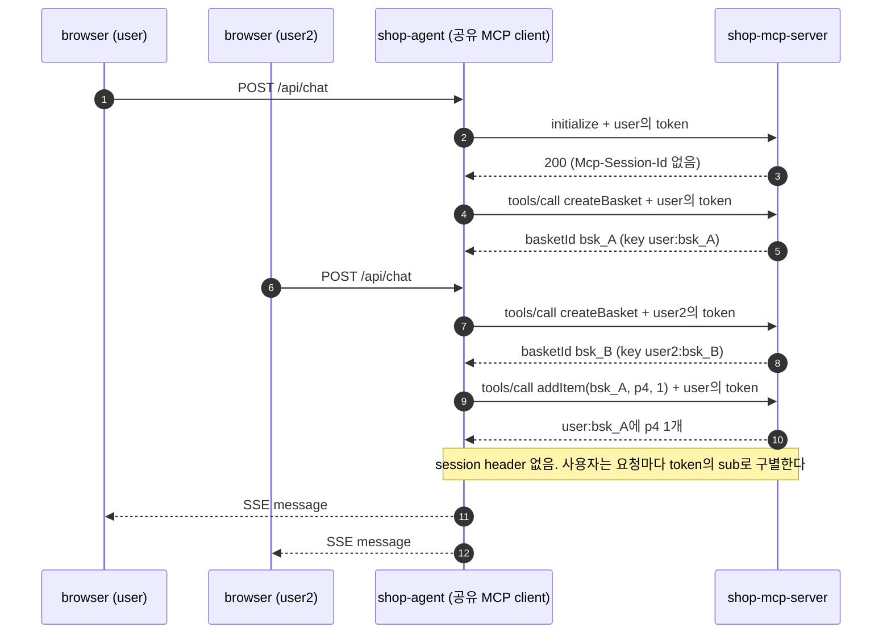

# mcp-stateless-handle

이 practice는 [mcp-security-authz](../mcp-security-authz/README.md)를 바탕으로 MCP Server를 session 없이(stateless) 돌린다.
장바구니처럼 tool 호출 사이에 남는 상태는 MCP Server가 만든 handle로 주고받는다.
웹 agent에서는 모델이, `local-client`에서는 코드가 앞선 tool 결과의 handle을 다음 tool 호출의 인자로 넘긴다.
흐름과 규칙은 [안내서 11장](../mcp-guide/11-stateless-and-handle.md)이 설명하고, 이 README에서는 authz와 다른 점만 본다.

## mcp-security-authz와 다른 점

| 바뀐 곳 | authz | 이 practice | 안내서 절 |
|---|---|---|---|
| MCP Server의 session | `protocol: STREAMABLE`이다. `initialize` 응답에 `Mcp-Session-Id`를 주고, GET stream과 session을 끝내는 `DELETE`를 받는다 | `protocol: STATELESS`다. `Mcp-Session-Id`가 없고, GET `/mcp`는 `405`, DELETE `/mcp`는 경로가 없어 `404`다 | [11장 1단계](../mcp-guide/11-stateless-and-handle.md#113-1단계-session-없는-서버의-요청과-응답) |
| MCP Server의 응답 형식 | `tools/call`의 응답은 `text/event-stream`이고, event `id`가 session ID다 | `tools/call`의 응답도 `initialize`처럼 `application/json` 본문 하나다. SSE event가 없으므로 event `id`도 없다 | [11장 1단계](../mcp-guide/11-stateless-and-handle.md#113-1단계-session-없는-서버의-요청과-응답) |
| MCP Server가 tool을 부른 사용자를 아는 방법 | tool은 로그에 남길 사용자 이름만 `SecurityContextHolder`에서 읽는다 | transport의 `contextExtractor`가 요청마다 token의 `sub`·`client_id`를 `McpTransportContext`에 넣는다. 장바구니 tool은 이 값을 `McpCaller`로 꺼낸다 | [11장 3단계](../mcp-guide/11-stateless-and-handle.md#115-3단계-handle을-사용자에게-묶는다), [11장 서버 코드](../mcp-guide/11-stateless-and-handle.md#119-서버-코드에서-보기) |
| MCP Server의 장바구니 저장소 | 없다 | `BasketStore`가 장바구니를 메모리에 `<sub>:<handle>` key로 둔다. 장바구니는 만든 뒤 30분이 지나면 만료되고, 사용자마다 열린 장바구니는 5개, 한 장바구니에 같은 상품은 99개까지다 | [11장 3단계](../mcp-guide/11-stateless-and-handle.md#115-3단계-handle을-사용자에게-묶는다) |
| MCP Server의 tool | `searchProducts`·`getStock`·`updateStock` 세 개다 | `BasketTools`가 `createBasket`·`addItem`·`getBasket`·`checkout`을 더한다. `checkout`만 새 scope `orders:write`를 요구하고, 나머지 셋은 `products:read`로 부른다 | [11장 시퀀스 다이어그램](../mcp-guide/11-stateless-and-handle.md#112-시퀀스-다이어그램), [11장 2단계](../mcp-guide/11-stateless-and-handle.md#114-2단계-handle을-만들고-넘긴다) |
| MCP Server의 tool 결과 | tool이 문자열을 돌려주고, Spring AI가 그 문자열을 text content 하나인 결과로 만든다 | 장바구니 tool은 `CallToolResult`를 직접 만든다. handle과 주문 번호는 `structuredContent`에도 넣고, 쓸 수 없는 장바구니는 `isError: true`인 tool 결과로 알린다 | [11장 2단계](../mcp-guide/11-stateless-and-handle.md#114-2단계-handle을-만들고-넘긴다), [handle과 소유권](#handle과-소유권) |
| `auth-server`의 scope 등록 | 두 client에 `products:read`와 `products:write`가 있다 | `orders:write`(주문)를 더한다. 이 scope는 `products:read`를 포함하지 않으므로, client는 authz처럼 가진 scope와 합쳐 요청한다 | [11장 시퀀스 다이어그램](../mcp-guide/11-stateless-and-handle.md#112-시퀀스-다이어그램), [10장 합친 scope](../mcp-guide/10-scope-and-step-up.md#105-3단계-합친-scope로-다시-authorization을-받는다) |
| `auth-server`의 login 계정 | `user` 하나다 | `user2`가 더 있다. 다른 사용자가 남의 handle을 쓰면 어떻게 되는지 보는 데 쓴다 | [11장 3단계](../mcp-guide/11-stateless-and-handle.md#115-3단계-handle을-사용자에게-묶는다) |
| agent의 MCP client | 모든 사용자가 client 하나를 같이 쓰고, 요청마다 그 사용자의 token을 붙인다. session은 첫 채팅을 보낸 사용자의 token으로 열리고, 앱을 끌 때 보내는 `DELETE`에는 token이 없다 | 코드는 같다. 서버에 session이 없어서, 요청마다 붙는 token만으로 사용자가 정해진다 | [session 없는 서버](#session-없는-서버), [6장 session과 사용자](../mcp-guide/06-mcp-call-and-validation.md#67-session과-사용자) |
| agent의 대화 기억 | 없다. 질문마다 새 대화다 | `ChatMemoryConfig`가 사용자(`sub`)마다 최근 메시지 20개를 기억한다. 대화 기억 advisor를 tool loop 안쪽에 두어 tool 호출과 결과까지 남긴다 | [11장 웹 agent](../mcp-guide/11-stateless-and-handle.md#117-웹-agent-tool-결과까지-기억하는-대화), [대화 기억과 끊긴 turn](#대화-기억과-끊긴-turn) |
| agent의 system prompt | 상품과 재고를 물으면 tool로 실제 데이터를 조회해 답하게 한다 | 앞선 tool 결과의 `basketId`를 이어 쓰고, 장바구니가 없거나 찾을 수 없음·만료·이미 주문이라는 결과가 오면 `createBasket`으로 새로 만들게 한다. `checkout`은 사용자가 주문이나 결제를 분명히 부탁할 때만 부르게 한다 | [11장 웹 agent](../mcp-guide/11-stateless-and-handle.md#117-웹-agent-tool-결과까지-기억하는-대화) |
| agent의 step-up | `403`이면 consent 카드를 보내고, consent 뒤 browser가 같은 질문을 다시 보낸다 | 같다. 그리고 step-up으로 끊긴 turn을 대화 기억에서 되돌려, 다시 보낸 질문이 끊기기 전의 기억에서 시작하게 한다 | [11장 웹 agent](../mcp-guide/11-stateless-and-handle.md#117-웹-agent-tool-결과까지-기억하는-대화), [대화 기억과 끊긴 turn](#대화-기억과-끊긴-turn) |
| agent의 화면 | 대화를 비우는 버튼이 없다 | "새 대화" 버튼이 `POST /api/chat/reset`으로 그 사용자의 대화 기억을 지운다 | [대화 기억과 끊긴 turn](#대화-기억과-끊긴-turn) |
| `local-client`의 MCP 호출 | `getStock(p1)` 뒤에 `updateStock(p1, 10)`을 부르고, `403`이면 `products:write`로 step-up한다 | `getStock(p1)` 뒤에 장바구니를 만들어 두 상품을 담고, 모르는 handle로 `getBasket`을 불러 오류를 본다. 마지막 `checkout`이 `403`을 받으면 `orders:write`로 step-up한 뒤 같은 호출을 새 요청으로 다시 보낸다 | [11장 사용자 기기의 앱](../mcp-guide/11-stateless-and-handle.md#118-사용자-기기의-앱-코드가-handle을-들고-다닌다) |

MCP Server의 scope 검사(`ToolScopeFilter`), `401`의 `scope`와 PRM, token 검증, `Origin`·`Host`·`MCP-Protocol-Version` 검사는 authz와 같은 클래스다.
agent의 discovery 클래스와 `ChatEvents`를 뺀 step-up 클래스, `local-client`의 `StepUp`·`TokenHolder`도 authz와 같다.
그 클래스들은 package 이름(`dev.starryeye.stateless.*`)과 포트·client_id 같은 설정 값만 다르다.

PRM의 `scopes_supported`와 `401`의 `scope`는 authz처럼 `products:read`뿐이다.
tool 목록도 authz처럼 scope와 상관없이 모두에게 같다.
조회 token으로 `tools/list`를 보내도 `checkout`이 보이고, scope는 tool을 부를 때 검사한다.

MCP 요청 형식은 authz와 같은 2025-11-25다.
2025-11-25에서 session ID를 줄지는 서버가 정하므로, session을 쓰지 않는 서버도 이 버전 그대로 돈다.
버전은 Spring Boot 4.1.1, Spring AI 2.0.1, MCP Java SDK 2.0.1이다(authz는 4.1.0, 2.0.0, 2.0.0).

### session 없는 서버

authz의 agent는 MCP client 하나를 모든 사용자가 같이 쓴다([6장 session과 사용자](../mcp-guide/06-mcp-call-and-validation.md#67-session과-사용자)).
session이 있는 서버에서는 모든 사용자의 요청이 이 client의 session 하나로 간다.
그래서 session에 사용자 상태를 두면 사용자끼리 섞인다.
이 session은 첫 채팅을 보낸 사용자의 token으로 열린다.
session을 첫 사용자에게 묶으면 두 번째 사용자부터는 요청이 막힌다.
앱을 끌 때 session을 끝내려고 보내는 `DELETE`에는 붙일 사용자 token도 없다.

이 practice의 MCP Server는 session을 만들지 않는다.
`initialize` 응답에 `Mcp-Session-Id`가 없으므로, client는 이후 요청에 session header를 보내지 않는다.
agent는 authz처럼 MCP 요청을 보낼 때마다 그 요청을 일으킨 사용자의 token을 붙인다(`OAuth2TokenAttachingRequestCustomizer`).
서버는 요청이 어느 연결이나 session에서 왔는지 기억하지 않으므로, 요청에 붙은 token의 `sub`만으로 사용자를 구별한다.
그래서 공유 client를 그대로 두어도 사용자끼리 섞일 상태가 없다.

MCP Java SDK의 client는 session ID를 받지 않았으면 닫을 때 `DELETE`를 보내지 않는다.
GET `/mcp`에 `405`를 받으면, 서버가 먼저 보내는 stream 없이 요청과 응답만으로 돈다.



[다이어그램 그림으로 보기](diagrams/README-1.png)

첫 채팅이 오면 공유 client는 그 사용자의 token으로 `initialize`를 한 번 보낸다(2).
응답에 session ID가 없으므로(3), 이 `initialize`는 `user`에게 묶이는 상태를 서버에 남기지 않는다.
그 뒤의 요청에는 그 요청을 일으킨 사용자의 token만 붙는다(4)(7)(9).
MCP Server는 token의 `sub`로 장바구니 key를 만들므로, 한 client를 거쳐 온 `user`와 `user2`의 장바구니가 따로 있다(5)(8).

session이 없으면 요청을 어느 서버가 받아도 되므로, MCP Server를 여러 대로 늘리기 쉽다.
다만 이 practice의 장바구니는 서버 한 대의 메모리에 있어서, 여러 대로 늘리려면 Redis 같은 공유 저장소가 필요하다.

### handle과 소유권

handle은 장바구니를 가리키는 이름일 뿐, 가졌다고 쓸 수 있는 권한이 아니다.
handle은 tool 결과에 담겨 대화 기록에 남으므로, 다른 사람이 알게 될 수 있다.
그래서 `BasketStore`는 장바구니를 `<sub>:<handle>` key로 저장하고 찾는다.
`sub`는 tool 인자가 아니라 MCP Server가 검증한 token에서 온다(`McpCaller`).
다른 사용자가 handle을 알아내도 자기 `sub`로 찾게 되어, 장바구니를 찾을 수 없다는 결과만 받는다.

handle은 추측으로 맞힐 수 없어야 한다.
그래서 `SecureRandom`의 128bit 무작위 값을 base64url 22자로 적고, 앞에 `bsk_`를 붙여 만든다.

장바구니를 쓸 수 없는 이유를 모델이 읽으면, 새 장바구니를 만들어 이어 갈 수 있다.
그래서 tool은 JSON-RPC 오류가 아니라 `isError: true`인 tool 결과로 답한다.

| 경우 | tool 결과의 문장 |
|---|---|
| 모르는 handle, 다른 사용자의 handle | `찾을 수 없는 장바구니입니다(bsk_…). createBasket으로 새 장바구니를 만드세요.` |
| `bsk_` 뒤에 22자가 오는 형식이 아닌 값 | 같은 문장이고, 괄호 안의 handle 자리에 `올바르지 않은 ID`가 들어간다 |
| 본인 handle, 만든 뒤 30분이 지남 | `만료된 장바구니입니다(bsk_…, 만든 뒤 30분). createBasket으로 새 장바구니를 만드세요.` |
| 본인 handle, 이미 주문함 | `이미 주문한 장바구니입니다(bsk_…, 주문 번호 ord-…).` |
| 이미 담은 수량과 합쳐 99개를 넘는 `addItem` | `한 장바구니에는 같은 상품을 99개까지 담을 수 있습니다(지금 98개, 더하려는 수량 2개).`처럼 지금 수량과 더하려는 수량이 붙는다. 장바구니는 그대로다 |
| 빈 장바구니의 `checkout` | `비어 있는 장바구니입니다(bsk_…). addItem으로 상품을 담으세요.` |
| 재고가 모자란 상품이 있는 `checkout` | `재고가 모자라 주문할 수 없습니다: p3`처럼 모자란 상품 ID가 붙는다. 장바구니는 열린 채로 남는다 |
| 열린 장바구니가 이미 5개인 사용자의 `createBasket` | `열린 장바구니는 5개까지 만들 수 있습니다. 쓰던 장바구니를 이어 쓰세요.` |

남의 handle을 보내도 서버는 보낸 사람의 `sub`로 key를 만들어 찾으므로, 모르는 handle과 같은 문장이 된다.
그래서 만료와 주문 완료를 따로 알려도, 남의 handle이 있는지는 알 수 없다.
같은 장바구니를 두 번 주문하지 못하게 하는 방법은 [11장 3단계](../mcp-guide/11-stateless-and-handle.md#115-3단계-handle을-사용자에게-묶는다)에서 본다.

### 대화 기억과 끊긴 turn

웹 agent에서 handle을 다음 tool 호출에 넘기는 것은 모델이다.
모델이 앞선 turn(사용자 질문 하나와 그 답)의 tool 결과를 봐야 그 안의 `basketId`를 다시 쓸 수 있다.
Spring AI의 기본 배치에서는 대화 기억에 사용자 질문과 마지막 답만 남고, tool 호출과 결과는 남지 않는다.

agent는 두 설정을 함께 바꿔 tool 호출과 결과까지 기억에 남긴다.

- `ChatMemoryConfig`는 `ToolCallingAdvisor`의 내부 history를 끈다(`disableInternalConversationHistory()`).
  그러면 대화 history는 대화 기억 한 곳에만 있다.
- `ChatClientConfig`는 `MessageChatMemoryAdvisor`를 `ChatMemoryConfig`의 `MEMORY_ADVISOR_ORDER`로 넣는다.
  이 order는 `ToolCallingAdvisor`의 order보다 커서, 대화 기억 advisor가 tool loop 안쪽에 든다.
  그래서 tool loop의 한 단계마다 tool 호출과 결과가 저장된다.

두 설정이 함께 있어야 하는 이유는 [11장 웹 agent](../mcp-guide/11-stateless-and-handle.md#117-웹-agent-tool-결과까지-기억하는-대화)에서 본다.

conversation ID는 login한 사용자의 `sub`다(`ChatController`).
그래서 사용자마다 대화가 따로 있다.
기억은 사용자마다 최근 메시지 20개이고 메모리에 있어서, agent를 다시 띄우면 사라진다.

**step-up으로 끊긴 turn 되돌리기**

`checkout`이 `403`을 받으면 turn은 답 없이 consent 카드로 끝난다.
이때 기억에는 그 turn의 사용자 질문과 결과 없는 `checkout` 호출이 남아 있다.
되돌리지 않으면, consent 뒤 browser가 같은 질문을 다시 보낼 때 모델은 같은 질문 두 개와 결과 없는 tool 호출이 섞인 기억을 받는다.

그래서 `ChatController`는 turn을 시작하기 전의 기억을 복사해 둔다.
turn이 step-up으로 끝나면 `ChatEvents`가 consent 카드 event를 만들기 직전에 그 복사본으로 기억을 되돌린다.
다시 보낸 질문은 끊기기 전의 기억에서 새 turn으로 시작한다.
거절 안내(`step-up-declined`)로 끝나는 turn도 같은 방법으로 되돌린다.

**새 대화**

화면의 "새 대화" 버튼은 `POST /api/chat/reset`을 보내 그 사용자의 대화 기억을 지운다.
기억이 지워지면 모델은 전에 받은 handle을 모르므로, 장바구니가 필요할 때 `createBasket`으로 새로 만든다.
옛 장바구니는 서버에 남아 있다가 만료된다.
turn이 도는 중에 기억을 지우면, 그 turn은 지운 뒤에도 기억에 계속 쓴다.
그래서 화면은 turn이 끝날 때까지 이 버튼을 막아 둔다.

**이 practice의 한계**

- 되돌리기는 turn 전체를 되돌린다.
  한 turn에서 `addItem`을 부른 뒤 `checkout`이 step-up으로 끊기면, 담은 상품은 서버에 그대로 있다.
  다시 보낸 질문이 `addItem`을 또 불러 수량이 늘어난다.
  그래서 결제는 `결제해 줘`처럼 따로 한 turn으로 부탁한다.
- 기억은 최근 메시지 20개다.
  20개를 넘으면 `MessageWindowChatMemory`는 오래된 메시지를 다음 사용자 질문 앞까지 한꺼번에 지운다.
  그래서 한 turn에서 tool을 10번쯤 넘게 부르면, 그 turn이 통째로 기억에서 빠질 수 있다.
- 같은 사용자가 browser tab 두 개에서 채팅하면, 두 tab이 대화 하나를 lock 없이 같이 쓴다.
  한 tab의 turn이 step-up으로 되돌려지면, 다른 tab이 그 사이에 쌓은 기억도 함께 되돌려진다.

## 실행

준비물과 `run.sh`가 하는 일은 [official의 실행](../mcp-security-authn-official/README.md#실행)과 같다.

```bash
# 저장소 최상위 폴더에서
cd practice/mcp-stateless-handle
./run.sh
```

`run.sh`는 `auth-server`(9040) → `shop-mcp-server`(8151) → `shop-agent`(8150) 순서로 띄운다.
앱의 로그는 `practice/mcp-stateless-handle/logs/<module>.log`에 남는다.
issuer는 `http://localhost:9040`이고, MCP Server의 resource는 `http://localhost:8151/mcp`다.
agent의 confidential client는 `stateless-shop-agent`이고, `local-client`는 public client `local-mcp-client`로 token을 받는다.
login 계정은 `user`/`password`와 `user2`/`password` 두 개다.
캡처 스크립트는 `user2`의 token으로 `user`의 handle을 써 본다.

browser에서 `http://localhost:8150`을 열고 `user`/`password`로 login한다.
login 뒤 consent 화면의 선택 항목은 `products:read` 하나다.
`products:read`를 체크해 제출한 뒤 `장바구니 만들고 인체공학 마우스 하나 담아 줘`, `휴대용 SSD도 두 개 담아 줘`, `결제해 줘`를 차례로 보낸다.
결제를 부탁하면 답 대신 채팅 아래에 `orders:write`를 요청하는 consent 카드가 뜬다.

`auth-server`는 consent를, MCP Server는 장바구니와 재고를, agent는 token·step-up 기록·대화 기억을 메모리에 둔다.
흐름을 처음부터 다시 보려면 `./stop.sh`로 내리고 `./run.sh`로 다시 띄운다.

**`local-client` 실행**

`local-client`에게는 `auth-server`와 `shop-mcp-server`만 있으면 된다.
`./gradlew run`은 `JAVA_HOME`이 Java 21을 가리켜야 돈다.
Java 21을 sdkman으로 설치했다면 아래 첫 줄로 맞춘다.
다른 방법으로 설치했다면 `JAVA_HOME`을 그 Java 21 폴더로 둔다.

```bash
# 저장소 최상위 폴더에서
export JAVA_HOME=$(find $HOME/.sdkman/candidates/java -maxdepth 1 -type d -name '21.*' | sort -V | tail -1)
cd practice/mcp-stateless-handle/local-client
./gradlew run
```

browser는 두 번 열린다.
처음 열린 browser에 login 화면이 나오면 `user`/`password`로 login한다.
consent 화면에서는 `products:read`를 체크해 제출한다.
`checkout`이 `403`을 받으면 step-up의 consent 화면이 열린다.
`local-mcp-client`는 public client라서 Authorization Server가 consent를 저장하지 않는다.
그래서 이 화면은 `products:read`와 `orders:write`를 모두 묻고, 여기서는 둘 다 체크해 제출한다.
terminal에 `[1]`부터 `[7]`까지 찍히고 앱은 끝난다.
`./gradlew run --args="--no-browser"`는 browser를 열지 않고 authorization request 주소만 찍는다.
인자와 멈추는 경우는 [7장 실행해 보기](../mcp-guide/07-local-client.md#79-실행해-보기)에 있다.
이 practice의 기본값은 `--resource`가 `http://localhost:8151/mcp`, `--issuer`가 `http://localhost:9040`이다.

**멈추기**

```bash
# practice/mcp-stateless-handle에서
./stop.sh
```

`stop.sh`는 9040·8151·8150 포트에서 연결을 기다리는 process를 내린다.
`./stop.sh --ollama`는 ollama도 함께 내린다.

## 코드 지도

authz와 같은 클래스는 [authz README의 코드 지도](../mcp-security-authz/README.md#코드-지도)에 있다.
아래는 이 practice에만 있거나 authz와 다른 클래스다.
클래스는 `<module>/src/main/java/dev/starryeye/stateless/<package>/` 아래에 있고, `application.yml`과 `static/index.html`은 `<module>/src/main/resources/`에 있다.
package는 `auth-server`가 `authserver`, `shop-mcp-server`가 `mcpserver`, `shop-agent`가 `agent`, `local-client`가 `localclient`다.
MCP Server에는 authz에 없는 하위 package 두 개가 더 있다.
장바구니 저장소가 있는 `basket`과 `McpCaller`가 있는 `security`다.

| module | 클래스 | 하는 일 | 안내서 |
|---|---|---|---|
| `auth-server` | `application.yml` | 두 client의 scope에 `orders:write`를 더한다 | [11장 시퀀스 다이어그램](../mcp-guide/11-stateless-and-handle.md#112-시퀀스-다이어그램) |
| | `UserConfig` | login 계정 `user`와 `user2`를 둔다. 비밀번호는 둘 다 `password`다 | [11장 3단계](../mcp-guide/11-stateless-and-handle.md#115-3단계-handle을-사용자에게-묶는다) |
| `shop-mcp-server` | `application.yml` | `spring.ai.mcp.server.protocol: STATELESS`로 session 없는 transport를 쓴다 | [11장 1단계](../mcp-guide/11-stateless-and-handle.md#113-1단계-session-없는-서버의-요청과-응답) |
| | `McpTransportConfig` | Spring AI 자동 구성 대신 `WebMvcStatelessServerTransport` bean을 직접 만들어 `contextExtractor`에 `McpCaller::context`를 넣는다. `BasketStore` bean도 만들고, `ToolScopeRegistry`가 `BasketTools`의 scope도 읽게 한다 | [11장 서버 코드](../mcp-guide/11-stateless-and-handle.md#119-서버-코드에서-보기) |
| | `McpCaller` | Spring Security가 검증한 JWT에서 `sub`와 `client_id`를 꺼내 `McpTransportContext`에 넣는다. tool은 같은 클래스로 이 값을 꺼내고, 인증이 없으면 예외를 던진다 | [11장 3단계](../mcp-guide/11-stateless-and-handle.md#115-3단계-handle을-사용자에게-묶는다), [11장 서버 코드](../mcp-guide/11-stateless-and-handle.md#119-서버-코드에서-보기) |
| | `BasketStore` | 장바구니를 `<sub>:<handle>` key로 메모리에 두고, handle을 만든다. 만료(30분), 사용자당 개수(5개), 상품당 수량(99개)을 지키고, 같은 장바구니를 두 번 주문하지 못하게 한다 | [11장 3단계](../mcp-guide/11-stateless-and-handle.md#115-3단계-handle을-사용자에게-묶는다), [11장 서버 코드](../mcp-guide/11-stateless-and-handle.md#119-서버-코드에서-보기) |
| | `BasketException`, `BasketView` | 장바구니를 쓸 수 없는 이유와 모델이 읽을 문장을 정한다. `BasketView`는 tool에 돌려주는 장바구니 내용(handle, 만료 시각, 담은 상품)이다 | [handle과 소유권](#handle과-소유권) |
| | `BasketTools` | 장바구니 tool 네 개다. `CallToolResult`를 직접 만들어 handle과 주문 번호를 `structuredContent`에도 넣고, 쓸 수 없는 장바구니는 `isError: true`로 알린다 | [11장 2단계](../mcp-guide/11-stateless-and-handle.md#114-2단계-handle을-만들고-넘긴다), [11장 서버 코드](../mcp-guide/11-stateless-and-handle.md#119-서버-코드에서-보기) |
| | `ProductRepository` | `reserve`가 주문 수량만큼 재고를 한꺼번에 줄인다. 하나라도 모자라면 아무것도 줄이지 않는다 | [11장 서버 코드](../mcp-guide/11-stateless-and-handle.md#119-서버-코드에서-보기) |
| `shop-agent` | `ChatMemoryConfig` | 사용자마다 최근 메시지 20개를 기억하는 `ChatMemory`를 만든다. `ToolCallingAdvisor`의 내부 history를 끄고, 대화 기억 advisor가 tool loop 안쪽에 들 order 값(`MEMORY_ADVISOR_ORDER`)을 정한다 | [11장 웹 agent](../mcp-guide/11-stateless-and-handle.md#117-웹-agent-tool-결과까지-기억하는-대화), [11장 client 코드](../mcp-guide/11-stateless-and-handle.md#1110-client-코드에서-보기) |
| | `ChatClientConfig` | 대화 기억 advisor를 `MEMORY_ADVISOR_ORDER`로 기본 advisor에 넣고, system prompt에 장바구니 규칙을 적는다 | [11장 웹 agent](../mcp-guide/11-stateless-and-handle.md#117-웹-agent-tool-결과까지-기억하는-대화) |
| | `ChatController` | login한 사용자의 `sub`를 conversation ID로 쓴다. turn 전의 기억을 복사해 두었다가 step-up으로 끊기면 되돌리고, `/api/chat/reset`으로 기억을 지운다 | [11장 웹 agent](../mcp-guide/11-stateless-and-handle.md#117-웹-agent-tool-결과까지-기억하는-대화), [11장 client 코드](../mcp-guide/11-stateless-and-handle.md#1110-client-코드에서-보기) |
| | `ChatEvents` | step-up event를 만들기 직전에 `ChatController`가 넘긴 되돌리기를 부른다 | [대화 기억과 끊긴 turn](#대화-기억과-끊긴-turn) |
| | `index.html` | "새 대화" 버튼을 둔다. turn이 도는 동안에는 보내기 버튼과 함께 막아 둔다 | [대화 기억과 끊긴 turn](#대화-기억과-끊긴-turn) |
| `local-client` | `McpCalls` | 장바구니 시나리오를 부른다. `createBasket`의 `structuredContent`에서 `basketId`를 꺼내 다음 호출의 인자로 넘기고, `isError`인 결과 앞에는 `[오류]`를 찍는다 | [11장 사용자 기기의 앱](../mcp-guide/11-stateless-and-handle.md#118-사용자-기기의-앱-코드가-handle을-들고-다닌다), [11장 client 코드](../mcp-guide/11-stateless-and-handle.md#1110-client-코드에서-보기) |

## 직접 확인할 것

`run.sh`로 띄운 뒤 `practice/mcp-stateless-handle`에서 실행한다.
`local-client`의 줄은 `practice/mcp-stateless-handle/local-client`에서, 캡처 스크립트의 줄은 저장소 최상위 폴더에서 실행한다.
웹 agent의 줄은 표의 순서대로 한다.
handle은 앞 turn의 대화 기억으로 이어지고, `orders:write`는 한 번 허락하면 token과 consent에 남기 때문이다.
처음부터 다시 보려면 `./stop.sh`와 `./run.sh`로 다시 띄운다.

| 해 볼 것 | 기대 결과 |
|---|---|
| `curl -i -X POST http://localhost:8151/mcp` | `401`과 `WWW-Authenticate: Bearer resource_metadata="http://localhost:8151/.well-known/oauth-protected-resource/mcp", scope="products:read"` |
| browser로 `http://localhost:8150`을 열고 `user`/`password`로 login | consent 화면의 선택 항목은 `products:read` 하나다 |
| `products:read`를 체크해 제출하고 `장바구니 만들고 인체공학 마우스 하나 담아 줘` 보내기 | 인체공학 마우스를 장바구니에 담았다고 답한다. `logs/shop-mcp-server.log`에 `createBasket 호출 (사용자=user, client_id=stateless-shop-agent)`와 `addItem 호출 (사용자=user, productId=p4, quantity=1)`이 찍힌다 |
| `휴대용 SSD도 두 개 담아 줘` 보내기 | `addItem 호출 (사용자=user, productId=p9, quantity=2)`가 찍히고, 앞 turn의 handle을 이어 쓰므로 새 `createBasket 호출`은 없다. 답에는 인체공학 마우스 1개(59,000원), 휴대용 SSD 1TB 2개(278,000원), 합계 337,000원이 나온다 |
| `결제해 줘` 보내기 | 채팅 아래에 `checkout을(를) 하려면 orders:write 권한이 더 필요합니다. 허용하면 권한을 받은 뒤 질문을 다시 보냅니다.` 카드와 "권한 허용" 버튼이 뜬다 |
| `grep 'scope 부족' logs/shop-mcp-server.log` | `scope 부족 — 사용자=user, client_id=stateless-shop-agent, tool=checkout, 필요한 scope=orders:write, 가진 scope=[openid, products:read]` |
| "권한 허용" 누르기 | consent 화면에서 새로 고를 항목은 `orders:write` 하나다. `openid`와 `products:read`는 "You have already granted the following permissions to the above app" 아래에 나온다 |
| `orders:write`를 체크해 제출 | 채팅 화면으로 돌아와 질문이 다시 가고, 주문 번호 `ord-1001`로 두 상품을 주문했다는 답이 나온다. `logs/shop-mcp-server.log`에는 `checkout 호출 (사용자=user, client_id=stateless-shop-agent)`가 찍힌다 |
| "새 대화"를 누르고 `장바구니 보여 줘` 보내기 | `대화를 비웠습니다.`가 나온다. 모델은 옛 handle을 몰라 `createBasket`으로 새 장바구니를 만들고, 장바구니가 비어 있다고 답한다 |
| `local-client`에서 `./gradlew -q run` 뒤 두 번의 consent | `createBasket: 장바구니를 만들었습니다. ID는 bsk_…이고,`로 시작하는 줄 뒤에 `addItem` 두 번과 `getBasket`이 찍히고, `getBasket`에는 `합계 337,000원`이 나온다. 이어서 `getBasket(모르는 ID): [오류] 찾을 수 없는 장바구니입니다(bsk_AAAAAAAAAAAAAAAAAAAAAA).`로 시작하는 줄이 찍힌다 |
| 이어지는 `local-client`의 출력 | `403 insufficient_scope — 필요한 scope: orders:write` 뒤에 `[6]`, `[3]`, `[4]`(`scope: products:read orders:write`), `[7]` 순서로 찍힌다. 마지막에 `checkout: 주문을 접수했습니다. 주문 번호는 ord-…입니다.`가 찍힌다 |
| `local-client` 실행 뒤 `grep 'createBasket 호출' ../logs/shop-mcp-server.log` | `client_id=local-mcp-client`인 줄이 더 있다. 같은 `user`라도 어느 client를 거친 요청인지 로그로 구분된다 |
| 서버를 다시 띄운 뒤 `docs/superpowers/captures/mcp-stateless-walkthrough.sh` 실행 | `initialize` 응답 header에 `Mcp-Session-Id`가 없다. GET `/mcp`는 `HTTP/1.1 405`, DELETE `/mcp`는 `HTTP/1.1 404`다 |
| 같은 출력의 `createBasket` 응답 | `"structuredContent":{"basketId":"bsk_9VXC2asqgK2Ym9ZSdNo3Kg","expiresAt":"2026-10-05T17:58:03.151952Z"}`처럼 handle과 만료 시각이 온다. 두 값은 실행마다 다르다 |
| 같은 출력에서 `user2`의 token으로 보낸 `getBasket` | `"isError":true`와 `찾을 수 없는 장바구니입니다(bsk_…). createBasket으로 새 장바구니를 만드세요.` |
| 같은 출력에서 조회 token으로 보낸 `checkout` | `403`과 `WWW-Authenticate: Bearer error="insufficient_scope", scope="orders:write", resource_metadata="http://localhost:8151/.well-known/oauth-protected-resource/mcp"` |
| 같은 출력에서 step-up 뒤에 보낸 `checkout` | `주문을 접수했습니다. 주문 번호는 ord-1001입니다.`와 `"structuredContent":{"orderId":"ord-1001"}` |
| 같은 출력에서 같은 handle로 다시 보낸 `checkout` | `"isError":true`와 `이미 주문한 장바구니입니다(bsk_…, 주문 번호 ord-1001).` |
| `auth-server`, `shop-mcp-server`, `shop-agent`, `local-client` 폴더에서 각각 `./gradlew test` | `user2` login, session 없는 transport, 장바구니의 소유권·만료·한 번만 주문, tool 결과까지 남는 대화 기억과 되돌리기, `local-client`의 handle 전달을 확인하는 테스트가 통과한다 |

LLM의 답은 `qwen3:8b`의 출력이라 문장이 매번 조금씩 다르다.
기기에 따라 답 하나에 30\~100초가 걸린다.
`./gradlew test` 전에는 [실행](#실행)의 `export` 줄로 `JAVA_HOME`을 Java 21로 맞춘다.

`logs/shop-agent.log`에는 `checkout`이 `403`을 받을 때 `ERROR` 줄 세 개가 남는다.
`SyncMcpToolCallback`의 `Exception while tool calling` 한 줄과 `MessageAggregator`의 `Aggregation Error` 두 줄이다.
이 줄들은 Spring AI가 tool 예외를 채팅 응답까지 전하면서 남긴다.
실패가 아니라 step-up이 정상으로 진행될 때 남는 로그다.
찾을 수 없는 장바구니처럼 `isError: true`인 tool 결과가 오면 `SyncMcpToolCallback`이 `Error calling tool: [TextContent[…]]`라는 `ERROR` 줄을 남기고, 모델은 이 문자열을 tool 결과로 받아 답을 이어 간다.

`mcp-stateless-walkthrough.sh`는 agent의 client `stateless-shop-agent`로 `user`와 `user2`의 token을 받고, 장바구니 흐름과 `checkout`의 step-up까지 밟는다.
login과 consent는 browser 대신 curl이 한다.
consent 화면이 나오려면 저장된 consent가 없어야 하므로, `./stop.sh`와 `./run.sh`로 다시 띄운 직후에 돌린다.
`stateless-local-client-run.sh`는 `local-client`를 `--no-browser`로 돌리고, 두 번의 consent를 curl로 한다.

```bash
# 저장소 최상위 폴더에서. 출력의 JWT는 앞 20자만 남는다
docs/superpowers/captures/mcp-stateless-walkthrough.sh > /tmp/stateless-walkthrough.txt
# ./gradlew run을 부르므로 JAVA_HOME이 Java 21을 가리켜야 한다
docs/superpowers/captures/stateless-local-client-run.sh > /tmp/stateless-local-client.txt
```

같은 방법으로 받은 기록이 [stateless 캡처](../../docs/superpowers/captures/2026-10-01-stateless-walkthrough.txt)와 [stateless local-client 캡처](../../docs/superpowers/captures/2026-10-01-stateless-local-client.txt)에 있다.

## 더 읽을 것

- [안내서 11장 stateless와 handle](../mcp-guide/11-stateless-and-handle.md): 이 practice로 session 없는 서버, handle의 소유권과 만료, tool 결과까지 기억하는 대화를 설명한다.
- [6장 session과 사용자](../mcp-guide/06-mcp-call-and-validation.md#67-session과-사용자): 공유 MCP client에서 session이 사용자와 맞지 않는 이유를 처음 설명한다.
- [9장 `initialize`와 session의 제거](../mcp-guide/09-versions.md#97-initialize와-session의-제거-2026-07-28): MCP 2026-07-28이 session을 없앤 이유와 handle로 상태를 다루는 방법을 설명한다.
- [부록: 명세 준수표](../mcp-guide/reference-compliance.md#mcp-stateless-handle에서-달라지는-행): 36번(session 종료 `DELETE`의 token)처럼 session이 없어 authz와 판정이 달라지는 행과, handle의 소유권·만료처럼 새로 생긴 행을 모았다.
- [mcp-security-authz](../mcp-security-authz/README.md): 이 practice의 바탕이 된 practice다.
- 다음 practice [mcp-tool-visibility](../mcp-tool-visibility/README.md)는 MCP Server가 token의 scope가 아니라 사용자의 역할에 따라 `tools/list`에 보여 주는 tool을 달리하는 방법을 다룬다.
