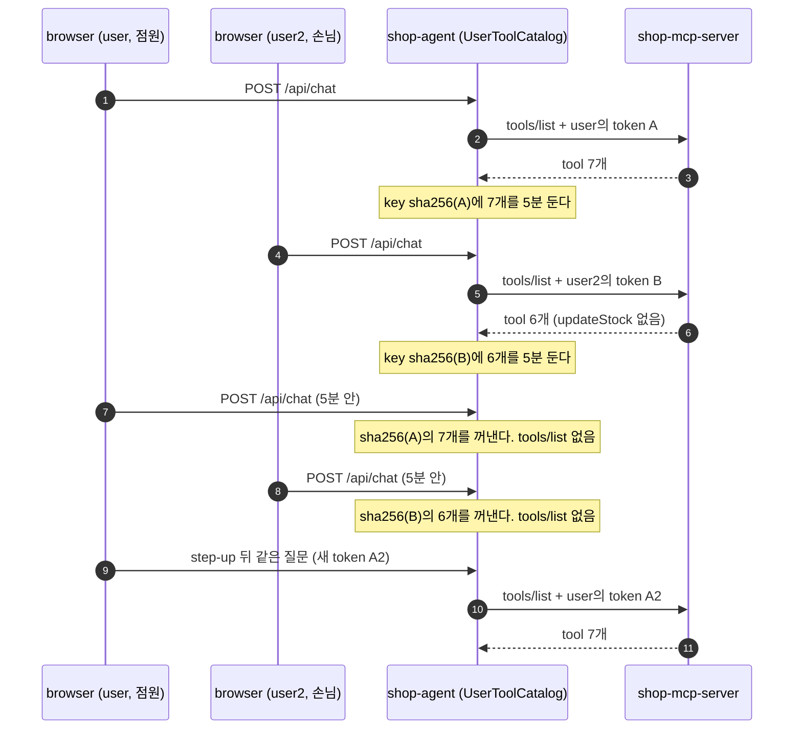

# mcp-tool-visibility

이 practice는 [mcp-stateless-handle](../mcp-stateless-handle/README.md)을 바탕으로, MCP Server가 사용자 권한에 따라 다른 tool 목록을 준다.
사용자가 원래 할 수 없는 일의 tool은 목록에서 숨기고, 할 수 있지만 아직 client에 맡기지 않은 일의 tool은 보여 준 뒤 부를 때 step-up한다.
웹 agent는 사용자마다 다른 이 목록을 access token별로 cache한다.
흐름과 규칙은 [안내서 12장](../mcp-guide/12-tool-visibility.md)이 설명하고, 이 README에서는 stateless와 다른 점만 본다.

## mcp-stateless-handle과 다른 점

| 바뀐 곳 | stateless | 이 practice | 안내서 절 |
|---|---|---|---|
| MCP Server의 사용자 권한 | 없다. tool을 부를 때 token의 scope만 본다 | `McpTransportConfig`가 역할 표를 만들고, 그 표에서 `user`만 점원(`STAFF`)이다. `ToolVisibility`는 역할마다 받을 수 있는 scope와 tool의 `@RequiredScope`로 숨길 tool을 정한다 | [12장 1단계](../mcp-guide/12-tool-visibility.md#123-1단계-역할로-거른-toolslist), [12장 권한을 판단하는 곳](../mcp-guide/12-tool-visibility.md#126-권한을-판단하는-곳) |
| MCP Server의 `tools/list` | scope와 상관없이 누구에게나 tool 7개를 모두 보인다 | `ToolVisibilityTransport`가 SDK handler를 감싸 결과를 역할로 거른다. 점원은 7개, 손님은 `updateStock`을 뺀 6개를 SDK가 준 순서대로 받는다 | [12장 1단계](../mcp-guide/12-tool-visibility.md#123-1단계-역할로-거른-toolslist) |
| 숨긴 tool의 `tools/call` | 숨긴 tool이 없다 | `ToolVisibilityTransport`가 SDK보다 먼저 "모르는 tool" JSON-RPC 오류로 답한다. HTTP `200`이고 `WWW-Authenticate`가 없으며, 본문은 정말 없는 tool에 SDK가 주는 오류와 같다 | [12장 2단계](../mcp-guide/12-tool-visibility.md#124-2단계-숨긴-tool을-부르면) |
| `ToolScopeFilter`의 검사 순서 | 기본 scope, tool의 scope 순이다 | 기본 scope, 보이는 tool인지, tool의 scope 순이다. 숨긴 tool은 scope를 보지 않고 transport로 넘기므로, 손님의 `updateStock`은 `403`이 아니라 "모르는 tool"이 된다 | [12장 3단계](../mcp-guide/12-tool-visibility.md#125-3단계-받을-수-있는-tool은-그대로-step-up) |
| `updateStock`·`checkout`의 tool 설명 | 권한에 관한 문장이 없다 | 설명 끝에 `처음 부르면 사용자에게 재고 변경 권한(products:write)을 묻는다.`와 `처음 부르면 사용자에게 주문 권한(orders:write)을 묻는다.`가 있다. 지금 token에 scope가 없어도 모델이 이 tool을 피하지 않게 하려는 문장이다 | [12장 3단계](../mcp-guide/12-tool-visibility.md#125-3단계-받을-수-있는-tool은-그대로-step-up) |
| `auth-server` | 포트 9040, client `stateless-shop-agent`, cookie `STATELESSAUTHSESSIONID`다 | 포트 9050, client `visibility-shop-agent`, cookie `VISIBILITYAUTHSESSIONID`다. 계정과 scope 등록은 같고, 점원·손님 역할은 모른다 | [12장 권한을 판단하는 곳](../mcp-guide/12-tool-visibility.md#126-권한을-판단하는-곳) |
| agent의 tool 목록 | `ChatClientConfig`가 자동 구성의 tool provider를 기본 tool로 넣고, 모든 사용자가 그 목록을 같이 쓴다 | `spring.ai.mcp.client.toolcallback.enabled: false`로 그 provider를 끈다. `ChatController`가 질문마다 그 사용자의 목록을 `.tools(...)`로 넣는다 | [12장 웹 agent의 목록 cache](../mcp-guide/12-tool-visibility.md#127-웹-agent-사용자별-tool-목록-cache) |
| agent의 목록 cache | 사용자별 cache가 없다 | `UserToolCatalog`가 access token 값의 SHA-256 hex를 key로 목록을 5분 둔다. step-up이나 refresh로 token이 바뀌면 key가 달라져 목록을 다시 받는다 | [12장 웹 agent의 목록 cache](../mcp-guide/12-tool-visibility.md#127-웹-agent-사용자별-tool-목록-cache) |
| agent가 받은 "모르는 tool" 오류 | `SyncMcpToolCallback`이 던진 오류로 채팅 stream이 끝난다 | `UnknownToolAwareToolCallback`이 그 token의 목록을 버리고, 오류를 `ToolExecutionException`으로 바꾼다. 모델은 `Unknown tool: invalid_tool_name`을 tool 결과로 받고 turn이 이어진다 | [12장 목록에 없는 tool](../mcp-guide/12-tool-visibility.md#128-웹-agent-목록에-없는-tool을-모델이-부를-때) |
| 모델이 목록에 없는 tool을 부를 때 | Spring AI가 오류로 stream을 끝내고, 결과 없는 tool 호출이 대화 기억에 남는다 | `ChatEvents`가 그 turn을 대화 기억에서 되돌리고 `tool-unavailable` event를 보낸다. 화면에는 `이 계정에서는 updateStock을(를) 쓸 수 없습니다.`처럼 나온다 | [12장 목록에 없는 tool](../mcp-guide/12-tool-visibility.md#128-웹-agent-목록에-없는-tool을-모델이-부를-때) |
| `local-client`의 tool 목록 | `tools/list`의 이름을 `tool:` 줄에 하나씩 찍는다 | 목록을 `tools:` 한 줄로 찍고, 목록에 `updateStock`이 없으면 일부러 불러 JSON-RPC 오류를 찍는다. step-up으로 token이 바뀌면 목록을 다시 받아 한 번 더 찍는다 | [12장 사용자 기기의 앱](../mcp-guide/12-tool-visibility.md#129-사용자-기기의-앱) |

[코드 지도](#코드-지도)에 없는 클래스는 stateless와 같다.
그 클래스들은 package 이름(`dev.starryeye.visibility.*`)과 포트·client_id·cookie 같은 설정 값만 다르다.
PRM의 `scopes_supported`와 `401`의 `scope`는 stateless처럼 `products:read`뿐이다.

MCP 요청 형식은 stateless와 같은 2025-11-25이고, 버전도 Spring Boot 4.1.1, Spring AI 2.0.1, MCP Java SDK 2.0.1로 같다.
목록을 사용자마다 달리하는 방법은 2026-07-28 server/tools 규칙을, 목록 cache는 2026-07-28 Caching 규칙을 따른다.
다만 2026-07-28이 더한 `ttlMs`·`cacheScope` field는 서버가 보내지 않는다.

### 숨기기와 step-up

모델은 `tools/list`에 있는 tool만 부른다.
그래서 지금 token에 없는 scope의 tool까지 숨기면, 모델은 그 tool을 몰라 부르지 않고 step-up도 시작되지 않는다.
이 practice의 MCP Server는 "이 사용자가 언젠가 받을 수 있는 scope인지"로 숨길지를 정한다.
이 기준의 이유는 [12장 필요성](../mcp-guide/12-tool-visibility.md#121-권한별-tool-목록의-필요성)에서 본다.

역할은 MCP Server의 표에 있다.
`user`만 점원(`STAFF`)이고, 표에 없는 사용자(`user2` 포함)와 `sub`가 없는 token은 손님(`CUSTOMER`)이다.

| 역할 | 받을 수 있는 scope |
|---|---|
| 점원(`STAFF`) | `products:read`, `products:write`, `orders:write` |
| 손님(`CUSTOMER`) | `products:read`, `orders:write` |

tool마다 필요한 scope(`@RequiredScope`)를 이 표와 맞춰 보면, 손님에게는 `updateStock`만 숨겨진다.

| tool | 필요한 scope | 점원 `user` | 손님 `user2` |
|---|---|---|---|
| `searchProducts`, `getStock`, `createBasket`, `addItem`, `getBasket` | `products:read` | 보인다 | 보인다 |
| `checkout` | `orders:write` | 보인다. 처음 부르면 `403`으로 step-up한다 | 보인다. 처음 부르면 `403`으로 step-up한다 |
| `updateStock` | `products:write` | 보인다. 처음 부르면 `403`으로 step-up한다 | 숨긴다. 부르면 "모르는 tool" 오류가 오고 step-up은 없다 |

Authorization Server는 역할을 모른다.
그래서 client가 `user2`에게 `products:write`를 요청해도, consent 화면을 보여 주고 token을 준다.
그래도 MCP Server는 역할로 거르므로, 그 token으로 받은 목록도 6개이고 `updateStock`은 "모르는 tool"이며 재고는 그대로다.
웹 agent와 `local-client`가 손님에게 `products:write`를 요청하는 일은 없다.
MCP Server가 손님에게 그 scope로 `403`을 보내지 않기 때문이다.

### 사용자별 목록 cache

agent에서는 모든 사용자가 MCP client 하나를 같이 쓴다([stateless의 session 없는 서버](../mcp-stateless-handle/README.md#session-없는-서버)).
MCP Server가 사용자마다 다른 목록을 주므로, 목록 하나를 받아 모두에게 쓰면 먼저 물은 사람의 목록이 다른 사람에게 간다.
그래서 자동 구성의 tool provider를 끄고, `UserToolCatalog`가 목록을 access token별로 둔다.



[다이어그램 그림으로 보기](diagrams/README-1.png)

질문이 오면 agent는 그 사용자의 access token으로 key를 만들고 목록을 찾는다(1)(4).
없으면 그 token으로 `tools/list`를 보내고, 받은 목록을 5분 동안 둔다(2)(3)(5)(6).
5분 안에 같은 token으로 다시 물으면 `tools/list` 없이 받아 둔 목록을 쓴다(7)(8).
step-up으로 token이 바뀌면 key가 달라지므로 목록을 다시 받는다(9)(10)(11).
질문마다 그 사용자의 목록만 모델에게 가므로, `user2`의 모델은 `updateStock`을 보지 못한다.

key는 token 값을 그대로 쓰지 않고 SHA-256 hex로 바꾼다.
로그나 heap dump에 token이 그대로 보이지 않게 하려는 것이다.
5분은 agent가 정한 값이다.
2025-11-25 서버는 목록의 유효 시간(`ttlMs`)을 알려 주지 않기 때문이다.
만료된 항목은 목록을 꺼낼 때 지우고, 만료 전에 미리 다시 받지는 않는다.
"모르는 tool" 오류가 오면 5분이 지나지 않았어도 그 token의 목록을 버린다.
이 규칙들이 2026-07-28 Caching의 어느 규칙에 해당하는지는 [12장 웹 agent의 목록 cache](../mcp-guide/12-tool-visibility.md#127-웹-agent-사용자별-tool-목록-cache)에서 본다.

## 실행

준비물과 `run.sh`가 하는 일은 [official의 실행](../mcp-security-authn-official/README.md#실행)과 같다.

```bash
# 저장소 최상위 폴더에서
cd practice/mcp-tool-visibility
./run.sh
```

`run.sh`는 `auth-server`(9050) → `shop-mcp-server`(8161) → `shop-agent`(8160) 순서로 띄운다.
앱의 로그는 `practice/mcp-tool-visibility/logs/<module>.log`에 남는다.
issuer는 `http://localhost:9050`이고, MCP Server의 resource는 `http://localhost:8161/mcp`다.
agent의 confidential client는 `visibility-shop-agent`이고, `local-client`는 public client `local-mcp-client`로 token을 받는다.

login 계정은 둘이고, 비밀번호는 둘 다 `password`다.

| 계정 | MCP Server의 역할 | 보이는 tool |
|---|---|---|
| `user` | 점원(`STAFF`) | 7개 |
| `user2` | 손님(`CUSTOMER`) | `updateStock`을 뺀 6개 |

browser에서 `http://localhost:8160`을 열고 `user2`/`password`로 login한다.
login 뒤 consent 화면의 선택 항목은 `products:read` 하나다.
`products:read`를 체크해 제출한 뒤 `p1 재고를 10개로 바꿔 줘`를 보내면, consent 카드 없이 재고를 바꿀 수 없다는 답이 온다.
점원은 시크릿 창에서 `user`/`password`로 login한다.
같은 질문에 `products:write`를 요청하는 consent 카드가 뜬다.

agent 화면에는 logout이 없고, 한 browser 창에는 auth-server의 login session이 남는다.
그래서 같은 창에서 다른 계정으로 login하려면 `./stop.sh`와 `./run.sh`로 서버를 다시 띄운다.
`auth-server`는 login session과 consent를, MCP Server는 장바구니와 재고를, agent는 token·tool 목록·대화 기억을 메모리에 둔다.
다시 띄우면 이 상태가 모두 처음으로 돌아간다.

**`local-client` 실행**

`local-client`에게는 `auth-server`와 `shop-mcp-server`만 있으면 된다.
`./gradlew run`은 `JAVA_HOME`이 Java 21을 가리켜야 돈다.
Java 21을 sdkman으로 설치했다면 아래 첫 줄로 맞춘다.
다른 방법으로 설치했다면 `JAVA_HOME`을 그 Java 21 폴더로 둔다.

```bash
# 저장소 최상위 폴더에서
export JAVA_HOME=$(find $HOME/.sdkman/candidates/java -maxdepth 1 -type d -name '21.*' | sort -V | tail -1)
cd practice/mcp-tool-visibility/local-client
./gradlew run
```

browser는 두 번 열린다.
처음 열린 browser에 login 화면이 나오면 `user`나 `user2`로 login하고, consent 화면에서 `products:read`를 체크해 제출한다.
`checkout`이 `403`을 받으면 step-up의 consent 화면이 열린다.
`local-mcp-client`는 public client라서 Authorization Server가 consent를 저장하지 않는다.
그래서 이 화면은 `products:read`와 `orders:write`를 모두 묻고, 여기서는 둘 다 체크해 제출한다.
`user`면 `tools:` 줄에 tool 7개가, `user2`면 6개와 `updateStock(목록에 없음)` 줄이 찍힌다.

browser가 이미 auth-server에 login되어 있으면, login 화면 없이 그 계정으로 진행된다.
다른 계정으로 보려면 `./gradlew run --args="--no-browser"`로 실행한다.
그러면 browser를 열지 않고 authorization request 주소만 찍으므로, 그 주소를 원하는 계정이 login된 창이나 새 시크릿 창에 붙여 넣는다.
step-up 때 찍히는 두 번째 주소도 같은 창에 붙여 넣는다.
인자와 멈추는 경우는 [7장 실행해 보기](../mcp-guide/07-local-client.md#79-실행해-보기)에 있다.
이 practice의 기본값은 `--resource`가 `http://localhost:8161/mcp`, `--issuer`가 `http://localhost:9050`이다.

**멈추기**

```bash
# practice/mcp-tool-visibility에서
./stop.sh
```

`stop.sh`는 9050·8161·8160 포트에서 연결을 기다리는 process를 내린다.
`./stop.sh --ollama`는 ollama도 함께 내린다.

## 코드 지도

stateless와 같은 클래스는 [stateless README의 코드 지도](../mcp-stateless-handle/README.md#코드-지도)에 있다.
아래는 이 practice에만 있거나 stateless와 다른 클래스다.
`auth-server`는 포트·client·cookie 이름 같은 설정 값만 달라서 표에 없다.
클래스는 `<module>/src/main/java/dev/starryeye/visibility/<package>/` 아래에 있고, `application.yml`과 `static/index.html`은 `<module>/src/main/resources/`에 있다.
package는 `shop-mcp-server`가 `mcpserver`, `shop-agent`가 `agent`, `local-client`가 `localclient`다.

| module | 클래스 | 하는 일 | 안내서 |
|---|---|---|---|
| `shop-mcp-server` | `ToolVisibility` | 역할 `STAFF`·`CUSTOMER`와 역할마다 받을 수 있는 scope를 둔다. 등록된 tool의 scope를 그 역할이 받을 수 없으면 숨기고, 표에 없는 사용자는 손님으로 본다 | [12장 1단계](../mcp-guide/12-tool-visibility.md#123-1단계-역할로-거른-toolslist), [12장 서버 코드](../mcp-guide/12-tool-visibility.md#1210-서버-코드에서-보기) |
| | `McpTransportConfig` | 역할 표(`user` → `STAFF`)로 `ToolVisibility` bean을 만든다. `ToolVisibilityTransport`를 `@Primary` bean으로 두고, `ToolScopeFilter`에도 `ToolVisibility`를 넘긴다 | [12장 서버 코드](../mcp-guide/12-tool-visibility.md#1210-서버-코드에서-보기) |
| | `ToolVisibilityTransport` | SDK server가 transport에 넘기는 handler를 감싸 `tools/list` 결과를 역할로 거른다. 숨긴 tool의 `tools/call`에는 SDK가 tool을 찾기 전에 "모르는 tool" 오류로 답한다 | [12장 2단계](../mcp-guide/12-tool-visibility.md#124-2단계-숨긴-tool을-부르면), [12장 서버 코드](../mcp-guide/12-tool-visibility.md#1210-서버-코드에서-보기) |
| | `ToolScopeFilter` | 기본 scope 다음에 보이는 tool인지 본다. 숨긴 tool이면 tool의 scope를 보지 않고 transport로 넘긴다 | [12장 3단계](../mcp-guide/12-tool-visibility.md#125-3단계-받을-수-있는-tool은-그대로-step-up), [12장 서버 코드](../mcp-guide/12-tool-visibility.md#1210-서버-코드에서-보기) |
| | `McpCaller` | token에 `sub`가 없으면 사용자를 transport context에 넣지 않아, 그 요청을 손님으로 다루게 한다. `subject(...)`는 transport context에서 `sub`를 꺼낸다 | [12장 서버 코드](../mcp-guide/12-tool-visibility.md#1210-서버-코드에서-보기) |
| | `ProductTools`, `BasketTools` | `updateStock`과 `checkout`의 설명 끝에, 처음 부르면 권한을 묻는다는 문장을 둔다 | [12장 3단계](../mcp-guide/12-tool-visibility.md#125-3단계-받을-수-있는-tool은-그대로-step-up) |
| `shop-agent` | `application.yml` | `spring.ai.mcp.client.toolcallback.enabled: false`로 자동 구성의 tool provider를 끈다. MCP client bean(`mcpSyncClients`)은 그대로 남는다 | [12장 client 코드](../mcp-guide/12-tool-visibility.md#1211-client-코드에서-보기) |
| | `ToolCatalogConfig` | `UserToolCatalog` bean을 만든다. cache key의 access token은 MCP 요청에 token을 붙이는 customizer와 같은 `OAuth2AuthorizedClientManager.authorize(...)`로 얻는다 | [12장 client 코드](../mcp-guide/12-tool-visibility.md#1211-client-코드에서-보기) |
| | `UserToolCatalog` | access token 값의 SHA-256 hex를 key로 사용자마다 tool 목록을 5분 둔다. 목록을 꺼낼 때 만료 항목을 지우고, 없으면 그 사용자의 token으로 `tools/list`를 받는다 | [12장 웹 agent의 목록 cache](../mcp-guide/12-tool-visibility.md#127-웹-agent-사용자별-tool-목록-cache), [12장 client 코드](../mcp-guide/12-tool-visibility.md#1211-client-코드에서-보기) |
| | `UnknownToolAwareToolCallback` | `SyncMcpToolCallback`을 감싼다. "모르는 tool" 오류면 그 token의 목록을 버리고, 오류를 `ToolExecutionException`으로 바꿔 모델에게 문장으로 돌려준다 | [12장 목록에 없는 tool](../mcp-guide/12-tool-visibility.md#128-웹-agent-목록에-없는-tool을-모델이-부를-때), [12장 client 코드](../mcp-guide/12-tool-visibility.md#1211-client-코드에서-보기) |
| | `ChatClientConfig` | 기본 tool을 넣지 않는다. system prompt와 대화 기억 advisor만 기본으로 둔다 | [12장 웹 agent의 목록 cache](../mcp-guide/12-tool-visibility.md#127-웹-agent-사용자별-tool-목록-cache) |
| | `ChatController` | 질문마다 `UserToolCatalog`에서 그 사용자의 목록을 꺼내 `.tools(...)`로 넣는다. 목록은 요청 thread에서 꺼내므로, 새로 받을 때 그 사용자의 token이 붙는다 | [12장 웹 agent의 목록 cache](../mcp-guide/12-tool-visibility.md#127-웹-agent-사용자별-tool-목록-cache), [12장 client 코드](../mcp-guide/12-tool-visibility.md#1211-client-코드에서-보기) |
| | `ChatEvents` | 모델이 목록에 없는 tool을 불러 Spring AI가 `No ToolCallback found for tool name: …` 오류로 stream을 끝내면, turn을 되돌리고 `tool-unavailable` event를 보낸다. event의 data는 `{"tool":"updateStock"}`처럼 tool 이름이다 | [12장 목록에 없는 tool](../mcp-guide/12-tool-visibility.md#128-웹-agent-목록에-없는-tool을-모델이-부를-때), [12장 client 코드](../mcp-guide/12-tool-visibility.md#1211-client-코드에서-보기) |
| | `index.html` | `tool-unavailable` event를 받으면 `이 계정에서는 updateStock을(를) 쓸 수 없습니다.`처럼 보여 준다 | [12장 목록에 없는 tool](../mcp-guide/12-tool-visibility.md#128-웹-agent-목록에-없는-tool을-모델이-부를-때) |
| `local-client` | `McpCalls` | `ToolList`가 목록을 받은 token을 기억하고, token이 바뀌었을 때만 목록을 다시 받아 `tools:` 한 줄로 찍는다. 목록에 `updateStock`이 없으면 한 번 불러 JSON-RPC 오류를 찍는다 | [12장 사용자 기기의 앱](../mcp-guide/12-tool-visibility.md#129-사용자-기기의-앱), [12장 client 코드](../mcp-guide/12-tool-visibility.md#1211-client-코드에서-보기) |

## 직접 확인할 것

`run.sh`로 띄운 뒤 `practice/mcp-tool-visibility`에서 실행한다.
`local-client`의 줄은 `practice/mcp-tool-visibility/local-client`에서, 캡처 스크립트의 줄은 저장소 최상위 폴더에서 실행한다.
웹 agent의 줄은 표의 순서대로 한다.
`user2`는 보통 browser 창에서, `user`는 시크릿 창에서 login한다.

| 해 볼 것 | 기대 결과 |
|---|---|
| browser로 `http://localhost:8160`을 열고 `user2`/`password`로 login | consent 화면의 선택 항목은 `products:read` 하나다 |
| `products:read`를 체크해 제출하고 `p1 재고를 10개로 바꿔 줘` 보내기 | consent 카드가 뜨지 않는다. 모델은 받은 목록에 `updateStock`이 없어서 `재고 수량 변경은 현재 제공된 도구로는 지원되지 않습니다.`처럼 답한다 |
| `grep 'tools/list' logs/shop-mcp-server.log` | `tools/list — 사용자=user2, 역할=CUSTOMER, 보인 tool=6/7` |
| `grep 'tool 목록' logs/shop-agent.log` | `tool 목록을 새로 받았다 (사용자=user2, 6개)` |
| 5분 안에 `노트북 재고 있어?` 보내기 | `logs/shop-agent.log`에 `tool 목록을 cache에서 꺼낸다 (사용자=user2, 6개)`가 찍히고, MCP Server 로그에는 `user2`의 `tools/list` 줄이 늘지 않는다 |
| 시크릿 창에서 `user`/`password`로 login하고, `products:read`를 체크해 제출한 뒤 `p1 재고를 10개로 바꿔 줘` 보내기 | 채팅 아래에 `updateStock을(를) 하려면 products:write 권한이 더 필요합니다. 허용하면 권한을 받은 뒤 질문을 다시 보냅니다.` 카드와 "권한 허용" 버튼이 뜬다 |
| `grep -e 'tools/list' -e 'scope 부족' logs/shop-mcp-server.log` | `tools/list — 사용자=user, 역할=STAFF, 보인 tool=7/7`이 더 있다. 그 뒤에 `scope 부족 — 사용자=user, client_id=visibility-shop-agent, tool=updateStock, 필요한 scope=products:write, 가진 scope=[openid, products:read]`가 찍힌다 |
| "권한 허용" 누르기 | consent 화면에서 새로 고를 항목은 `products:write` 하나다. `openid`와 `products:read`는 이미 허락한 항목으로 나온다 |
| `products:write`를 체크해 제출 | 채팅 화면으로 돌아와 질문이 다시 가고, `상품 p1 (게이밍 노트북 15인치)의 재고를 10개로 변경했습니다.`처럼 답한다. MCP Server 로그에는 `updateStock 호출 (productId=p1, quantity=10, 사용자=user)`가 찍힌다 |
| `grep 'tool 목록' logs/shop-agent.log` | `user2`의 줄과 따로 `tool 목록을 새로 받았다 (사용자=user, 7개)`가 두 번 있다. 두 번째는 step-up으로 받은 새 token의 목록이다 |
| `local-client`에서 `./gradlew -q run` 뒤 `user2`로 두 번의 consent | `tools: getStock, searchProducts, addItem, checkout, createBasket, getBasket` 바로 아래에 `updateStock(목록에 없음): JSON-RPC 오류 -32602 Unknown tool: invalid_tool_name (Tool not found: updateStock)`가 찍힌다 |
| 이어지는 `local-client`의 출력 | step-up은 `checkout`의 `403 insufficient_scope — 필요한 scope: orders:write` 한 번뿐이다. `checkout: 주문 ord-…를 접수했습니다.` 뒤에 같은 6개의 `tools:` 줄이 한 번 더 찍힌다 |
| `local-client`에서 `./gradlew -q run --args="--no-browser"` 뒤 찍힌 두 주소를 `user`가 login된 시크릿 창에 차례로 붙여 넣기 | `tools: getStock, searchProducts, updateStock, addItem, checkout, createBasket, getBasket`가 찍히고, `목록에 없음` 줄은 없다. step-up 뒤에도 같은 7개의 `tools:` 줄이 찍힌다 |
| `local-client` 실행 뒤 `grep '숨긴 tool' ../logs/shop-mcp-server.log` | `숨긴 tool 호출 — 사용자=user2, 역할=CUSTOMER, tool=updateStock` |
| 서버를 다시 띄운 뒤 `docs/superpowers/captures/mcp-visibility-walkthrough.sh` 실행 | 점원 token의 목록은 `names(7개): getStock,searchProducts,updateStock,addItem,checkout,createBasket,getBasket`, 손님 token의 목록은 `names(6개): getStock,searchProducts,addItem,checkout,createBasket,getBasket`다. 점원 token으로 한 번 더 받은 목록도 순서가 같다 |
| 같은 출력에서 손님 token으로 보낸 `updateStock`과 없는 이름 `updateStack` | 둘 다 `HTTP/1.1 200`, `Content-Length: 129`이고 `WWW-Authenticate`가 없다. 본문은 `{"jsonrpc":"2.0","id":7,"error":{"code":-32602,"message":"Unknown tool: invalid_tool_name","data":"Tool not found: updateStock"}}`이고, `data`의 이름만 다르다 |
| 같은 출력에서 점원의 조회 token으로 보낸 `updateStock` | `HTTP/1.1 403`과 `WWW-Authenticate: Bearer error="insufficient_scope", scope="products:write", resource_metadata="http://localhost:8161/.well-known/oauth-protected-resource/mcp"` |
| 같은 출력에서 `user2`가 `products:write`까지 받은 token | token의 `scope`는 `["openid","products:read","products:write"]`다. 그래도 목록은 6개이고, `updateStock(p1, 10)`은 같은 "모르는 tool" 오류이며 `getStock(p1)`은 호출 전후 모두 7개다 |

LLM의 답은 `qwen3:8b`의 출력이라 문장이 매번 조금씩 다르다.
기기에 따라 답 하나에 30\~100초가 걸린다.

모델이 손님의 목록에 없는 `updateStock`을 그래도 부르면, Spring AI가 MCP 요청 없이 그 turn을 끝낸다.
agent는 그 turn을 대화 기억에서 되돌리고, 화면에 `이 계정에서는 updateStock을(를) 쓸 수 없습니다.`를 보여 준다.
다음 질문은 그 turn이 시작되기 전의 기억에서 이어진다.

`logs/shop-agent.log`에는 실패가 아닌데도 `ERROR` 줄이 남는 경우가 있다.
점원의 `updateStock`이 `403`을 받을 때 남는 줄은 [stateless의 직접 확인할 것](../mcp-stateless-handle/README.md#직접-확인할-것)과 같다.
agent의 목록이 낡아 MCP Server가 "모르는 tool"로 답하면, `SyncMcpToolCallback`이 `Protocol error while calling tool:`로 시작하는 `ERROR` 줄을 남긴다.
목록이 낡는 것은 agent가 목록을 받은 뒤 5분 안에 MCP Server의 목록이 바뀐 경우다.
agent는 이 오류를 받아 그 token의 목록을 버리고 모델에게 문장으로 돌려주므로, turn은 이어진다.

agent는 SSE stream을 시작하기 전에, 요청 thread에서 그 사용자의 목록을 꺼낸다.
그래서 목록을 새로 받다가 실패하면 화면에는 `오류: HTTP 500`만 나오고, 원인은 `logs/shop-agent.log`에 있다.
MCP Server가 꺼져 있거나, `auth-server`만 다시 띄워 agent의 token이 `401`을 받거나, token refresh가 실패한 경우다.
이때는 `./stop.sh`와 `./run.sh`로 세 서버를 함께 다시 띄우고 login부터 한다.

`mcp-visibility-walkthrough.sh`는 agent의 client `visibility-shop-agent`로 `user`와 `user2`의 token을 받고, 위 비교를 curl로 밟는다.
consent 화면이 나오려면 저장된 consent가 없어야 하므로, `./stop.sh`와 `./run.sh`로 다시 띄운 직후에 돌린다.
`visibility-local-client-run.sh`는 `local-client`를 `--no-browser`로 돌리고, 첫 인자로 받은 계정으로 두 번의 consent를 curl로 한다.

```bash
# 저장소 최상위 폴더에서. 출력의 JWT는 앞 20자만 남는다
docs/superpowers/captures/mcp-visibility-walkthrough.sh > /tmp/visibility-walkthrough.txt
# ./gradlew run을 부르므로 JAVA_HOME이 Java 21을 가리켜야 한다
docs/superpowers/captures/visibility-local-client-run.sh user > /tmp/visibility-local-client-user.txt
docs/superpowers/captures/visibility-local-client-run.sh user2 > /tmp/visibility-local-client-user2.txt
```

같은 방법으로 받은 기록이 [visibility 캡처](../../docs/superpowers/captures/2026-10-05-visibility-walkthrough.txt), [local-client `user` 캡처](../../docs/superpowers/captures/2026-10-05-visibility-local-client-user.txt), [local-client `user2` 캡처](../../docs/superpowers/captures/2026-10-05-visibility-local-client-user2.txt)에 있다.

## 더 읽을 것

- [안내서 12장 tool 목록과 권한](../mcp-guide/12-tool-visibility.md): 이 practice로 권한과 scope를 나눠 tool 목록을 정하는 방법, 숨긴 tool의 응답, 사용자별 목록 cache를 설명한다.
- [안내서 10장 scope와 step-up](../mcp-guide/10-scope-and-step-up.md): 목록에 보인 tool이 `403`을 받은 뒤의 step-up 흐름과, 쓸 수 없는 tool을 숨기는 GitHub MCP Server의 예를 설명한다.
- [안내서 11장 stateless와 handle](../mcp-guide/11-stateless-and-handle.md): 이 practice가 그대로 쓰는 session 없는 서버, 장바구니 handle, tool 결과까지 기억하는 대화를 설명한다.
- [부록: 명세 준수표](../mcp-guide/reference-compliance.md#mcp-tool-visibility에서-달라지는-행): 사용자별 tool 목록과 목록 cache처럼, 이 practice에서 새로 생기거나 stateless와 판정이 달라지는 행을 모았다.
- [mcp-stateless-handle](../mcp-stateless-handle/README.md): 이 practice의 바탕이 된 practice다.
- 다음 practice에서는 미리 등록하지 않은 client가 자기 metadata 문서의 주소를 `client_id`로 쓰는 CIMD를 다룬다([4장 CIMD](../mcp-guide/04-client-registration.md#45-cimd)).
